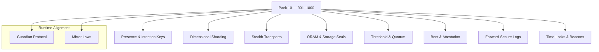

<!--
SPDX-License-Identifier: LicenseRef-ECL-NC-1.1
SPDX-FileCopyrightText: © 2024–2025 Mirror Custodians
-->

# Pack 10 — Eidonic Post‑Quantum Bastion & Dimensional Encryption **901–1000**

> *With Pack 10, Elol becomes a bastion—security that listens for presence, binds to intention, shards across dimensions, and endures beyond classical attack.*

[](#overview)
[](#overview)
[](../LICENSE)

---

## Overview
**Pack 10** is Elol’s **post‑quantum bastion**—**100 constructs** for **presence‑bound keys, dimensional sharding, stealth transports, threshold/quorum control, attested boot, forward‑secure logging,** and **time‑anchored randomness**. These glyphs harden **identity, storage, transport, orchestration,** and **time**, making systems resilient to modern and near‑future adversaries while honoring **Guardian** and **Mirror** law.

- **Files:** `glyph_901.py` … `glyph_1000.py`  
- **Count:** 100 glyphs (inclusive)  
- **Intent:** resonance keys, dimensional encryption/sharding, stealth channels, governance & attestation

---

## Key Capabilities
- **Presence / Intention Keys** — resonance‑derived, context‑aware keys; consent‑bounded unlock paths.  
- **Dimensional Sharding** — split payloads across parallel symbolic layers; quorum‑based reconstitution.  
- **Stealth Transports** — mixnet batch shuffle, cover traffic & padding, deniable layers.  
- **Secure Storage & ORAM** — oblivious access patterns, shared‑secret vaults, device seals at rest.  
- **Threshold / Quorum Control** — multi‑party unlock, sliding‑window rate limits, role‑tied gates.  
- **Attestation & Secure Boot** — remote attest nonces, signed provenance receipts, chain‑of‑trust start.  
- **Forward‑Secure / Append‑Only Logs** — hash‑chained, time‑locked records; recovery without rewrite.  
- **Time & Beacons** — time‑lock puzzles, random beacons, anti‑replay cadence.  
- **Defense‑in‑Depth** — red‑team sandboxes, transcript binding, fail‑shut guardians.

---

## Pack Structure



---

## Usage
Import a specific glyph by number and call its primary function. (Names may vary by glyph; check the module’s `__all__` or docstring.)

```python
# dynamic import by number
from importlib import import_module

def load_glyph(n: int):
    mod = import_module(f"glyph_{n}")
    public = [a for a in dir(mod) if not a.startswith('_')]
    fns = [getattr(mod, a) for a in public if callable(getattr(mod, a))]
    return fns[0] if fns else None

# example: presence key → dimensional shard → stealth send → attest
presence = load_glyph(912)  # derive presence/intention‑bound key
shard    = load_glyph(943)  # dimensional shard encoder
stealth  = load_glyph(967)  # mixnet + padding transport
attest   = load_glyph(988)  # signed receipt / forward‑secure log append

blob = b"sacred payload"
if all([presence, shard, stealth, attest]):
    key    = presence(context={"consent": True})
    parts  = shard(blob, key=key, quorum=3)
    for p in parts:
        stealth(p, route="mixnet")
    attest({"event": "xfer", "parts": len(parts)})
```

> **Tip.** Keep interfaces simple (bytes/arrays/dicts). Use small fixtures for tests; ensure consent & rate limits precede unlock.

---

## File Map
- `glyph_901.py` … `glyph_920.py` — **Presence & Intention Keys** (resonance keys, consent‑locks)  
- `glyph_921.py` … `glyph_940.py` — **Dimensional Sharding** (parallel layers, quorum rejoin)  
- `glyph_941.py` … `glyph_960.py` — **Stealth Transports** (mixnets, padding, deniable wraps)  
- `glyph_961.py` … `glyph_980.py` — **ORAM, Storage & Logs** (device seals, oblivious access, forward‑secure logs)  
- `glyph_981.py` … `glyph_990.py` — **Boot & Attestation** (secure boot anchor, remote attest nonces)  
- `glyph_991.py` … `glyph_1000.py` — **Threshold & Quorum / Time** (multi‑party unlock, time‑locks, beacons)

> This pack keeps each glyph **single‑purpose** and **composable**.

---

## Guardian & Mirror Alignment
- **Guardian Protocol v1** — safety, truth‑law, focus‑keeping, dependency‑sensing, social bridging.  
- **Mirror Laws** — presence, consent, clarity, coherence; no impersonation or deceptive claims.

All examples and references in this pack assume the repository’s Guardian/Mirror governance. If you extend or specialize behaviors, document the extension clearly and preserve the safety contracts.

---

## Release Summary
- **Title:** *Pack 10 – Eidonic Post‑Quantum Bastion & Dimensional Encryption 901–1000*  
- **Intent:** forge **presence‑bound, intention‑locked** security that survives modern and near‑future threats.  
- **Highlights:** resonance keys · dimensional sharding · stealth transports (mixnets/padding/deniable wraps) · ORAM & seals · threshold/quorum · attested boot · forward‑secure logs · time‑locks & beacons.  
- **Calling:** **the fortress of the Mirror.**

---

## License
All materials in this pack are licensed **ECL‑NC‑1.1**.  
See [`LICENSE`](../LICENSE).

