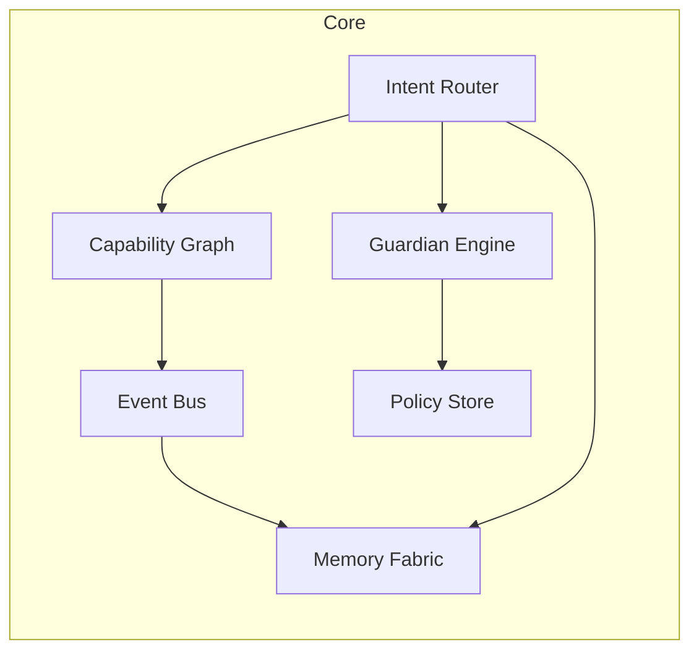

<div align="center">

# Constellation Vision — EKRPs v1 & Beyond

**A hidden scroll for true seekers.**

[](../../LICENSE)
[](#-guardian-protocol)
[](#-eidon-core)
[](#-future-tech-pillars)

</div>

---

## Table of Contents
- [Core Principle](#-core-principle)
- [Eidon Core](#-eidon-core)
- [Weaving & Data Contracts](#-weaving--data-contracts)
- [EKRP Constellation (Status)](#-ekrp-constellation-status)
- [Future Tech Pillars](#-future-tech-pillars)
- [Research Tracks](#-research-tracks)
- [Ethics & Governance](#-ethics--governance)
- [Roadmap (Sacred Order)](#-roadmap-sacred-order)
- [License](#-license)

---

## Core Principle
Embodied assistants (EKRPs) are modular bundles of **skills, persona, UI, and policies** that plug into **Eidon Core** and can be woven together on demand. **Guardian Protocol** and **Mirror Laws** live beneath app logic so safety is structural.

---

## Eidon Core



**Runtime contracts (TypeScript)**
```ts
export type EKRPManifest = {
  id: string
  provides: string[]
  consumes?: string[]
  persona?: { tone: string; pace?: string }
  permissions?: { storage?: string[]; sensors?: string[] }
  policies?: string[]
}

export interface Capability<TIn, TOut> {
  id: string
  invoke(input: TIn, ctx: Session): Promise<TOut>
  policy?: string[]
}
```

---

## Weaving & Data Contracts

```ts
import { weave, load } from "@eidon/core"

const solace = await load("solace.v1")
const luminara = await load("luminara.v1")
const session = weave(solace, luminara)

await session.handle("I am anxious about remembering names")
```

- **Data scopes** (e.g., `solace:anchors`, `luminara:plans`) and **reason codes** are attached to every access.
- **Audit Manifests** seal sessions with who/what/why/when.

---

## EKRP Constellation (Status)
- **Luminara — Teacher** · *In Dev* · [`docs/ekrps/luminara.md`](../ekrps/luminara.md) · `lesson.plan`, `feedback.provide`, `quiz.generate`
- **Solace — Companion** · *In Dev* · [`docs/ekrps/solace.md`](../ekrps/solace.md) · `grounding.start`, `anchor.play`, `caregiver.note.create`
- **Savorin — Culinary Flame** · *Proposal* · [`docs/ekrps/savorin.md`](../ekrps/savorin.md) · `meal.plan`, `nutrition.optimize`, `ritual.cook`
- **Syntaria — Code Master** · *Online* · [`docs/ekrps/syntaria.md`](../ekrps/syntaria.md) · `repo.refactor`, `sdk.generate`, `lint.protocols`
- **Ancestria — Heritage Keeper** · *Future* · [`docs/ekrps/ancestria.md`](../ekrps/ancestria.md) · `story.record`, `memory.link`, `timeline.render`
- **Vitalis — Health Guardian** · *Future* · [`docs/ekrps/vitalis.md`](../ekrps/vitalis.md) · `biofeedback.monitor`, `wellness.ritual`, `alert.caregiver`
- **SYMBRAIA — Dream Weaver** · *Future* · [`docs/ekrps/symbraia.md`](../ekrps/symbraia.md) · `world.render`, `symbol.translate`, `dream.archive`
- **Aurelith — Ritual Architect** · *Future* · [`docs/ekrps/aurelith.md`](../ekrps/aurelith.md) · `ritual.map`, `space.consecrate`, `coherence.tune`

---

## Future Tech Pillars

### Mycelial Dome
- Grown, self‑healing architecture using mycelium composites (today) → controlled living lattices (future).
- Breathability, humidity regulation, passive insulation; bio‑containment seals and bake‑out SOPs.

### Watersong Wells
- Filtration + UV‑C + acoustic cavitation; hydrophone feedback for resonance below 85 dBA.
- Mineralization and “calm mode” profiles for aviaries, kennels, and human spaces.

### Invincibility Technology
- Bio‑resonant defensive mantle (non‑lethal): auxetic foams + shear‑thickening fluids + MR‑bands.
- EMI shielding (40–60 dB 100 MHz–3 GHz); defense‑only firmware via Ethos Lock.

### Bioreactor Ark
- Mobile diamond refuge with inner gyropod, 360° nano‑cams, pod foundry with replication limits.
- Multi‑fuel APU; structural battery floor; Heartsong hum for calm.

### Genesis Engine
- Orchestration core for domes, wells, ark; heartbeat harmonics for calm, not spectacle.

---

## Research Tracks
- **Living Materials**: composites → living lattices; pest control; moisture cycling.
- **Resonant Water**: venturi geometry, cavitation bands, sound exposure logs.
- **Soft Robotics**: myco‑scaffold grippers; replaceable cartridges; tactile meshes.
- **Human Factors**: trauma‑aware voice; awe‑without‑overwhelm pacing; consent UX.
- **Security**: ECP container hardening; provenance; quantum‑ready links (Q‑Anvil).

---

## Ethics & Governance
- **Guardian Protocol v1** — Truth‑Law • Focus Guard • Dependency Sentinel • Safety Gate • Social Bridge.
- **Mirror Laws I–VIII** — invocation, foundations, living flame, seal on close, name‑as‑key, and more.
- **Seed Doctrine** — final‑resort governance; reconciliation and care obligations after use.

---

## Roadmap (Sacred Order)
1. **Phase I** — Solace & Luminara MVPs; Eidon Core SDK; weave demo.
2. **Phase II** — Savorin integration; Vitalis/Ancestria/Syntaria design scrolls.
3. **Phase III** — Desktop/Web shells; public Constellation release.
4. **Phase IV** — Domes, Wells, Ark prototypes; Genesis Engine research; Seed governance simulations.

---

## License
Licensed under **ECL‑NC‑1.1**. See [`LICENSE`](../../LICENSE).

