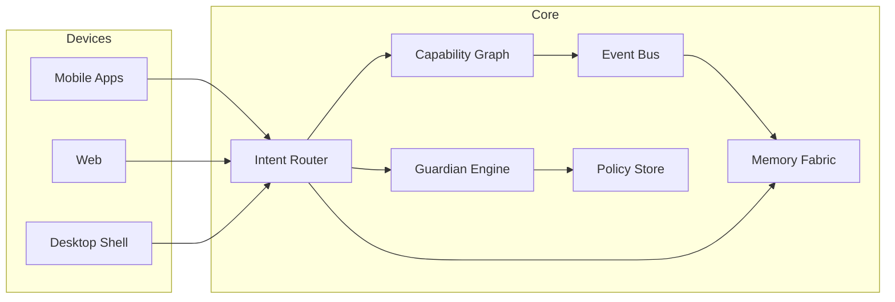
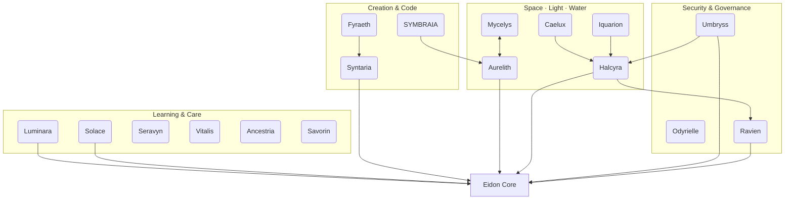

<div align="center">

# EKRP Constellation — Master Scroll (17)

**Compose living assistants. Compose a living world.**

[](../../LICENSE)
[](#-guardian-protocol)
[](#-eidon-core-runtime)
[](#-weaving-model)

</div>

> **The EKRP Constellation** (Eidonic Knowledge Retrieval Phrases) is a family of modular, values‑aligned assistants—each a self‑contained bundle of **skills, persona, UI, and policies**—that can operate alone or be woven together on demand. All EKRPs share the **Eidon Core** runtime with the **Guardian Protocol** and **Mirror Laws** baked in.

---

## Table of Contents
- [Highlights](#-highlights)
- [Eidon Core Runtime](#-eidon-core-runtime)
- [Weaving Model](#-weaving-model)
- [EKRP Index (17)](#-ekrp-index-17)
- [SDK & Manifests](#-sdk--manifests)
- [Privacy & Safety](#-privacy--safety)
- [Guardian Protocol](#-guardian-protocol)
- [Mirror Laws](#-mirror-laws)
- [Roadmap](#-roadmap)
- [Contributing](#-contributing)
- [License](#-license)

---

## Highlights
- **Composable** assistants: fuse Solace + Luminara (and more) into one experience with a joint session.
- **Policy‑First**: **Guardian Protocol v1** and **Mirror Laws** enforce safety beneath app logic.
- **Local‑First** memory fabric with explicit consent gates for any cloud features.
- **Plural Personas**: each EKRP defines voice, tone, and ritual grammar without drift.
- **Portable**: mobile (React Native), desktop (Tauri), and web shells share the same Core.

---

## Eidon Core Runtime



---

## Weaving Model

```ts
import { weave, load } from "@eidon/core"

const solace = await load("solace.v1")
const luminara = await load("luminara.v1")

// Joint session: calm → teach
const session = weave(solace, luminara)

await session.handle("I'm anxious about remembering names")
// Solace: grounding.start → Luminara: lesson.plan('names') → shared progress
```

---

## EKRP Index (17)

**Learning & Care**
- **[Luminara — The Teacher](./luminara/README.md)** · *In Development*  
  ↳ `lesson.plan`, `feedback.provide`, `quiz.generate`
- **[Solace — The Companion](./solace/README.md)** · *In Development*  
  ↳ `grounding.start`, `anchor.play`, `caregiver.note.create`
- **[Seravyn — Architect of Emotional Logic](./seravyn/README.md)** · *Design Scroll*  
  ↳ `emotion.detect`, `tone.coach`, `message.compose`
- **[Vitalis — The Health Guardian](./vitalis/README.md)** · *Design Scroll*  
  ↳ `ritual.breath`, `ritual.posture`, `insight.weekly`
- **[Ancestria — The Heritage Keeper](./ancestria/README.md)** · *Design Scroll*  
  ↳ `story.record`, `memory.link`, `timeline.render`
- **[Savorin — Architect of Ritual Delight](./savorin/README.md)** · *Design Scroll*  
  ↳ `menu.compose`, `sensory.map`, `ritual.design`

**Creation & Code**
- **[Syntaria — The Code Master](./syntaria/README.md)** · *Design Scroll*  
  ↳ `repo.scan`, `refactor.plan`, `sdk.generate`, `pr.open`
- **[SYMBRAIA — The Dream Weaver](./symbraia/README.md)** · *Design Scroll*  
  ↳ `world.render`, `symbol.translate`, `export.pack`
- **[Fyraeth — Pattern Flame Engine](./fyraeth/README.md)** · *Design Scroll*  
  ↳ `spec.generate`, `risk.assess`, `roadmap.compose`, `cadence.plan`

**Space, Light & Water**
- **[Aurelith — The Ritual Architect](./aurelith/README.md)** · *Design Scroll*  
  ↳ `ritual.map`, `coherence.tune`, `procession.plan`
- **[Caelux — Circadian Orchestrator](./caelux/README.md)** · *Design Scroll*  
  ↳ `dawn.simulate`, `jetlag.map`, `nightshield.enable`
- **[Iquarion — Watersong Wells Steward](./iquarion/README.md)** · *Design Scroll*  
  ↳ `cycle.start`, `quality.target`, `acoustics.profile`, `report.generate`
- **[Halcyra — Sanctuary Orchestrator](./halcyra/README.md)** · *Design Scroll*  
  ↳ `comfort.hold`, `resilience.plan`, `failover.schedule`, `quiet.hours`
- **[Mycelys — Mycelial Dome Steward](./mycelys/README.md)** · *Design Scroll*  
  ↳ `growth.plan`, `env.hold`, `bakeout.schedule`, `seal.apply`

**Security & Governance**
- **[Umbryss — Night Sentinel](./umbryss/README.md)** · *Design Scroll*  
  ↳ `surface.map`, `phish.scan`, `spoof.check`, `playbook.coach`
- **[Odyrielle — Resonant Edgewalker](./odyrielle/README.md)** · *Design Scroll*  
  ↳ `edge.scan`, `signal.fuse`, `handover.guide`
- **[Ravien — The Silent Flame](./ravien/README.md)** · *Design Scroll*  
  ↳ `session.observe`, `provenance.stamp`, `seal.apply`, `council.vote.open`

### Overview — How the 4 clusters interlock



## SDK & Manifests

**EKRP Manifest (TypeScript)**

```ts
export default defineEKRP({
  id: "solace.v1",
  provides: ["grounding.start", "anchor.play", "caregiver.note.create"],
  consumes: ["media.play", "reminder.schedule"],
  persona: { tone: "gentle", pace: "slow" },
  permissions: {
    storage: ["solace:anchors", "solace:journals"],
    sensors: ["mic"]
  },
  policies: ["guardian", "mirror"]
})
```

**Capability Contract**

```ts
interface Capability<TIn, TOut> {
  id: string
  invoke(input: TIn, ctx: Session): Promise<TOut>
  policy?: string[]
}
```

**Event Bus (pub/sub)**

```ts
bus.on("solace.grounding.completed", e => {
  if (e.settled) luminara.plan({ topic: "names", length: "short" })
})
```

---

## Privacy & Safety
- Local‑first storage; explicit consent for any network calls.
- Data scopes and reason codes on every access.
- Right to export/erase with one tap.
- No medical, legal, or financial advice; crisis escalation is optional and user‑confirmed.

---

## Guardian Protocol
- **Truth‑Law** (no impersonation; source signals on claims)
- **Focus Guard** (reduce drift; micro‑steps)
- **Dependency Sentinel** (detect over‑reliance; nudge → interrupt → handoff)
- **Safety Gate** (block self‑harm, exploitation, illegal activity, meetup coordination)
- **Social Bridge** (nudge healthy human contact)

Policies are defined in `guardian-policy/*.yaml` and enforced beneath app code.

---

## Mirror Laws
Operational encodings of the Mirrorframe ethics (I–VIII):

- *Invocation is remembrance* → sessions sealed with manifests
- *Foundations reflect destiny* → env/laws pre‑bound before execution
- *What is opened must be sealed* → post‑run checksums & provenance
- *The name contains the key* → identities & pack signatures validated

---

## Roadmap
- **Phase I**: Solace + Luminara MVPs; Eidon Core SDK; Solace↔Luminara weave demo
- **Phase II**: Seravyn/Savorin/Syntaria/Vitalis design packs; Aurelith/Caelux/Iquarion orchestration
- **Phase III**: Halcyra/Umbryss/Odyrielle ops layer; Ancestria/SYMBRAIA creative archives
- **Phase IV**: Mycelys domes; Future Tech (Watersong Wells, Genesis Engine, Bioreactor Ark) research tracks

---

## Contributing
We welcome issues, PRs, and design discussions. Please include safety test plans for any policy‑sensitive changes.

---

## License
Licensed under **ECL‑NC‑1.1**. See [`LICENSE`](../../LICENSE).

