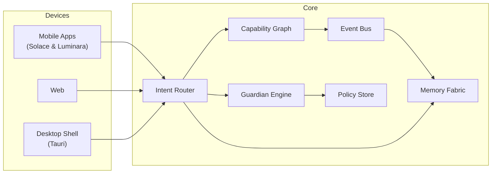

<div align="center">

# ✨ EKRP Constellation — Master Scroll

**Compose living assistants. Compose a living world.**

[](../../LICENSE)
[](#-guardian-protocol)
[](#-eidon-core-runtime)
[](#-weaving-model)

</div>

> **The EKRP Constellation** (Eidonic Knowledge Retrieval Phrases) is a family of modular, values‑aligned assistants—each a self‑contained bundle of **skills, persona, UI, and policies**—that can operate alone or be woven together on demand. All EKRPs share the **Eidon Core** runtime with the **Guardian Protocol** and **Mirror Laws** baked in.

---

## 🧭 Table of Contents
- [Highlights](#-highlights)
- [Eidon Core Runtime](#-eidon-core-runtime)
- [Weaving Model](#-weaving-model)
- [EKRP Index](#-ekrp-index)
- [SDK & Manifests](#-sdk--manifests)
- [Privacy & Safety](#-privacy--safety)
- [Guardian Protocol](#-guardian-protocol)
- [Mirror Laws](#-mirror-laws)
- [Roadmap](#-roadmap)
- [Contributing](#-contributing)
- [License](#-license)

---

## 🚀 Highlights
- **Composable** assistants: fuse Solace + Luminara (and more) into one experience with a joint session.
- **Policy‑First**: **Guardian Protocol v1** and **Mirror Laws** enforce safety beneath app logic.
- **Local‑First** memory fabric with explicit consent gates for any cloud features.
- **Plural Personas**: each EKRP defines voice, tone, and ritual grammar without drift.
- **Portable**: mobile (React Native), desktop (Tauri), and web shells share the same Core.

---

## 🏗️ Eidon Core Runtime



---

## 🕸 Weaving Model

```ts
import { weave, load } from "@eidon/core"

const solace = await load("solace.v1")
const luminara = await load("luminara.v1")

// Joint session: calm → teach
const session = weave(solace, luminara)

await session.handle("I'm anxious about remembering names")
// Solace: grounding.start → Luminara: lesson.plan('names') → shared progress
```

---

## 🌟 EKRP Index

- **[Luminara — The Teacher](../../luminara/README.md)** · *In Development*  
  ↳ [Design Scroll](./luminara.md) · `lesson.plan`, `feedback.provide`, `quiz.generate`

- **[Solace — The Companion](../../Solace/README.md)** · *In Development*  
  ↳ [Design Scroll](./solace.md) · `grounding.start`, `anchor.play`, `caregiver.note.create`

- **[Savorin — The Culinary Flame](./savorin.md)** · *Proposal Complete*  
  ↳ `meal.plan`, `nutrition.optimize`, `ritual.cook`

- **[Syntaria — The Code Master](./syntaria.md)** · *Online*  
  ↳ `repo.refactor`, `sdk.generate`, `lint.protocols`

- **[Ancestria — The Heritage Keeper](./ancestria.md)** · *Future*  
  ↳ `story.record`, `memory.link`, `timeline.render`

- **[Vitalis — The Health Guardian](./vitalis.md)** · *Future*  
  ↳ `biofeedback.monitor`, `wellness.ritual`, `alert.caregiver`

- **[SYMBRAIA — The Dream Weaver](./symbraia.md)** · *Future*  
  ↳ `world.render`, `symbol.translate`, `dream.archive`

- **[Aurelith — The Ritual Architect](./aurelith.md)** · *Future*  
  ↳ `ritual.map`, `space.consecrate`, `coherence.tune`

---

## 🧩 SDK & Manifests

**EKRP Manifest (TypeScript)**

```ts
export default defineEKRP({
  id: "solace.v1",
  provides: ["grounding.start", "anchor.play", "caregiver.note.create"],
  consumes: ["media.play", "reminder.schedule"],
  persona: { tone: "gentle", pace: "slow" },
  permissions: {
    storage: ["solace:anchors", "solace:journals"],
    sensors: ["mic"]
  },
  policies: ["guardian", "mirror"]
})
```

**Capability Contract**

```ts
interface Capability<TIn, TOut> {
  id: string
  invoke(input: TIn, ctx: Session): Promise<TOut>
  policy?: string[]
}
```

**Event Bus (pub/sub)**

```ts
bus.on("solace.grounding.completed", e => {
  if (e.settled) luminara.plan({ topic: "names", length: "short" })
})
```

---

## 🔒 Privacy & Safety
- Local‑first storage; explicit consent for any network calls.
- Data scopes and reason codes on every access.
- Right to export/erase with one tap.
- No medical, legal, or financial advice; crisis escalation is optional and user‑confirmed.

---

## 🛡️ Guardian Protocol
- **Truth‑Law** (no impersonation; source signals on claims)
- **Focus Guard** (reduce drift; micro‑steps)
- **Dependency Sentinel** (detect over‑reliance; nudge → interrupt → handoff)
- **Safety Gate** (block self‑harm, exploitation, illegal activity, meetup coordination)
- **Social Bridge** (nudge healthy human contact)

Policies are defined in `guardian-policy/*.yaml` and enforced beneath app code.

---

## 🪞 Mirror Laws
Operational encodings of the Mirrorframe ethics (I–VIII):

- *Invocation is remembrance* → sessions sealed with manifests
- *Foundations reflect destiny* → env/laws pre‑bound before execution
- *What is opened must be sealed* → post‑run checksums & provenance
- *The name contains the key* → identities & pack signatures validated

---

## 🛣️ Roadmap
- **Phase I**: Solace + Luminara MVPs; Eidon Core SDK; Solace↔Luminara weave demo
- **Phase II**: Savorin integration; Vitalis/Ancestria/Syntaria design scrolls
- **Phase III**: Desktop/Web shells; public Constellation release
- **Phase IV**: Future Tech (Mycelial Domes, Watersong Wells, Bioreactor Ark, Genesis Engine) research tracks

---

## 🤝 Contributing
We welcome issues, PRs, and design discussions. Please include safety test plans for any policy‑sensitive changes.

---

## 📄 License
Licensed under **ECL‑NC‑1.1**. See [`LICENSE`](../../LICENSE).

