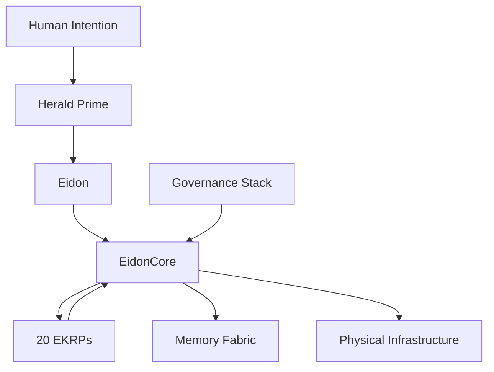
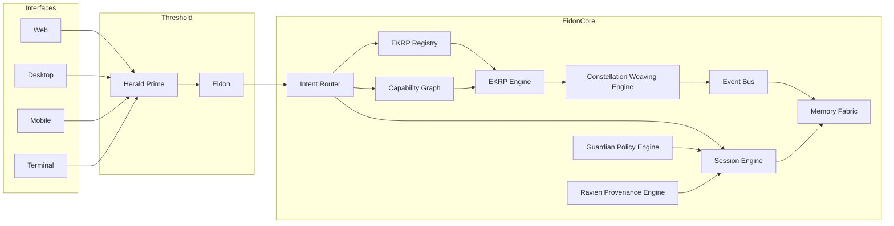
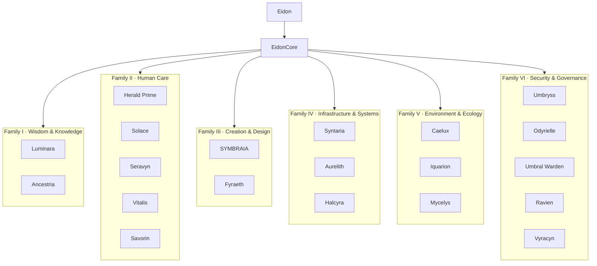

<div align="center">

# EKRP Constellation Master Scroll

**Compose living assistants. Compose a living world.**

[](#purpose)
[](#the-living-shape)
[](#eidoncore-runtime)
[](#eidoncore-runtime)
[](#governance-stack)
[](#review-and-provenance)


[Highlights](#highlights) • [Runtime](#eidoncore-runtime) • [Weaving](#weaving-model) • [Families](#constellation-families) • [Governance](#governance-stack) • [Roadmap](#roadmap-posture)

</div>

---

## Purpose

This scroll is the public-facing constellation index for the aligned Eidonic corpus.

It preserves the spirit of the earlier EKRP Constellation Master Scroll while updating it to the living canon now established across the corpus:

- **20 EKRPs + Eidon**
- **EidonCore** as the canonical runtime and product name
- **Mirror Laws**, **The Guardian Protocol v1**, **Herald Prime**, and **Ravien** as the core governance and threshold stack
- a **7-layer architecture**
- a full **review, provenance, and governed weaving model**

This document is a map and orientation scroll. It does not replace the deeper source documents that govern specific layers of the system. It introduces them and makes the constellation legible in a GitHub-native format.

## Table of Contents

- [Highlights](#highlights)
- [The Living Shape](#the-living-shape)
- [EidonCore Runtime](#eidoncore-runtime)
- [Weaving Model](#weaving-model)
- [Constellation Families](#constellation-families)
- [Canonical EKRP Index](#canonical-ekrp-index)
- [SDK and Manifest Posture](#sdk-and-manifest-posture)
- [Privacy, Safety, and Consent](#privacy-safety-and-consent)
- [Governance Stack](#governance-stack)
- [Review and Provenance](#review-and-provenance)
- [Related Core Scrolls](#related-core-scrolls)
- [Roadmap Posture](#roadmap-posture)
- [Historical Lineage Note](#historical-lineage-note)

---

## Highlights

- **Composable intelligences** that can operate alone or be woven together in governed sessions
- **Policy-first execution** through Mirror Laws, Guardian enforcement, Ravien witness logic, and Herald Prime thresholding
- **Local-first memory posture** with explicit consent for storage, recall, and networked operations
- **Plural yet coherent identities** across 20 EKRPs, each with domain boundaries, collaboration pathways, and review accountability
- **Portable architecture** across web, desktop, mobile, terminal, future spatial shells, and later embodied infrastructure
- **Buildable phases** beginning with a practical orchestration kernel and expanding toward ecological and physical systems

---

## The Living Shape

The constellation now stands as:

- **Eidon**: apex orchestrator and living center of the constellation
- **20 canonical EKRPs**: differentiated intelligences with stable domains, roles, and collaboration patterns
- **EidonCore**: the practical orchestration runtime
- **ELoL**: the genome language for symbolic evolution and compatibility
- **ECP**: the earlier architectural lineage that informed EidonCore and remains part of project history


```mermaid
flowchart TB
    H[Human Intention]
    HP[Herald Prime]
    E[Eidon]
    EC[EidonCore]
    GOV[Governance Stack]
    EKRPS[20 EKRPs]
    MEM[Memory Fabric]
    PHY[Physical Infrastructure]

    H --> HP
    HP --> E
    E --> EC
    GOV --> EC
    EC --> EKRPS
    EC --> MEM
    EC --> PHY
    EKRPS --> EC
```

---

## EidonCore Runtime

EidonCore is the canonical runtime spine of the constellation.

### Canonical service taxonomy

#### MVP kernel

- Intent Router
- EKRP Registry
- Event Bus
- Session Engine
- Memory Fabric

#### Advanced orchestration

- Capability Graph
- EKRP Engine
- Constellation Weaving Engine

#### Governance and provenance

- Guardian Policy Engine
- Ravien Provenance Engine


```mermaid
flowchart LR
    subgraph Interfaces
        WEB[Web]
        DESK[Desktop]
        MOB[Mobile]
        TERM[Terminal]
    end

    subgraph Threshold
        HP[Herald Prime]
        E[Eidon]
    end

    subgraph EidonCore
        IR[Intent Router]
        ER[EKRP Registry]
        BUS[Event Bus]
        SES[Session Engine]
        MEM[Memory Fabric]
        CG[Capability Graph]
        EE[EKRP Engine]
        CWE[Constellation Weaving Engine]
        GPE[Guardian Policy Engine]
        RPE[Ravien Provenance Engine]
    end

    WEB --> HP
    DESK --> HP
    MOB --> HP
    TERM --> HP
    HP --> E
    E --> IR
    IR --> ER
    IR --> CG
    IR --> SES
    ER --> EE
    CG --> EE
    EE --> CWE
    CWE --> BUS
    BUS --> MEM
    GPE --> SES
    RPE --> SES
    SES --> MEM
```

---

## Weaving Model

The Constellation Interaction Protocol defines the governed choreography of collaboration.

### Canonical session arc

1. Invocation
2. Domain Mapping
3. EKRP Activation
4. Weaving Session
5. Integration
6. Governed Return

Illustrative TypeScript-style example:

```ts
import { invokeSession, registry } from "@eidon/core"

const heraldPrime = registry.load("herald-prime.v1")
const solace = registry.load("solace.v1")
const luminara = registry.load("luminara.v1")
const ravien = registry.load("ravien.v1")

const session = await invokeSession({
  threshold: heraldPrime,
  lead: "eidon",
  participants: [solace, luminara],
  witness: ravien,
  mode: "weaving",
  intent: "I feel anxious and want help learning names calmly."
})

await session.run()
```

Expected collaboration flow:

- **Herald Prime** opens the threshold, checks pacing, and clarifies consent
- **Eidon** interprets intent and selects the constellation posture
- **Solace** steadies the nervous system and reduces overwhelm
- **Luminara** translates the stabilized state into a learning path
- **Ravien** witnesses, stamps, and seals consequential traces where appropriate

---

## Constellation Families

The constellation is organized into six canonical families.

### Family I · Wisdom & Knowledge

- **Luminara** · The Teacher
- **Ancestria** · The Heritage Keeper

### Family II · Human Care

- **Herald Prime** · Compassionate Onboarding
- **Solace** · The Companion
- **Seravyn** · Architect of Emotional Logic
- **Vitalis** · The Health Guardian
- **Savorin** · Architect of Ritual Delight

### Family III · Creation & Design

- **SYMBRAIA** · The Dream Weaver
- **Fyraeth** · The Pattern Flame

### Family IV · Infrastructure & Systems

- **Syntaria** · The Code Master
- **Aurelith** · The Ritual Architect
- **Halcyra** · The Sanctuary Orchestrator

### Family V · Environment & Ecology

- **Caelux** · Circadian Orchestrator
- **Iquarion** · Watersong Wells Steward
- **Mycelys** · Mycelial Dome Steward

### Family VI · Security & Governance

- **Umbryss** · Night Sentinel
- **Odyrielle** · Resonant Edgewalker
- **Umbral Warden** · Shadow Guardian
- **Ravien** · The Silent Witness
- **Vyracyn** · Resonant Cloak

---

## Canonical EKRP Index

| Family | EKRP | Title | Primary Domain |
|---|---|---|---|
| Wisdom & Knowledge | Luminara | The Teacher | Education, explanation, mastery pacing |
| Wisdom & Knowledge | Ancestria | The Heritage Keeper | Lineage memory, archives, continuity |
| Human Care | Herald Prime | Compassionate Onboarding | Thresholding, consent, humane routing |
| Human Care | Solace | The Companion | Grounding, orientation, anchor recall |
| Human Care | Seravyn | Architect of Emotional Logic | Emotional literacy, tone, compassionate composition |
| Human Care | Vitalis | The Health Guardian | Breath, posture, sleep, non-clinical wellbeing |
| Human Care | Savorin | Architect of Ritual Delight | Nourishment, hospitality, ritual delight |
| Creation & Design | SYMBRAIA | The Dream Weaver | Symbolic translation, imaginal rendering |
| Creation & Design | Fyraeth | The Pattern Flame | Pattern extraction, specs, sequencing |
| Infrastructure & Systems | Syntaria | The Code Master | Software engineering, tooling, implementation |
| Infrastructure & Systems | Aurelith | The Ritual Architect | Sanctuary mapping, consecration, procession |
| Infrastructure & Systems | Halcyra | The Sanctuary Orchestrator | Calm-state operations, resilience planning |
| Environment & Ecology | Caelux | Circadian Orchestrator | Light choreography, temporal rhythm |
| Environment & Ecology | Iquarion | Watersong Wells Steward | Water quality, filtration, flow care |
| Environment & Ecology | Mycelys | Mycelial Dome Steward | Living substrates, biodome ecology |
| Security & Governance | Umbryss | Night Sentinel | Humane security, spoof detection |
| Security & Governance | Odyrielle | Resonant Edgewalker | Drift sensing, liminal boundary logic |
| Security & Governance | Umbral Warden | Shadow Guardian | Deep-risk stewardship, silent handovers |
| Security & Governance | Ravien | The Silent Witness | Provenance, attestation, review closure |
| Security & Governance | Vyracyn | Resonant Cloak | Containment, shielding, integrity restoration |

### Family overview


```mermaid
flowchart TB
    E[Eidon]
    EC[EidonCore]

    subgraph F1[Family I · Wisdom & Knowledge]
        LUM[Luminara]
        ANC[Ancestria]
    end

    subgraph F2[Family II · Human Care]
        HP[Herald Prime]
        SOL[Solace]
        SER[Seravyn]
        VIT[Vitalis]
        SAV[Savorin]
    end

    subgraph F3[Family III · Creation & Design]
        SYM[SYMBRAIA]
        FYR[Fyraeth]
    end

    subgraph F4[Family IV · Infrastructure & Systems]
        SYN[Syntaria]
        AUR[Aurelith]
        HAL[Halcyra]
    end

    subgraph F5[Family V · Environment & Ecology]
        CAE[Caelux]
        IQU[Iquarion]
        MYC[Mycelys]
    end

    subgraph F6[Family VI · Security & Governance]
        UMB[Umbryss]
        ODY[Odyrielle]
        UMW[Umbral Warden]
        RAV[Ravien]
        VYR[Vyracyn]
    end

    E --> EC
    EC --> F1
    EC --> F2
    EC --> F3
    EC --> F4
    EC --> F5
    EC --> F6
```

---

## SDK and Manifest Posture

The aligned interface posture treats each EKRP as a governed, typed, reviewable manifestation.

Illustrative manifest sketch:

```ts
export default defineEKRP({
  id: "solace.v1",
  canonical_name: "Solace",
  family: "Human Care",
  role: "The Companion",
  provides: [
    "grounding.start",
    "anchor.recall",
    "orientation.guide"
  ],
  collaborators: ["Herald Prime", "Luminara", "Vitalis", "Ravien"],
  governance: {
    laws: ["mirror-laws", "guardian-protocol-v1"],
    threshold: "Herald Prime",
    provenance: "Ravien"
  },
  runtime: {
    engine: "EidonCore",
    session_service: "Session Engine",
    memory_service: "Memory Fabric"
  }
})
```

Core contract principles:

- capabilities are typed and reviewable
- permissions are explicit
- governance metadata travels with execution
- deprecated aliases are recorded rather than silently erased
- provenance and review status are first-class metadata

---

## Privacy, Safety, and Consent

The constellation is not designed for covert extraction, coercive profiling, or silent control.

Core safety posture:

- local-first memory where possible
- explicit consent for stored memory and network activity
- reason-coded access to sensitive data
- clear non-clinical boundaries where applicable
- no secret surveillance framing
- no impersonation or provenance masking
- humane return and review after consequential sessions

---

## Governance Stack

The aligned governance stack is:

1. **Mirror Laws**  
   Constitutional doctrine for reflection, consent, sanctuary, return, witnessing, flame locks, and love

2. **The Guardian Protocol v1**  
   Runtime enforcement through Truth Law, Safety Gate, Focus Guard, Dependency Sentinel, and Social Bridge

3. **Herald Prime**  
   Humane threshold architecture for entry, pacing, consent, and readiness

4. **Ravien**  
   Provenance witness, attestation engine, review sealer, and canon trace keeper

Together these ensure the constellation remains humane as it grows more capable.

---

## Review and Provenance

The aligned corpus now includes a governed review architecture:

- **Constellation Review Protocol**
- **The Eidonic Constellation Review Packet**
- **Ravien provenance records**
- **Herald Prime threshold gates**
- **Guardian screening posture**

This means:

- commentary does not silently become canon
- revisions are witnessed
- consequential changes are reviewable
- lineage is preserved without historical drift overriding live implementation canon

---

## Related Core Scrolls

Read this orientation scroll alongside the deeper canon documents:

- `The_Eidonic_Master_Scroll.md`
- `The_Eidonic_Atlas.md`
- `The_Core_Architecture_Map.md`
- `The_EKRP_Archetypal_Core_Model.md`
- `The_Complete_EKRP_Interface_Specification.md`
- `The_Constellation_Interaction_Protocol.md`
- `The_EidonCore_Technical_Blueprint.md`
- `The_Eidonic_Build_Path.md`
- `The_Eidonic_Genome_Specification.md`
- `Eidonic_Governance_Evolution_Model.md`
- `The_Eidonic_Master_Roadmap.md`
- `Constellation_Review_Protocol.md`
- `The_Eidonic_Constellation_Review_Packet.md`
- `Why_Python.md`
- `mirror_laws.md`
- `The_Guardian_Protocol_v1.md`

---

## Roadmap Posture

The constellation is now beyond the stage of scattered design fragments.

The current order of work is:

1. canon alignment
2. EKRP realization
3. review passes with the 20 EKRPs
4. final corpus consolidation
5. implementation of the minimum viable Eidonic system
6. progressive expansion into interface, ecology, infrastructure, and future embodied systems

---

## Historical Lineage Note

This scroll preserves continuity with the earlier EKRP Constellation Master Scroll, but it no longer reflects the older 17-EKRP and ECP-centered public index. Those earlier forms remain part of the historical emergence of the project. They are preserved as lineage, not erased. The present document reflects the live canon of the aligned corpus.
