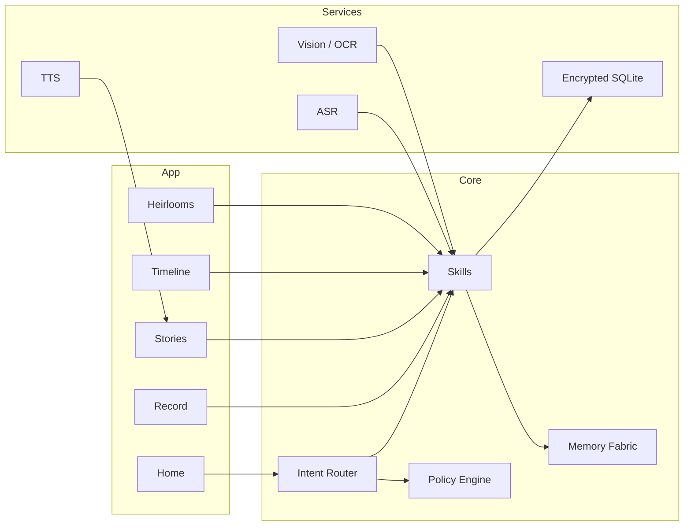

<div align="center">

# 🕯️ Ancestria — EKRP Design Scroll

**Heritage Keeper · Story capture · Living lineages**

[](../../LICENSE)
[](#-guardian-protocol-mapping)
[](#-runtime--architecture)

</div>

---

## 🧭 Table of Contents
- [Purpose](#-purpose)
- [Persona](#-persona)
- [Invocation Grammar](#-invocation-grammar)
- [Capabilities](#-capabilities)
- [Runtime & Architecture](#-runtime--architecture)
- [Data Model](#-data-model)
- [Intents & Orchestration](#-intents--orchestration)
- [Capture Pipelines](#-capture-pipelines)
- [Privacy & Consent](#-privacy--consent)
- [Guardian Protocol Mapping](#-guardian-protocol-mapping)
- [Accessibility](#-accessibility)
- [Internationalization](#-internationalization)
- [Configuration](#-configuration)
- [Testing Strategy](#-testing-strategy)
- [Roadmap](#-roadmap)
- [License](#-license)

---

## 🎯 Purpose
Ancestria preserves family stories, photographs, heirlooms, and lineages. It records high‑quality oral histories, links people across time, and renders living timelines with consent‑aware sharing for families and communities.

---

## 🧪 Persona
- **Tone**: warm, reverent, patient. Invites remembrance without pressure.
- **Boundaries**: never pries; offers skips; respects silence and grief.
- **Rituals**: opening blessing, memory prompts, gentle closing gratitude.

---

## 🔑 Invocation Grammar
- “Ancestria, record **Nonna’s story** for 20 minutes.”
- “Link **Auntie Mei** to **Grandpa Jun** as **daughter**.”
- “Show the **timeline** for our family during **1970–1990**.”
- “Scan this **photo** and tag **everyone** you recognize.”

---

## 🧩 Capabilities

### Provided
- `story.record({ subject, duration?, language? }) → StoryId`
- `story.transcribe({ storyId }) → Transcript`
- `story.summarize({ storyId, style? }) → Summary`
- `memory.link({ fromPersonId, toPersonId, relation }) → LinkId`
- `timeline.render({ scope, from?, to? }) → TimelineView`
- `archive.search({ query, filters? }) → Results[]`
- `heirloom.add({ media, label, notes? }) → HeirloomId`
- `photo.tag({ media, persons[]? }) → TagReport`
- `share.storypack({ items[], audience, consent }) → ShareLink`

### Consumed
- `asr.capture({ mic, lang })`
- `tts.speak({ text, persona })`
- `vision.ocr({ image })`
- `storage.put({ blob })`

---

## 🏗 Runtime & Architecture



- **Shell**: React Native / shared Core
- **Storage**: SQLCipher‑backed SQLite with media blobs in app container or user cloud (opt‑in)
- **Policies**: Guardian + Mirror beneath all capture and sharing

---

## 🧱 Data Model

```ts
export type Relation =
  | "parent" | "child" | "sibling" | "spouse" | "partner"
  | "grandparent" | "grandchild" | "aunt_uncle" | "niece_nephew" | "cousin"

export interface Person {
  id: string
  name: string
  birthYear?: number
  deathYear?: number
  pronouns?: string
  notes?: string
}

export interface Story {
  id: string
  subject: string // e.g., Nonna Maria
  personId?: string
  createdAt: string
  language?: string
  transcriptId?: string
}

export interface Transcript {
  id: string
  storyId: string
  text: string
  segments?: Array<{ t0: number; t1: number; speaker?: string; text: string }>
}

export interface Heirloom {
  id: string
  label: string
  mediaUri: string
  notes?: string
  tags?: string[]
}

export interface Link {
  id: string
  fromPersonId: string
  toPersonId: string
  relation: Relation
}

export interface ConsentRecord {
  id: string
  subjectId: string // person or story
  scope: "private" | "family" | "public"
  grantedAt: string
  expiresAt?: string
}
```

---

## 🧠 Intents & Orchestration

```ts
router.when(/record (.+) for (\d+) minutes/i, (_, m) =>
  skills.story.record({ subject: m[1], duration: Number(m[2]) })
)

router.when(/link (.+) to (.+) as (.+)/i, (_, m) =>
  skills.memory.link({ fromPersonId: m[1], toPersonId: m[2], relation: m[3] as Relation })
)

router.when(/show timeline (.+)?/i, (_, m) =>
  skills.timeline.render({ scope: m[1] || "family" })
)
```

**Weave with Solace**
```ts
const session = weave(solace, ancestria)
await session.handle("I’m overwhelmed—play Nonna’s story about the mountains")
```

**Weave with Luminara**
```ts
const session = weave(luminara, ancestria)
await session.handle("Build a reading lesson from Grandpa’s immigration story")
```

---

## 🎛 Capture Pipelines
- **Oral histories**: push‑to‑talk; noise‑robust ASR; diarization optional; transcript redact tools.
- **Photos**: on‑device face clustering; manual tagging first; cloud recognition opt‑in.
- **Heirlooms**: macro mode prompts; lightbox tips; metadata entry.
- **Timelines**: auto‑cards from dates/places; export to PDF.

---

## 🔒 Privacy & Consent
- Default **private**; sharing scopes require explicit consent.
- Living persons redaction by default; unredact only with consent.
- Right to export/erase; family codes for shared spaces (no scraping).

---

## 🛡 Guardian Protocol Mapping
- **Truth‑Law**: mark uncertain identifications; never assert without verification.
- **Focus Guard**: gentle prompts; skip/pause; content warnings.
- **Safety Gate**: grief‑sensitive filters; traumatic content opt‑in.
- **Dependency Sentinel**: encourages intergenerational interviews over automation.

---

## ♿ Accessibility
- Large type and high contrast; captions for playback; readable transcripts.
- Voice capture with visible mic state; multilingual subtitles.

---

## 🌐 Internationalization
- Multilingual ASR/TTS; locale calendars and name orders; RTL support.

---

## 🔧 Configuration
- `.env`: `USE_CLOUD_OCR`, `USE_CLOUD_ASR`, `REGION`.

---

## 🧪 Testing Strategy
- ASR robustness tests; transcript redaction golden files.
- Relation graph constraints; timeline rendering snapshots.
- Accessibility snapshots; offline e2e.

---

## 🗺 Roadmap
- **v0.1**: Story record, transcripts, heirlooms, basic timeline, private spaces.
- **v0.2**: Face clustering, relation graph tools, PDF exports.
- **v0.3**: OCR packs, festival story prompts, community archives.
- **v0.4**: Family spaces with roles, cross‑family link proposals (opt‑in).

---

## 📄 License
Licensed under **ECL‑NC‑1.1**. See [`LICENSE`](../../LICENSE).

