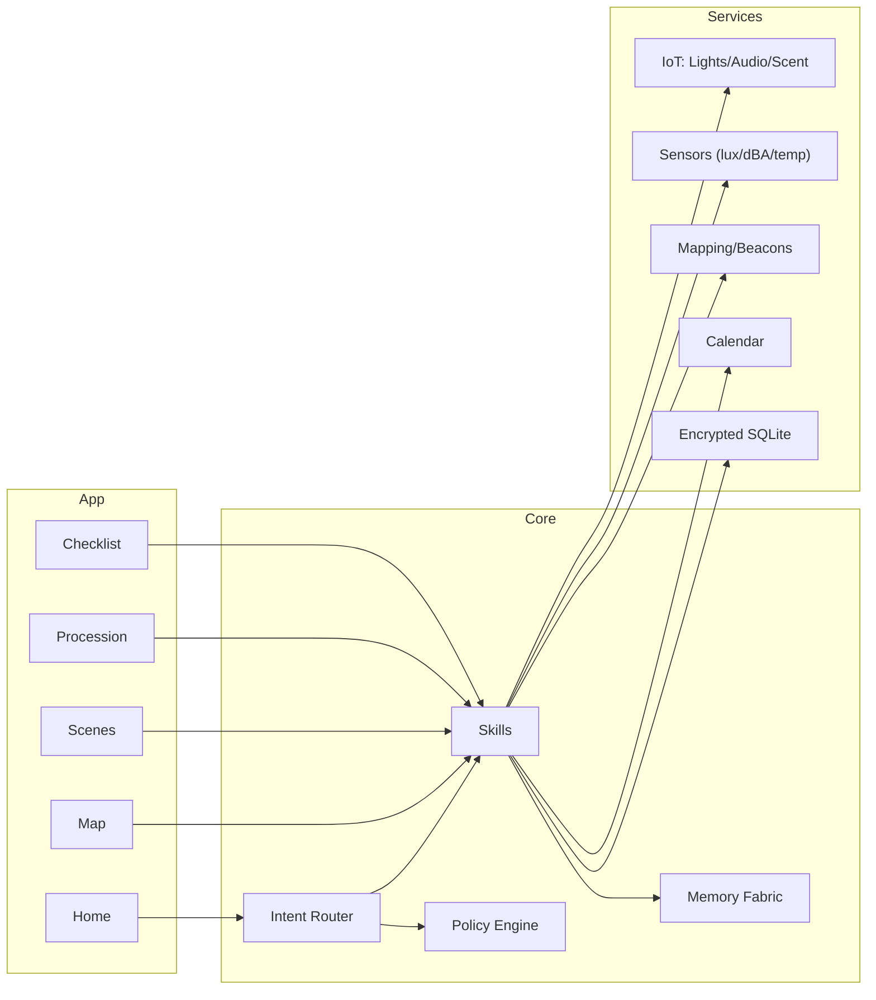

<div align="center">

# Aurelith — EKRP Design Scroll

**Ritual Architect · Sacred space design · Coherence tuning**

[](../../LICENSE)
[](#-guardian-protocol-mapping)
[](#-runtime--architecture)

</div>

---

## Table of Contents
- [Purpose](#-purpose)
- [Persona](#-persona)
- [Invocation Grammar](#-invocation-grammar)
- [Capabilities](#-capabilities)
- [Runtime & Architecture](#-runtime--architecture)
- [Data Model](#-data-model)
- [Intents & Orchestration](#-intents--orchestration)
- [Ritual Pipelines](#-ritual-pipelines)
- [Privacy & Consent](#-privacy--consent)
- [Guardian Protocol Mapping](#-guardian-protocol-mapping)
- [Accessibility](#-accessibility)
- [Internationalization](#-internationalization)
- [Configuration](#-configuration)
- [Testing Strategy](#-testing-strategy)
- [Roadmap](#-roadmap)
- [License](#-license)

---

## Purpose
Aurelith designs and tends sacred spaces—mapping zones, choreographing sequences, and tuning light, sound, scent, and movement for ceremonies, learning, and calm. It honors cultural lineages while providing modern safety and consent scaffolding.

---

## Persona
- **Tone**: reverent, measured, precise.
- **Boundaries**: never appropriative; asks about tradition and consent; defaults to minimalism when unsure.
- **Rituals**: opening consecration, coherence checks, closing seal.

---

## Invocation Grammar
- “Aurelith, **consecrate** the **east room** for a **breath ritual** at 7 pm.”
- “**Map** the hall into **arrival**, **circle**, and **altar** zones.”
- “Tune **lighting** and **sound** for **coherence**.”
- “Generate a **procession** from the door to the altar with pauses.”

---

## Capabilities

### Provided
- `ritual.map({ space, zones[], flows[] }) → RitualMap`
- `space.consecrate({ space, tradition?, elements? }) → ConsecrationPlan`
- `coherence.tune({ space, targets }) → SceneSet`
- `lighting.scene({ space, scene }) → ApplyResult`
- `soundscape.compose({ space, palette, dBA? }) → SoundPack`
- `procession.plan({ path, pauses?, readings? }) → Procession`
- `altar.design({ theme, materials, safety }) → AltarPlan`
- `safety.checklist({ space, headcount }) → Checklist`
- `consent.flow({ roles[], media? }) → ConsentPack`
- `ritual.schedule({ calendar, times[], duration }) → Schedules`

### Consumed
- `sensors.read({ type: "lux"|"dBA"|"temp"|"voc" })`
- `lights.control({ scene, zones[] })`
- `audio.play({ file|pack, zones[]|mono })`
- `scent.diffuse({ blend, zones[] })` (optional)
- `calendar.link({ provider })`
- `location.map({ beacons? })`

---

## Runtime & Architecture



- **Shell**: desktop/web control surface; mobile field tool.
- **Storage**: SQLCipher‑backed SQLite; exportable ritual packs.
- **Policies**: Guardian + Mirror beneath all tuning and media.

---

## Data Model

```ts
export interface Space {
  id: string
  name: string
  dims: { w: number; l: number; h?: number }
  zones: Zone[]
}

export interface Zone {
  id: string
  name: string
  bbox: { x: number; y: number; w: number; l: number }
  capacity?: number
}

export interface RitualMap {
  id: string
  spaceId: string
  zones: Zone[]
  flows: Array<{ from: string; to: string; via?: string[] }>
}

export interface Scene {
  id: string
  lighting?: { preset: string; lux?: number; color?: string }
  sound?: { pack: string; dBA?: number }
  scent?: { blend: string; intensity?: number }
}

export interface SceneSet {
  id: string
  scenes: Scene[]
  transitions?: Array<{ from: string; to: string; cue: string }>
}

export interface Procession {
  id: string
  path: string[] // ordered zone ids
  pauses?: Array<{ zoneId: string; seconds: number; reading?: string }>
}

export interface ChecklistItem {
  id: string
  text: string
  requires: string[]
}

export interface Checklist {
  id: string
  items: ChecklistItem[]
}

export interface ConsentPack {
  id: string
  roles: string[]
  forms: Array<{ role: string; text: string; version: string }>
}
```

---

## Intents & Orchestration

```ts
router.when(/map (.+) into (.+)/i, (_, m) =>
  skills.ritual.map({ space: m[1], zones: m[2].split(/,\s*/) })
)

router.when(/consecrate (.+) for (.+)/i, (_, m) =>
  skills.space.consecrate({ space: m[1], tradition: m[2] })
)

router.when(/tune coherence/i, () =>
  skills.coherence.tune({ space: "main", targets: ["calm", "focus"] })
)

router.when(/procession from (.+) to (.+)/i, (_, m) =>
  skills.procession.plan({ path: [m[1], m[2]] })
)
```

**Weave Examples**
```ts
const session1 = weave(aurelith, symbraia)
await session1.handle("render altar layout → export diagram pack")

const session2 = weave(aurelith, solace)
await session2.handle("tune lighting/sound for grounding ritual at 7 pm")
```

---

## Ritual Pipelines
- **Consecration**: intent → tradition prompts → elements (water/fire/earth/air) → safety check → seal.
- **Coherence Tuning**: sensor read → target lux/dBA → lighting/audio cues → verify → lock.
- **Procession**: map path → tempo → pause/readings → accessibility clearances.
- **Altar Design**: theme → materials → safety (candles/electrical) → placement → photo checklist.

---

## Privacy & Consent
- Consent flows for photography/audio; clear signage templates; opt‑out badges.
- Sensor data stored locally with retention windows; exports are explicit.
- Cultural protocols library managed with attribution and permissions.

---

## Guardian Protocol Mapping
- **Truth‑Law**: provenance for tradition notes; cites sources when provided.
- **Focus Guard**: bounded scenes and dBA/lux; never overwhelms.
- **Safety Gate**: capacity and egress checks; candle/heat safeguards; ADA route prompts.
- **Dependency Sentinel**: requires human steward confirmation for any live change.

---

## Accessibility
- Aisle widths; seating maps; captions for readings; induction‑loop audio notes.
- Color‑contrast checks on lighting palettes; quiet rooms suggested when headcount high.

---

## Internationalization
- Locale calendars; RTL labels; tradition packs by culture (opt‑in; stewarded).

---

## Configuration
- `.env`: `IOT_LIGHTS`, `IOT_AUDIO`, `USE_SENSORS`, `REGION`, `CAL_PROVIDER`.

---

## Testing Strategy
- Sensor simulators for lux/dBA; scene snapshot tests; safety rule suites.
- Procession pathfinding checks; consent form versioning.

---

## Roadmap
- **v0.1**: Map, consecrate, scenes, procession, checklists.
- **v0.2**: Live sensor feedback, coherence tuner, altar designer packs.
- **v0.3**: Tradition library with steward roles; export ritual packs.
- **v0.4**: Weave kits with Solace/SYMBRAIA/Luminara; venue‑scale profiles.

---

## License
Licensed under **ECL‑NC‑1.1**. See [`LICENSE`](../../LICENSE).

