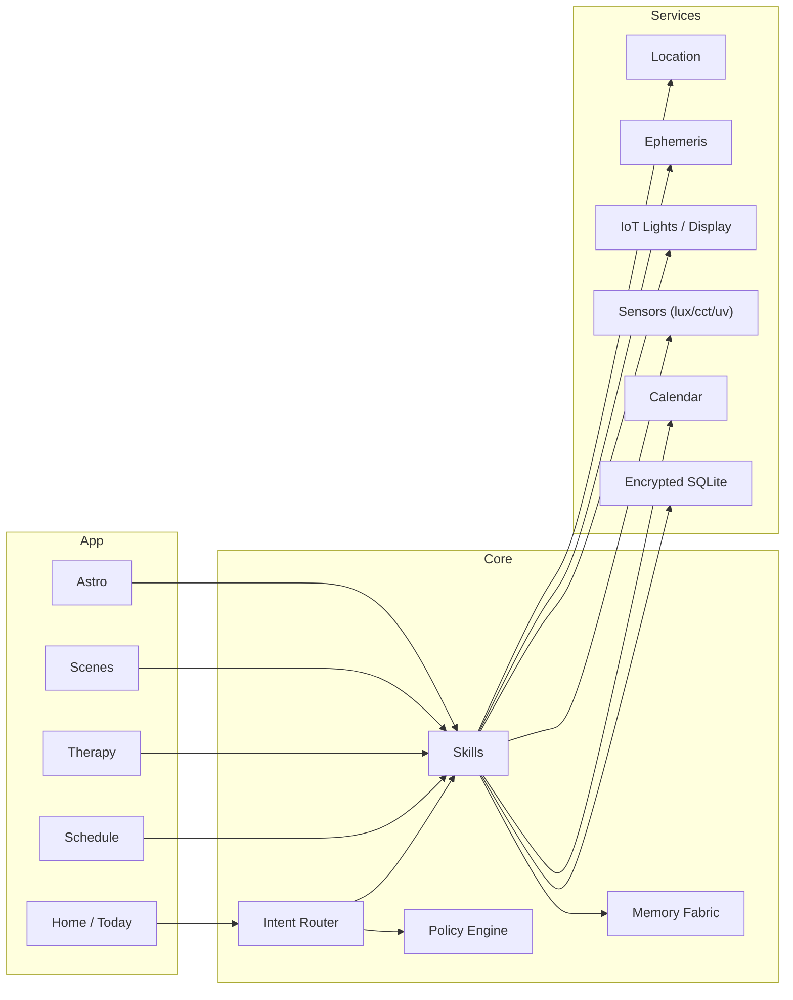

<div align="center">

# 🌞 Caelux — EKRP Design Scroll

**Circadian Orchestrator · Light choreography · Temporal navigation**

[](../../LICENSE)
[](#-guardian-protocol-mapping)
[](#-runtime--architecture)

</div>

---

## 🧭 Table of Contents
- [Purpose](#-purpose)
- [Persona](#-persona)
- [Invocation Grammar](#-invocation-grammar)
- [Capabilities](#-capabilities)
- [Runtime & Architecture](#-runtime--architecture)
- [Data Model](#-data-model)
- [Intents & Orchestration](#-intents--orchestration)
- [Light & Time Pipelines](#-light--time-pipelines)
- [Privacy & Consent](#-privacy--consent)
- [Guardian Protocol Mapping](#-guardian-protocol-mapping)
- [Accessibility](#-accessibility)
- [Internationalization](#-internationalization)
- [Configuration](#-configuration)
- [Testing Strategy](#-testing-strategy)
- [Roadmap](#-roadmap)
- [License](#-license)
- [Disclaimer](#-disclaimer)

---

## 🎯 Purpose
Caelux aligns daily life with healthy light and time. It plans **sun‑aligned schedules**, guides **safe light exposure** (morning bright, evening warm‑dim), simulates **dawn** for gentle wakeups, and helps travelers **map jet‑lag recovery**. It is non‑clinical and complements Vitalis/Aurelith.

---

## 🧪 Persona
- **Tone**: bright, encouraging, unhurried.
- **Boundaries**: no medical claims; respects sensory sensitivities and shift‑work realities.
- **Rituals**: dawn greeting, golden‑hour pause, sunset unwind, night seal.

---

## 🔑 Invocation Grammar
- “Caelux, **wake me with a 20‑minute dawn** at 6:40 am.”
- “Plan a **jet‑lag map** from Calgary → Tokyo, arrival Friday.”
- “**Warm‑dim** the house at 9 pm and **enable blue‑light filter**.”
- “Find a **10‑minute sunlight window** between 11–2.”

---

## 🧩 Capabilities

### Provided
- `chrono.plan({ chronotype?, shift?, goals[] }) → ChronoPlan`
- `light.therapy.start({ minutes, intensityLux?, cctK?, safety? }) → Session`
- `scene.apply({ space, preset }) → ApplyResult`
- `dawn.simulate({ startAt, durationMin, targetLux?, cctProfile? }) → AlarmId`
- `jetlag.map({ fromTZ, toTZ, departAt, arriveAt, days }) → JetLagPlan`
- `window.find({ from, to, constraints }) → Windows[]`
- `nightshield.enable({ at, cctMaxK, brightnessMax% }) → Rule`
- `schedule.sync({ calendarLink }) → SyncReport`

### Consumed
- `sensors.read({ type: "lux"|"cctK"|"uv" })`
- `lights.control({ scene, zones[] })`
- `display.filter({ mode, until })`
- `alarm.schedule({ at, scene })`
- `calendar.link({ provider })`
- `location.read()` · `ephemeris.compute({ lat, lon, date })`
- `weather.fetch({ day })` (optional)

---

## 🏗 Runtime & Architecture



- **Shell**: mobile (alarms, filters) + desktop/web control for whole‑home scenes.
- **Stores**: local encrypted schedule, rules, exposure logs.
- **Policies**: Guardian + Mirror beneath all schedules and device control.

---

## 🧱 Data Model

```ts
export interface ChronoPlan {
  id: string
  chronotype?: "lark" | "neutral" | "owl"
  shift?: { start: string; end: string; days: string[] }
  goals: Array<"alert_morning" | "winddown_evening" | "jetlag_recovery" | "shift_support">
  cues: Array<{ at: string; kind: "bright"|"dim"|"move"|"pause"|"shield"; note?: string }>
}

export interface LightSession {
  id: string
  minutes: number
  intensityLux?: number
  cctK?: number
  startedAt: string
  endedAt?: string
  safety?: { epilepsyWarning?: boolean; eyeComfort?: boolean }
}

export interface JetLagPlan {
  id: string
  fromTZ: string
  toTZ: string
  departAt: string
  arriveAt: string
  days: Array<{ day: number; sleep: { start: string; end: string }; light: { target: "bright"|"dim"; window: { from: string; to: string } }>
}

export interface ScenePreset {
  id: string
  name: string
  cctK?: number
  lux?: number
  zones?: string[]
}

export interface ShieldRule {
  id: string
  at: string
  cctMaxK: number
  brightnessMaxPct: number
}
```

---

## 🧠 Intents & Orchestration

```ts
router.when(/dawn at (\d+:\d+)/i, (_, m) =>
  skills.dawn.simulate({ startAt: m[1], durationMin: 20, cctProfile: "sunrise" })
)

router.when(/jetlag .* (\w+) to (\w+)/i, (_, m) =>
  skills.jetlag.map({ fromTZ: m[1], toTZ: m[2], departAt: "2025-09-01T10:00", arriveAt: "2025-09-02T15:00", days: 4 })
)

router.when(/warm dim at (\d+)(am|pm)/i, (_, m) =>
  skills.nightshield.enable({ at: `${m[1]}${m[2]}`, cctMaxK: 2700, brightnessMax%: 30 })
)

router.when(/sunlight window (.+) to (.+)/i, (_, m) =>
  skills.window.find({ from: m[1], to: m[2], constraints: { minLux: 10000 } })
)
```

---

## 🔄 Light & Time Pipelines
- **Dawn Simulation**: ephemeris → ramp CCT/lux → gentle audio → wake confirmation.
- **Night Shield**: schedule → reduce CCT/brightness → enable OS filter → dim scenes.
- **Jet‑Lag Map**: TZ delta → staged sleep shifts → light windows → travel reminders.
- **Sunlight Window**: weather + ephemeris → walking slot suggestions.

---

## 🔒 Privacy & Consent
- Location/timezone use is explicit and scoped; can run fully offline with manual TZ.
- IoT access is opt‑in with zone scoping; all actions logged with reasons.
- Export/erase supported; no sharing by default.

---

## 🛡 Guardian Protocol Mapping
- **Medical Boundaries**: no treatment for SAD/insomnia; suggests clinicians when asked.
- **Safety**: warn about photosensitivity/epilepsy; eye comfort intervals on sessions.
- **Truth‑Law**: label estimates; cite public guidelines when provided.
- **Focus Guard**: small, reversible changes; one‑tap disable.

---

## ♿ Accessibility
- Large type; high contrast; haptic confirmations; tone‑safe alerts.
- Color‑blind‑aware palettes; captions for audio wake cues.

---

## 🌐 Internationalization
- Timezones and locales; DST edges; lunar/solar calendars (optional packs).

---

## 🔧 Configuration
- `.env`: `USE_IOT`, `USE_SENSORS`, `ALLOW_DISPLAY_FILTER`, `REGION`.

---

## 🧪 Testing Strategy
- Ephemeris correctness; DST and leap‑day boundaries.
- Sensor range simulations; eye‑comfort timers.
- Offline alarms; IoT failure fallbacks.

---

## 🗺 Roadmap
- **v0.1**: Dawn, night shield, sunlight window, local schedules.
- **v0.2**: Jet‑lag planner; IoT zones; Vitalis weave.
- **v0.3**: Weather‑aware suggestions; building daylight harvest (opt‑in).
- **v0.4**: Multi‑home profiles; travel packs; Aurelith ritual scenes.

---

## 📄 License
Licensed under **ECL‑NC‑1.1**. See [`LICENSE`](../../LICENSE).

---

## ⚠️ Disclaimer
Caelux is **not** a medical device and does not provide medical advice, diagnosis, or treatment.

