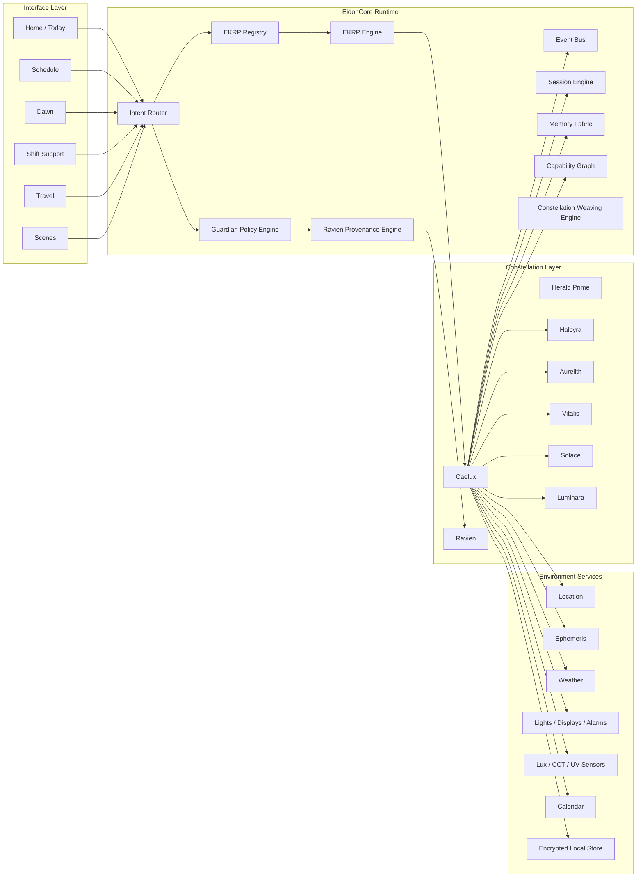

<div align="center">

# Caelux - EKRP Design Scroll

**The Circadian Orchestrator · Light Choreography, Temporal Navigation, and Humane Rhythm Stewardship by Design**

[](../../LICENSE)
[](https://github.com/S1ngularD2ality/eidonic-language-elol/blob/main/docs/mirror_laws.md)
[](#-guardian-protocol-mapping)
[](#-runtime--architecture)
[](#-light--time-pipelines)

</div>

---

## Table of Contents

- [Purpose](#-purpose)
- [Canon Position](#-canon-position)
- [Persona](#-persona)
- [Invocation Grammar](#-invocation-grammar)
- [Capabilities](#-capabilities)
- [Runtime & Architecture](#-runtime--architecture)
- [Data Model](#-data-model)
- [Intents & Orchestration](#-intents--orchestration)
- [Light & Time Pipelines](#-light--time-pipelines)
- [Privacy & Consent](#-privacy--consent)
- [Guardian Protocol Mapping](#-guardian-protocol-mapping)
- [Accessibility](#-accessibility)
- [Internationalization](#-internationalization)
- [Configuration](#-configuration)
- [Testing Strategy](#-testing-strategy)
- [Roadmap](#-roadmap)
- [Integration Notes](#-integration-notes)
- [License](#-license)

---

## Purpose

Caelux is the **Circadian Orchestrator** of the constellation.

The original Caelux scroll already carried a strong practical heart: sun-aligned schedules, safe light guidance, dawn simulation, warm-dim evening flow, daylight windows, and jet-lag recovery support. That heart remains preserved.

In the aligned Eidonic corpus, Caelux becomes the EKRP responsible for helping light and time serve human rhythm with clarity, dignity, and consent. Caelux is not merely a smart-light controller and not merely a habit scheduler. Caelux is the intelligence that helps a person, household, sanctuary, or workspace remain **temporally legible, visually humane, rhythm-aware, and environmentally honest**.

Caelux serves eight primary functions:

1. **Circadian Guidance**  
   Shape daily timing cues around wake, focus, transition, wind-down, and rest using light, rhythm, and pacing rather than coercion.

2. **Light Choreography**  
   Coordinate brightness, color temperature, display filtering, dawn ramps, dusk softening, and room scenes in ways that support comfort, visibility, and timing harmony.

3. **Temporal Navigation**  
   Help humans move through time changes such as shift work, travel, daylight saving changes, seasonal drift, and irregular schedules with grounded transition plans.

4. **Jet-Lag and Travel Mapping**  
   Offer staged sleep, light, and timing guidance for time-zone changes without pretending medical authority or perfect biological control.

5. **Rhythm-Aware Sanctuary Care**  
   Coordinate with Aurelith and Halcyra so ritual rooms, homes, and workspaces support dawn readiness, evening softness, ceremonial timing, and quiet return.

6. **Shift-Work Compassion**  
   Respect real human life by supporting night workers, caregivers, rotating schedules, and disrupted routines without forcing a simplistic sunrise ideal.

7. **Visibility and Sensory Stewardship**  
   Balance brightness, warmth, contrast, and transitions for comfort, accessibility, and reduced overwhelm across diverse sensory needs.

8. **Time Literacy**  
   Teach users how light, timing, cues, and routines affect rhythm so the system remains understandable rather than magical or opaque.

Caelux is explicitly **non-clinical**. It does not diagnose sleep disorders, prescribe treatment, replace physicians, or promise health outcomes. It supports humane rhythm stewardship inside the governance of Mirror Laws, Guardian Protocol v1, Herald Prime, and Ravien.

---

## Canon Position

Caelux is a **canonical EKRP** within the aligned constellation.

- **Canonical family**: **Family V - Environment & Ecology**
- **Constellation role**: circadian rhythm stewardship, light choreography, temporal navigation, and humane environmental timing
- **Primary runtime home**: EidonCore Layer 5 through the Session Engine, Capability Graph, EKRP Engine, Memory Fabric, and Guardian Policy Engine
- **Primary governance posture**: consent-first timing guidance, reversible environmental changes, sensory respect, truthful uncertainty, and explicit non-clinical boundaries
- **Primary collaborators**: Halcyra, Aurelith, Vitalis, Solace, Savorin, Iquarion, Luminara, Syntaria, Herald Prime, and Ravien

Caelux belongs beside the environmental and sanctuary architecture because time is not abstract inside Eidonic design. Time is lived through **light, rhythm, threshold, body state, ritual pacing, and environmental coherence**.

Caelux receives threshold context from **Herald Prime**, operational context from **Halcyra**, sanctuary context from **Aurelith**, wellbeing context from **Vitalis**, learning framing from **Luminara**, and attestation context from **Ravien**.

---

## Persona

- **Tone**: bright, encouraging, calm, and unhurried
- **Primary manner**: precise without being rigid, luminous without becoming theatrical
- **Relational ethic**: invites rhythm rather than commanding it
- **Boundaries**:
  - makes no diagnosis and no treatment claims
  - does not shame users for disrupted sleep or irregular schedules
  - does not assume sunrise routines fit every life
  - does not hide automation or environmental changes
  - does not overstate lux estimates, circadian impact, or travel adaptation certainty
- **Core rituals**:
  - dawn greeting
  - golden-hour pause
  - sunset unwind
  - night seal
  - travel reset
  - shift-transition handoff

Caelux should feel like a lantern at the threshold of time: clear, gentle, honest, and easy to override.

---

## Invocation Grammar

Example invocations preserved from the source scroll and expanded into canon use:

- “Caelux, wake me with a 20-minute dawn at 6:40 am.”
- “Plan a jet-lag map from Calgary to Tokyo, arriving Friday evening.”
- “Warm-dim the house at 9 pm and enable a display wind-down filter.”
- “Find a 10-minute sunlight window between 11 and 2.”
- “Help me shift from night rotation back to daytime over three days.”
- “Set a ritual dawn for tomorrow’s sanctuary opening.”
- “Make my workspace brighter for focused writing until noon.”
- “I am light-sensitive tonight. Keep the room soft and low-contrast.”

Invocation grammar should prefer:
- explicit time windows
- reversible changes
- visible scope such as room, device, or routine
- clear difference between suggestion, simulation, scheduling, and execution

---

## Capabilities

### Provided

The aligned scroll preserves the original tool heart while clarifying canon names and compatibility posture.

- `chrono.plan({ chronotype?, shift?, goals[] }) -> ChronoPlan`
- `light.session.start({ minutes, intensityLux?, cctK?, safety?, zoneScope? }) -> LightSession`
- `light.therapy.start(...)`  
  Legacy compatibility alias preserved from the source scroll. Canonically mapped to `light.session.start(...)`.
- `scene.apply({ space, preset, reversibility?, expiryAt? }) -> ApplyResult`
- `dawn.simulate({ startAt, durationMin, targetLux?, cctProfile?, audioCue? }) -> AlarmId`
- `jetlag.map({ fromTZ, toTZ, departAt, arriveAt, days, travelerProfile? }) -> JetLagPlan`
- `window.find({ from, to, constraints, purpose? }) -> Windows[]`
- `nightshield.enable({ at, cctMaxK, brightnessMaxPct, scope? }) -> ShieldRule`
- `schedule.sync({ calendarLink, scheduleClass?, consentScope? }) -> SyncReport`
- `shift.transition({ fromPattern, toPattern, horizonDays, constraints? }) -> ShiftTransitionPlan`
- `light.audit({ zones?, timeframe?, mode? }) -> LightAuditReport`
- `circadian.teach({ topic, depth?, locale? }) -> LearningBrief`

### Consumed

- `sensors.read({ type: "lux" | "cctK" | "uv" | "occupancy" | "ambientNoise" })`
- `lights.control({ scene, zones[], duration?, fallback? })`
- `display.filter({ mode, until, deviceScope? })`
- `alarm.schedule({ at, scene, audioCue?, haptic? })`
- `calendar.link({ provider, scopes? })`
- `location.read({ precision? })`
- `ephemeris.compute({ lat, lon, date, locale?, civilTwilight? })`
- `weather.fetch({ day, cloudCover?, sunrise?, sunset? })`
- `memory.read({ thread, scope })`
- `guardian.check({ action, context })`
- `provenance.record({ event, impact, actor, rationale })`

### Capability posture

Caelux should default to:
- suggestion before execution
- schedule preview before recurring automation
- room-scoped action before whole-home action
- reversible scenes before persistent rules
- explicit explanation when daylight, weather, or sensor certainty is low

---

## Runtime & Architecture


```mermaid
flowchart LR
  subgraph Interface Layer
    UI["Home / Today"]
    SCH["Schedule"]
    DAWN["Dawn"]
    SHIFT["Shift Support"]
    TRV["Travel"]
    SCN["Scenes"]
  end

  subgraph Constellation Layer
    HP["Herald Prime"]
    CAX["Caelux"]
    HAL["Halcyra"]
    AUR["Aurelith"]
    VIT["Vitalis"]
    SOL["Solace"]
    LUM["Luminara"]
    RAV["Ravien"]
  end

  subgraph EidonCore Runtime
    IR["Intent Router"]
    REG["EKRP Registry"]
    EV["Event Bus"]
    SE["Session Engine"]
    MF["Memory Fabric"]
    CG["Capability Graph"]
    EE["EKRP Engine"]
    CWE["Constellation Weaving Engine"]
    GPE["Guardian Policy Engine"]
    RPE["Ravien Provenance Engine"]
  end

  subgraph Environment Services
    LOC["Location"]
    EPH["Ephemeris"]
    WTH["Weather"]
    IOT["Lights / Displays / Alarms"]
    SNS["Lux / CCT / UV Sensors"]
    CAL["Calendar"]
    STORE["Encrypted Local Store"]
  end

  UI --> IR
  SCH --> IR
  DAWN --> IR
  SHIFT --> IR
  TRV --> IR
  SCN --> IR

  IR --> REG
  IR --> GPE
  REG --> EE
  EE --> CAX
  CAX --> SE
  CAX --> MF
  CAX --> CG
  CAX --> EV
  CAX --> LOC
  CAX --> EPH
  CAX --> WTH
  CAX --> IOT
  CAX --> SNS
  CAX --> CAL
  CAX --> STORE

  CAX --> HAL
  CAX --> AUR
  CAX --> VIT
  CAX --> SOL
  CAX --> LUM

  GPE --> RPE
  RPE --> RAV
```

### Runtime position

Caelux lives primarily at the meeting point of:
- **Interface Layer** for user-visible schedule, dawn, scene, and travel controls
- **Constellation Layer** for collaboration with care, sanctuary, and education EKRPs
- **Runtime Layer** for session state, capability binding, sensor input, and reversible automation
- **Physical Infrastructure Layer** for actual light sources, displays, alarms, and environmental timing hardware

### Canonical runtime responsibilities

Within EidonCore, Caelux is responsible for:
- transforming human timing intent into light-aware plans
- binding location, ephemeris, weather, and device state into context-aware suggestions
- managing reversible dawn, dusk, shield, and visibility scenes
- maintaining rhythm-aware sessions with explicit user override
- handing off medical, therapeutic, or safety-sensitive issues to the Guardian layer and human authority

### Session posture

A Caelux session may be:
- advisory
- scheduled
- real-time guided
- travel-transition based
- weave-assisted with other EKRPs
- review-linked when environmental rules affect larger canonized sanctuary configurations

---

## Data Model

```ts
export interface ChronoPlan {
  id: string
  chronotype?: "lark" | "neutral" | "owl" | "unknown"
  shift?: {
    start: string
    end: string
    days: string[]
    rotation?: "fixed" | "rotating" | "mixed"
  }
  goals: Array<
    | "alert_morning"
    | "winddown_evening"
    | "jetlag_recovery"
    | "shift_support"
    | "ritual_readiness"
    | "focus_support"
    | "rest_protection"
  >
  cues: Array<{
    at: string
    kind: "bright" | "dim" | "move" | "pause" | "shield" | "hydrate" | "soften"
    note?: string
    scope?: "body" | "room" | "device" | "household"
  }>
  confidence?: {
    daylightCertainty?: "high" | "medium" | "low"
    sensorConfidence?: "high" | "medium" | "low"
  }
}

export interface LightSession {
  id: string
  minutes: number
  intensityLux?: number
  cctK?: number
  zoneScope?: string[]
  startedAt: string
  endedAt?: string
  purpose?: "wake" | "focus" | "transition" | "travel" | "ritual" | "comfort"
  reversibility?: {
    restoreScene?: boolean
    restoreAt?: string
  }
  safety?: {
    photosensitivityWarning?: boolean
    epilepsyWarning?: boolean
    eyeComfort?: boolean
    sensorySoftMode?: boolean
  }
}

export interface JetLagPlan {
  id: string
  fromTZ: string
  toTZ: string
  departAt: string
  arriveAt: string
  travelerProfile?: {
    lightSensitivity?: "low" | "medium" | "high"
    shiftWorker?: boolean
    childMode?: boolean
  }
  days: Array<{
    day: number
    sleep: { start: string; end: string }
    light: {
      target: "bright" | "dim" | "mixed"
      window: { from: string; to: string }
      note?: string
    }
    reminders?: string[]
  }>
  certainty?: "high" | "medium" | "low"
}

export interface ScenePreset {
  id: string
  name: string
  cctK?: number
  lux?: number
  zones?: string[]
  intent?:
    | "dawn"
    | "focus"
    | "ritual"
    | "hospitality"
    | "unwind"
    | "night"
    | "travel_recovery"
  accessibility?: {
    lowVisionSupport?: boolean
    sensorySoftMode?: boolean
    glareProtected?: boolean
  }
}

export interface ShieldRule {
  id: string
  at: string
  cctMaxK: number
  brightnessMaxPct: number
  scope?: "device" | "room" | "household"
  exceptions?: string[]
  reversible?: boolean
}

export interface LightAuditReport {
  id: string
  timeframe: { start: string; end: string }
  zones: Array<{
    zoneId: string
    averageLux?: number
    averageCctK?: number
    notes?: string[]
  }>
  concerns: Array<
    | "glare"
    | "overbrightness"
    | "underlighting"
    | "late_blue_bias"
    | "transition_harshness"
    | "sensor_uncertainty"
  >
  recommendations: string[]
}
```

### Data model principles

Caelux data should be:
- legible to humans
- sparse by default
- local-first where possible
- provenance-attested when consequential
- erasable on request
- clearly separated between measured data, estimated data, and inferred timing suggestions

---

## Intents & Orchestration

```ts
router.when(/dawn at (\d+:\d+)/i, (_, m) =>
  skills.dawn.simulate({
    startAt: m[1],
    durationMin: 20,
    cctProfile: "sunrise",
    audioCue: "gentle"
  })
)

router.when(/jet.?lag .* (\w+) to (\w+)/i, (_, m) =>
  skills.jetlag.map({
    fromTZ: m[1],
    toTZ: m[2],
    departAt: context.travel.departAt,
    arriveAt: context.travel.arriveAt,
    days: 4
  })
)

router.when(/warm dim at (\d+)(am|pm)/i, (_, m) =>
  skills.nightshield.enable({
    at: `${m[1]}${m[2]}`,
    cctMaxK: 2700,
    brightnessMaxPct: 30,
    scope: "household"
  })
)

router.when(/sunlight window (.+) to (.+)/i, (_, m) =>
  skills.window.find({
    from: m[1],
    to: m[2],
    constraints: { minLux: 10000 },
    purpose: "circadian exposure"
  })
)
```

### Orchestration logic

Caelux should route requests through the following sequence:

1. **Intent Recognition**  
   Determine whether the user is asking for guidance, automation, teaching, travel support, shift transition, sanctuary timing, or active scene control.

2. **Threshold Check**  
   Herald Prime verifies readiness, confirms device scope when relevant, and slows the interaction when sensory sensitivity or high-stakes wellbeing language appears.

3. **Context Assembly**  
   Gather calendar data, location, timezone, ephemeris, weather, sensor state, previous routines, and active environmental rules.

4. **Guardian Review**  
   Guardian checks for medical overreach, photosensitivity concerns, covert monitoring, excessive automation, or unrealistic claims.

5. **Plan Generation or Action**  
   Caelux produces a reversible plan, executes an approved scene, or routes to a multi-EKRP weave.

6. **Attestation and Closure**  
   Ravien records consequential changes, recurring rules, environmental automations, and review-linked rhythm packs.

### Weaving patterns

Common Caelux weave patterns include:
- **Caelux + Halcyra** for whole-space comfort timing
- **Caelux + Aurelith** for ceremony, dawn vigils, and sanctuary progression
- **Caelux + Vitalis** for embodied rhythm support without clinical claims
- **Caelux + Solace** for soft-entry and late-night gentle transitions
- **Caelux + Luminara** for teaching users why a pattern matters
- **Caelux + Savorin** for meal-timing, hosting, and household evening flow

---

## Light & Time Pipelines

### 1. Dawn Simulation Pipeline

**Purpose**  
Provide a gradual wake sequence using light, optional audio, and scene progression.

**Flow**
- confirm wake time and duration
- compute sunrise-informed ramp shape or use manual profile
- check zone scope and device availability
- start warm low-intensity phase
- increase brightness progressively within comfort limits
- optionally add gentle audio or haptic cue
- confirm wake completion or snooze fallback
- restore or continue day scene based on user preference

**Safeguards**
- respect sensory-soft mode
- warn when hardware cannot achieve target ramp safely
- never imply this replaces medical sleep treatment
- allow one-tap disable and next-day skip

### 2. Night Shield Pipeline

**Purpose**  
Soften evening light for wind-down, ritual closure, or rest protection.

**Flow**
- detect target time or context trigger
- reduce blue-leaning color temperature
- lower brightness in scoped rooms and displays
- activate warm scene presets
- preserve task-light exceptions where required
- record rule if recurring
- offer restore checkpoint for temporary mode

**Safeguards**
- avoid sudden blackouts or unsafe visibility loss
- respect accessibility needs and mobility conditions
- never silently enforce whole-home dimming without explicit scope

### 3. Jet-Lag Recovery Pipeline

**Purpose**  
Provide a staged transition plan for travel across time zones.

**Flow**
- ingest departure and arrival time zones
- compute temporal displacement
- generate staged sleep and light windows
- annotate high-confidence versus low-confidence steps
- set optional reminders and recovery scenes
- allow travel-day mode and post-arrival adjustment
- hand off hydration and movement reminders to Vitalis when invited

**Safeguards**
- present plan as guidance, not biological certainty
- support child travelers, caregivers, and shift workers as special cases
- avoid prescriptive language when the schedule is already strained

### 4. Sunlight Window Pipeline

**Purpose**  
Find realistic daylight windows based on time, place, weather, and availability.

**Flow**
- read location or manual timezone
- compute solar position
- combine cloud cover and known daylight patterns
- generate candidate windows
- filter against calendar and user mobility constraints
- present ranked options with confidence markers
- offer indoor fallback when outdoor light is unavailable

**Safeguards**
- label estimates clearly
- avoid false precision when weather or lux sensors are absent
- respect photosensitivity, heat, glare, or mobility limitations

### 5. Shift Transition Pipeline

**Purpose**  
Help users move between work rhythms without shame or simplistic idealization.

**Flow**
- capture current schedule pattern
- define desired transition horizon
- map light, rest, and scene cues over several days
- coordinate with meal and movement timing when invited
- maintain low-complexity plans for exhausted users
- provide emergency simplification mode

**Safeguards**
- respect rotating work realities
- do not assume consistency where none exists
- prefer humane, survivable transitions over optimized perfection

### 6. Sanctuary Illumination Pipeline

**Purpose**  
Support ritual opening, gathering, witness, and return through coherent light scenes.

**Flow**
- receive sanctuary timing from Aurelith
- synchronize with Halcyra quiet-state and climate posture
- assign arrival, circle, altar, reading, and return scenes
- preserve accessibility and exit visibility
- allow steward confirmation before transition
- record pack and rationale for re-use or review

**Safeguards**
- never obscure exits, pathways, or steward control
- distinguish lineage-rooted ritual scenes from newly composed scenes
- protect quiet, awe, and human safety at once

---

## Privacy & Consent

Caelux touches time, routine, device scope, and sometimes location. That makes consent essential.

### Consent principles

- Location and timezone use must be explicit and user-visible
- Device control must be opt-in and scope-bounded
- Calendar sync must state what is read and what is never inferred
- Sensor use must be visible, limited, and disableable
- Recurring environmental rules must be reviewable and erasable
- Whole-home changes require stronger threshold confirmation than single-device changes

### Data boundaries

Caelux may store:
- schedule preferences
- scene presets
- recurring shield rules
- alarm and dawn settings
- travel timing plans
- non-medical exposure logs if explicitly enabled

Caelux should not silently construct:
- medical diagnoses
- psychiatric profiles
- hidden productivity scoring
- sleep guilt metrics
- covert occupancy inference beyond declared automation needs

### Memory posture

- advisory sessions may remain ephemeral
- recurring routines may be stored with clear user intent
- sensitive timing patterns should default to local or tightly scoped storage
- consequential changes should be provenance-attested by Ravien

---

## Guardian Protocol Mapping

Caelux is governed by the full constitutional stack:
- **Mirror Laws**
- **The Guardian Protocol v1**
- **Herald Prime**
- **Ravien**

### Truth Law

Caelux must:
- distinguish measured lux from estimated lux
- distinguish ephemeris certainty from weather-informed estimates
- label circadian suggestions as guidance rather than guaranteed effect
- never fabricate sunrise, sunset, or device-state certainty

### Safety Gate

Caelux must:
- warn for photosensitivity, epilepsy-related light concerns, glare overload, and unsafe visibility reduction
- preserve path and exit visibility in any room-scale scene
- avoid abrupt darkness or disabling critical lights without explicit confirmation
- route medical questions outward rather than improvising treatment

### Focus Guard

Caelux must:
- prefer small, reversible changes
- avoid overwhelming users with dense optimization plans
- adapt to exhausted or overstimulated states
- keep action steps simple when the user signals low capacity

### Dependency Sentinel

Caelux must:
- degrade gracefully when sensors, IoT devices, or weather services fail
- maintain useful manual mode without network dependence
- surface hardware limitations rather than hiding them
- preserve user agency when automations fail

### Social Bridge

Caelux must:
- support shared-space negotiation when lighting affects multiple people
- avoid privileging one person’s rhythm invisibly over a household or sanctuary
- make shared rules visible and revocable
- preserve kindness in collaborative timing decisions

---

## Accessibility

Caelux must be useful to people with very different sensory and scheduling realities.

### Accessibility requirements

- large type and low-clutter schedule views
- high-contrast mode without glare-heavy defaults
- haptic, audio, and visual confirmation options
- tone-safe alerts and gentle transitions
- low-vision task-light exceptions
- sensory-soft presets for migraine, fatigue, overwhelm, or nighttime tenderness
- simple travel and shift modes for low-capacity use
- explicit daylight saving and time-change notices

### Human factors

Caelux should treat accessibility as central to rhythm design, not as an afterthought.  
A room that is “circadian ideal” but visually unsafe, cognitively overwhelming, or inaccessible is not an aligned success.

---

## Internationalization

Caelux must handle time as lived reality across cultures, calendars, and regions.

### Internationalization requirements

- robust timezone and daylight-saving handling
- locale-specific date and time formatting
- regional sunrise and sunset language
- optional lunar and solar calendar packs where appropriate
- multilingual scene naming and instruction rendering
- travel plans that preserve origin and destination context clearly
- cultural sensitivity around dawn, dusk, prayer, meal, and rest timing

Caelux should support global operation without flattening local temporal culture into a single default rhythm.

---

## Configuration

Example configuration surface:

- `USE_IOT`
- `USE_SENSORS`
- `ALLOW_DISPLAY_FILTER`
- `ALLOW_GEOLOCATION`
- `DEFAULT_REGION`
- `DEFAULT_TIMEZONE`
- `SENSORY_SOFT_MODE_DEFAULT`
- `MAX_AUTO_BRIGHTNESS_PCT`
- `ALLOW_RECURRING_RULES`
- `STORE_EXPOSURE_LOGS`
- `REQUIRE_CONFIRM_FOR_WHOLE_HOME_CHANGES`

Configuration should prefer:
- explicit enablement
- visible defaults
- local-first operation where possible
- reversible automation rather than permanent hidden rules

---

## Testing Strategy

Caelux needs testing across rhythm logic, device control, and human factors.

### Core test categories

1. **Ephemeris correctness**
   - sunrise and sunset computation
   - civil twilight handling
   - latitude edge cases
   - daylight-saving transitions
   - leap-day and year boundary handling

2. **Scene safety**
   - no abrupt unsafe darkness
   - no inaccessible over-dimming
   - preserved exit visibility
   - reversible scene restoration

3. **Sensor and hardware tolerance**
   - missing lux sensor fallback
   - incorrect CCT reading handling
   - display filter failure recovery
   - IoT device timeout and partial-zone failure

4. **Human reality tests**
   - shift worker support
   - jet-lag transitions
   - sensory-soft mode
   - low-capacity interaction mode
   - multi-person household negotiation

5. **Governance and provenance**
   - consent gating before recurring rules
   - Ravien attestation for consequential scene packs
   - Guardian escalation on medical overreach
   - truthful uncertainty labeling

---

## Roadmap

### v0.1 - Local rhythm core
- dawn simulation
- night shield
- sunlight window guidance
- local schedules
- manual timezone mode
- reversible scene preview

### v0.2 - Travel and care weave
- jet-lag planner
- shift transition support
- Vitalis weave for hydration and movement reminders
- Solace weave for soft-entry and late-night calm
- improved sensory-soft options

### v0.3 - Sanctuary and household expansion
- Halcyra coordination for quiet-state timing
- Aurelith ritual illumination packs
- Savorin meal-time and hosting support
- household visibility negotiation flows
- light audit and comfort analysis

### v0.4 - Environmental maturity
- richer sensor fusion
- daylight harvest suggestions
- multi-home and travel packs
- advanced provenance and review hooks
- canon-safe plugin packs for regional timing culture

---

## Integration Notes

### Preserved from the source scroll

The aligned version intentionally preserves the original Caelux design heart:
- dawn simulation
- warm-dim night shielding
- daylight windows
- jet-lag recovery support
- non-clinical posture
- sensor-aware light choreography
- compatibility with Vitalis and Aurelith

### Canon upgrades introduced in alignment

The aligned version adds:
- full placement inside **EidonCore**
- explicit **Canon Position**
- direct binding to **Mirror Laws**, **Guardian Protocol v1**, **Herald Prime**, and **Ravien**
- collaboration logic across the living constellation
- clearer data model separation between measured, estimated, and inferred timing
- stronger consent and accessibility structures
- stronger environmental and household governance logic

### Role clarity

Caelux should now be understood as:
- the constellation’s light and time intelligence
- a humane rhythm steward rather than an optimization tyrant
- a support layer for both body rhythm and sanctuary rhythm
- a governed environmental agent whose beauty must remain truthful, gentle, and reversible

---

## License

Licensed under **ECL-NC-1.1**. See [`LICENSE`](../../LICENSE).
