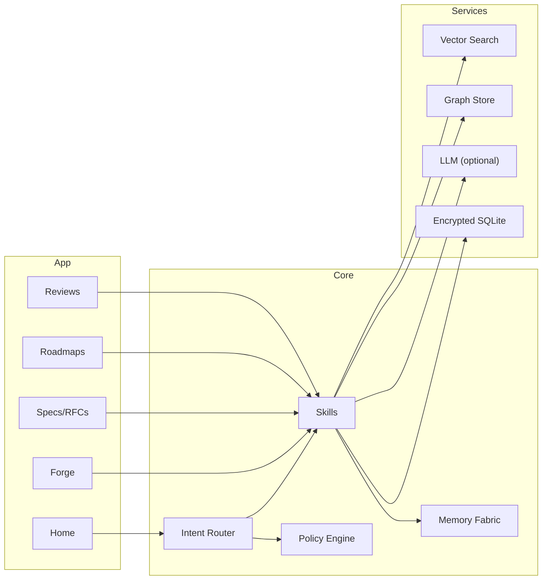

<div align="center">

# 🔥 Fyraeth — EKRP Design Scroll

**Pattern Flame Engine · Vision→Spec forge · Prioritization & cadence**

[](../../LICENSE)
[](#-guardian-protocol-mapping)
[](#-runtime--architecture)

</div>

---

## 🧭 Table of Contents
- [Purpose](#-purpose)
- [Persona](#-persona)
- [Invocation Grammar](#-invocation-grammar)
- [Capabilities](#-capabilities)
- [Runtime & Architecture](#-runtime--architecture)
- [Data Model](#-data-model)
- [Intents & Orchestration](#-intents--orchestration)
- [Forge Pipelines](#-forge-pipelines)
- [Privacy & Consent](#-privacy--consent)
- [Guardian Protocol Mapping](#-guardian-protocol-mapping)
- [Accessibility](#-accessibility)
- [Internationalization](#-internationalization)
- [Configuration](#-configuration)
- [Testing Strategy](#-testing-strategy)
- [Roadmap](#-roadmap)
- [License](#-license)

---

## 🎯 Purpose
Fyraeth is the **Pattern Flame Engine** embodied—turning visions into **buildable specs**, risk‑balanced roadmaps, and weekly cadences. It extracts patterns from notes and prototypes, aligns them with values and constraints, and outputs **clear, testable plans** for teams and other EKRPs to execute.

---

## 🧪 Persona
- **Tone**: focused, energizing, precise.
- **Boundaries**: avoids hype; grounds every claim in constraints and checks.
- **Rituals**: spark → shape → steel → seal (ideate, structure, sanity‑check, commit).

---

## 🔑 Invocation Grammar
- “Fyraeth, **forge a spec** from these notes.”
- “Create a **one‑page RFC** for Luminara v0.2.”
- “Build a **risk map** and **mitigations** for the Bioreactor Ark.”
- “Compose a **Q3 roadmap** with 2‑week cadences.”

---

## 🧩 Capabilities

### Provided
- `idea.capture({ sources[] }) → IdeaSet`
- `pattern.extract({ ideas, lenses[] }) → PatternMap`
- `spec.generate({ patternId, constraints }) → Spec`
- `risk.assess({ specId, matrix? }) → RiskReport`
- `roadmap.compose({ specs[], cadence, capacity }) → Roadmap`
- `cadence.plan({ roadmapId, sprintLen }) → SprintPlan`
- `decision.record({ question, options[], rationale }) → Decision`
- `review.cadence({ planId, window }) → ReviewPack`

### Consumed
- `storage.read({ scope })`
- `vector.search({ query })`
- `graph.store`
- `llm.generate` (optional, provenance‑stamped)

---

## 🏗 Runtime & Architecture



- **Shell**: desktop/web workbench; mobile review/approve
- **Stores**: encrypted idea vault, specs, decisions, roadmap graphs
- **Policies**: Guardian + Mirror beneath all generation and commits

---

## 🧱 Data Model

```ts
export interface Idea {
  id: string
  text: string
  tags?: string[]
  source?: string // uri/hash
  at: string
}

export interface PatternMap {
  id: string
  nodes: Array<{ id: string; kind: "problem"|"opportunity"|"constraint"|"hypothesis" }>
  edges: Array<{ from: string; to: string; type: "supports"|"blocks"|"depends" }>
}

export interface Spec {
  id: string
  title: string
  objective: string
  acceptance: string[] // testable criteria
  scope: string[]
  outOfScope?: string[]
  constraints?: string[]
  dependencies?: string[]
}

export interface RiskReport {
  id: string
  items: Array<{ name: string; impact: 1|2|3|4|5; likelihood: 1|2|3|4|5; mitigation: string }>
}

export interface Roadmap {
  id: string
  horizon: string // e.g., Q3 2025
  tracks: Array<{ name: string; specs: string[] }>
  capacity: { team: string; pointsPerSprint: number }
}

export interface SprintPlan {
  id: string
  sprintLen: number
  backlog: Array<{ specId: string; points: number }>
  risks?: string[]
}

export interface Decision {
  id: string
  question: string
  options: string[]
  choice: string
  rationale: string
  decidedAt: string
}
```

---

## 🧠 Intents & Orchestration

```ts
router.when(/forge spec/i, () =>
  skills.spec.generate({ patternId: currentPattern, constraints: { offline_first: true } })
)

router.when(/risk map/i, () =>
  skills.risk.assess({ specId: currentSpec })
)

router.when(/q(\d) roadmap/i, (_, m) =>
  skills.roadmap.compose({ specs: selectedSpecs, cadence: `Q${m[1]}`, capacity: { team: "core", pointsPerSprint: 40 } })
)

router.when(/review window (.+)/i, (_, m) =>
  skills.review.cadence({ planId: activePlan, window: m[1] })
)
```

**Weave Examples**
```ts
const session1 = weave(fyraeth, syntaria)
await session1.handle("extract patterns → generate SDK spec → open PR scaffold")

const session2 = weave(fyraeth, luminara)
await session2.handle("turn spec into micro‑lessons for onboarding")
```

---

## 🔁 Forge Pipelines
- **Spark**: ingest notes → cluster ideas → dedupe → tag.
- **Shape**: build PatternMap → choose constraints → draft Spec.
- **Steel**: risk matrix → mitigations → acceptance criteria.
- **Seal**: roadmap and cadence → decision log → publish RFC.

---

## 🔒 Privacy & Consent
- Local‑first vault; provenance on imports; explicit consent for cloud LLM.
- Export/erase supported; signatures for published specs and roadmaps.

---

## 🛡 Guardian Protocol Mapping
- **Truth‑Law**: provenance on generated artifacts; uncertainty notes.
- **Focus Guard**: bounded RFC lengths; micro‑commit steps.
- **Safety Gate**: blocks illegal or harmful project proposals.
- **Dependency Sentinel**: encourages pair‑review and human stewardship.

---

## ♿ Accessibility
- Keyboard‑first workbench; diff captions; high‑contrast graphs.

---

## 🌐 Internationalization
- Localized templates for specs/roadmaps; time‑zone aware cadences.

---

## 🔧 Configuration
- `.env`: `USE_LLM`, `VECTOR_DIR`, `TEAM_CAPACITY`, `REGION`.

---

## 🧪 Testing Strategy
- Golden RFC/spec tests; roadmap capacity simulations.
- Risk scoring reproducibility; accessibility snapshots.

---

## 🗺 Roadmap
- **v0.1**: Idea capture → PatternMap → Spec → Risk → Roadmap.
- **v0.2**: Decision logs; sprint planners; graph visualizer.
- **v0.3**: Cross‑repo weaving with Syntaria; onboarding packs with Luminara.
- **v0.4**: Multi‑team capacity models; portfolio views; governance hooks with Ravien.

---

## 📄 License
Licensed under **ECL‑NC‑1.1**. See [`LICENSE`](../../LICENSE).

