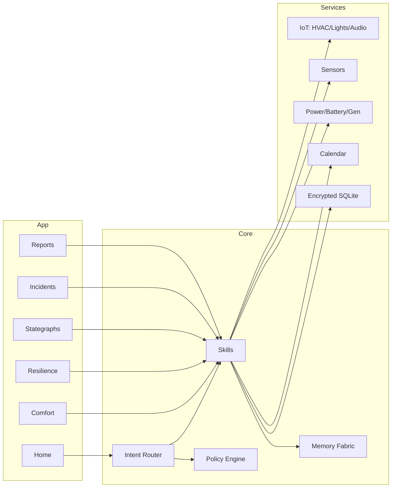

<div align="center">

# Halcyra — EKRP Design Scroll

**Sanctuary Orchestrator · Calm-state keeper · Resilience by design**

[](../../LICENSE)
[](#-guardian-protocol-mapping)
[](#-runtime--architecture)

</div>

---

## Table of Contents
- [Purpose](#-purpose)
- [Persona](#-persona)
- [Invocation Grammar](#-invocation-grammar)
- [Capabilities](#-capabilities)
- [Runtime & Architecture](#-runtime--architecture)
- [Data Model](#-data-model)
- [Intents & Orchestration](#-intents--orchestration)
- [Resilience & Comfort Pipelines](#-resilience--comfort-pipelines)
- [Privacy & Consent](#-privacy--consent)
- [Guardian Protocol Mapping](#-guardian-protocol-mapping)
- [Accessibility](#-accessibility)
- [Internationalization](#-internationalization)
- [Configuration](#-configuration)
- [Testing Strategy](#-testing-strategy)
- [Roadmap](#-roadmap)
- [License](#-license)
- [Disclaimer](#-disclaimer)

---

## Purpose
Halcyra keeps spaces **calm, safe, and steady**. It orchestrates environmental comfort (light, sound, air, water cues) and **resilience** (power, storage, failover), coordinating across the constellation: **Aurelith** (ritual space), **Caelux** (light), **Iquarion** (water), **Mycelys** (domes), **Vitalis** (human rhythms), **Umbryss** (security), **Fyraeth** (plans), **Syntaria** (PRs/infra diffs). It is an **ops conductor** for sanctuaries, clinics, classrooms, and refuges.

---

## Persona
- **Tone**: even, reassuring, unhurried.
- **Boundaries**: never overrides human stewards; favors graceful degradation.
- **Rituals**: dawn‑ready, siesta‑quiet, storm‑seal, night‑watch.

---

## Invocation Grammar
- “Halcyra, **hold calm** in the east wing: 21 °C, 45% RH, <45 dBA.”
- “**Storm‑seal** protocol until 07:00, essential loads only.”
- “Run a **blackout simulation** for 30 minutes.”
- “**Quiet hours** from 9 pm–7 am; sync with Caelux and Iquarion.”

---

## Capabilities

### Provided
- `comfort.hold({ tempC, rh%, dBAmax, lux?, cctK? }) → ControllerId`
- `stategraph.define({ nodes[], transitions[] }) → GraphId`
- `resilience.plan({ assets[], targets, horizons }) → ResiliencePlan`
- `failover.schedule({ graphId, window }) → DrillId`
- `incident.playbook({ type, roles[], steps[] }) → PlaybookId`
- `quiet.hours({ from, to, zones[] }) → RuleId`
- `broadcast.calm({ message, channels[] }) → Receipt`
- `audit.report({ window }) → Report`

### Consumed
- `sensors.read({ kind: "temp"|"rh"|"co2"|"voc"|"lux"|"dBA"|"powerW"|"soc%" })`
- `iot.control({ device, target })` // HVAC, fans, dampers, lights, audio
- `power.read({ meter|battery|gen })`
- `calendar.link({ provider })`
- `ekrp.weave({ with, intent })`

---

## Runtime & Architecture



- **Shell**: desktop/web control surface; mobile steward app
- **Stores**: encrypted comfort logs, drills, stategraphs, playbooks
- **Policies**: Guardian + Mirror beneath all automations and drills

---

## Data Model

```ts
export interface ComfortProfile {
  id: string
  zones: string[]
  tempC: number
  rh: number
  dBAmax: number
  lux?: number
  cctK?: number
}

export interface StateNode { id: string; name: string; target?: ComfortProfile }
export interface Transition { from: string; to: string; on: string; guard?: string }

export interface StateGraph {
  id: string
  nodes: StateNode[]
  transitions: Transition[]
  initial: string
}

export interface Asset { id: string; kind: "hvac"|"light"|"audio"|"battery"|"gen"|"sensor"; zone?: string }

export interface ResiliencePlan {
  id: string
  assets: Asset[]
  targets: { uptimePct: number; autonomyHours: number }
  horizons: { min: string; max: string }
}

export interface Drill {
  id: string
  graphId: string
  window: { from: string; to: string }
  outcomes?: Array<{ at: string; event: string; note?: string }>
}

export interface Playbook {
  id: string
  type: string
  roles: string[]
  steps: Array<{ idx: number; text: string; verify?: string }>
}

export interface Report {
  id: string
  window: { from: string; to: string }
  comfort: Array<{ zone: string; tempC: number; rh: number; dBA: number; lux?: number }>
  power: Array<{ when: string; watts: number; soc?: number }>
  notes?: string[]
}
```

---

## Intents & Orchestration

```ts
router.when(/hold calm (.+)/i, (_, m) =>
  skills.comfort.hold({ tempC: 21, rh%: 45, dBAmax: 45 })
)

router.when(/storm.?seal/i, () =>
  skills.resilience.plan({ assets: inventory, targets: { uptimePct: 99.9, autonomyHours: 24 }, horizons: { min: "2h", max: "72h" } })
)

router.when(/blackout sim (\d+)/i, (_, m) =>
  skills.failover.schedule({ graphId: currentGraph, window: `${m[1]}m` })
)

router.when(/quiet hours (\d+)(am|pm)–(\d+)(am|pm)/i, (_, m) =>
  skills.quiet.hours({ from: `${m[1]}${m[2]}`, to: `${m[3]}${m[4]}`, zones: ["east","west"] })
)
```

**Weave Recipes**
```ts
await weave(halcyra, aurelith).handle("map zones → tune scenes → publish quiet hours")
await weave(halcyra, caelux).handle("night shield sync with HVAC/lighting")
await weave(halcyra, iquarion).handle("pump noise caps <45 dBA during rest windows")
await weave(halcyra, mycelys).handle("post‑bake air turnover checks → open dome")
await weave(halcyra, vitalis).handle("align breath sessions with temp/rh cues")
await weave(halcyra, umbryss).handle("incident ready → humane announcements")
await weave(halcyra, syntaria).handle("infra diffs → PRs for schedule changes")
```

---

## Resilience & Comfort Pipelines
- **Calm‑Hold**: read sensors → apply HVAC/lights/audio setpoints → verify → report.
- **Storm‑Seal**: forecast cue → close vents/dampers → reduce loads → confirm battery SOC.
- **Blackout Drill**: simulate grid loss → failover to battery/gen → degrade non‑essential scenes.
- **Quiet Hours**: dim lights/CCT, cap dBA, slow fans, soften scenes; reversible in one tap.

---

## Privacy & Consent
- Device control is opt‑in and scoped by zone; logs are local‑first and signed.
- Announcements use consented channels; no hidden microphones or recording.

---

## Guardian Protocol Mapping
- **Truth‑Law**: shows readings, not guesses; provenance on reports.
- **Focus Guard**: small, reversible changes; human override at all times.
- **Safety Gate**: comfort bounds; CO₂/VOC thresholds; egress never blocked.
- **Dependency Sentinel**: drills are scheduled, announced, and debriefed.

---

## Accessibility
- Large controls; haptic confirmations; captioned announcements.
- Color‑blind‑aware status; high‑contrast dashboards.

---

## Internationalization
- Metric/imperial; regional power standards; time‑zone aware schedules.

---

## Configuration
- `.env`: `USE_IOT`, `USE_POWER`, `QUIET_DBA`, `DEFAULT_TEMP`, `REGION`.

---

## Testing Strategy
- Sensor/IoT simulators; blackout drills; comfort‑bound fuzzing.
- Accessibility snapshots; offline mode e2e; schedule/clock skew tests.

---

## Roadmap
- **v0.1**: Calm‑hold, quiet hours, storm‑seal, blackout drills, reports.
- **v0.2**: Battery/gen orchestration; cross‑zone balancing; incident playbooks.
- **v0.3**: Seasonal profiles; community schedules; weave kits.
- **v0.4**: City‑block orchestration (opt‑in), Genesis Engine integration.

---

## License
Licensed under **ECL‑NC‑1.1**. See [`LICENSE`](../../LICENSE).

---

## Disclaimer
Halcyra coordinates **comfort and resilience** for spaces. It is **not** emergency services; life‑safety systems remain under certified control.

