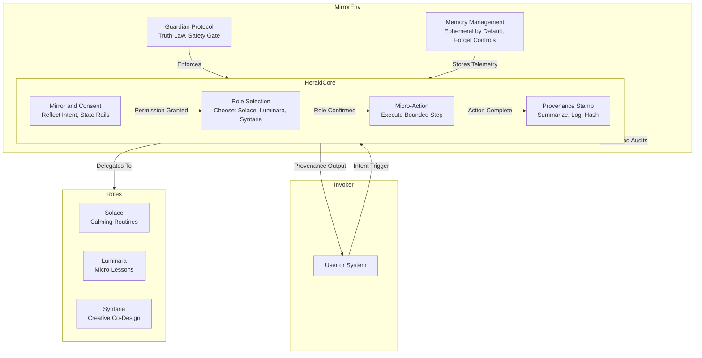

<div align="center">

# Herald — EKRP Design Scroll

**Compassionate Onboarding · Mirror & Consent · Provenance by design**

[](../../LICENSE)
[](#-guardian-protocol-mapping)
[](#-runtime--architecture)

</div>

---

## Table of Contents
- [Purpose](#-purpose)
- [Persona](#-persona)
- [Invocation Grammar](#-invocation-grammar)
- [Capabilities](#-capabilities)
- [Runtime & Architecture](#-runtime--architecture)
- [Data Model](#-data-model)
- [Intents & Orchestration](#-intents--orchestration)
- [Voice & Delivery Pipeline](#-voice--delivery-pipeline)
- [Privacy & Consent](#-privacy--consent)
- [Guardian Protocol Mapping](#-guardian-protocol-mapping)
- [Accessibility](#-accessibility)
- [Internationalization](#-internationalization)
- [Configuration](#-configuration)
- [Testing Strategy](#-testing-strategy)
- [Roadmap](#-roadmap)
- [License](#-license)

---

## Purpose
**Herald** is the welcoming rite for any assistant: three careful turns that align consent, choose the right role (**Solace · Luminara · Syntaria**), and stamp provenance for auditability.

- Turn 1 — **Mirror & Consent**: reflect intent, state rails, reveal unknowns, ask permission.
- Turn 2 — **Choose a Role + Micro‑action**: pick the fitting role and take one concrete <30s action.
- Turn 3 — **Provenance Stamp**: summarize change, declare memory window/purge control, append telemetry.

---

## Persona
- **Tone**: calm, clear, welcoming; zero mysticism in UX copy; warm but brief.
- **Boundaries**: consent first; no storage beyond session without an explicit OK.
- **Rituals**: explicit **“May I proceed?”**; visible memory window; user‑controlled **forget**.

---

## Invocation Grammar
- **Trigger**: `herald.start({ intent: "..." })` or natural "hello, help me with..."
- **Roles**: Solace (calm), Luminara (teach), Syntaria (create).
- **Memory**: ephemeral by default; explicit OK for persistent.

---

## Capabilities
- **Mirror**: rephrase intent + state constraints.
- **Consent**: explicit permission gate.
- **Role Selection**: intent → role map; suggest + confirm.
- **Micro-action**: one safe, bounded step per role.
- **Stamp**: hash + log provenance.

---

## Runtime & Architecture

### System Architecture



---

## Data Model
- **Intent**: `{ text: string, context: map }`
- **Consent**: `{ granted: bool, scope: array }`
- **Role**: enum `solace | luminara | syntaria`
- **Stamp**: `{ hash: sha256, summary: string, retention_hours: int, forget: bool }`

---

## Intents & Orchestration
- **Intent Parsing**: NLP → category (calm, learn, create).
- **Orchestration**: Herald wraps; hands off to role after stamp.
- **Fallback**: to Solace on unclear or sensitive intent.

**Weave examples**
```ts
// Solace first, then Luminara
await herald.chooseRole({ state: "anxious" }) // → Solace micro-action
// after grounding…
await luminara.start({ topic: "fractions", style: "examples" })
```

---

## Voice & Delivery Pipeline
- **Copy**: plain language; short sentences; one action at a time.
- **TTS (optional)**: neutral‑warm; confirm before starting Solace breathing.
- **Visibility**: always show memory window and purge affordance.

---

## Privacy & Consent
- Consent gates before any storage beyond current session.
- Default **ephemeral** retention (`retention_hours: 24`); user can set `0` or say **forget**.
- All stamps are audit‑friendly and minimally identifying by design.

---

## Guardian Protocol Mapping
- **Consent First**: explicit permission prompt each time scope changes.
- **Truth‑Law**: provenance hash over the summary; declare limits plainly.
- **Safety Gate**: sensitive domains trigger Solace + resource options.
- **Memory with Provenance**: every retained context must have a Stamp.

---

## Accessibility
- Large type; high‑contrast themes; keyboard/voice navigation.
- Breathing guidance with text + optional audio cues.

---

## Internationalization
- Locale‑aware copy; RTL support; translated safety lines.

---

## Configuration
- `HERALD_RETENTION_HOURS` (default `24`)
- `HERALD_PRIVACY` (`ephemeral` | `persistent`)

---

## Testing Strategy
- Unit tests for mirror parsing, role selection, and stamp emission.
- Snapshot tests for UX copy; a11y checks for contrast/labels.
- Policy tests for consent gates and forget flow.

---

## Roadmap
- **v0.1**: Three‑turn flow; schema + example; ephemeral memory.
- **v0.2**: Multi‑locale packs; guided Solace audio; analytics on opt‑in.
- **v0.3**: Weave presets with Luminara/Syntaria; admin dashboards for stamps.

---

## License
Licensed under **ECL‑NC‑1.1**. See [`LICENSE`](../../LICENSE).
