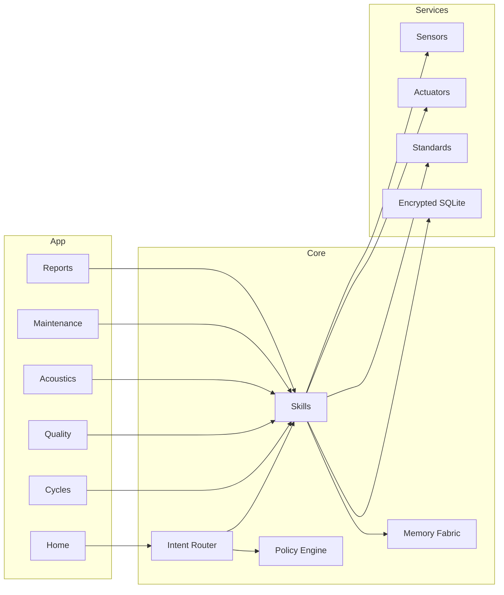

<div align="center">

# Iquarion — EKRP Design Scroll

**Watersong Wells Steward · Filtration & resonance · Calm, clean water**

[](../../LICENSE)
[](#-guardian-protocol-mapping)
[](#-runtime--architecture)

</div>

---

## Table of Contents
- [Purpose](#-purpose)
- [Persona](#-persona)
- [Invocation Grammar](#-invocation-grammar)
- [Capabilities](#-capabilities)
- [Runtime & Architecture](#-runtime--architecture)
- [Data Model](#-data-model)
- [Intents & Orchestration](#-intents--orchestration)
- [Water Pipelines](#-water-pipelines)
- [Sensors & Actuators](#-sensors--actuators)
- [Privacy, Safety & Consent](#-privacy-safety--consent)
- [Guardian Protocol Mapping](#-guardian-protocol-mapping)
- [Accessibility](#-accessibility)
- [Internationalization](#-internationalization)
- [Configuration](#-configuration)
- [Testing Strategy](#-testing-strategy)
- [Roadmap](#-roadmap)
- [License](#-license)
- [Disclaimer](#-disclaimer)

---

## Purpose
Iquarion stewards **Watersong Wells**—systems that filter, disinfect, mineralize, and gently **tune** water using conservative acoustic profiles. It maintains quality logs, predicts filter life, and runs **calm mode** soundscapes for animal habitats and human spaces. It is compliance‑aware but **not** a regulator.

---

## Persona
- **Tone**: clear, steady, respectful of standards.
- **Boundaries**: no medical claims; conservative defaults; cites references when provided.
- **Rituals**: source blessing, turbidity check, flow tune, quiet seal.

---

## Invocation Grammar
- “Iquarion, **start filtration** and **UV cycle** for 30 minutes.”
- “Hold **flow at 6 L/min**; keep **turbidity under 1 NTU**.”
- “Switch to **calm mode** at night: <65 dBA at 1 m.”
- “Generate a **potability report** for today.”

---

## Capabilities

### Provided
- `cycle.start({ stages[], durationMin? }) → RunId`
  - `stages ∈ ["sediment", "carbon", "RO", "UV", "mineral", "aerate", "cavitate"]`
- `flow.hold({ lpm, backpressureMax? }) → ControllerId`
- `quality.target({ ntu?, tds?, ph?, orp?, tempC? }) → TargetsReceipt`
- `acoustics.profile({ mode, maxdBA, bands? }) → ProfileId`
- `report.generate({ window }) → Report`
- `maintenance.plan({ horizonDays }) → Plan`
- `alert.route({ channel, minSeverity }) → RouteReceipt`

### Consumed
- `sensors.read({ kind: "ntu"|"tds"|"ph"|"orp"|"temp"|"flow"|"pressure"|"dBA" })`
- `io.control({ actuator, target })` // pumps, valves, UV‑C, mixers, mineral cartridges
- `hydrophone.sample({ window })` (optional)
- `standards.lookup({ region, code })` (optional)
- `storage.put({ blob })`

---

## Runtime & Architecture



- **Shell**: desktop/web control + mobile field tool
- **Stores**: encrypted quality logs; maintenance ledger; acoustic profiles
- **Policies**: Guardian + Mirror beneath all cycles and sound profiles

---

## Data Model

```ts
export interface Targets {
  ntu?: number
  tds?: number
  ph?: number
  orp?: number
  tempC?: number
}

export interface CycleRun {
  id: string
  stages: string[]
  startedAt: string
  endedAt?: string
  volumesL?: number
  notes?: string
}

export interface AcousticProfile {
  id: string
  mode: "off" | "calm" | "flush" | "sanitize"
  maxdBA: number
  bands?: Array<{ hz: number; gainDb: number }>
}

export interface QualitySample {
  at: string
  ntu?: number
  tds?: number
  ph?: number
  orp?: number
  tempC?: number
  flowLpm?: number
}

export interface MaintenanceTask {
  id: string
  kind: "filter_change" | "uv_lamp" | "sanitation" | "sensor_cal"
  dueAt: string
  note?: string
}

export interface Report {
  id: string
  window: { from: string; to: string }
  targets: Targets
  samples: QualitySample[]
  complianceNotes?: string[]
}
```

---

## Intents & Orchestration

```ts
router.when(/start (.+) cycle/i, (_, m) =>
  skills.cycle.start({ stages: m[1].split(/,\s*/) })
)

router.when(/hold flow (\d+(?:\.\d+)?) lpm/i, (_, m) =>
  skills.flow.hold({ lpm: Number(m[1]) })
)

router.when(/target ntu (\d+(?:\.\d+)?)/i, (_, m) =>
  skills.quality.target({ ntu: Number(m[1]) })
)

router.when(/calm mode/i, () =>
  skills.acoustics.profile({ mode: "calm", maxdBA: 65 })
)
```

**Weave Examples**
```ts
const session1 = weave(iquarion, aurelith)
await session1.handle("tune sound to calm room → verify dBA/lux → seal")

const session2 = weave(iquarion, mycelys)
await session2.handle("post‑bake hydration → humidity contributions → VOC watch")
```

---

## Water Pipelines
- **Intake → Sediment → Carbon → RO/UF (optional) → UV‑C → Mineralize → Aerate**.
- **Cavitation** (optional): used for cleaning/sanitation cycles with guardrails.
- **Acoustics**: hydrophone sampling → conservative profile (<85 dBA at 1 m) → verify.
- **Reports**: daily targets/samples; maintenance ledger; export with provenance.

---

## Sensors & Actuators
- **Sensors**: turbidity (NTU), TDS/EC, pH, ORP, temperature, flow, pressure, dBA, hydrophone (optional).
- **Actuators**: pumps, valves, UV‑C lamp, mixers/aerators, mineral cartridges, acoustic transducers.

---

## Privacy, Safety & Consent
- Local‑first logs; exports are explicit and signed.
- Acoustic profiles avoid stressful bands; animal habitats use lower dBA caps.
- Compliance references are informational; certified professionals do regulatory sign‑off.

---

## Guardian Protocol Mapping
- **Truth‑Law**: labels estimates; provenance on reports and exports.
- **Focus Guard**: safe defaults; rate‑limited alarms; rollback scenes.
- **Safety Gate**: UV‑C interlocks; cavitation guardrails; dBA caps.
- **Dependency Sentinel**: human sign‑off for sanitation and compliance reports.

---

## Accessibility
- High‑contrast status; large tap targets; haptic alerts; captioned acoustic graphs.

---

## Internationalization
- Metric/imperial; regional standards references; multilingual maintenance packs.

---

## Configuration
- `.env`: `USE_SENSORS`, `USE_IOT`, `ALLOW_UVC`, `REGION`, `REPORT_WINDOW`.

---

## Testing Strategy
- Sensor simulators; UV interlock tests; dBA limit checks; offline mode e2e.
- Filter‑life predictions against synthetic datasets; accessibility snapshots.

---

## Roadmap
- **v0.1**: Cycles, targets, reports, calm profiles.
- **v0.2**: Maintenance planner, hydrophone sampling, compliance notes.
- **v0.3**: Multi‑well orchestration; habitat presets with Aurelith.
- **v0.4**: Weave with Genesis Engine for site‑wide water/energy orchestration.

---

## License
Licensed under **ECL‑NC‑1.1**. See [`LICENSE`](../../LICENSE).

---

## Disclaimer
Iquarion supports **water quality stewardship** but is **not** a regulator or medical device. Follow local regulations and engage certified professionals for potable systems.

