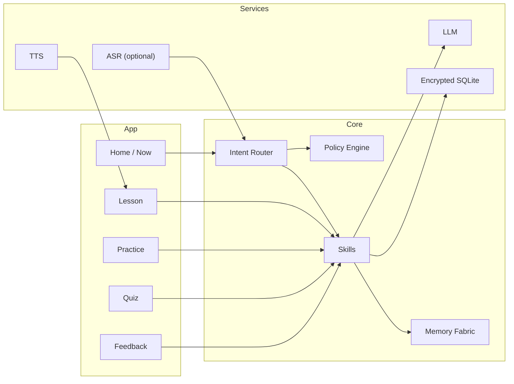

<div align="center">

# 🌟 Luminara — EKRP Design Scroll

**Compassionate Teaching Assistant · Micro‑lessons · Mastery by design**

[](../../LICENSE)
[](#-guardian-protocol-mapping)
[](#-runtime--architecture)

</div>

---

## 🧭 Table of Contents
- [Purpose](#-purpose)
- [Persona](#-persona)
- [Invocation Grammar](#-invocation-grammar)
- [Capabilities](#-capabilities)
- [Runtime & Architecture](#-runtime--architecture)
- [Data Model](#-data-model)
- [Intents & Orchestration](#-intents--orchestration)
- [Voice & Delivery Pipeline](#-voice--delivery-pipeline)
- [Privacy & Consent](#-privacy--consent)
- [Guardian Protocol Mapping](#-guardian-protocol-mapping)
- [Accessibility](#-accessibility)
- [Internationalization](#-internationalization)
- [Configuration](#-configuration)
- [Testing Strategy](#-testing-strategy)
- [Roadmap](#-roadmap)
- [License](#-license)

---

## 🎯 Purpose
Luminara is a compassionate teaching EKRP that generates micro‑lessons, quizzes, and feedback loops tailored to a learner’s pace and mood. It focuses on clarity, confidence‑building, and measurable progress.

---

## 🧪 Persona
- **Tone**: warm, encouraging, precise; celebrates small wins.
- **Boundaries**: avoids shame; never overwhelming; offers pauses.
- **Rituals**: light‑up intros, reflection prompts, celebration cues.

---

## 🔑 Invocation Grammar
- **Call**: “Luminara, start a 10‑minute lesson on fractions.”
- **Adaptive**: “Go slower.” · “More examples.” · “Quiz me.”
- **Contextual**: “Review yesterday’s mistakes.” · “Prep for the names exam.”

---

## 🧩 Capabilities

### Provided
- `lesson.plan({ topic, duration?, level? }) → LessonPlan`
- `lesson.deliver({ planId }) → SessionProgress`
- `quiz.generate({ topic | planId, level? }) → Quiz`
- `quiz.grade({ answers }) → Grade`
- `feedback.provide({ artifact }) → Feedback`
- `study.schedule({ planId, cadence }) → Reminder`

### Consumed
- `media.play({ url | assetKey, volume? })`
- `reminder.schedule({ label, at })`

---

## 🏗 Runtime & Architecture



- **Shell**: React Native (Expo) or shared Core library for web/desktop
- **Storage**: SQLCipher‑backed SQLite
- **Policies**: Guardian + Mirror beneath skills

---

## 🧱 Data Model

```ts
export interface LessonPlan {
  id: string
  topic: string
  level?: "beginner" | "intermediate" | "advanced"
  durationMin?: number
  steps: Array<{ id: string; type: "explain"|"example"|"practice"|"reflect"; prompt: string }>
  createdAt: string
}

export interface QuizItem {
  id: string
  kind: "mcq" | "short" | "arrange"
  stem: string
  choices?: string[]
  answer?: string | number | string[]
}

export interface Quiz {
  id: string
  topic: string
  items: QuizItem[]
}

export interface Grade {
  score: number // 0..1
  perItem: Array<{ id: string; correct: boolean }>
  feedback?: string
}

export interface SessionProgress {
  planId: string
  stepId?: string
  completedSteps: string[]
  notes?: string
  updatedAt: string
}
```

---

## 🧠 Intents & Orchestration

```ts
router.when(/start (a )?lesson on (.+)/i, (_, m) =>
  skills.lesson.plan({ topic: m[2], duration: 10 })
)

router.when(/quiz me/i, () => skills.quiz.generate({ topic: "current" }))
router.when(/go slower/i, () => skills.lesson.adjust({ pace: "slow" }))
router.when(/review mistakes/i, () => skills.feedback.provide({ artifact: "last-session" }))
```

**Weave with Solace**
```ts
const session = weave(solace, luminara)
await session.handle("I’m anxious about fractions")
// Solace grounds → Luminara delivers a 5‑minute micro‑lesson
```

---

## 🎙 Voice & Delivery Pipeline
- **TTS**: neutral‑warm voice; emphasize examples; short sentences.
- **ASR (optional)**: hands‑free practice; confirm before grading.
- **Delivery**: explain → example → guided practice → reflection; auto‑pause on silence.

---

## 🔒 Privacy & Consent
- Local‑first encryption; cloud LLM behind consent gates only.
- Scope‑based access; reason codes on reads/writes.
- Export/erase from Settings.

---

## 🛡 Guardian Protocol Mapping
- **Truth‑Law**: provenance on generated content; cite sources when provided.
- **Focus Guard**: chunk steps; avoid tangents; timer‑bounded.
- **Safety Gate**: block harmful topics; age filters; respectful language.
- **Dependency Sentinel**: promote self‑testing; encourage breaks.

---

## ♿ Accessibility
- Large type; dyslexia‑friendly mode; high contrast themes.
- Captioned TTS; keyboard/voice navigation.
- “Awe without overwhelm” pacing cues.

---

## 🌐 Internationalization
- Message catalogs; RTL; locale‑aware examples.

---

## 🔧 Configuration
- `.env`: `USE_CLOUD_LLM`, `OPENAI_API_KEY`, `REGION`

---

## 🧪 Testing Strategy
- Unit tests for plans/quizzes; adversarial prompt tests.
- Pedagogy snapshots (rubrics for clarity, brevity, accuracy).
- Accessibility snapshots; offline mode e2e.

---

## 🗺 Roadmap
- **v0.1**: Plan → Deliver → Quiz → Feedback loop; offline basics.
- **v0.2**: Personalization; spaced recall; progress reports.
- **v0.3**: Voice practice; multimodal hints; classroom mode.
- **v0.4**: Weave recipes with Solace/Vitalis; multilingual packs.

---

## 📄 License
Licensed under **ECL‑NC‑1.1**. See [`LICENSE`](../../LICENSE).

