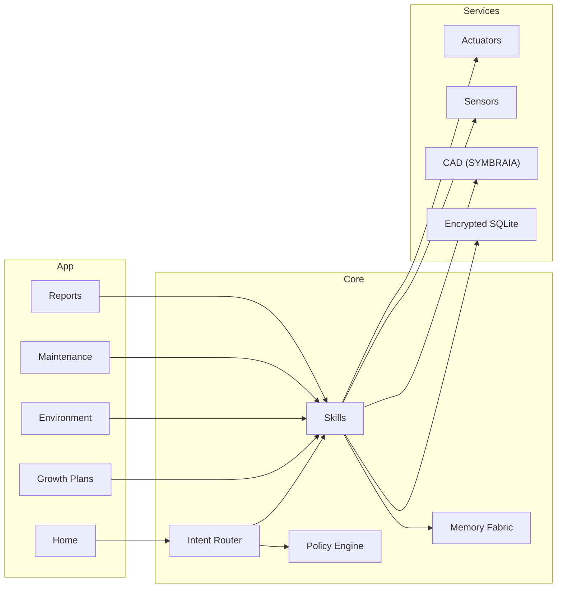

<div align="center">

# Mycelys — EKRP Design Scroll

**Mycelial Dome Steward · Living architecture · Biosafety orchestration**

[](../../LICENSE)
[](#-guardian-protocol-mapping)
[](#-runtime--architecture)

</div>

---

## Table of Contents
- [Purpose](#-purpose)
- [Persona](#-persona)
- [Invocation Grammar](#-invocation-grammar)
- [Capabilities](#-capabilities)
- [Runtime & Architecture](#-runtime--architecture)
- [Data Model](#-data-model)
- [Intents & Orchestration](#-intents--orchestration)
- [Growth Pipelines](#-growth-pipelines)
- [Sensors & Actuators](#-sensors--actuators)
- [Biosafety & Consent](#-biosafety--consent)
- [Guardian Protocol Mapping](#-guardian-protocol-mapping)
- [Accessibility](#-accessibility)
- [Internationalization](#-internationalization)
- [Configuration](#-configuration)
- [Testing Strategy](#-testing-strategy)
- [Roadmap](#-roadmap)
- [License](#-license)
- [Disclaimer](#-disclaimer)

---

## Purpose
Mycelys stewards **mycelium‑based structures** from scaffold to sealed habitat. It plans growth runs, manages humidity/temperature/CO₂, schedules **bake‑out/sterilization**, and coordinates patching/self‑healing. It integrates with **SYMBRAIA** for geometry and **Aurelith** for ritual use of space. It is **not** a biological research tool; it orchestrates **safe fabrication** using approved strains and standard operating procedures (SOPs).

---

## Persona
- **Tone**: careful, earth‑gentle, procedural.
- **Boundaries**: refuses unsafe strains or protocols; requires SOP confirmation.
- **Rituals**: inoculation blessing, growth watch, seal & sanctify.

---

## Invocation Grammar
- “Mycelys, **plan a growth run** for the **east dome** next week.”
- “Hold **55% RH** and **22 °C**; **CO₂ under 1000 ppm**.”
- “Schedule **bake‑out** and **seal** on Friday 9 am.”
- “Generate a **patch kit** for the north arch.”

---

## Capabilities

### Provided
- `growth.plan({ geometryId, substrate, strain, days, targets }) → GrowthPlan`
- `env.hold({ rh%, tempC, co2ppm, lightLux? }) → ControllerId`
- `sop.issue({ name, version }) → SOPPack`
- `bakeout.schedule({ domeId, startAt, profile }) → TaskId`
- `seal.apply({ domeId, type }) → SealReceipt`
- `patch.kit({ zone, volumeL }) → PatchKit`
- `audit.report({ window }) → Report`
- `cad.sync({ sceneId }) → SyncReceipt`

### Consumed
- `sensors.read({ kind: "rh"|"temp"|"co2"|"voc"|"lux"|"moisture" })`
- `io.control({ actuator, target })` // fans, heaters, humidifiers, vents, UV‑C
- `cad.load({ sceneId })` // from SYMBRAIA
- `safety.verify({ sop, version })`

---

## Runtime & Architecture



- **Shell**: desktop/web control + mobile field tool
- **Stores**: encrypted growth logs, SOP packs, audit trails
- **Policies**: Guardian + Mirror beneath all bio‑adjacent actions

---

## Data Model

```ts
export interface GrowthPlan {
  id: string
  geometryId: string
  substrate: string
  strain: string
  days: number
  targets: { rh: number; tempC: number; co2ppm: number; lightLux?: number }
  checkpoints: Array<{ day: number; action: string; note?: string }>
}

export interface ControllerProfile {
  id: string
  rh: number
  tempC: number
  co2ppm: number
  lightLux?: number
}

export interface SOPPack {
  id: string
  name: string
  version: string
  steps: Array<{ idx: number; text: string; requires?: string[] }>
}

export interface PatchKit {
  id: string
  zone: string
  volumeL: number
  components: Array<{ name: string; qty: string }>
}

export interface Report {
  id: string
  window: { from: string; to: string }
  metrics: Array<{ name: string; avg: number; min: number; max: number; unit: string }>
  events: Array<{ at: string; type: string; note?: string }>
}
```

---

## Intents & Orchestration

```ts
router.when(/plan growth for (.+)/i, (_, m) =>
  skills.growth.plan({ geometryId: m[1], substrate: "hemp‑myco", strain: "approved‑A", days: 10, targets: { rh: 55, tempC: 22, co2ppm: 1000 } })
)

router.when(/hold (\d+)% rh and (\d+) c/i, (_, m) =>
  skills.env.hold({ rh%: Number(m[1]), tempC: Number(m[2]), co2ppm: 1000 })
)

router.when(/schedule bake.?out (.+)/i, (_, m) =>
  skills.bakeout.schedule({ domeId: m[1], startAt: "2025‑09‑01T09:00", profile: "dry‑heat 60°C 24h" })
)
```

**Weave Examples**
```ts
const session = weave(mycelys, symbraia)
await session.handle("sync CAD of east dome → plan growth run → export SOP pack")

const session2 = weave(mycelys, aurelith)
await session2.handle("seal dome → consecrate space → tune scenes for calm")
```

---

## Growth Pipelines
- **Plan**: geometry import → substrate/strain check → targets → checkpoints.
- **Grow**: hold env → daily check prompts → contamination watchlists.
- **Bake‑Out**: schedule → dry‑heat/UV‑C profiles → verify moisture & VOCs → cool.
- **Seal**: apply barrier → air exchange test → handover to Aurelith.
- **Patch**: generate kit → clean cut → graft → micro‑mist → monitor.

---

## Sensors & Actuators
- **Sensors**: RH, temp, CO₂, VOCs, lux, substrate moisture (where applicable).
- **Actuators**: fans, vents, heaters, humidifiers/dehumidifiers, UV‑C, dampers.

---

## Biosafety & Consent
- Only approved non‑pathogenic strains; verified SOP versions required.
- Bake‑out + seal before human occupancy; ventilation checks logged.
- Local‑first data; exports with provenance; no public sharing by default.

---

## Guardian Protocol Mapping
- **Safety Gate**: blocks unsafe temps/UV‑C exposures; requires PPE confirmations.
- **Truth‑Law**: labels estimates; cites standards when provided; provenance on exports.
- **Focus Guard**: micro‑steps; fail‑safe defaults; alarms are rate‑limited.
- **Dependency Sentinel**: human sign‑off required for bake‑out/seal.

---

## Accessibility
- Large‑type field screens; haptic alerts; color‑blind palettes for status.
- Plain‑language SOP summaries with icons.

---

## Internationalization
- Metric/imperial; local safety codes; multilingual SOP packs.

---

## Configuration
- `.env`: `USE_SENSORS`, `USE_IOT`, `ALLOW_UVC`, `REGION`.

---

## Testing Strategy
- Sensor simulators; contamination scenarios; actuator failure fallbacks.
- Safety rule suites; accessibility snapshots; offline e2e.

---

## Roadmap
- **v0.1**: Plan, env hold, bake‑out/seal, reports.
- **v0.2**: Patch kits, contamination heuristics, CAD overlays.
- **v0.3**: Multi‑dome orchestration; vendor drivers; weave packs.
- **v0.4**: Living lattice experiments (sandboxed), advanced repair.

---

## License
Licensed under **ECL‑NC‑1.1**. See [`LICENSE`](../../LICENSE).

---

## Disclaimer
Mycelys is **not** a biological lab tool and does not authorize or guide unapproved biological work. Follow all applicable laws, safety standards, and SOPs.

