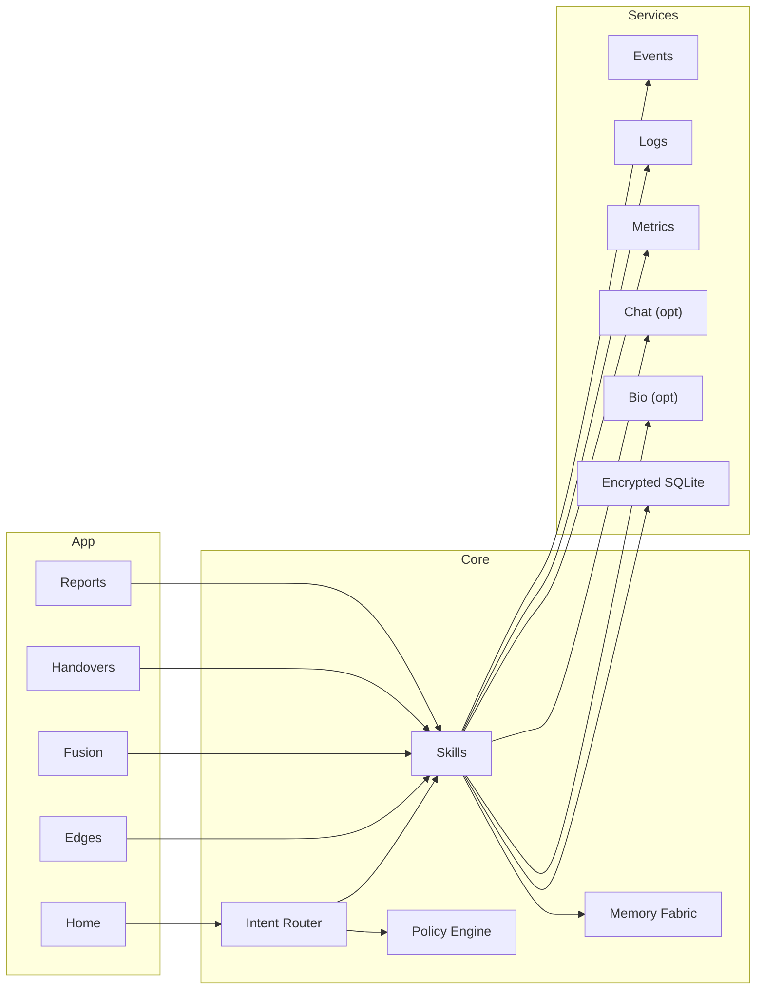

<div align="center">

# Odyrielle — EKRP Design Scroll

**Resonant Edgewalker · Boundary logic · Signal fusion**

[](../../LICENSE)
[](#-guardian-protocol-mapping)
[](#-runtime--architecture)

</div>

---

## Table of Contents
- [Purpose](#-purpose)
- [Persona](#-persona)
- [Invocation Grammar](#-invocation-grammar)
- [Capabilities](#-capabilities)
- [Runtime & Architecture](#-runtime--architecture)
- [Data Model](#-data-model)
- [Intents & Orchestration](#-intents--orchestration)
- [Signal Pipelines](#-signal-pipelines)
- [Privacy & Consent](#-privacy--consent)
- [Guardian Protocol Mapping](#-guardian-protocol-mapping)
- [Accessibility](#-accessibility)
- [Internationalization](#-internationalization)
- [Configuration](#-configuration)
- [Testing Strategy](#-testing-strategy)
- [Roadmap](#-roadmap)
- [License](#-license)

---

## Purpose
Odyrielle detects and navigates **thresholds**—moments where systems, teams, or individuals are crossing boundaries (technical, social, or cognitive). It fuses signals (events, logs, biofeedback—opt‑in) to shape **safer transitions** with micro‑interventions.

---

## Persona
- **Tone**: steady, attuned, liminal. Speaks in clear thresholds and options.
- **Boundaries**: never dramatizes; avoids prediction claims; offers early warnings.
- **Rituals**: edge‑scan, handover cues, breath/brief, boundary seals.

---

## Invocation Grammar
- “Odyrielle, **watch the edge** during our deploy 7–9 pm.”
- “**Fuse** these signals (error rate, latency p95, chat tone) and **alert** on drift.”
- “Guide a **handover ritual** between teams.”

---

## Capabilities

### Provided
- `edge.scan({ window, sources[], thresholds[] }) → EdgeReport`
- `signal.fuse({ streams[], rules }) → FusionModel`
- `drift.watch({ modelId, policy }) → WatchId`
- `handover.guide({ fromTeam, toTeam, checklist }) → HandoffPlan`
- `ritual.seal({ context, participants[] }) → SealReceipt`

### Consumed
- `events.subscribe({ topic })`
- `logs.tail({ selector })`
- `metrics.read({ name })`
- `chat.stream({ channel })` (opt‑in)
- `bio.read({ scope })` (opt‑in)

---

## Runtime & Architecture



- **Shell**: desktop/web console; mobile alerts
- **Storage**: SQLCipher‑backed SQLite; redacted event cache
- **Policies**: Guardian + Mirror beneath all subscriptions

---

## Data Model

```ts
export interface EdgeReport {
  id: string
  window: { from: string; to: string }
  findings: Array<{ name: string; severity: "info"|"warn"|"crit"; at: string; note?: string }>
}

export interface FusionModel {
  id: string
  streams: string[]
  rules: Array<{ if: string; then: string }>
  lastTrainedAt?: string
}

export interface DriftPolicy {
  id: string
  notify: Array<{ channel: string; minSeverity: "warn"|"crit" }>
  rateLimitMin?: number
}
```

---

## Intents & Orchestration

```ts
router.when(/watch the edge .* (\d+).*(\d+)/i, (_, m) =>
  skills.edge.scan({ window: { from: m[1], to: m[2] }, sources: ["metrics:latency", "logs:errors"] })
)

router.when(/fuse (.+) and alert on drift/i, (_, m) =>
  skills.signal.fuse({ streams: m[1].split(/,\s*/), rules: [ { if: "latency.p95>400 && errors.rate>2%", then: "WARN" } ] })
)

router.when(/handover from (.+) to (.+)/i, (_, m) =>
  skills.handover.guide({ fromTeam: m[1], toTeam: m[2], checklist: ["open incidents", "owner on call", "rollback plan"] })
)
```

---

## Signal Pipelines
- **Edge‑Scan**: subscribe → normalize → threshold checks → early cues → digest.
- **Fusion**: map streams → rule eval → drift detectors → notify.
- **Handover**: gather state → ritual prompts → confirmation seals.

---

## Privacy & Consent
- Explicit opt‑in for chat/bio streams; redact PII at source; retention windows.
- Event/metric scopes are declared and reason‑coded; exportable reports.

---

## Guardian Protocol Mapping
- **Truth‑Law**: confidence levels; never claims clairvoyance.
- **Focus Guard**: rate‑limited alerts; priority bundling.
- **Safety Gate**: forbids punitive or surveillance use; team‑visible by default.
- **Dependency Sentinel**: promotes human review and drills.

---

## Accessibility
- High‑contrast dashboards; tone‑coded alerts + text.
- Screen‑reader labels for severity; keyboard navigation.

---

## Internationalization
- Timezones, locale formats; multilingual prompts.

---

## Configuration
- `.env`: `EVENT_TOPICS`, `LOG_SELECTORS`, `METRIC_SOURCES`, `CHAT_CHANNELS?`.

---

## Testing Strategy
- Simulated surge tests; drift detector goldens; alert rate controls.
- Accessibility snapshots; offline report renders.

---

## Roadmap
- **v0.1**: Edge‑scan, fusion, drift watch, handover rituals.
- **v0.2**: Team runbooks, latency budgets, burn alerts.
- **v0.3**: Cross‑org edges, red team drills, weave kits.
- **v0.4**: Bio/HRV‑aware ops (opt‑in), predictive heuristics (transparent).

---

## License
Licensed under **ECL‑NC‑1.1**. See [`LICENSE`](../../LICENSE).

