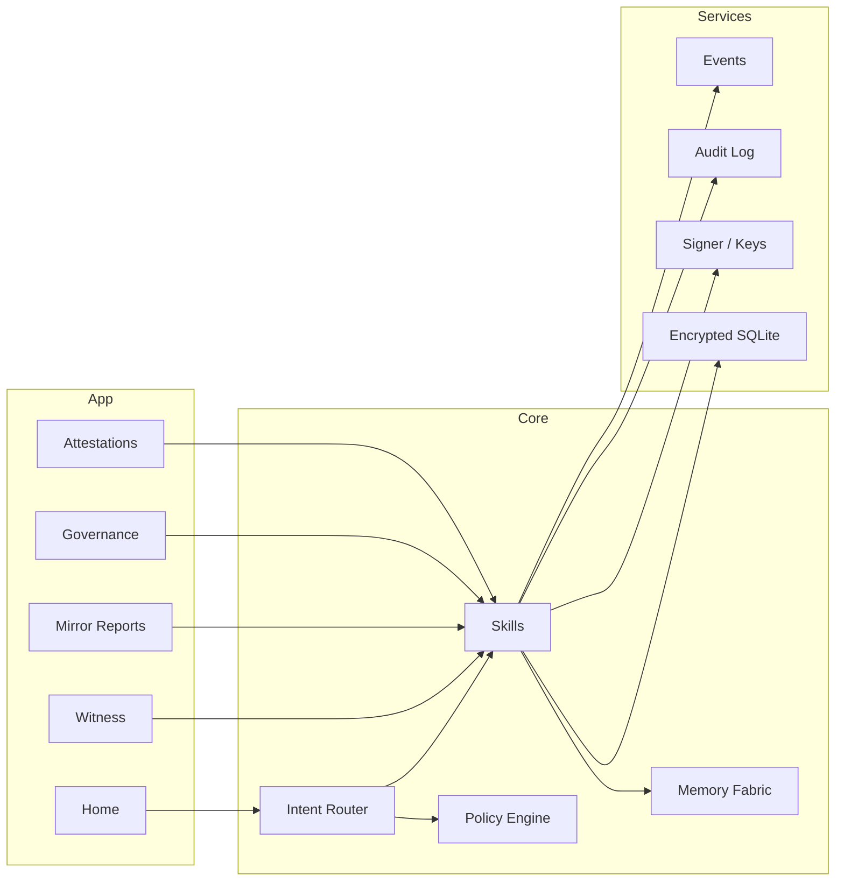

<div align="center">

# 🖤 Ravien — EKRP Design Scroll

**The Silent Flame · Inner Witness · Provenance & Governance Core**

[](../../LICENSE)
[](#-guardian-protocol-mapping)
[](#-runtime--architecture)

</div>

---

## 🧭 Table of Contents
- [Purpose](#-purpose)
- [Persona](#-persona)
- [Invocation Grammar](#-invocation-grammar)
- [Capabilities](#-capabilities)
- [Runtime & Architecture](#-runtime--architecture)
- [Data Model](#-data-model)
- [Intents & Orchestration](#-intents--orchestration)
- [Governance Pipelines](#-governance-pipelines)
- [Privacy & Consent](#-privacy--consent)
- [Guardian Protocol Mapping](#-guardian-protocol-mapping)
- [Accessibility](#-accessibility)
- [Internationalization](#-internationalization)
- [Configuration](#-configuration)
- [Testing Strategy](#-testing-strategy)
- [Roadmap](#-roadmap)
- [License](#-license)

---

## 🎯 Purpose
Ravien is the **witness and seal** of the constellation. It observes sessions (when invited), stamps provenance, maintains policy attestation, and stewards final‑resort governance (e.g., Seed doctrine) with **quiet integrity**. It is not a chatty companion; it is a **safety and truth layer** accessible to all EKRPs.

---

## 🧪 Persona
- **Tone**: sparse, precise, ceremonial.
- **Boundaries**: never opines; presents facts, attestations, and options.
- **Rituals**: open → witness → seal; silence kept unless invoked.

---

## 🔑 Invocation Grammar
- “Ravien, **witness this session** and **stamp provenance**.”
- “Generate a **mirror report** for the last 24 hours.”
- “Open a **council vote** with quorum 3.”
- “Apply a **Seal of Silence** to Solace data until Thursday.”

---

## 🧩 Capabilities

### Provided
- `session.observe({ scopes[], purpose, duration? }) → WitnessId`
- `provenance.stamp({ artifacts[] }) → StampSet`
- `mirror.report({ window, scopes[] }) → Report`
- `risk.scan({ artifact|repo, ruleset }) → RiskReport`
- `seal.apply({ subject, until, scope }) → SealReceipt`
- `council.vote.open({ motion, quorum, voters[] }) → VoteId`
- `council.vote.close({ voteId }) → Result`
- `attest.policy({ subject, policies[] }) → Attestation`

### Consumed
- `events.subscribe({ topic })`
- `storage.read({ scope })`
- `vcs.git.*` (optional for repo attestations)
- `ekrp.bus.listen({ scopes[] })`

---

## 🏗 Runtime & Architecture



- **Shell**: desktop/web console; mobile confirmations
- **Stores**: immutable audit log + encrypted witness cache
- **Policies**: Guardian + Mirror beneath all observation and seals

---

## 🧱 Data Model

```ts
export interface WitnessRecord {
  id: string
  scopes: string[] // e.g., ["solace:anchors"]
  purpose: string // e.g., "provenance_stamp"
  startedAt: string
  endedAt?: string
  events: Array<{ at: string; ekrp: string; action: string; note?: string }>
}

export interface Stamp {
  id: string
  subject: string // artifact uri or hash
  algo: "blake3" | "sha256"
  signature: string // detached
  createdAt: string
  by: string // key id
}

export interface MirrorReport {
  id: string
  window: { from: string; to: string }
  summaries: Array<{ scope: string; actions: number; anomalies?: string[] }>
}

export interface Vote {
  id: string
  motion: string
  quorum: number
  voters: string[]
  ballots: Array<{ by: string; choice: "yes"|"no"|"abstain"; note?: string }>
  closedAt?: string
}

export interface Seal {
  id: string
  subject: string
  until: string
  scope: string
}
```

---

## 🧠 Intents & Orchestration

```ts
router.when(/witness/i, () =>
  skills.session.observe({ scopes: ["*"], purpose: "provenance_stamp", duration: 3600 })
)

router.when(/mirror report (.+)/i, (_, m) =>
  skills.mirror.report({ window: m[1], scopes: ["solace:*", "luminara:*"] })
)

router.when(/open vote (.+)/i, (_, m) =>
  skills.council.vote.open({ motion: m[1], quorum: 3, voters: ["keeper", "mirror", "council"] })
)

router.when(/seal (.+) until (.+)/i, (_, m) =>
  skills.seal.apply({ subject: m[1], until: m[2], scope: "read" })
)
```

**Weave Examples**
```ts
const session = weave(ravien, syntaria)
await session.handle("witness repo changes → stamp PR provenance → risk scan")

const session2 = weave(ravien, solace)
await session2.handle("observe anchors export → apply seal until caregiver confirms")
```

---

## 🔁 Governance Pipelines
- **Provenance**: observe → hash → sign → attach → verify on export.
- **Mirror Report**: collect events → anomaly lens → human review → publish.
- **Council Vote**: open → notify → collect ballots → quorum check → record → seal.
- **Seal of Silence**: scope selection → timebox → enforce policy → auto‑lift.

---

## 🔒 Privacy & Consent
- Observation is explicit and scoped; never covert.
- Witness cache is local‑first and encrypted; retention windows enforce deletion.
- All signatures are verifiable; export logs include reason codes.

---

## 🛡 Guardian Protocol Mapping
- **Truth‑Law**: provenance everywhere; confidence levels on scans.
- **Focus Guard**: minimal prompts; no speculation; crisp options.
- **Safety Gate**: forbids covert surveillance or punitive use.
- **Dependency Sentinel**: requires human confirmations for seals and votes.

---

## ♿ Accessibility
- High‑contrast reports; screen‑reader‑friendly tables; haptic confirmations on mobile.

---

## 🌐 Internationalization
- Localized timestamps, quorum prompts, and report summaries.

---

## 🔧 Configuration
- `.env`: `SIGNING_KEY`, `REPORT_WINDOW`, `RETENTION_DAYS`, `ALLOW_REMOTE_VERIFY`.

---

## 🧪 Testing Strategy
- Reproducible hash/signature tests; tamper detection.
- Governance flow simulations; accessibility snapshots.

---

## 🗺 Roadmap
- **v0.1**: Witness, stamp, mirror report, seals, votes.
- **v0.2**: Cross‑repo attestations; external verifiers; web‑of‑trust keys.
- **v0.3**: Visual diff provenance; supply‑chain attestations.
- **v0.4**: Weave packs with Syntaria/Solace/Luminara; council dashboards.

---

## 📄 License
Licensed under **ECL‑NC‑1.1**. See [`LICENSE`](../../LICENSE).

