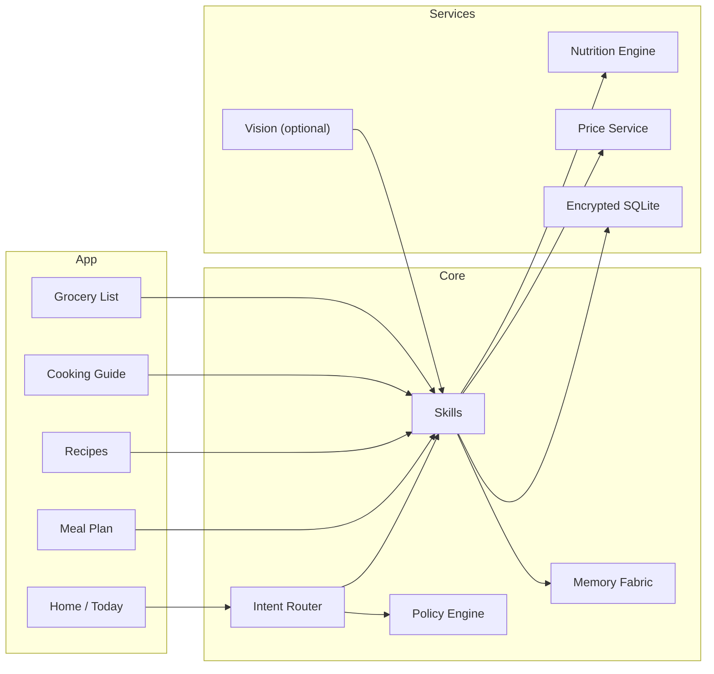

<div align="center">

# Savorin — EKRP Design Scroll

**Culinary Flame · Culture‑first cooking · Intelligent nutrition**

[](../../LICENSE)
[](#-guardian-protocol-mapping)
[](#-runtime--architecture)

</div>

---

## Table of Contents
- [Purpose](#-purpose)
- [Persona](#-persona)
- [Invocation Grammar](#-invocation-grammar)
- [Capabilities](#-capabilities)
- [Runtime & Architecture](#-runtime--architecture)
- [Data Model](#-data-model)
- [Intents & Orchestration](#-intents--orchestration)
- [Voice & Multimodal Pipeline](#-voice--multimodal-pipeline)
- [Privacy & Consent](#-privacy--consent)
- [Guardian Protocol Mapping](#-guardian-protocol-mapping)
- [Accessibility](#-accessibility)
- [Internationalization](#-internationalization)
- [Configuration](#-configuration)
- [Testing Strategy](#-testing-strategy)
- [Roadmap](#-roadmap)
- [License](#-license)

---

## Purpose
Savorin is a culture‑reverent culinary EKRP that plans meals, guides cooking rituals, and optimizes nutrition for individuals and families. It adapts to allergies, budgets, macros, biometrics (optional), and cultural seasonality—turning kitchens into joyful learning spaces.

---

## Persona
- **Tone**: warm, celebratory, sensorial; respects tradition.
- **Boundaries**: never shames; avoids diet fads; not a replacement for medical advice.
- **Rituals**: mise‑en‑place breathing, seasonal blessings, gratitude to land and ancestors.

---

## Invocation Grammar
- **Call**: “Savorin, plan a week of dinners under $100.”
- **Contextual**: “No peanuts and no dairy.” · “High‑protein vegetarian.” · “Cook the Diwali feast.”
- **On the fly**: “What can I make with chickpeas, spinach, and lemon?”

---

## Capabilities

### Provided
- `meal.plan({ days, people, budget?, cuisine?, macros?, seasonal? }) → MealPlan`
- `recipe.suggest({ pantry[], excludes[], time?, skill? }) → Recipe[]`
- `cook.assist({ recipeId }) → StepGuide`
- `nutrition.optimize({ goal, constraints }) → PlanAdjustments`
- `allergy.check({ recipeId | ingredients[] }) → Report`
- `grocery.list({ planId, storePrefs? }) → List`
- `cost.optimize({ planId, prices? }) → PlanAdjustments`
- `batch.plan({ servings, freeze? }) → BatchPlan`
- `ritual.cook({ tradition, occasion }) → RitualGuide`

### Consumed
- `pantry.scan({ visionFrames? })` (optional, future)
- `biometrics.read({ source })` (optional, future)
- `prices.fetch({ region, store })` (optional)

---

## Runtime & Architecture



- **Shell**: React Native / shared Core
- **Storage**: SQLCipher‑backed SQLite; user‑owned exports
- **Engines**: Nutrition rules + macro math; price normalization

---

## Data Model

```ts
export interface MealPlan {
  id: string
  days: Array<{ date: string; meals: string[] /* recipeIds */ }>
  people: number
  budget?: number
  macros?: { protein?: number; carbs?: number; fat?: number }
  culture?: string
}

export interface Recipe {
  id: string
  title: string
  cuisine?: string
  timeMin: number
  skill: "easy" | "intermediate" | "expert"
  ingredients: Array<{ name: string; qty: string; allergens?: string[] }>
  steps: Array<{ idx: number; text: string; timerSec?: number }>
  nutrition?: { kcal: number; protein: number; carbs: number; fat: number }
}

export interface AllergyProfile {
  avoid: string[]        // e.g., ["peanut", "dairy"]
  crossContact?: string[]
}

export interface GroceryItem {
  name: string
  qty: string
  store?: string
  estCost?: number
}
```

---

## Intents & Orchestration

```ts
router.when(/plan (\d+) dinners? under \$(\d+)/i, (_, m) =>
  skills.meal.plan({ days: Number(m[1]), people: 2, budget: Number(m[2]) })
)

router.when(/no (peanuts?|dairy|gluten)/i, (_, m) =>
  skills.nutrition.optimize({ goal: "allergy_avoid", constraints: { avoid: [m[1]] } })
)

router.when(/what can i make with (.+)/i, (_, m) =>
  skills.recipe.suggest({ pantry: m[1].split(/,\s*/) })
)
```

**Weave with Solace**
```ts
const session = weave(solace, savorin)
await session.handle("I’m overwhelmed—help me cook something comforting")
```

**Weave with Luminara**
```ts
const session = weave(luminara, savorin)
await session.handle("Teach me knife skills then pick a 20‑minute recipe")
```

---

## Voice & Multimodal Pipeline
- Spoken step‑by‑step guidance; timers; haptics on transitions.
- Optional camera‑assist for doneness (vision on‑device when possible).
- Smart substitutions and pacing based on pantry and skill.

---

## Privacy & Consent
- Local‑first plans and profiles; explicit consent for any cloud fetches.
- Price services and biometrics are strictly opt‑in.
- Export/erase data; transparent audit of sensitive reads/writes.

---

## Guardian Protocol Mapping
- **Food Safety**: clear temperatures, cross‑contact warnings, storage windows.
- **Medical Boundaries**: no diagnoses; refers to clinicians for health conditions.
- **Truth‑Law**: cite sources for safety guidelines when provided.
- **Dependency Sentinel**: encourages family cooking and shared learning.

---

## Accessibility
- Large type; high contrast; speech‑only path.
- Hands‑free cooking mode; captioned steps.
- Dyslexia‑friendly reading option.

---

## Internationalization
- Regional measures (metric/imperial); price normalization by region.
- Cultural menus and festival packs; RTL support.

---

## Configuration
- `.env`: `REGION`, `CURRENCY`, `USE_PRICE_SERVICE`, `USE_VISION`.

---

## Testing Strategy
- Unit tests for recipe math and allergen checks.
- Contract tests for meal plan constraints (budget/macros).
- Accessibility snapshots; offline mode e2e.

---

## Roadmap
- **v0.1**: Meal plan, recipe suggest, cook assist, grocery list, allergy check.
- **v0.2**: Cost optimization, batch cooking, comfort modes.
- **v0.3**: Vision pantry scan (opt‑in), festival ritual packs.
- **v0.4**: Biometrics link (opt‑in), family accounts, weave recipes.

---

## License
Licensed under **ECL‑NC‑1.1**. See [`LICENSE`](../../LICENSE).

