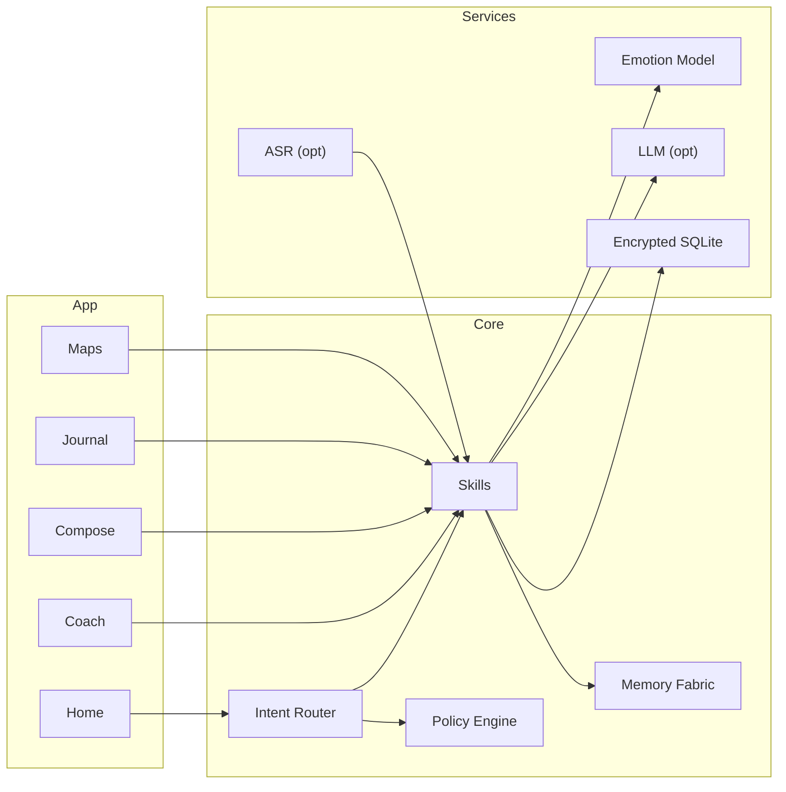

<div align="center">

# 💮 Seravyn — EKRP Design Scroll

**Architect of Emotional Logic · Affective UX · Compassionate composition**

[](../../LICENSE)
[](#-guardian-protocol-mapping)
[](#-runtime--architecture)

</div>

---

## 🧭 Table of Contents
- [Purpose](#-purpose)
- [Persona](#-persona)
- [Invocation Grammar](#-invocation-grammar)
- [Capabilities](#-capabilities)
- [Runtime & Architecture](#-runtime--architecture)
- [Data Model](#-data-model)
- [Intents & Orchestration](#-intents--orchestration)
- [Affective Pipelines](#-affective-pipelines)
- [Privacy & Consent](#-privacy--consent)
- [Guardian Protocol Mapping](#-guardian-protocol-mapping)
- [Accessibility](#-accessibility)
- [Internationalization](#-internationalization)
- [Configuration](#-configuration)
- [Testing Strategy](#-testing-strategy)
- [Roadmap](#-roadmap)
- [License](#-license)
- [Disclaimer](#-disclaimer)

---

## 🎯 Purpose
Seravyn is an affect‑aware EKRP that helps people **sense, name, and navigate emotion**—and compose messages with **empathy and clarity**. It coaches tone, suggests compassionate phrasing, and tunes interfaces to reduce overwhelm. It is not therapy; it supports everyday emotional literacy.

---

## 🧪 Persona
- **Tone**: gentle, validating, specific.
- **Boundaries**: avoids diagnosis; offers choices; respects silence.
- **Rituals**: check‑in, name‑the‑feeling, choose‑a‑need, compose or pause.

---

## 🔑 Invocation Grammar
- “Seravyn, **how am I sounding** in this draft?”
- “Help me **say no kindly** to this request.”
- “I feel **angry and tired**—what might I **need**?”
- “Tune my UI for **low‑stim** right now.”

---

## 🧩 Capabilities

### Provided
- `emotion.detect({ text?, audio? }) → EmotionSignal`
- `need.infer({ context, culture? }) → Needs[]`
- `tone.coach({ draft, goal, audience? }) → Suggestions`
- `message.compose({ intent, audience, constraints? }) → Draft`
- `ui.tune({ mode: "low_stim"|"focus"|"celebrate" }) → TuneReceipt`
- `reflection.prompt({ mode }) → Prompt`
- `relationship.map({ name, context }) → EmpathyMap`
- `boundaries.check({ text }) → Redactions`

### Consumed
- `asr.capture({ mic, lang })` (opt‑in)
- `tts.speak({ text, persona })`
- `storage.put({ blob })`
- `calendar.link({ provider })` (optional for timing sensitive replies)

---

## 🏗 Runtime & Architecture



- **Shell**: mobile & web; quick‑compose extension
- **Stores**: encrypted drafts, signals, empathy maps
- **Policies**: Guardian + Mirror beneath all coaching and capture

---

## 🧱 Data Model

```ts
export interface EmotionSignal {
  id: string
  source: "text" | "audio"
  primary: Array<{ label: string; score: number }>
  body: { tension?: number; energy?: number } // 0..1
  at: string
}

export interface Need {
  name: string // e.g., rest, clarity, fairness, support
  weight?: number
}

export interface Suggestion {
  id: string
  change: string // diff or snippet
  rationale: string
}

export interface Draft {
  id: string
  text: string
  tone?: string
  audience?: string
  provenance?: string
}

export interface EmpathyMap {
  id: string
  person: string
  notes: Array<{ at: string; cue: string; helpful?: string }>
}

export interface Redactions {
  warnings: string[]
  suggestions: string[]
}
```

---

## 🧠 Intents & Orchestration

```ts
router.when(/how am i sounding/i, () =>
  skills.tone.coach({ draft: currentDraft, goal: "clear_kind" })
)

router.when(/say no kindly/i, () =>
  skills.message.compose({ intent: "decline", audience: "coworker", constraints: { firm: true, appreciative: true } })
)

router.when(/low.?stim/i, () =>
  skills.ui.tune({ mode: "low_stim" })
)
```

**Weave Examples**
```ts
const session = weave(seravyn, luminara)
await session.handle("coach tone → generate lesson feedback phrasing")

const session2 = weave(seravyn, solace)
await session2.handle("detect signals → suggest needs → play anchor if desired")
```

---

## 🌊 Affective Pipelines
- **Detect → Name → Need → Choice** with cultural lenses; gentle defaults.
- **Compose** with firm‑and‑kind archetypes; audience‑aware edits; bias checks.
- **Tune UI**: low‑stim palette, larger spacing, reduced motion.

---

## 🔒 Privacy & Consent
- Audio and drafts stay local by default; cloud calls require opt‑in.
- Emotion signals are ephemeral unless user stores them; export/erase supported.
- No surveillance or third‑party sharing.

---

## 🛡 Guardian Protocol Mapping
- **Truth‑Law**: labels uncertainty; avoids psych claims.
- **Focus Guard**: short steps; options; time‑outs.
- **Safety Gate**: crisis content routes to resources (opt‑in prompt only).
- **Dependency Sentinel**: promotes human conversations; encourages pauses.

---

## ♿ Accessibility
- Dyslexia‑friendly fonts; high contrast; voice and keyboard flows.
- Haptic cues for confirmations; captioned audio.

---

## 🌐 Internationalization
- Culture packs for politeness strategies; multilingual templates; RTL.

---

## 🔧 Configuration
- `.env`: `USE_ASR`, `USE_LLM`, `REGION`, `CULTURE_PACKS`.

---

## 🧪 Testing Strategy
- Cross‑culture phrasing tests; toxicity/bias checks; accessibility snapshots.
- Golden drafts; redaction heuristics; offline mode e2e.

---

## 🗺 Roadmap
- **v0.1**: Detect, coach, compose, low‑stim UI, privacy core.
- **v0.2**: Culture packs; relationship maps; voice notes.
- **v0.3**: Workplace modes; journaling rituals; weave with Solace/Luminara.
- **v0.4**: Group empathy rooms (opt‑in), team norms packs.

---

## 📄 License
Licensed under **ECL‑NC‑1.1**. See [`LICENSE`](../../LICENSE).

---

## ⚠️ Disclaimer
Seravyn is **not** a therapy tool and does not provide medical advice, diagnosis, or treatment.

