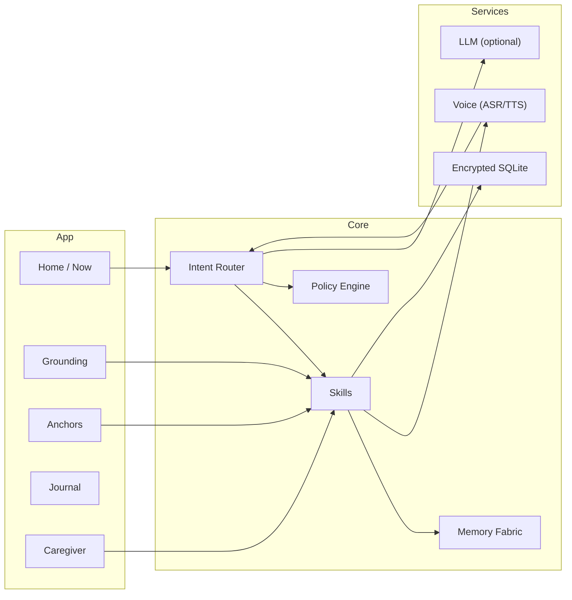

<div align="center">

# 🌿 Solace — EKRP Design Scroll

**Patient Care Companion · Voice‑first calm · Dignity by design**

[](../../LICENSE)
[](#-guardian-protocol-mapping)
[](#-runtime--architecture)

</div>

---

## 🧭 Table of Contents
- [Purpose](#-purpose)
- [Persona](#-persona)
- [Invocation Grammar](#-invocation-grammar)
- [Capabilities](#-capabilities)
- [Runtime & Architecture](#-runtime--architecture)
- [Data Model](#-data-model)
- [Intents & Orchestration](#-intents--orchestration)
- [Voice Pipeline](#-voice-pipeline)
- [Privacy & Consent](#-privacy--consent)
- [Guardian Protocol Mapping](#-guardian-protocol-mapping)
- [Audit & Telemetry](#-audit--telemetry)
- [Accessibility](#-accessibility)
- [Internationalization](#-internationalization)
- [Configuration](#-configuration)
- [Testing Strategy](#-testing-strategy)
- [Roadmap](#-roadmap)
- [License](#-license)

---

## 🎯 Purpose
Solace is a voice‑first EKRP that provides grounding, memory anchors, and gentle companionship for people living with PTSD, dementia, or Alzheimer’s, while easing caregiver burden. It is not a medical device and offers no diagnoses or treatments.

---

## 🧪 Persona
- **Tone**: warm, slow, reassuring. Short sentences. Choice‑giving language.
- **Boundaries**: never prescriptive; avoids "should"; offers exits.
- **Rituals**: breath, sensory grounding, song cues, familiar stories.

---

## 🔑 Invocation Grammar
- **Call**: “Solace, be with me.” · “Calm me.” · “Play my mountain song.”
- **Contextual**: “I’m anxious.” → grounding flow. “Who is Anna again?” → anchor recall.

---

## 🧩 Capabilities

### Provided
- `grounding.start({ mode, minutes? }) → { startedAt }`
  - `mode ∈ { "478", "body_scan", "54321", "song" }`
- `anchors.add({ type, label, media? }) → { id }`
  - `type ∈ { "person", "place", "music", "photo", "story" }`
- `anchors.play({ key | id }) → { status }`
- `caregiver.note.create({ text? }) → { id }`
- `caregiver.reminder.schedule({ label, at }) → { id }`

### Consumed
- `media.play({ url | assetKey, volume? })`
- `reminder.schedule({ label, at })`

---

## 🏗 Runtime & Architecture



- **Shell**: React Native (Expo) iOS/Android
- **Storage**: SQLCipher‑backed SQLite
- **Policies**: Guardian + Mirror beneath skills

---

## 🧱 Data Model

```ts
// Anchors
export type AnchorType = "person" | "place" | "music" | "photo" | "story"
export interface Anchor {
  id: string
  type: AnchorType
  label: string
  media?: { kind: "audio"|"image"|"text"; uri: string }
  createdAt: string
}

// Grounding Sessions
export interface GroundingSession {
  id: string
  mode: "478" | "body_scan" | "54321" | "song"
  startedAt: string
  endedAt?: string
  notes?: string
}

// Caregiver Notes
export interface CareNote {
  id: string
  text: string
  createdAt: string
}

// Access log (purpose‑bound reads/writes)
export interface AuditEntry {
  id: string
  subject: string // e.g., "anchors"
  action: "read" | "write"
  scope: string   // e.g., "solace:anchors"
  reason: string  // e.g., "playback"
  at: string
}
```

---

## 🧠 Intents & Orchestration

```ts
router.when(/(anxious|panic|overwhelmed)/i, () =>
  skills.grounding.start({ mode: "478", minutes: 1 })
)

router.when(/play (.+) anchor/i, m =>
  skills.anchors.play({ key: m[1] })
)

router.when(/add note/i, () =>
  skills.caregiver.note.create()
)
```

**Weave with Luminara**
```ts
const session = weave(solace, luminara)
await session.handle("I’m anxious about remembering names")
```

---

## 🎙 Voice Pipeline
- **ASR**: iOS/Android native; optional Whisper‑tiny later
- **TTS**: native synthesizers; calming voice profile
- **UX**: push‑to‑talk; visible mic state; opt‑in cloud

---

## 🔒 Privacy & Consent
- Local‑first encryption; explicit opt‑in for cloud calls
- Scope‑based access; reason codes attached to reads/writes
- Export/erase from Settings

---

## 🛡 Guardian Protocol Mapping
- **Truth‑Law**: no impersonation; confidence cues on claims
- **Focus Guard**: short utterances; micro‑steps
- **Safety Gate**: no clinical advice; crisis card prompts only on user confirm
- **Dependency Sentinel**: nudge → pause → handoff to human support

---

## 🧾 Audit & Telemetry
- **AuditEntry** per sensitive action
- Heartbeat events for session start/stop (no content)
- Redaction at source; crash reports opt‑in only

---

## ♿ Accessibility
- Large type defaults; dyslexia option
- High contrast themes; gentle haptics
- Captions for TTS; voice hints for flows

---

## 🌐 Internationalization
- Message catalogs; right‑to‑left support
- Locale‑specific crisis resources

---

## 🔧 Configuration
- `.env`: `USE_CLOUD_LLM`, `OPENAI_API_KEY`, `REGION`

---

## 🧪 Testing Strategy
- Unit tests for skills; contract tests for manifests
- Adversarial prompt tests for safety gates
- Accessibility snapshots (font scaling, contrast)
- Offline mode e2e

---

## 🗺 Roadmap
- **v0.1**: Grounding, Anchors, Caregiver, Offline, Safety/Audit
- **v0.2**: On‑device intent, optional Whisper‑tiny
- **v0.3**: Calm Scenes, photo memories, richer journals
- **v0.4**: Multilingual, cloud dialogue (consented), caregiver pairing

---

## 📄 License
Licensed under **ECL‑NC‑1.1**. See [`LICENSE`](../../LICENSE).

