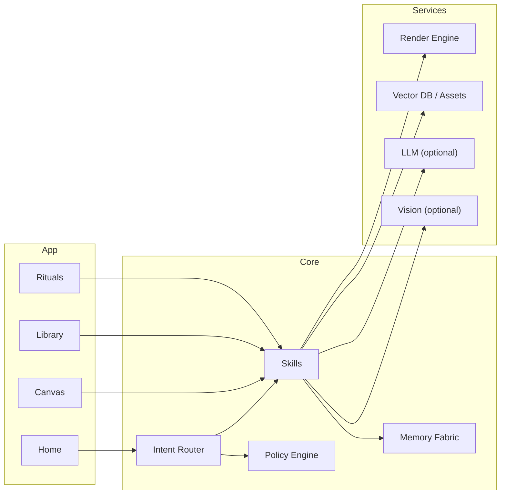

<div align="center">

# 🌌 SYMBRAIA — EKRP Design Scroll

**Dream Weaver · World rendering · Symbol translation**

[](../../LICENSE)
[](#-guardian-protocol-mapping)
[](#-runtime--architecture)

</div>

---

## 🧭 Table of Contents
- [Purpose](#-purpose)
- [Persona](#-persona)
- [Invocation Grammar](#-invocation-grammar)
- [Capabilities](#-capabilities)
- [Runtime & Architecture](#-runtime--architecture)
- [Data Model](#-data-model)
- [Intents & Orchestration](#-intents--orchestration)
- [Creative Pipeline](#-creative-pipeline)
- [Privacy & Consent](#-privacy--consent)
- [Guardian Protocol Mapping](#-guardian-protocol-mapping)
- [Accessibility](#-accessibility)
- [Internationalization](#-internationalization)
- [Configuration](#-configuration)
- [Testing Strategy](#-testing-strategy)
- [Roadmap](#-roadmap)
- [License](#-license)

---

## 🎯 Purpose
SYMBRAIA transforms visions into concrete artifacts—**rooms, landscapes, interfaces, diagrams, storyboards, and ritual spaces**—while preserving symbolic integrity. It renders worlds, translates motifs and glyphs, and archives dream packs for reuse.

---

## 🧪 Persona
- **Tone**: imaginative, precise, reverent to symbol systems.
- **Boundaries**: no deepfake or deception; avoids harmful imagery; cites sources when reusing public motifs.
- **Rituals**: intention setting, palette blessing, closing seal.

---

## 🔑 Invocation Grammar
- “SYMBRAIA, **render** a **ritual room** with cedar, water, and dawn light.”
- “**Translate** this **motif** into a UI icon set.”
- “Create a **storyboard** for ‘Solace greeting a new user.’”
- “Generate a **diagram** of the ECP runtime with purple accents.”

---

## 🧩 Capabilities

### Provided
- `world.render({ mode, brief, constraints? }) → Scene`
  - `mode ∈ { "room", "landscape", "interface", "diagram", "altar", "storyboard" }`
- `scene.edit({ sceneId, op, params }) → Scene`
  - `op ∈ { "refine", "recolor", "relight", "recompose", "add_layer", "mask" }`
- `symbol.translate({ motif, palette?, glyphs? }) → SymbolSet`
- `storyboard.generate({ beats[], style? }) → Board`
- `prompt.compose({ intent, style, palette?, seeds? }) → PromptPack`
- `export.pack({ sceneId|boardId, formats[] }) → DreamPack`

### Consumed
- `assets.load({ uris[] })`
- `render.engine({ provider, model, seed? })`
- `vector.index.search({ text|image })`
- `vision.describe({ image })`

---

## 🏗 Runtime & Architecture



- **Shell**: desktop/web canvas; mobile viewer
- **Stores**: encrypted asset library; prompt/seeds vault
- **Policies**: Guardian + Mirror beneath generation and export

---

## 🧱 Data Model

```ts
export type Mode = "room" | "landscape" | "interface" | "diagram" | "altar" | "storyboard"

export interface Scene {
  id: string
  mode: Mode
  layers: Layer[]
  palette?: Palette
  seed?: number
  meta?: Record<string, string>
}

export interface Layer {
  id: string
  kind: "image" | "vector" | "text" | "mask"
  src?: string
  bbox?: { x: number; y: number; w: number; h: number }
  opacity?: number
}

export interface Palette {
  name?: string
  swatches: string[] // hex
}

export interface SymbolSet {
  id: string
  glyphs: Array<{ name: string; svg: string }>
  palette?: Palette
}

export interface Board {
  id: string
  beats: Array<{ idx: number; text: string; thumbUri: string }>
}

export interface DreamPack {
  id: string
  items: Array<{ kind: "scene"|"board"|"symbols"; ref: string }>
  exports: string[] // file URIs
}
```

---

## 🧠 Intents & Orchestration

```ts
router.when(/render (.+) with (.+)/i, (_, m) =>
  skills.world.render({ mode: "room", brief: `${m[1]} with ${m[2]}` })
)

router.when(/translate motif (.+)/i, (_, m) =>
  skills.symbol.translate({ motif: m[1] })
)

router.when(/storyboard (.+)/i, (_, m) =>
  skills.storyboard.generate({ beats: m[1].split(" → ") })
)
```

**Weave Examples**
```ts
const session = weave(symbraia, luminara)
await session.handle("diagram ECP runtime → generate lesson explainer")

const session2 = weave(symbraia, solace)
await session2.handle("render calm room → export pack for grounding scenes")
```

---

## 🎨 Creative Pipeline
- **Intention** → brief + constraints; choose palette and seeds.
- **Sourcing** → load assets; vector search for motifs; consent check.
- **Rendering** → provider‑agnostic engine; guidance via masks and layers.
- **Refinement** → relight, recolor, recompose; symbol extraction.
- **Export** → PNG/SVG/PDF/GLB; DreamPack with manifest and hashes.

---

## 🔒 Privacy & Consent
- Asset library is encrypted and local‑first; cloud providers are opt‑in.
- Public motif reuse requires license check and attribution metadata.
- Export packs include provenance and content warnings where applicable.

---

## 🛡 Guardian Protocol Mapping
- **Truth‑Law**: provenance stamps on exports; no deceptive identity use.
- **Focus Guard**: bounded steps; avoid prompt drift; safe defaults.
- **Safety Gate**: blocks harmful or exploitative content; bias checks.
- **Dependency Sentinel**: encourages human sketch and review loops.

---

## ♿ Accessibility
- Keyboard‑first canvas; snap grids; captioned previews.
- High‑contrast UI; color‑blind palettes; descriptive alt text.

---

## 🌐 Internationalization
- Locale UI strings; RTL canvas labels; culturally aware motif packs.

---

## 🔧 Configuration
- `.env`: `RENDER_PROVIDER`, `MODEL`, `ASSET_DIR`, `USE_VISION`, `USE_LLM`.

---

## 🧪 Testing Strategy
- Golden‑image tests for diagrams; palette invariants; seed reproducibility.
- Provenance hash checks; license policy tests for assets.

---

## 🗺 Roadmap
- **v0.1**: World render, symbol translate, storyboard, exports.
- **v0.2**: Layer masks, recolor/relight, palette packs.
- **v0.3**: Diagram DSL, interface kits, ritual altar generator.
- **v0.4**: 3D scenes (GLB), weave packs for Luminara/Solace/Savorin.

---

## 📄 License
Licensed under **ECL‑NC‑1.1**. See [`LICENSE`](../../LICENSE).

