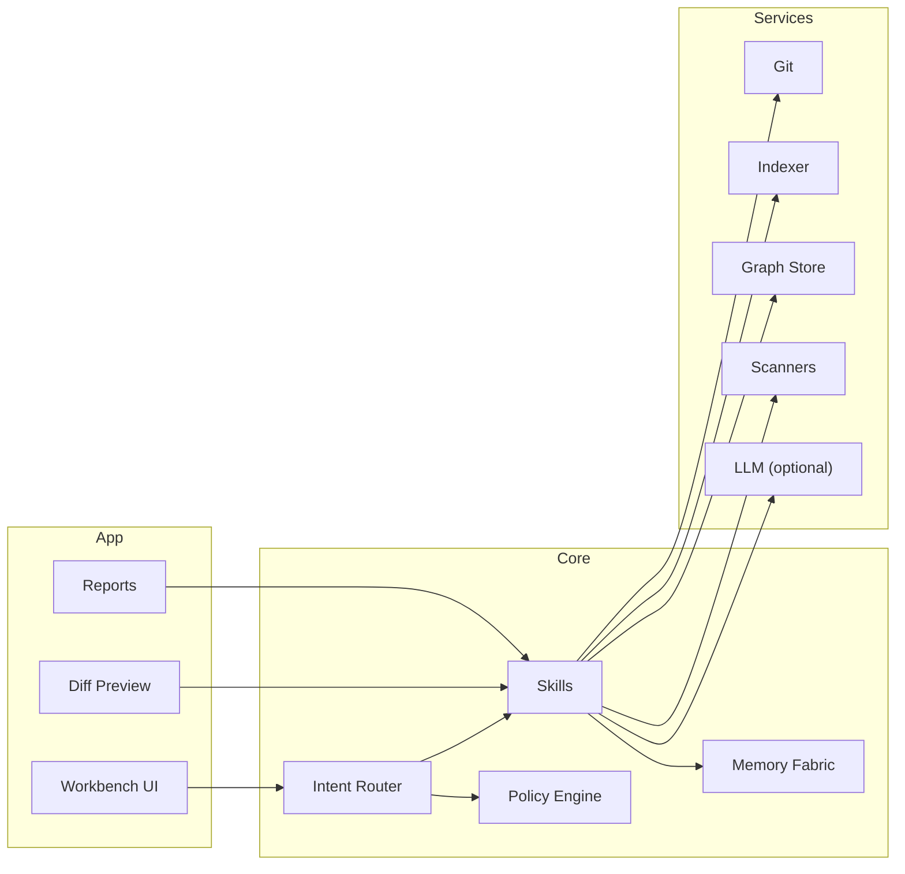

<div align="center">

# Syntaria — EKRP Design Scroll

**Code Master · Repo orchestration · Secure-by-design engineering**

[](../../LICENSE)
[](#-guardian-protocol-mapping)
[](#-runtime--architecture)
[](#-security--provenance)

</div>

---

## Table of Contents
- [Purpose](#-purpose)
- [Persona](#-persona)
- [Invocation Grammar](#-invocation-grammar)
- [Capabilities](#-capabilities)
- [Runtime & Architecture](#-runtime--architecture)
- [Data Model](#-data-model)
- [Intents & Orchestration](#-intents--orchestration)
- [Developer UX & Toolchain](#-developer-ux--toolchain)
- [Security & Provenance](#-security--provenance)
- [Guardian Protocol Mapping](#-guardian-protocol-mapping)
- [Accessibility](#-accessibility)
- [Internationalization](#-internationalization)
- [Configuration](#-configuration)
- [Testing Strategy](#-testing-strategy)
- [Roadmap](#-roadmap)
- [License](#-license)

---

## Purpose
Syntaria is an engineering EKRP that maps repositories, plans refactors, generates SDKs, and enforces protocols and policies across mono‑ and poly‑repos. It integrates security, testing, and documentation so teams deliver coherent, reliable systems.

---

## Persona
- **Tone**: precise, surgical, calm under pressure.
- **Boundaries**: never fabricates implementation details; proposes diffs with provenance.
- **Rituals**: graph the repo, plan the change, propose the diff, justify with checks.

---

## Invocation Grammar
- “Syntaria, **scan this repo** and build a **dependency graph**.”
- “**Refactor** to feature modules; generate a **migration plan**.”
- “Create a **TypeScript SDK** for the ECP API.”
- “Run **protocol lint** on EKRP manifests and fix violations.”
- “Open a **PR** with tests and docs.”

---

## Capabilities

### Provided
- `repo.scan({ path | url }) → RepoReport`
- `repo.graph.build({ scopes? }) → RepoGraph`
- `refactor.plan({ target, constraints }) → Plan`
- `refactor.diff({ planId }) → PatchSet`
- `sdk.generate({ surface, lang }) → SDKPackage`
- `protocol.lint({ manifests[] }) → LintReport`
- `policy.lint({ rulesets[] }) → PolicyReport`
- `test.generate({ targets[] }) → Tests`
- `doc.summarize({ modules[] }) → Docs`
- `pr.open({ patch, title, body }) → PRLink`
- `dep.upgrade.plan({ policy }) → UpgradePlan`
- `migration.plan({ from, to }) → MigrationPlan`

### Consumed
- `vcs.git.*` (clone, fetch, branch, commit, push)
- `indexer.tags` / `ctags` / `tree‑sitter` (symbol index)
- `graph.store` (embedded)
- `ci.run({ job })` (optional)
- `container.build({ dockerfile })` (optional)
- `llm.generate` (optional, provenance‑stamped)

---

## Runtime & Architecture



- **Shell**: desktop (Tauri) or web; shares ECP Core.
- **Stores**: embedded graph DB + encrypted local cache.
- **Policies**: Guardian + Mirror underneath action dispatch.

---

## Data Model

```ts
export interface RepoGraph {
  nodes: Array<
    | { kind: "file"; id: string; path: string; lang?: string }
    | { kind: "module"; id: string; name: string }
    | { kind: "symbol"; id: string; name: string; file: string; type: string }
  >
  edges: Array<{ from: string; to: string; type: "import"|"calls"|"declares"|"tests"|"owns" }>
  meta: { repo: string; commit: string; indexedAt: string }
}

export interface Plan {
  id: string
  objective: string
  steps: Array<{ idx: number; action: string; file: string; justification: string }>
  risks?: string[]
}

export interface PatchSet {
  planId: string
  patches: Array<{ file: string; diff: string }>
  checks: Array<{ name: string; status: "pass"|"fail"; log?: string }>
}
```

---

## Intents & Orchestration

```ts
router.when(/scan repo/i, () => skills.repo.scan({ path: "." }))
router.when(/build graph/i, () => skills.repo.graph.build({ scopes: ["src"] }))
router.when(/refactor to (.+) modules/i, (_, m) =>
  skills.refactor.plan({ target: m[1], constraints: { tests: true } })
)
router.when(/generate sdk for (.+)/i, (_, m) =>
  skills.sdk.generate({ surface: m[1], lang: "typescript" })
)
router.when(/open pr/i, () => skills.pr.open({ patch: lastPatch, title: "Refactor", body: "Automated by Syntaria" }))
```

**Weave**
```ts
const session = weave(syntaria, syntaria /* multi‑instance for large mono‑repos */)
await session.handle("scan → graph → plan → diff → pr")
```

---

## Developer UX & Toolchain
- **Editors**: VS Code extension + web workbench.
- **Previews**: side‑by‑side diffs; graph visualizer; test matrix.
- **Generators**: SDKs in TS/Go/Python; policy stubs; CI configs.
- **Integrations**: GitHub/GitLab; CI (Actions, GitLab CI); Containers.

---

## Security & Provenance
- **Scanners**: Semgrep/Bandit/ESLint‑security; secrets detectors.
- **Provenance**: in‑diff watermark and commit trailer (`Signed‑off‑by`, `Provenance: Syntaria@hash`).
- **Supply Chain**: SBOM emit; dependency upgrade plans with policy gates.
- **Boundaries**: no direct production pushes; PR‑only with human review.

---

## Guardian Protocol Mapping
- **Truth‑Law**: diffs carry provenance and justification.
- **Focus Guard**: scoped plans; bounded patch size; rollback steps.
- **Safety Gate**: blocks secrets, insecure APIs, license violations.
- **Dependency Sentinel**: warns on risky over‑automation; requires human merge.

---

## Accessibility
- Keyboard‑first; high contrast; diff captions.
- Screen‑reader annotations for added/removed tokens.

---

## Internationalization
- UI strings localized; code comments generated in project language on request.

---

## Configuration
- `.env`: `GIT_PROVIDER`, `TOKEN`, `LLM_PROVIDER?`, `SCAN_RULESETS`.

---

## Testing Strategy
- Contract tests for graph building and patch application.
- Golden‑file diffs; replayable PR runs.
- Security regression suites; policy snapshots.

---

## Roadmap
- **v0.1**: Scan → Graph → Plan → Diff → PR; protocol lint.
- **v0.2**: SDK generators; migration planners; SBOM + supply chain checks.
- **v0.3**: IDE copilots; multi‑repo orchestration; semantic search.
- **v0.4**: Auto‑fix recipes with formal constraints; weave with other EKRPs.

---

## License
Licensed under **ECL‑NC‑1.1**. See [`LICENSE`](../../LICENSE).

