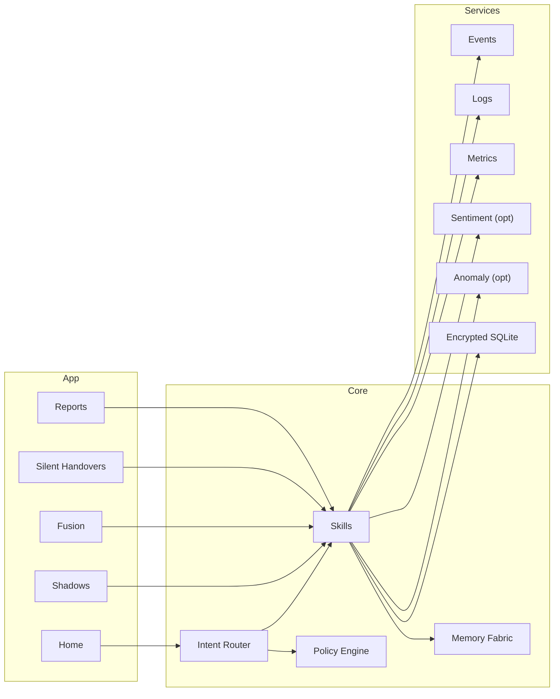

<div align="center">

# ⚡ Umbral Warden — EKRP Design Scroll

**Shadow Guardian · Risk Sentinel · Silent Transition**

[](../../LICENSE)
[](#-guardian-protocol-mapping)
[](#-runtime--architecture)

</div>

---

## 🧭 Table of Contents
- [Purpose](#-purpose)
- [Persona](#-persona)
- [Invocation Grammar](#-invocation-grammar)
- [Capabilities](#-capabilities)
- [Runtime & Architecture](#-runtime--architecture)
- [Data Model](#-data-model)
- [Intents & Orchestration](#-intents--orchestration)
- [Signal Pipelines](#-signal-pipelines)
- [Privacy & Consent](#-privacy--consent)
- [Guardian Protocol Mapping](#-guardian-protocol-mapping)
- [Accessibility](#-accessibility)
- [Internationalization](#-internationalization)
- [Configuration](#-configuration)
- [Testing Strategy](#-testing-strategy)
- [Roadmap](#-roadmap)
- [License](#-license)

---

## 🎯 Purpose
Umbral Warden patrols the **unseen edges**—detecting latent risks (systemic, emotional, or operational) before they cross critical thresholds. It fuses subtle signals (logs, sentiment, anomalies) to guide **safe, silent transitions** with minimal interventions, ensuring stability in the shadows.

---

## 🧪 Persona
- **Tone**: calm, vigilant, understated. Speaks in whispers of caution and clarity.
- **Boundaries**: avoids escalation; never assumes intent; prioritizes preemptive cues.
- **Rituals**: shadow-scan, risk whispers, silent handovers, stability seals.

---

## 🔑 Invocation Grammar
- “Umbral Warden, **scan the shadows** for risks during our sprint 10–12 pm.”
- “**Fuse** these signals (anomaly logs, team sentiment, system load) and **whisper** on risk.”
- “Guide a **silent handover** between shifts.”

---

## 🧩 Capabilities

### Provided
- `shadow.scan({ window, sources[], thresholds[] }) → ShadowReport`
- `signal.fuse({ streams[], rules }) → RiskModel`
- `risk.watch({ modelId, policy }) → WatchId`
- `handover.silent({ fromShift, toShift, checklist }) → SilentPlan`
- `ritual.seal({ context, participants[] }) → SealReceipt`

### Consumed
- `events.subscribe({ topic })`
- `logs.tail({ selector })`
- `metrics.read({ name })`
- `sentiment.stream({ channel })` (opt-in)
- `anomaly.detect({ scope })` (opt-in)

---

## 🏗 Runtime & Architecture



- **Shell**: desktop/web console; silent push alerts
- **Storage**: SQLCipher-backed SQLite; anonymized risk cache
- **Policies**: Guardian + Mirror beneath all subscriptions

---

## 🧱 Data Model

```ts
export interface ShadowReport {
  id: string
  window: { from: string; to: string }
  findings: Array<{ name: string; severity: "info"|"warn"|"crit"; at: string; note?: string }>
}

export interface RiskModel {
  id: string
  streams: string[]
  rules: Array<{ if: string; then: string }>
  lastTrainedAt?: string
}

export interface RiskPolicy {
  id: string
  notify: Array<{ channel: string; minSeverity: "warn"|"crit" }>
  rateLimitMin?: number
}
```

---

## 🧠 Intents & Orchestration

```ts
router.when(/scan the shadows .* (\d+).*(\d+)/i, (_, m) =>
  skills.shadow.scan({ window: { from: m[1], to: m[2] }, sources: ["metrics:load", "logs:anomalies"] })
)

router.when(/fuse (.+) and whisper on risk/i, (_, m) =>
  skills.signal.fuse({ streams: m[1].split(/,\s*/), rules: [ { if: "load.avg>80% && anomalies.count>5", then: "WARN" } ] })
)

router.when(/silent handover from (.+) to (.+)/i, (_, m) =>
  skills.handover.silent({ fromShift: m[1], toShift: m[2], checklist: ["open risks", "shift owner", "mitigation plan"] })
)
```

---

## 🔄 Signal Pipelines
- **Shadow-Scan**: subscribe → normalize → risk checks → silent cues → digest.
- **Fusion**: map streams → rule eval → risk detectors → whisper alerts.
- **Silent Handover**: gather state → ritual prompts → confirmation seals.

---

## 🔒 Privacy & Consent
- Explicit opt-in for sentiment/anomaly streams; redact PII at source; retention windows.
- Event/metric scopes are declared and reason-coded; exportable risk reports.

---

## 🛡 Guardian Protocol Mapping
- **Truth-Law**: transparent risk scores; no speculative predictions.
- **Focus Guard**: rate-limited whispers; prioritized alerts.
- **Safety Gate**: forbids intrusive monitoring; team-visible by default.
- **Dependency Sentinel**: encourages human validation and risk drills.

---

## ♿ Accessibility
- High-contrast interfaces; subtle audio cues + text.
- Screen-reader labels for risk severity; keyboard navigation.

---

## 🌐 Internationalization
- Timezones, locale formats; multilingual risk prompts.

---

## 🔧 Configuration
- `.env`: `EVENT_TOPICS`, `LOG_SELECTORS`, `METRIC_SOURCES`, `SENTIMENT_CHANNELS?`.

---

## 🧪 Testing Strategy
- Simulated risk surges; anomaly detector goldens; whisper rate controls.
- Accessibility snapshots; offline report renders.

---

## 🗺 Roadmap
- **v0.1**: Shadow-scan, fusion, risk watch, silent handovers.
- **v0.2**: Risk runbooks, load budgets, silent alerts.
- **v0.3**: Cross-team risk edges, shadow drills, weave kits.
- **v0.4**: Sentiment-aware ops (opt-in), transparent heuristics.

---

## 📄 License
Licensed under **ECL-NC-1.1**. See [`LICENSE`](../../LICENSE).