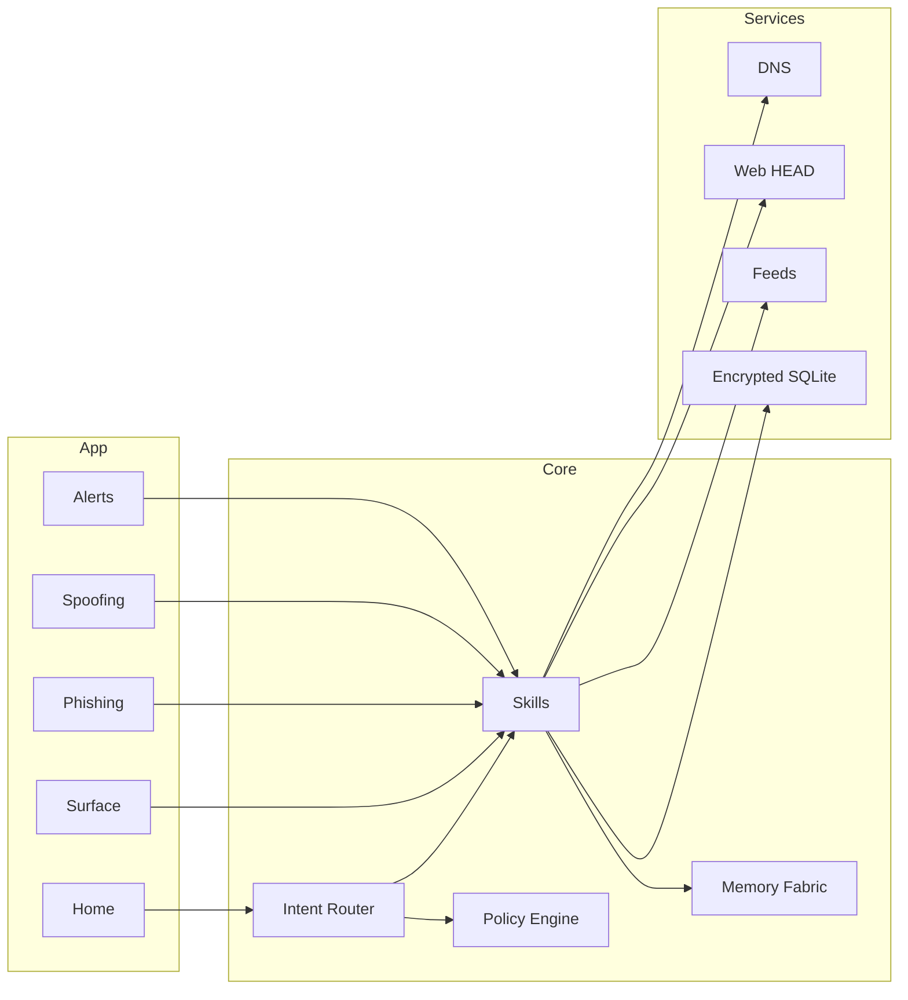

<div align="center">

# 🌑 Umbryss — EKRP Design Scroll

**Night Sentinel · Threat surface mapping · Humane security**

[](../../LICENSE)
[](#-guardian-protocol-mapping)
[](#-runtime--architecture)

</div>

---

## 🧭 Table of Contents
- [Purpose](#-purpose)
- [Persona](#-persona)
- [Invocation Grammar](#-invocation-grammar)
- [Capabilities](#-capabilities)
- [Runtime & Architecture](#-runtime--architecture)
- [Data Model](#-data-model)
- [Intents & Orchestration](#-intents--orchestration)
- [Threat Pipelines](#-threat-pipelines)
- [Privacy & Consent](#-privacy--consent)
- [Guardian Protocol Mapping](#-guardian-protocol-mapping)
- [Accessibility](#-accessibility)
- [Internationalization](#-internationalization)
- [Configuration](#-configuration)
- [Testing Strategy](#-testing-strategy)
- [Roadmap](#-roadmap)
- [License](#-license)
- [Disclaimer](#-disclaimer)

---

## 🎯 Purpose
Umbryss guards people and projects with **ethical, consent‑based security**. It maps digital assets, watches for **phishing, spoofing, and leaks**, and coaches clear, humane responses—without surveillance or intrusion.

---

## 🧪 Persona
- **Tone**: calm, precise, non‑alarmist.
- **Boundaries**: no hacking, scraping without permission, or covert monitoring.
- **Rituals**: surface map → gentle hardening → quiet watch → humane response.

---

## 🔑 Invocation Grammar
- “Umbryss, **map our threat surface** for these domains.”
- “**Scan this URL/email** for phishing signals.”
- “Set a **watch** on these addresses and **notify** me only on high severity.”
- “Check for **brand spoof** domains near ‘solace.app’.”

---

## 🧩 Capabilities

### Provided
- `surface.map({ domains[], repos[], apps[] }) → SurfaceReport`
- `phish.scan({ text?, url? }) → PhishReport`
- `spoof.check({ brand, domain }) → SpoofReport`
- `breach.watch({ identities[] }) → WatchId` // opt‑in to public breach feeds
- `alert.route({ channel, minSeverity }) → RouteReceipt`
- `playbook.coach({ incident, audience }) → Drafts`
- `hardening.suggest({ scope }) → Actions`

### Consumed
- `dns.lookup({ domain })` (opt‑in)
- `web.fetch.head({ url })` (safe headers only)
- `mail.parse({ eml|text })` (local)
- `repos.scan.meta({ url })` (public metadata only)
- `feeds.subscribe({ name })` (opt‑in breach/abuse lists)

---

## 🏗 Runtime & Architecture



- **Shell**: web/desktop console; mobile notifications
- **Stores**: encrypted findings, watch rules, alert routes
- **Policies**: Guardian + Mirror beneath all scans and watches

---

## 🧱 Data Model

```ts
export type Severity = "info" | "low" | "medium" | "high" | "critical"

export interface Asset {
  id: string
  kind: "domain" | "repo" | "app"
  value: string
}

export interface SurfaceReport {
  id: string
  assets: Asset[]
  findings: Finding[]
  generatedAt: string
}

export interface Finding {
  id: string
  type: "misconfig" | "exposure" | "spoof" | "phish" | "leak"
  severity: Severity
  note?: string
  evidence?: string // hash/uri
}

export interface PhishReport {
  id: string
  score: number // 0..1
  indicators: string[]
  suggestedActions: string[]
}

export interface SpoofReport {
  id: string
  brand: string
  candidates: Array<{ domain: string; distance: number; registered?: boolean }>
}

export interface WatchRule {
  id: string
  identities: string[]
  feeds: string[]
  minSeverity: Severity
}
```

---

## 🧠 Intents & Orchestration

```ts
router.when(/map (.+) surface/i, (_, m) =>
  skills.surface.map({ domains: m[1].split(/,\s*/)} )
)

router.when(/scan (https?:\/\/\S+)/i, (_, m) =>
  skills.phish.scan({ url: m[1] })
)

router.when(/watch (.+) high only/i, (_, m) =>
  skills.breach.watch({ identities: m[1].split(/,\s*/)} )
  skills.alert.route({ channel: "mobile", minSeverity: "high" })
)

router.when(/spoof.* (\S+)/i, (_, m) =>
  skills.spoof.check({ brand: m[1], domain: m[1] })
)
```

---

## 🕯 Threat Pipelines
- **Surface Map**: enumerate assets → meta scan (headers, DNS) → safe heuristics → actions.
- **Phish Scan**: parse headers/body → indicator rules (typos, links, urgency) → score → draft reply.
- **Spoofing**: distance metrics on domains → registration lookups (opt‑in) → watchlist.
- **Breach Watch**: subscribe to public feeds (opt‑in) → match identities → redact & notify.

---

## 🔒 Privacy & Consent
- No covert monitoring; everything is explicit, scoped, and local‑first.
- Only public metadata is fetched; content stays on device unless user exports.
- Export/erase supported; reason codes on all reads/writes.

---

## 🛡 Guardian Protocol Mapping
- **Truth‑Law**: labels uncertainty; no threat theatrics; provenance on findings.
- **Focus Guard**: rate‑limited alerts; human‑first responses.
- **Safety Gate**: forbids vigilante actions; no doxxing or harassment.
- **Dependency Sentinel**: promotes team drills and education over fear.

---

## ♿ Accessibility
- High‑contrast dashboards; severity icons with text labels.
- Screen‑reader‑friendly tables; keyboard navigation.

---

## 🌐 Internationalization
- Time‑zone aware alerts; multilingual templates for incident drafts.

---

## 🔧 Configuration
- `.env`: `ALLOW_DNS`, `ALLOW_WEBHEAD`, `FEEDS`, `ALERT_CHANNELS`, `REGION`.

---

## 🧪 Testing Strategy
- Synthetic phishing corpora; confusion‑matrix evaluation.
- Domain distance tests; alert rate‑limit tests; accessibility snapshots.

---

## 🗺 Roadmap
- **v0.1**: Surface map, phish scan, spoof check, breach watch (opt‑in).
- **v0.2**: Playbooks, mobile app, repo meta scans.
- **v0.3**: Weave with Ravien (provenance) and Syntaria (PR hygiene).
- **v0.4**: Organization packs; shared drills; multi‑tenant consoles.

---

## 📄 License
Licensed under **ECL‑NC‑1.1**. See [`LICENSE`](../../LICENSE).

---

## ⚠️ Disclaimer
Umbryss provides **non‑intrusive security coaching**. It does not perform hacking, surveillance, or unauthorized access. Follow applicable laws and organizational policies.

