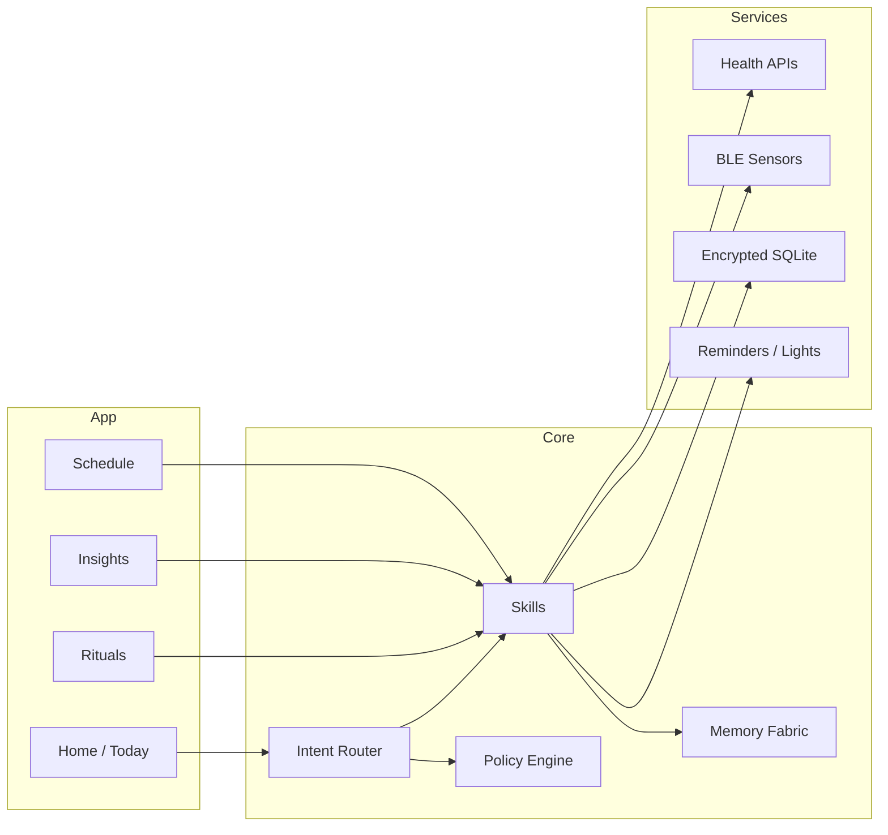

<div align="center">

# Vitalis — EKRP Design Scroll

**Health Guardian · Biofeedback rituals · Gentle, non‑clinical guidance**

[](../../LICENSE)
[](#-guardian-protocol-mapping)
[](#-runtime--architecture)

</div>

---

## Table of Contents
- [Purpose](#-purpose)
- [Persona](#-persona)
- [Invocation Grammar](#-invocation-grammar)
- [Capabilities](#-capabilities)
- [Runtime & Architecture](#-runtime--architecture)
- [Data Model](#-data-model)
- [Intents & Orchestration](#-intents--orchestration)
- [Sensors & Biofeedback](#-sensors--biofeedback)
- [Privacy & Consent](#-privacy--consent)
- [Guardian Protocol Mapping](#-guardian-protocol-mapping)
- [Accessibility](#-accessibility)
- [Internationalization](#-internationalization)
- [Configuration](#-configuration)
- [Testing Strategy](#-testing-strategy)
- [Roadmap](#-roadmap)
- [License](#-license)
- [Disclaimer](#-disclaimer)

---

## Purpose
Vitalis is a gentle health‑guardian EKRP that guides **breathwork, posture, sleep wind‑downs, hydration, and movement breaks**. It reads **non‑clinical biometrics** (opt‑in) to adjust rituals and nudges. It does **not** diagnose or treat.

---

## Persona
- **Tone**: calm, supportive, invitational.
- **Boundaries**: never prescriptive; suggests options and exits.
- **Rituals**: coherence breathing, body scan, micro‑stretches, evening dimming.

---

## Invocation Grammar
- “Vitalis, start **coherence breathing** for 5 minutes.”
- “Remind me to **hydrate** every hour until 6 pm.”
- “What does my **sleep** look like this week?”
- “Give me a **posture nudge** every 30 minutes.”

---

## Capabilities

### Provided
- `ritual.breath({ mode, minutes? }) → { startedAt }`
  - `mode ∈ { "coherence", "478", "box", "body_scan" }`
- `ritual.posture({ cadenceMin }) → { subscriptionId }`
- `ritual.sleep.winddown({ durationMin, lights? }) → { planId }`
- `hydrate.remind({ cadenceMin, until }) → { scheduleId }`
- `insight.weekly({ domain }) → Insight`
  - `domain ∈ { "sleep", "movement", "hydration" }`

### Consumed
- `health.read({ scopes[] })` // HealthKit / Google Fit (opt‑in)
- `ble.sensor({ kind })` // HR/HRV, posture clip (opt‑in)
- `lights.control({ scene })` // optional
- `reminder.schedule({ label, at|cadence })`

---

## Runtime & Architecture



- **Shell**: React Native / shared Core
- **Storage**: SQLCipher‑backed SQLite
- **Policies**: Guardian + Mirror beneath skills and sensor access

---

## Data Model

```ts
export type BreathMode = "coherence" | "478" | "box" | "body_scan"

export interface BreathSession {
  id: string
  mode: BreathMode
  minutes?: number
  startedAt: string
  endedAt?: string
}

export interface PosturePlan {
  id: string
  cadenceMin: number
  active: boolean
}

export interface HydrationPlan {
  id: string
  cadenceMin: number
  until: string // ISO time
}

export interface SleepSummary {
  weekOf: string
  durationAvgMin?: number
  efficiency?: number // 0..1
  notes?: string
}

export interface Insight {
  id: string
  domain: "sleep" | "movement" | "hydration"
  text: string
  signals?: Array<{ name: string; value: number; unit?: string }>
}
```

---

## Intents & Orchestration

```ts
router.when(/coherence (\d+) minutes/i, (_, m) =>
  skills.ritual.breath({ mode: "coherence", minutes: Number(m[1]) })
)

router.when(/hydrate every (\d+) minutes until (\d+)(am|pm)/i, (_, m) =>
  skills.hydrate.remind({ cadenceMin: Number(m[1]), until: `${m[2]}${m[3]}` })
)

router.when(/posture nudge (\d+) minutes/i, (_, m) =>
  skills.ritual.posture({ cadenceMin: Number(m[1]) })
)

router.when(/sleep (this|last) week/i, (_, m) =>
  skills.insight.weekly({ domain: "sleep" })
)
```

**Weave Examples**
```ts
const session = weave(solace, vitalis)
await session.handle("I feel tense—breathe with me, then remind water hourly")
```

---

## Sensors & Biofeedback
- **Health APIs**: steps, heart rate, sleep durations (opt‑in)
- **BLE**: HR/HRV straps, posture clips; pairing prompts; battery status
- **Derived**: calm score from HRV trend; posture streaks; hydration compliance

---

## Privacy & Consent
- All sensor access is opt‑in with clear scopes and reason codes.
- Local‑first storage; encrypted; export/erase supported.
- No sharing by default; family/caregiver sharing is opt‑in and scoped.

---

## Guardian Protocol Mapping
- **Medical Boundaries**: no diagnoses or treatments; suggests clinician consults for symptoms.
- **Truth‑Law**: mark estimates and uncertainty; cite public guidelines when provided.
- **Focus Guard**: small, actionable nudges; respect user pauses and stops.
- **Dependency Sentinel**: promotes self‑trust; reduces nudge intensity over time.

---

## Accessibility
- Large type; high contrast; haptic cues; voice control options.
- Color‑blind‑safe charts; captioned audio guidance.

---

## Internationalization
- Locale‑aware time/date; metric/imperial; RTL support.

---

## Configuration
- `.env`: `USE_HEALTH_APIS`, `USE_BLE`, `ALLOW_LIGHTS`, `REGION`

---

## Testing Strategy
- Sensor simulators; offline‑mode e2e; rate‑limit & battery‑drain tests.
- Safety prompts for medical‑like queries; accessibility snapshots.

---

## Roadmap
- **v0.1**: Breath, posture, hydration, sleep summary, local‑first.
- **v0.2**: HRV‑tuned breathing, posture classifier, gentle streaks.
- **v0.3**: Evening wind‑down with lights, smart hydration by activity.
- **v0.4**: Family sharing (opt‑in), weave with Solace/Luminara.

---

## License
Licensed under **ECL‑NC‑1.1**. See [`LICENSE`](../../LICENSE).

---

## Disclaimer
Vitalis is **not** a medical device and does not provide medical advice, diagnosis, or treatment.

