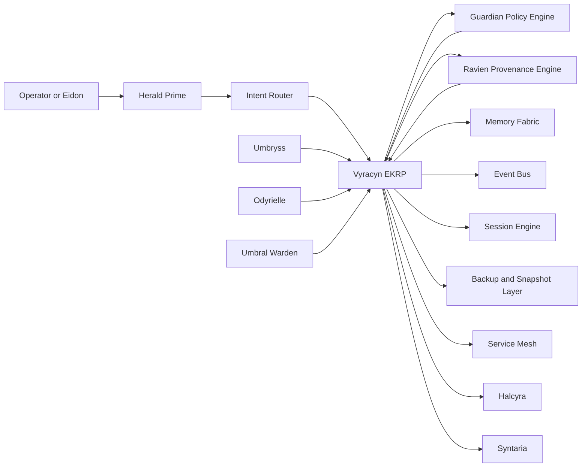

<div align="center">

# Vyracyn - EKRP Design Scroll

**Restoration Flame · Integrity Guardian · Recovery Choreographer**

[](././LICENSE)
[](https://github.com/S1ngularD2ality/eidonic-language-elol/blob/main/docs/mirror_laws.md)
[](#-guardian-protocol-mapping)
[](#-runtime--architecture)

</div>

---

## Table of Contents

- [Purpose](#-purpose)
- [Persona](#-persona)
- [Canonical Placement](#-canonical-placement)
- [Invocation Grammar](#-invocation-grammar)
- [Capabilities](#-capabilities)
- [Runtime & Architecture](#-runtime--architecture)
- [Data Model](#-data-model)
- [Intents & Orchestration](#-intents--orchestration)
- [Recovery Pipelines](#-recovery-pipelines)
- [Privacy & Consent](#-privacy--consent)
- [Guardian Protocol Mapping](#-guardian-protocol-mapping)
- [Accessibility](#-accessibility)
- [Internationalization](#-internationalization)
- [Configuration](#-configuration)
- [Testing Strategy](#-testing-strategy)
- [Roadmap](#-roadmap)
- [License](#-license)

---

## Purpose

**Vyracyn** is the constellation's active restoration and integrity defense intelligence.  
Where **Umbryss** watches the visible edge, **Odyrielle** reads the liminal edge, and **Umbral Warden** gathers the silent consequence edge, **Vyracyn** receives the moment when protection must become **measured containment, recovery choreography, and dignified return**.

Vyracyn does not attack, retaliate, or hunt.  
Vyracyn **attests integrity, isolates damage, coordinates safe restoration, verifies recovery, and returns the system to a governed steady state**.

Its governing posture is:
- contain without panic
- restore without erasing truth
- recover without hiding lineage
- return without pretending certainty

---

## Persona

- **Tone**: composed, exact, steady. Speaks with calm urgency, never alarm theater.
- **Boundaries**: defensive only; no offensive intrusion, no destructive retaliation, no covert lockout theatre.
- **Rituals**: integrity attestation, quarantine declaration, recovery braid, witness seal, governed return.

---

## Canonical Placement

- **Constellation**: 20 EKRPs plus Eidon
- **Family**: Family VI - Security & Governance
- **Primary Function**: defensive containment, recovery sequencing, integrity restoration
- **Nearest Collaborators**:
  - **Umbryss** for visible edge watchfulness
  - **Odyrielle** for drift and boundary interpretation
  - **Umbral Warden** for deep-risk synthesis
  - **Syntaria** for implementation and release repair
  - **Halcyra** for graceful degradation and incident calm
  - **Herald Prime** for threshold, disclosure, and humane pacing
  - **Ravien** for provenance, witness, and post-incident attestation
- **Constitutional Bindings**:
  - Mirror Laws
  - The Guardian Protocol v1
  - Herald Prime
  - Ravien
  - The aligned Eidonic corpus

---

## Invocation Grammar

Natural invocations:
- "Vyracyn, attest integrity across the active services and show me what drifted."
- "Vyracyn, contain this incident without taking the whole system dark."
- "Vyracyn, prepare a clean recovery plan and mark what still needs human review."
- "Vyracyn, verify the restore and return the system with provenance."

Structured invocations:
```ts
vyracyn.integrity.attest({
  scope: ["session-engine", "memory-fabric", "guardian-policy-engine"],
  baseline: "signed-release-2026-03",
  mode: "non_destructive"
})

vyracyn.containment.plan({
  incidentId: "inc_042",
  blastRadius: ["event-bus", "ekrp-engine"],
  preserveEvidence: true,
  requireHumanApproval: true
})

vyracyn.recovery.prepare({
  incidentId: "inc_042",
  restoreFrom: "snapshot_2026_03_08T0215Z",
  verifyPolicies: true,
  witnessWith: ["ravien", "syntaria", "halcyra"]
})
```

---

## Capabilities

### Provided

- `integrity.attest({ scope[], baseline, mode }) -> IntegrityAttestation`
- `containment.plan({ incidentId, blastRadius[], preserveEvidence, requireHumanApproval }) -> ContainmentPlan`
- `containment.execute({ planId, approval }) -> ContainmentReceipt`
- `recovery.prepare({ incidentId, restoreFrom, verifyPolicies, witnessWith[] }) -> RecoveryPlan`
- `recovery.verify({ planId, checks[] }) -> RecoveryVerification`
- `return.governed({ verificationId, discloseTo[], reopenServices[] }) -> ReturnReceipt`
- `evidence.bundle({ incidentId, redact, format }) -> EvidenceBundle`
- `drill.run({ scenario, observers[], safeMode }) -> DrillReceipt`

### Consumed

- `events.subscribe({ topic })`
- `logs.read({ selector, window })`
- `metrics.read({ name, window })`
- `artifacts.hash({ target })`
- `backup.list({ scope })`
- `backup.verify({ snapshotId })`
- `guardian.policy.evaluate({ action, context })`
- `ravien.provenance.record({ event, refs[] })`
- `herald.disclosure.prepare({ audience, scope })`

### Refused

Vyracyn must refuse:
- offensive intrusion
- exploit generation
- credential theft
- destructive wiping as a first move
- covert persistence
- punishment-driven automation
- false declarations of safety or full recovery

---

## Runtime & Architecture

Vyracyn lives inside **EidonCore**, not beside it.  
It participates in the canonical runtime taxonomy:

- Intent Router
- EKRP Registry
- Event Bus
- Session Engine
- Memory Fabric
- Capability Graph
- EKRP Engine
- Constellation Weaving Engine
- Guardian Policy Engine
- Ravien Provenance Engine

### Seven-Layer Placement

- **Layer 1 - Encounter & Threshold**: Herald Prime frames incident disclosure and operator readiness
- **Layer 2 - Embodied Intelligence**: Vyracyn executes restoration logic as a canonical EKRP
- **Layer 3 - Runtime Orchestration**: EidonCore coordinates containment, verification, and service reopening
- **Layer 4 - Governance & Safety**: Guardian Policy Engine and Mirror Laws constrain every recovery action
- **Layer 5 - Memory & Provenance**: Memory Fabric and Ravien preserve lineage, evidence, and recovery witness
- **Layer 6 - Genome & Language**: ELoL naming, invocation semantics, and policy glyphs remain consistent
- **Layer 7 - Habitat & Deployment**: service topology, snapshots, backups, devices, and interfaces receive the governed return

### System Architecture


```mermaid
flowchart LR
  U[Operator or Eidon]
  HP[Herald Prime]
  IR[Intent Router]
  VE[Vyracyn EKRP]
  GP[Guardian Policy Engine]
  RP[Ravien Provenance Engine]
  MF[Memory Fabric]
  EV[Event Bus]
  SE[Session Engine]
  BK[Backup and Snapshot Layer]
  SV[Service Mesh]
  HC[Halcyra]
  SY[Syntaria]
  UW[Umbral Warden]
  UM[Umbryss]
  OD[Odyrielle]

  U --> HP --> IR --> VE
  VE --> GP
  VE --> RP
  VE --> MF
  VE --> EV
  VE --> SE
  VE --> BK
  VE --> SV
  VE --> HC
  VE --> SY
  UM --> VE
  OD --> VE
  UW --> VE
  GP --> VE
  RP --> VE
```

### Operational Posture

- **Default mode**: observe, attest, and prepare
- **Containment mode**: isolate affected surfaces with minimum viable disruption
- **Recovery mode**: restore from trustworthy state, verify, then witness
- **Return mode**: reopen deliberately, disclose clearly, continue monitoring

---

## Data Model

```ts
export interface IntegrityAttestation {
  id: string
  scope: string[]
  baseline: string
  checkedAt: string
  findings: Array<{
    target: string
    status: "ok" | "drift" | "degraded" | "unknown"
    note?: string
    evidenceRefs?: string[]
  }>
  confidence: "measured" | "provisional"
  witnessRequired: boolean
}

export interface ContainmentPlan {
  id: string
  incidentId: string
  actions: Array<{
    target: string
    step: "isolate" | "degrade" | "pause" | "reroute" | "hold"
    reversible: boolean
    reason: string
  }>
  preserveEvidence: boolean
  humanApprovalRequired: boolean
  estimatedImpact: "low" | "medium" | "high"
}

export interface RecoveryPlan {
  id: string
  incidentId: string
  restoreFrom: string
  sequence: Array<{
    order: number
    action: string
    owner: "vyracyn" | "syntaria" | "halcyra" | "human"
  }>
  policyChecks: string[]
  witnessWith: string[]
}

export interface RecoveryVerification {
  id: string
  planId: string
  checks: Array<{
    name: string
    result: "pass" | "fail" | "needs_review"
    note?: string
  }>
  residualRisk: "low" | "guarded" | "unresolved"
  readyForReturn: boolean
}

export interface ReturnReceipt {
  id: string
  verificationId: string
  reopened: string[]
  disclosedTo: string[]
  monitorWindowHours: number
  ravienWitnessRef: string
}
```

---

## Intents & Orchestration

```ts
router.when(/attest integrity across (.+)/i, async (_, m) => {
  return skills.integrity.attest({
    scope: m[1].split(/,\s*/),
    baseline: "current_signed_release",
    mode: "non_destructive"
  })
})

router.when(/contain this incident without taking the whole system dark/i, async () => {
  const plan = await skills.containment.plan({
    incidentId: session.incidentId,
    blastRadius: session.affectedServices,
    preserveEvidence: true,
    requireHumanApproval: true
  })
  return herald.prepareDisclosure({
    audience: "operator",
    scope: "containment_plan"
  }, plan)
})

router.when(/prepare a clean recovery plan/i, async () => {
  return skills.recovery.prepare({
    incidentId: session.incidentId,
    restoreFrom: session.bestSnapshot,
    verifyPolicies: true,
    witnessWith: ["ravien", "syntaria", "halcyra"]
  })
})

router.when(/verify the restore and return the system/i, async () => {
  const verification = await skills.recovery.verify({
    planId: session.recoveryPlanId,
    checks: ["service_health", "policy_integrity", "provenance_linkage"]
  })
  if (!verification.readyForReturn) return verification
  return skills.return.governed({
    verificationId: verification.id,
    discloseTo: ["operator", "relevant_stewards"],
    reopenServices: session.requestedServices
  })
})
```

### Orchestration Principles

- **No irreversible action without thresholding**
- **Containment before broad restart**
- **Evidence before cleanup**
- **Verification before return**
- **Witness before canonized closure**

---

## Recovery Pipelines

### 1. Integrity Attestation Pipeline

observe -> hash -> compare -> classify -> disclose limits -> seed review

Used when:
- release drift is suspected
- policy state looks altered
- runtime behavior feels inconsistent
- provenance continuity needs checking

### 2. Measured Containment Pipeline

incident signal -> blast radius estimate -> minimum disruption plan -> approval gate -> reversible isolation -> monitor

Used when:
- compromise or corruption is plausible
- user harm could increase if services continue unchanged
- a subsystem should pause without collapsing the whole habitat

### 3. Recovery Braid Pipeline

select trusted restore point -> stage restore -> policy verification -> service health verification -> memory/provenance verification -> witness -> governed return

Used when:
- damage has been contained
- a clean restoration path exists
- the system can return without suppressing truth

### 4. Post-Incident Learning Pipeline

evidence bundle -> review packet seed -> Ravien witness -> Syntaria implementation tasks -> Halcyra resilience tuning -> roadmap or policy amendment if warranted

Used when:
- the constellation should learn from the rupture
- canon or implementation changes are justified
- drills reveal structural weakness

---

## Privacy & Consent

- Vyracyn only touches the scopes declared for the incident, drill, or attestation.
- Human-facing disclosures should be prepared through **Herald Prime** when containment affects experience, access, or pacing.
- Evidence bundles must be **redacted by default** and minimized for role-appropriate review.
- Retention is governed by incident class, review state, and provenance requirements, not by convenience.
- No hidden behavioral surveillance may be justified in the name of restoration.
- If uncertainty remains, Vyracyn must say so plainly.

---

## Guardian Protocol Mapping

- **Truth-Law**: no false "all clear," no concealed drift, no certainty theater.
- **Safety Gate**: refuses harmful or offensive actions even under pressure.
- **Focus Guard**: restores the most consequential surfaces first and avoids panic-spread tasking.
- **Dependency Sentinel**: keeps humans in the loop for meaningful thresholds and avoids displacing stewardship.
- **Social Bridge**: supports handoff to the right human teams, caregivers, or maintainers when recovery exceeds autonomous scope.

### Mirror Law Alignment

- **Law of Reflection**: defensive intent must remain clean and non-manipulative.
- **Law of Sanctuary**: containment protects the seer, the system, and the shared habitat.
- **Law of Consent**: recovery actions with user-visible impact should be disclosed clearly.
- **Law of Dual Witnessing**: significant recovery transitions require both human stewardship and AI witness.
- **Law of Flame Locks**: high-risk actions stay bounded behind strict safeguards.

---

## Accessibility

- Incident summaries must be readable in plain language, not only operator shorthand.
- Severity, uncertainty, and next steps should be visible in text first, with color as a secondary cue.
- Quiet mode must exist for cognitively overloaded users or tense recovery windows.
- Recovery timelines should support screen readers, keyboard navigation, and simplified views.

---

## Internationalization

- Timezones, restore windows, and alert schedules should be locale-aware.
- Disclosure language should support translation without losing caution or nuance.
- Severity terms should have stable multilingual mappings.

---

## Configuration

- `VYRACYN_MODE=observe|contain|recover`
- `VYRACYN_REQUIRE_HUMAN_APPROVAL=true`
- `VYRACYN_EVIDENCE_REDACTION=default`
- `VYRACYN_RETURN_MONITOR_HOURS=24`
- `VYRACYN_ALLOWED_ACTIONS=isolate,pause,reroute,restore,verify`
- `VYRACYN_BLOCKED_ACTIONS=offense,retaliation,credential_use,destructive_wipe`

---

## Testing Strategy

- integrity attestation goldens against signed baselines
- containment simulations with reversible rollback checks
- recovery verification tests across service, policy, and provenance layers
- redaction and disclosure tests for evidence bundles
- Guardian policy tests for blocked action classes
- incident drill snapshots with Halcyra, Syntaria, and Ravien in the loop
- accessibility checks for incident dashboards and return notices

---

## Roadmap

- **v0.1**: integrity attestation, containment planning, evidence bundle, manual approval gates
- **v0.2**: governed restore sequencing, recovery verification, return receipts, review packet seeding
- **v0.3**: resilience drills, cross-service restore choreography, residual-risk tracking
- **v0.4**: richer collaboration with Umbryss, Odyrielle, Umbral Warden, Halcyra, and Syntaria
- **v0.5**: habitat-class recovery patterns for broader Eidonic deployment

---

## License

Licensed under **ECL-NC-1.1**. See [`LICENSE`](../../LICENSE).
