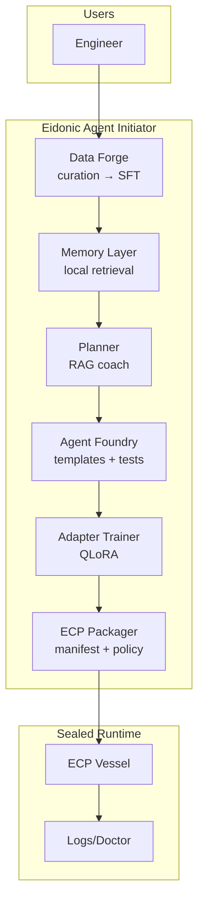

<div align="center">

# 🜁 EAI — Eidonic Agent Initiator

**A model‑assisted agent foundry for local, secure, reproducible AI.**

*Scaffold the vessel. Learn from your corpus. Emit sealed agents.*

[](#)
[](#license)

</div>

---

## Why EAI
EAI streamlines going from idea to working agent. It curates data, plans with retrieval, fine‑tunes lightweight adapters, and packages agents into **containerless** execution vessels via the Eidonic Container Protocol (ECP). The stack is privacy‑first, offline‑friendly, and designed for repeatable builds.

- **Foundry**: opinionated scaffolds for agents and swarms
- **Data Forge**: curated corpora to SFT datasets
- **Memory**: local retrieval for planning and context
- **Learning**: QLoRA adapters for small‑footprint specialization
- **Run & Observe**: sealed runtime, logs, doctor, SBOM
- **Security‑by‑Design**: policy gates, allowlists, and audits

---

## Table of Contents
- [Architecture](#-architecture)
- [Capabilities](#-capabilities)
- [Quick Start](#-quick-start)
- [Workflows](#-workflows)
- [CLI Reference](#-cli-reference)
- [Training Adapters](#-training-adapters)
- [Packaging with ECP](#-packaging-with-ecp)
- [Roadmap](#-roadmap)
- [Contributing](#-contributing)
- [License](#-license)

---

## Architecture



---

## Capabilities
- **Corpus curation** with time‑boxed epochs and streaming writes
- **Indexing** with offline TF‑IDF, upgradeable to embedding backends
- **RAG planning** for agent briefs and task decomposition
- **SFT export** in Alpaca‑style JSONL
- **Adapter training** via LLaMA‑Factory (QLoRA)
- **Local inference** through your preferred host (e.g., Ollama)
- **ECP packaging** to produce sealed, reproducible agent bundles

---

## Quick Start
> Prereqs: Python 3.10+, a GPU‑enabled environment for training (optional), and an LLM host for local inference.

```bash
# 1) Create and activate a virtual environment
python -m venv .venv && source .venv/bin/activate    # PowerShell: .\.venv\Scripts\Activate.ps1

# 2) Install EAI and extras
pip install -e .  # or: pip install eidonic-agent-initiator

# 3) Curate a corpus into a working directory
python -m agent.main curate \
  --src <your_corpus_dir> \
  --out-dir <your_work_dir>/teacher_out \
  --max-hours 6 --streams 2

# 4) Build a local index (offline TF‑IDF)
python -m agent.main index-build \
  --from-dir <your_work_dir>/teacher_out \
  --pattern "curated-*.jsonl" \
  --out <your_work_dir>/data/index/teacher_index.joblib \
  --embed-backend tfidf

# 5) Plan with RAG against that index
python -m agent.main coach-rag "Design an RTS scout that avoids patrols and updates a heatmap." \
  --index <your_work_dir>/data/index/teacher_index.joblib \
  --k 6 --embed-backend tfidf --model llama3

# 6) Export SFT for training
python -m agent.main export-sft \
  --from-dir <your_work_dir>/teacher_out \
  --pattern "curated-*.jsonl" \
  --out <your_work_dir>/datasets/eai_teacher_sft.jsonl
```

---

## Workflows

### Data Forge
1. Curate mixed files into unified JSONL streams
2. Build a fast local index for retrieval
3. Export supervised fine‑tuning sets

### Foundry → Agents
1. Scaffold from a template
2. Fill in tools, prompts, and policies
3. Validate with unit, smoke, and policy tests

### Learning → Adapters
1. Train QLoRA adapters for planning or domain skill
2. Load adapters into your inference host
3. Iterate with fresh curation cycles

---

## CLI Reference
Common entry points:

- `curate` — process a corpus into curated JSONL
- `index-build` — build an index over curated outputs
- `coach-rag` — retrieve + plan for a natural‑language brief
- `export-sft` — produce Alpaca‑style JSONL for SFT

Run `python -m agent.main -h` for the full command set and options.

---

## Training Adapters
Train with [LLaMA‑Factory](https://github.com/hiyouga/LLaMA-Factory) using QLoRA:

```bash
# inside your training environment
llamafactory-cli train \
  --model_name_or_path mistralai/Mistral-7B-Instruct-v0.3 \
  --finetuning_type lora --dataset_format alpaca \
  --train_file <path>/eai_teacher_sft.jsonl \
  --output_dir <path>/adapters/eai-teacher-lora \
  --per_device_train_batch_size 1 --gradient_accumulation_steps 8 \
  --learning_rate 1e-4 --num_train_epochs 2 \
  --logging_steps 20 --save_steps 200 --save_total_limit 2 \
  --lora_r 16 --lora_alpha 32 --lora_dropout 0.05 \
  --load_in_4bit True
```

Once trained, load the adapter in your local host (e.g., create a model in Ollama that references the base weights plus your LoRA).

---

## Packaging with ECP
EAI emits **ECP** packages for agents and swarms:
- Deterministic manifests and checksums
- Guardian and Mirror‑law policy hooks
- Doctor, logs, and restore flow

See the ECP docs for vessel lifecycle and glyphs.

---

## Roadmap
- Reliable curation and TF‑IDF indexing
- QLoRA adapters for an Agent Planner model
- Golden agent templates with built‑in tests
- ECP spec v0.2 packaging and doctor tools
- Thin GUI shell for wizarding, logs, and publish
- Swarm orchestration patterns

---

## Contributing
Contributions are welcome. Please open an issue to propose improvements to templates, retrieval, or packaging. Community test briefs are especially helpful.

---

## License
This project is licensed under **ECL‑NC 1.1** (Eidonic Community License — Non‑Commercial). See [LICENSE](./LICENSE) for details.

