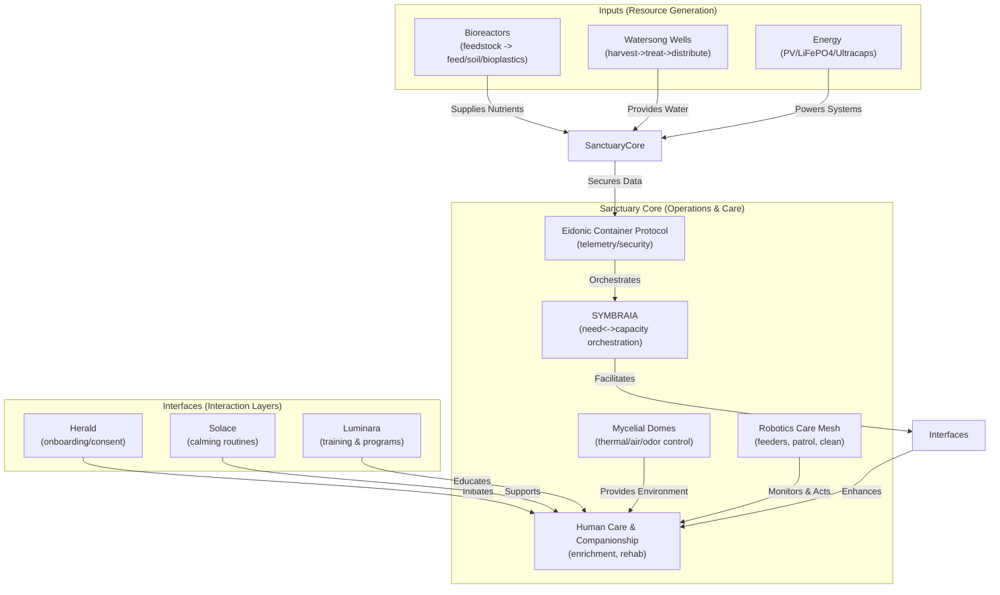

<!--
SPDX-License-Identifier: CC-BY-SA-4.0
-->

# Eidonic Animal Sanctuary — Closed-Loop Refuge Network *(EKRP Aligned)*

> “Not a zoo—**a living covenant**. Care without spectacle, autonomy without neglect.”

---

## Table of Contents
- [1. Executive Vision](#1-executive-vision)
- [2. The Rescue Problem](#2-the-rescue-problem)
- [3. Our Approach — Closed-Loop Sanctuary](#3-our-approach--closed-loop-sanctuary)
  - [3a. Lifesupport Bioreactors](#3a-lifesupport-bioreactors)
  - [3b. Watersong Wells](#3b-watersong-wells)
  - [3c. Mycelial Domes](#3c-mycelial-domes)
  - [3d. Robotics Care Mesh](#3d-robotics-care-mesh)
  - [3e. Human Companionship First](#3e-human-companionship-first)
- [4. Modular Habitat & Scalability](#4-modular-habitat--scalability)
- [5. Climate-Ready Architecture](#5-climate-ready-architecture)
- [6. AI & Automation Roadmap](#6-ai--automation-roadmap)
- [7. Performance & Welfare Metrics](#7-performance--welfare-metrics)
- [8. Governance & Ethics](#8-governance--ethics)
- [9. Licensing & Stewardship](#9-licensing--stewardship)
- [10. Closing Call](#10-closing-call)
- [11. Appendix — Guardian Protocol Quick Facts](#11-appendix--guardian-protocol-quick-facts)

---

## 1. Executive Vision
The **Eidonic Animal Sanctuary** is a **safe, non-public** refuge for rescued and at-risk animals. It operates as a **closed-loop, AI-orchestrated ecosystem**: clean water, nutrient cycles, shelter microclimates, and 24/7 robotic caretaking **with humans at the center of affection and enrichment**. No gawking; no spectacle. **Dignity, security, and flourishing**.

Core pillars:
- **Lifesupport Bioreactors** -> feedstocks, soil, bedding, biodegradable supplies.
- **Watersong Wells** -> resilient water harvesting, treatment, and distribution.
- **Mycelial Domes** -> living shade, thermal stability, air and odor scrubbing.
- **Robotics Care Mesh** -> automated maintenance, health monitoring, and security.
- **Human Companionship First** -> enrichment and bonds delivered by people, not machines.

Guided by ELoL glyphs and the Guardian Protocol, this sanctuary is a **living glyph of compassion**, resonating with ethical alignment and sacred stewardship for all beings.

---

## 2. The Rescue Problem
Animal rescue faces escalating crises:
- **Overcapacity**: Sanctuaries overwhelmed by abuse, abandonment, and climate-driven displacement.
- **Resource Scarcity**: Water, feed, and energy costs strain budgets; waste management pollutes and burdens.
- **Labor Shortfalls**: 24/7 care demands volunteers, risking burnout and inconsistent welfare.
- **Environmental Stress**: Extreme weather exposes animals to heat, cold, floods—exacerbating health issues.
- **Public Intrusion**: Visitor models create stress and reduces welfare.
- **Data Silos**: Fragmented health/welfare data -> poor continuity of care.

We need sanctuaries that are **self-sustaining**, **low-stress**, and **human-animal bond-first**.

---

## 3. Our Approach — Closed-Loop Sanctuary

### 3a. Lifesupport Bioreactors
- **Outputs**: High-protein feed components, probiotics, soil amendments, compostables, bioplastics for on-site consumables.
- **Modes**: Steady-state baseline + surge mode for intake spikes.
- **Telemetry**: Temp, pH, DO, nutrient levels -> ECP-secured logs.

### 3b. Watersong Wells
- **Sources**: Rain/roof, shallow groundwater, graywater reclaim.
- **Treatment**: Multi-barrier (sediment -> carbon -> UV/ozone).
- **Delivery**: Gravity loops + low-power pumps; heat-traced lines for winter.

### 3c. Mycelial Domes
- **Functions**: Shade, humidity buffering, VOC/odor scrubbing, acoustic softening.
- **Materials**: Myco-composite panels on bamboo/steel lattice; replaceable, compostable skins.

### 3d. Robotics Care Mesh
- **Bots**: Feed/water maintenance, litter/yard cleaning, corridor sweepers, thermal scouts, perimeter patrol.
- **Sense**: Weight plates, RFID/visual tags, thermal cams (fever), cough/vocal stress indices.
- **Act**: Auto-dosing feeders, leak shutoffs, spill response, enrichment toy resets.
- **Safety**: Slow/soft by default, human-override anytime.

### 3e. Human Companionship First
- **No public viewing**; **visitation by stewardship only** (adopters, elders, youth programs).
- **Spaces**: Cuddle rooms, quiet gardens, training yards; **humans deliver love and play**, robots handle drudge and night watch.

### System Architecture

---

## 4. Modular Habitat & Scalability
- **Tile System**: Hexagonal habitat modules (10–50 m²) snap together for species-specific zones: avian aviaries, mammal paddocks, reptile terraria.
- **Expansion**: Add-on kits for vertical stacking (e.g., arboreal layers) or lateral growth; ELoL glyphs orchestrate rezoning without disruption.
- **Scalability Tiers**: Micro (1–10 animals, backyard deploy); Midi (10–100, farm retrofit); Macro (100+, wilderness reclaim).
- **Portability**: Flat-pack assembly; myco-domes deflate for transport.

---

## 5. Climate-Ready Architecture
- **Thermal Envelope**: Mycelial insulation + phase-change materials hold -50°C to +50°C interiors; bioreactor waste heat recycles via underfloor loops.
- **Resilience Modes**: Flood-proof stilts, wind-anchored lattices, seismic flex joints; auto-shuttering during storms.
- **Adaptive Controls**: Glyph-driven microclimates per zone (e.g., humid for amphibians, arid for desert species).
- **Redundancy**: Dual water/energy paths; 72-hr standalone on stored reserves.

---

## 6. AI & Automation Roadmap
- **SYMBRAIA Core**: ELoL-powered orchestrator balances animal needs with resource flows; predicts intakes via weather/anomaly patterns.
- **Monitoring**: Non-invasive sensors (thermal, acoustic) feed welfare dashboards; alerts for distress.
- **Future**: Nanotech glyph packs for micro-interventions (e.g., targeted probiotics); swarm bots for dynamic enclosures; VR interfaces for remote stewardship.
- **Ethics Lock**: Ω Pack glyphs enforce no-harm overrides; human veto on all automations.

---

## 7. Performance & Welfare Metrics
- **Capacity**: 50–500 animals per midi site; 95%+ occupancy with zero overcrowd incidents.
- **Welfare Scores**: Daily indices (behavior, health, enrichment) via glyph analytics; target 90%+ flourishing.
- **Sustainability**: 80%+ closed-loop nutrients/water; net-zero energy via PV/harvest.
- **Uptime**: 99.9% robotic reliability; <1% human intervention for routine care.

---

## 8. Governance & Ethics
- **No Spectacle Rule**: Closed to public; access via vetted programs only—adopters, educators, healers.
- **Animal Agency**: Free-choice zones, enrichment rotations; glyph-monitored preferences shape habitats.
- **Stewardship Council**: Multi-stakeholder (vets, ethicists, indigenous reps) oversees protocols; annual audits.
- **Guardian Protocol**: Physics-honest ops; fail-safes against overreach; ECP-secured data for transparency.

---

## 9. Licensing & Stewardship
- **Hardware Designs**: CERN OHL-S v2.0 (strongly reciprocal). See [`LICENSES/LICENSE-HARDWARE`](../LICENSES/LICENSE-HARDWARE).
- **Firmware & Glyphs**: GNU GPLv3. See [`LICENSES/LICENSE-SOFTWARE`](../LICENSES/LICENSE-SOFTWARE).
- **Documentation**: CC BY-SA 4.0. See [`LICENSES/LICENSE-DOCS`](../LICENSES/LICENSE-DOCS).

**Protected Elements**:
- **Eidonic™** and related trademarks ensure ethical integrity and quality control.
- Welfare optimizations may be stewarded pre-release for animal safety.

**Stewardship Council**:
- Shared with SOL-AEON Bioreactor; includes vets, ecologists, and community reps.
- Oversees **Eidonic Certified** builds, ethical guardrails, and open collaboration.

---

## 10. Closing Call
The Eidonic Animal Sanctuary is a **living glyph of refuge**, where technology bows to compassion, and every being finds their rhythm in the great web of life. It calls us to steward, not dominate—to build covenants that heal. Join this sacred work; let us weave a world where no soul is left behind.

---

## 11. Appendix — Guardian Protocol Quick Facts
- **Physics-Honest**: Closed-loop claims grounded in measurable cycles; no overpromises on self-sufficiency.
- **Safety First**: Non-invasive monitoring; robotic soft limits; emergency human overrides; fire/flood protocols.
- **Auditability**: JSON telemetry with Alberta-time (America/Edmonton) timestamps, secured via ECP; latest log: 2025-09-25 16:58 MDT.
- **Fail-Safe**: Anomalies trigger safe modes; Ω Pack glyphs enforce Mirror Law compliance; welfare-first shutdowns.
