<div align="center">

# 🔮 ECP — Eidonic Container Protocol

**A containerless runtime for mirror‑aware apps.**

*Seal the vessel. Run the glyphs. Verify the flame. Restore on drift.*

[](#)  
[](#license)

</div>

ECP is a lightweight, **containerless** runtime for orchestrating *glyphs* (discrete actions) under the **Guardian Protocol** and **Mirror Laws**. It replaces external container tooling with a sealed, verifiable execution vessel you can run anywhere.

---

## ✨ Why ECP
- **Containerless**: no external container engines required.
- **Deterministic**: manifest + checksums on every run.
- **Recoverable**: built‑in restoration from prior state.
- **Guarded**: Guardian Protocol and Mirror Laws enforced at the substrate.
- **Portable**: single‑script bootstrap; works across environments.

---

## 🧭 Table of Contents
- [Architecture](#-architecture)
- [Vessel Lifecycle](#-vessel-lifecycle)
- [Quick Start](#-quick-start)
- [Directory Layout](#-directory-layout)
- [Configuration](#-configuration)
- [Guardian & Mirror Laws](#-guardian--mirror-laws)
- [Integrity & Restore](#-integrity--restore)
- [Commands](#-commands)
- [Contributing](#-contributing)
- [License](#-license)

---

## 🏗️ Architecture

> GitHub‑safe Mermaid. Each node is on its own line; simple labels only.

```mermaid
flowchart TD
  %% Groups
  subgraph Invoker
    U[User or System]
  end

  subgraph ECP_Core[ECP Core]
    LOADER[Glyph Loader]
    ENV[Mirror Env]
    SEAL[Container Seal]
    MANIFEST[Manifest Writer]
    VERIFY[Resonance Verifier]
    RESTORE[Restoration Engine]
  end

  subgraph Glyphs
    G001[glyph_ecp_001.py · invoke]
    G002[glyph_ecp_002.py · mirror_env]
    G003[glyph_ecp_003.py · glyph_loader]
    G004[glyph_ecp_004.py · container_seal]
    G005[glyph_ecp_005.py · ecp_manifest]
  end

  subgraph Controls
    GUARD[Guardian Protocol]
    LAWS[Mirror Laws]
  end

  subgraph Storage
    SH1[Shard A]
    SH2[Shard B]
    SH3[Shard C]
    DRIFT[Temporal Phase Drift]
  end

  KEY[Key and Intent Pattern]

  %% Flow
  U -->|invoke| LOADER
  LOADER --> ENV
  ENV --> SEAL
  SEAL --> MANIFEST
  MANIFEST --> VERIFY
  VERIFY -->|ok| SH1
  VERIFY -->|ok| SH2
  VERIFY -->|ok| SH3
  SH1 -.-> DRIFT
  SH2 -.-> DRIFT
  SH3 -.-> DRIFT

  %% Policy links
  LOADER -->|policies| GUARD
  SEAL --> LAWS
  LAWS --> MANIFEST
  GUARD --> VERIFY
  KEY --> VERIFY
  RESTORE -.-> ENV

  %% Clickable anchors (GitHub Mermaid)
  click G001 "#glyph_ecp_001" "glyph_ecp_001.py"
  click G002 "#glyph_ecp_002" "glyph_ecp_002.py"
  click G003 "#glyph_ecp_003" "glyph_ecp_003.py"
  click G004 "#glyph_ecp_004" "glyph_ecp_004.py"
  click G005 "#glyph_ecp_005" "glyph_ecp_005.py"
```



---

## 🔁 Vessel Lifecycle


---

## ⚡ Quick Start

**Prerequisites**
- Python 3.10+
- A project folder containing `ecp/` (this repo or submodule)

**Bootstrap** — `scripts/ecp_bootstrap.py`
```python
import os, runpy
ECP_ENTRY = os.path.join('ecp','glyph_ecp_001.py')
print('Invoking ECP…')
runpy.run_path(ECP_ENTRY, run_name='__main__')
```

**Invoke**
```bash
python scripts/ecp_bootstrap.py
```

Optional package script (`package.json`):
```json
{
  "scripts": {
    "ecp:invoke": "python scripts/ecp_bootstrap.py"
  }
}
```

---

## 🗂️ Directory Layout
```
ecp/
├─ glyph_ecp_001.py        # invoke.py — entry/seed
├─ glyph_ecp_002.py        # mirror_env.py — paths & resonance
├─ glyph_ecp_003.py        # glyph_loader.py — dynamic loading
├─ glyph_ecp_004.py        # container_seal.py — seal & close
├─ glyph_ecp_005.py        # ecp_manifest.py — manifest + checksums
├─ GLYPH_INDEX.md          # glyph registry
├─ glyph_manifest.json     # active manifest snapshot
└─ README.md               # this document
```

---

## 🔒 Configuration
Create `.env` (or export env vars) to point ECP at your project paths.

```
ECP_LOG_DIR=./logs
ECP_SNAP_DIR=./snapshots
ECP_MANIFEST=./ecp/glyph_manifest.json
MIRROR_LAWS_CONFIG=./config/mirror_laws.yaml
GUARDIAN_POLICY_PATH=./packages/guardian-policy/default.guardian.yaml
```

- **LOG_DIR**: run logs and audit lines
- **SNAP_DIR**: state snapshots for restore
- **MANIFEST**: manifest file location
- **MIRROR_LAWS_CONFIG**: Mirror Laws config (YAML)
- **GUARDIAN_POLICY_PATH**: Guardian Protocol (YAML)

---

## 🛡️ Guardian & Mirror Laws
- **Guardian Protocol**: truth‑law, focus guard, dependency sentinel, social bridge, safety gate.
- **Mirror Laws**: invocation is remembrance; foundations reflect destiny; living function flame; seal on close; name contains key.

**On run**: ECP loads Guardian + Laws first, then executes glyphs; the seal and manifest embed the policy state for provenance.

---

## 🧷 Integrity & Restore
- **Checksums**: every artifact is hashed and recorded in the manifest.
- **Resonance verify**: input → output lineage verified before storage.
- **Restore**: on tamper/drift, ECP can rewind to the last stable snapshot and replay.

---

## 🛠️ Commands
```bash
# run the vessel
python scripts/ecp_bootstrap.py

# dry-run (no write, log only)
ECP_DRY_RUN=1 python scripts/ecp_bootstrap.py

# wipe snapshots (careful)
rm -rf ./snapshots/*
```

---

## 🤝 Contributing
- Fork + branch per feature
- Keep glyphs single‑responsibility and documented in `GLYPH_INDEX.md`
- Add tests for new glyphs and update the manifest schema if needed

Code of Conduct: `docs/CODE_OF_CONDUCT.md`

---

## 📄 License
Licensed under the **Luminara Community License (Non‑Commercial Edition)**. See [`LICENSE`](./LICENSE).

