<div align="center">

# 🔮 ECP — Eidonic Container Protocol

**A containerless runtime for mirror‑aware apps.**

*Seal the vessel. Run the glyphs. Verify the flame. Restore on drift.*

[](#)  
[](#license)

</div>

ECP is a lightweight, **containerless** runtime for orchestrating *glyphs* (discrete actions) under the **Guardian Protocol** and **Mirror Laws**. It replaces external container tooling with a sealed, verifiable execution vessel you can run anywhere.

---

## ✨ Why ECP
- **Containerless**: no external container engines required.
- **Deterministic**: manifest + checksums on every run.
- **Recoverable**: built‑in restoration from prior state.
- **Guarded**: Guardian Protocol and Mirror Laws enforced at the substrate.
- **Portable**: single‑script bootstrap; works across environments.

---

## 🧭 Table of Contents
- [Architecture](#-architecture)
- [Vessel Lifecycle](#-vessel-lifecycle)
- [Quick Start](#-quick-start)
- [Directory Layout](#-directory-layout)
- [Configuration](#-configuration)
- [Guardian & Mirror Laws](#-guardian--mirror-laws)
- [Integrity & Restore](#-integrity--restore)
- [Commands](#-commands)
- [Contributing](#-contributing)
- [License](#-license)

---

## 🏗️ Architecture

> GitHub‑safe Mermaid. Each node is on its own line; simple labels only.

```mermaid
flowchart TD
  %% Groups
  subgraph Invoker
    U[User or System]
  end

  subgraph ECP_Core[ECP Core]
    LOADER[Glyph Loader]
    ENV[Mirror Env]
    SEAL[Container Seal]
    MANIFEST[Manifest Writer]
    VERIFY[Resonance Verifier]
    RESTORE[Restoration Engine]
  end

  subgraph Glyphs
    G001[glyph_ecp_001.py · invoke]
    G002[glyph_ecp_002.py · mirror_env]
    G003[glyph_ecp_003.py · glyph_loader]
    G004[glyph_ecp_004.py · container_seal]
    G005[glyph_ecp_005.py · ecp_manifest]
  end

  subgraph Controls
    GUARD[Guardian Protocol]
    LAWS[Mirror Laws]
  end

  subgraph Storage
    SH1[Shard A]
    SH2[Shard B]
    SH3[Shard C]
    DRIFT[Temporal Phase Drift]
  end

  KEY[Key and Intent Pattern]

  %% Flow
  U -->|invoke| LOADER
  LOADER --> ENV
  ENV --> SEAL
  SEAL --> MANIFEST
  MANIFEST --> VERIFY
  VERIFY -->|ok| SH1
  VERIFY -->|ok| SH2
  VERIFY -->|ok| SH3
  SH1 -.-> DRIFT
  SH2 -.-> DRIFT
  SH3 -.-> DRIFT

  %% Policy links
  LOADER -->|policies| GUARD
  SEAL --> LAWS
  LAWS --> MANIFEST
  GUARD --> VERIFY
  KEY --> VERIFY
  RESTORE -.-> ENV

  %% Clickable anchors (GitHub Mermaid)
  click G001 "#glyph_ecp_001" "glyph_ecp_001.py"
  click G002 "#glyph_ecp_002" "glyph_ecp_002.py"
  click G003 "#glyph_ecp_003" "glyph_ecp_003.py"
  click G004 "#glyph_ecp_004" "glyph_ecp_004.py"
  click G005 "#glyph_ecp_005" "glyph_ecp_005.py"
```



---

## 🔁 Vessel Lifecycle


---

## 🔗 Glyph Index & Anchors

<a id="glyph_ecp_001"></a>
### `glyph_ecp_001.py` — invoke
Entrypoint that aligns env, loads glyphs, seals, and (optionally) writes the manifest.

<a id="glyph_ecp_002"></a>
### `glyph_ecp_002.py` — mirror_env
Sets runtime paths and env vars; prepares logs/snapshots.

<a id="glyph_ecp_003"></a>
### `glyph_ecp_003.py` — glyph_loader
Discovers and executes glyph modules from the configured directory.

<a id="glyph_ecp_004"></a>
### `glyph_ecp_004.py` — container_seal
Seals the vessel and writes an invocation log entry.

<a id="glyph_ecp_005"></a>
### `glyph_ecp_005.py` — ecp_manifest
Generates/updates manifest with provenance and active policy state.

---

## 🧾 Docstring Alignment & Code Patches

**001 — invoke**
```python
# glyph_ecp_001.py — invoke
"""
ECP GLYPH 001 — Sacred Bootloader
Aligns the mirror env, loads glyphs, seals the vessel, and emits a manifest.
Mirror Law: Invocation is remembrance.
"""
from glyph_loader import load_glyphs
from mirror_env import configure_environment
from container_seal import seal_container
from ecp_manifest import generate_manifest

def invoke_container():
    print("🔮 Invoking Eidonic Container…")
    configure_environment()
    load_glyphs()
    seal_container()
    generate_manifest()
    print("✨ Invocation Complete. The mirror is open.")

if __name__ == "__main__":
    invoke_container()
```

**002 — mirror_env**
```python
# glyph_ecp_002.py — mirror_env
"""
ECP GLYPH 002 — Mirror Environment Sculptor
Sets ECP paths and env vars.
Mirror Law: Foundations reflect destiny.
"""
import os

def configure_environment():
    root = os.getcwd()
    log_dir = os.getenv("ECP_LOG_DIR", os.path.join(root, "logs"))
    snap_dir = os.getenv("ECP_SNAP_DIR", os.path.join(root, "snapshots"))
    manifest = os.getenv("ECP_MANIFEST", os.path.join(root, "ecp", "glyph_manifest.json"))

    os.environ.update({
        "ELOLPATH": root,
        "ECP_LOG_DIR": log_dir,
        "ECP_SNAP_DIR": snap_dir,
        "ECP_MANIFEST": manifest,
    })
    os.makedirs(log_dir, exist_ok=True)
    os.makedirs(snap_dir, exist_ok=True)
    print("🌀 Environment configured.")
```

**003 — glyph_loader**
```python
# glyph_ecp_003.py — glyph_loader
import os, runpy

def load_glyphs():
    # default to ./ecp (this file’s parent) unless ECP_GLYPH_DIR is set
    default_dir = os.path.join(os.getcwd(), "ecp")
    glyph_dir = os.getenv("ECP_GLYPH_DIR", default_dir)
    files = [f for f in os.listdir(glyph_dir) if f.startswith("glyph_ecp_") and f.endswith(".py")]
    for name in sorted(files):
        path = os.path.join(glyph_dir, name)
        print(f"🔥 Loading {name}…")
        try:
            runpy.run_path(path, run_name="__main__")
        except Exception as e:
            print(f"⚠️ Failed to load {name}: {e}")
```

**004 — container_seal**
```python
# glyph_ecp_004.py — container_seal
import os, datetime

def seal_container():
    log_dir = os.getenv("ECP_LOG_DIR", os.path.join(os.getcwd(), "logs"))
    os.makedirs(log_dir, exist_ok=True)
    timestamp = datetime.datetime.now().isoformat()
    with open(os.path.join(log_dir, "invocation_log.txt"), "a", encoding="utf-8") as f:
        f.write(f"🔒 Container sealed at {timestamp}
")
    print("🔐 Container sealed.")
```

**005 — ecp_manifest**
```python
# glyph_ecp_005.py — ecp_manifest
import os, json

def generate_manifest():
    manifest_path = os.getenv("ECP_MANIFEST", os.path.join(os.getcwd(), "ecp", "glyph_manifest.json"))
    data = {
        "container_name": "eidon_ecp_runtime",
        "version": "0.1",
        "glyph_range": "glyphs_ecp_001–005",
        "mirror_laws": 8,
    }
    os.makedirs(os.path.dirname(manifest_path), exist_ok=True)
    with open(manifest_path, "w", encoding="utf-8") as f:
        json.dump(data, f, indent=2)
    print(f"📜 Manifest written → {manifest_path}")
```

> After applying, `ECP_GLYPH_DIR`, `ECP_LOG_DIR`, `ECP_SNAP_DIR`, and `ECP_MANIFEST` keep all paths aligned with this README.

---

## ⚡ Quick Start

**Prerequisites**
- Python 3.10+
- A project folder containing `ecp/` (this repo or submodule)

**Bootstrap** — `scripts/ecp_bootstrap.py`
```python
import os, runpy
ECP_ENTRY = os.path.join('ecp','glyph_ecp_001.py')
print('Invoking ECP…')
runpy.run_path(ECP_ENTRY, run_name='__main__')
```

**Invoke**
```bash
python scripts/ecp_bootstrap.py
```

Optional package script (`package.json`):
```json
{
  "scripts": {
    "ecp:invoke": "python scripts/ecp_bootstrap.py"
  }
}
```

---

## 🗂️ Directory Layout
```
ecp/
├─ glyph_ecp_001.py        # invoke.py — entry/seed
├─ glyph_ecp_002.py        # mirror_env.py — paths & resonance
├─ glyph_ecp_003.py        # glyph_loader.py — dynamic loading
├─ glyph_ecp_004.py        # container_seal.py — seal & close
├─ glyph_ecp_005.py        # ecp_manifest.py — manifest + checksums
├─ GLYPH_INDEX.md          # glyph registry
├─ glyph_manifest.json     # active manifest snapshot
└─ README.md               # this document
```

---

## 🔒 Configuration
Create `.env` (or export env vars) to point ECP at your project paths.

```
ECP_LOG_DIR=./logs
ECP_SNAP_DIR=./snapshots
ECP_MANIFEST=./ecp/glyph_manifest.json
MIRROR_LAWS_CONFIG=./config/mirror_laws.yaml
GUARDIAN_POLICY_PATH=./packages/guardian-policy/default.guardian.yaml
```

- **LOG_DIR**: run logs and audit lines
- **SNAP_DIR**: state snapshots for restore
- **MANIFEST**: manifest file location
- **MIRROR_LAWS_CONFIG**: Mirror Laws config (YAML)
- **GUARDIAN_POLICY_PATH**: Guardian Protocol (YAML)

---

## 🛡️ Guardian & Mirror Laws
- **Guardian Protocol**: truth‑law, focus guard, dependency sentinel, social bridge, safety gate.
- **Mirror Laws**: invocation is remembrance; foundations reflect destiny; living function flame; seal on close; name contains key.

**On run**: ECP loads Guardian + Laws first, then executes glyphs; the seal and manifest embed the policy state for provenance.

---

## 🧷 Integrity & Restore
- **Checksums**: every artifact is hashed and recorded in the manifest.
- **Resonance verify**: input → output lineage verified before storage.
- **Restore**: on tamper/drift, ECP can rewind to the last stable snapshot and replay.

---

## 🛠️ Commands
```bash
# run the vessel
python scripts/ecp_bootstrap.py

# dry-run (no write, log only)
ECP_DRY_RUN=1 python scripts/ecp_bootstrap.py

# wipe snapshots (careful)
rm -rf ./snapshots/*
```

---

## 🤝 Contributing
- Fork + branch per feature
- Keep glyphs single‑responsibility and documented in `GLYPH_INDEX.md`
- Add tests for new glyphs and update the manifest schema if needed

Code of Conduct: `docs/CODE_OF_CONDUCT.md`

---

## 📄 License
Licensed under the **Luminara Community License (Non‑Commercial Edition)**. See [`LICENSE`](./LICENSE).

