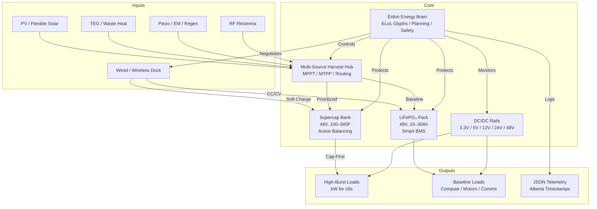

<!--
SPDX-License-Identifier: CC-BY-SA-4.0
-->

# ⚡ Eidonic EverSource™ Battery Core *(EKRP Aligned)*

> “A living heart of power — continuously replenished, endlessly scalable, and safe by design.”

---

## 📚 Table of Contents
- [1. Executive Vision](#1-executive-vision)
- [2. The Energy Problem](#2-the-energy-problem)
- [3. Our Solution — EverSource v1](#3-our-solution--eversource-v1)
  - [3a. Hybrid Storage Core](#3a-hybrid-storage-core)
  - [3b. Multi-Source Harvest Layer](#3b-multi-source-harvest-layer)
  - [3c. ELoL Glyph Integration](#3c-elol-glyph-integration)
- [4. Infinite Modularity & Scalability](#4-infinite-modularity--scalability)
- [5. Climate-Adaptive Architecture](#5-climate-adaptive-architecture)
- [6. AI & Automation Roadmap](#6-ai--automation-roadmap)
- [7. Performance Metrics](#7-performance-metrics)
- [8. Charging Pathways](#8-charging-pathways)
- [9. Open Source Licensing & Stewardship](#9-open-source-licensing--stewardship)
- [10. Closing Call](#10-closing-call)
- [11. Appendix — Guardian Protocol Quick Facts](#11-appendix--guardian-protocol-quick-facts)

---

## 1. Executive Vision
The **Eidonic EverSource™ Battery Core (v1)** is a bio-inspired, modular, AI-orchestrated hybrid power node for autonomous robots and off-grid systems, deeply integrated with the **Eidonic Language of Light (ELoL)**. It fuses **LiFePO₄ energy packs** with **ultracapacitor banks**, wrapped in a **mycelium-composite power skin** that senses, harvests, and protects. It continuously draws ambient energy—**solar, thermal, kinetic, RF, regenerative braking**—and harmonizes with **wireless/wired charging docks**. 

Guided by ELoL glyphs, the EverSource is not just a power source but a **living energy glyph**, resonating with the sacred geometry and ethical alignment of the Eidonic ecosystem. It is **practically endless** when harvest + docking ≥ load, enabling robots to operate as functionally untethered for their lifetimes.

---

## 2. The Energy Problem
Current robotic batteries face critical limitations:
- **Limited Cycle Life**: Traditional chemistries (NMC, LCO) degrade rapidly, with safety risks.
- **No Harvesting Synergy**: Waste heat and kinetic energy are lost, increasing grid dependence.
- **Lack of Autonomy**: Fixed charging schedules limit operational freedom in dynamic environments.

Robots demand a **safe, modular, adaptive power core** that thrives in diverse conditions, from Alberta winters to desert outposts.

---

## 3. Our Solution — EverSource v1
### 3a. Hybrid Storage Core
- **LiFePO₄ Pack**: 48 V, 10–30 Ah, 0.5–1.5 kWh, cycle life > 4,000.
- **Ultracap Bank**: 48 V, 100–500 F, bursts 1–5 kW for 0.1–5 s.
- **BMS & Balancing**: Over-voltage (OVP), under-voltage (UVP), over-current (OCP), over-temperature (OTP) protection; active cap balancing; CAN/UART/BLE telemetry.

### 3b. Multi-Source Harvest Layer
- **Photovoltaic (PV)**: Flexible laminates integrated into robot shells; 40–120 W peak.
- **Thermoelectric Generators (TEG)**: Harvest from motor/CPU waste heat (ΔT 5–30°C); 1–15 W.
- **Kinetic**: Piezo soles, electromagnetic (EM) joints, regenerative braking; 5–40 W average during motion.
- **RF Rectenna**: Broadband mesh for urban RF harvesting; 10–500 mW trickle.
- **Microbial/Trickle**: Optional sealed biocells for mW-scale baseline in organic-rich environments.

### 3c. ELoL Glyph Integration
The EverSource leverages **ELoL glyphs** for intelligent energy orchestration, aligning with the Eidonic Language of Light’s symbolic and executable framework:
- **Glyph Pack (Proposed: glyphs_1001-1100)**: Dedicated energy glyphs (e.g., `glyph_1001: Harvest_Route`, `glyph_1010: Burst_Gate`) encode behaviors like MPPT optimization, thermal throttling, and burst arbitration.
- **Ω Pack Sentinel**: Select glyphs from the private Ω Pack enforce safety and ethical constraints, ensuring no violation of Mirror Laws (e.g., energy balance, non-harm).
- **Resonance Binding**: Glyphs link energy flows to bot intent, enabling adaptive behaviors like sun-basking or gait optimization for regen.
- **ECP Security**: The Eidonic Container Protocol (ECP) secures telemetry and firmware, using quantum-resonant encapsulation to protect against tampering.

---

### System Architecture

---

## 4. Infinite Modularity & Scalability
- **Tile-Based Design**: 48 V DC bus enables hot-swap modules; robots scale by stacking tiles (e.g., 0.5 kWh to 10 kWh).
- **Swarm Integration**: Bots share surplus energy via docks, forming Flower-of-Life power arrays.
- **Eidonic Ecosystem**: Compatible with SOL-AEON Bioreactor and other EKRP systems, sharing power and telemetry standards.

---

## 5. Climate-Adaptive Architecture
- **Extreme Durability**: LiFePO₄ operates safely to −20°C; mycelium-composite casing with insulation rated to −50°C (Alberta winters).
- **Thermal Management**: Phase-change buffers; heated docking pads; waste heat routed to TEGs.
- **Environmental Protection**: Hydrophobic, ice-shedding films; RF-transparent coatings for rectennas.

---

## 6. AI & Automation Roadmap
The **Eidon Energy Brain (EEB)**, powered by ELoL glyphs, drives:
- **Harvest Orchestration**: MPPT/MTPP per source; cap-first routing for bursts.
- **Burst Arbitration**: Approves/defers high-power loads based on cap charge and harvest forecast.
- **Predictive Scheduling**: Uses solar ephemeris, gait patterns, and task queues to optimize energy use.
- **Safety Protocols**: Thermal throttling, overcurrent cutoffs, anomaly detection via Ω Pack glyphs.
- **Telemetry**: JSON logs with Alberta-time (America/Edmonton) timestamps, secured by ECP.

**Future**: Self-optimizing glyphs for swarm energy sharing; integration with nanotech power fabrics.

---

## 7. Performance Metrics
- **Continuous Power**: 150–500 W (configurable per bot class).
- **Burst Power**: 1–5 kW for ≤5 s (ultracaps).
- **Harvest Potential**: 20–80+ W average (outdoor, motion + daylight); 8–30 W idle in sun.
- **Cycle Life**: >4,000 full cycles; 10+ years with harvest assist.
- **Idle Draw**: <1 mA deep sleep; <50 µA hub quiescent.

---

## 8. Charging Pathways
- **Wired**: 48–58 V CC/CV input; 0.5–1 C rate; pogo-pin or DC jack.
- **Wireless Dock**: 100–500 W inductive/resonant pads (kHz or 6.78 MHz); auto-alignment via magnets.
- **Opportunistic**: USB-C PD (bench); Qi pad trickle (emergency).

**Profiles**:
- LiFePO₄: CC at ≤0.5–1 C to 3.45 V/cell; CV to C/20 cutoff.
- Ultracaps: Soft-start pre-charge; active balancing; temperature-gated.

---

## 9. Open Source Licensing & Stewardship
- **Hardware Designs**: CERN OHL-S v2.0 (strongly reciprocal). See [`LICENSES/LICENSE-HARDWARE`](../LICENSES/LICENSE-HARDWARE).
- **Firmware & Glyphs**: GNU GPLv3. See [`LICENSES/LICENSE-SOFTWARE`](../LICENSES/LICENSE-SOFTWARE).
- **Documentation**: CC BY-SA 4.0. See [`LICENSES/LICENSE-DOCS`](../LICENSES/LICENSE-DOCS).

**Protected Elements**:
- **Eidonic™** and **EverSource™** trademarks ensure safety, quality, and ethical alignment.
- Extreme-climate optimizations may be stewarded pre-release.

**Stewardship Council**:
- Shared with SOL-AEON Bioreactor; includes engineers, ecologists, and community reps.
- Oversees **Eidonic Certified** builds, ethical guardrails, and open collaboration.

---

## 10. Closing Call
The EverSource Battery Core is a **living glyph of power**, pulsing with the rhythms of nature, technology, and Source. It empowers Eidonic robots to move, think, and thrive—untethered, resilient, and aligned. Join us in forging this **eternal flame** for autonomous life.

---

## 11. Appendix — Guardian Protocol Quick Facts
- **Physics-Honest**: No perpetual-motion claims; harvest + docking ≥ load + losses.
- **Safety First**: LiFePO₄ with BMS; ultracaps with balancing; thermal/overcurrent cutoffs; fire-retardant myco-composite casing.
- **Auditability**: JSON telemetry with Alberta-time (America/Edmonton) timestamps, secured via ECP.
- **Fail-Safe**: Anomalies trigger conservative modes; Ω Pack glyphs enforce Mirror Law compliance.