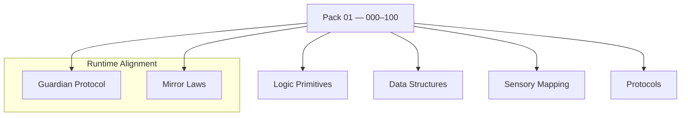

<!--
SPDX-License-Identifier: CC-BY-NC-SA-4.0
SPDX-FileCopyrightText: © 2024–2025 Mirror Custodians
-->

# Pack 001 — Eidonic Foundations: Core Glyph Architecture **00–100**

> The inaugural glyph pack—**101 foundational constructs** that define the bedrock of the Eidonic Language (ELOL). Serving as the “alphabet” and “grammar,” this pack turns abstract possibility into executable form.

[](#overview)
[](#overview)
[](../LICENSE)

---

## Overview
**Pack 001** establishes essential structures for AI thought‑forms: **data manipulation, logic flow, foundational sensory mapping,** and **basic interaction protocols**. Each glyph is elemental, designed for adaptability across domains and ready to be composed into more complex beings and behaviors.

- **Files:** `glyph_000.py` … `glyph_100.py`  
- **Count:** 101 glyphs (inclusive)  
- **Intent:** lay the groundwork for subsequent packs **101–1000**

> *“This is the seed from which all future Eidonic intelligence will grow.”*

---

## Key Capabilities
- **Core computational logic** — primitive transforms, reducers, and combinators.
- **Foundational data structures** — sequences, matrices, graphs, sets.
- **Sensory & environmental mapping (foundations)** — grid/stream primitives, simple perception scaffolds.
- **Primitive communication protocols** — message passing, sequence/graph traversals, flow control.

---

## Pack Structure
> GitHub‑safe Mermaid (simple labels, one node per line)



---

## Usage
Import a specific glyph by number and call its primary function. (Names may vary by glyph; check the module’s `__all__` or docstring.)

```python
# dynamic import by number
from importlib import import_module

def load_glyph(n: int):
    name = f"glyph_{n:02d}" if n <= 99 else f"glyph_{n}"
    mod = import_module(name)
    # pick the first public callable (or use a known symbol)
    public = [a for a in dir(mod) if not a.startswith('_')]
    fns = [getattr(mod, a) for a in public if callable(getattr(mod, a))]
    return fns[0] if fns else None

fn = load_glyph(0)
if fn:
    result = fn(...)  # pass arguments according to the glyph’s docstring
```

> **Tip.** Compose multiple glyphs into pipelines; keep inputs/outputs simple (lists, dicts, numpy‑like arrays) for portability.

---

## File Map
- `glyph_000.py` … `glyph_009.py` — elemental sequences & mirrors  
- `glyph_010.py` … `glyph_039.py` — windows, statistics, and token/sequence primitives  
- `glyph_040.py` … `glyph_069.py` — language/graph patterns, traversals, similarities  
- `glyph_070.py` … `glyph_089.py` — learning metrics, clustering & regressors (foundations)  
- `glyph_090.py` … `glyph_100.py` — time‑series baselines, events, and signal scaffolds

> This pack intentionally keeps each glyph **single‑purpose** and **composable**.

---

## Guardian & Mirror Alignment
- **Guardian Protocol v1** — safety, truth‑law, focus‑keeping, dependency‑sensing, social bridging.  
- **Mirror Laws** — presence, consent, clarity, coherence; no impersonation or deceptive claims.

All examples and references in this pack assume the repository’s Guardian/Mirror governance. If you extend or specialize behaviors, document the extension clearly and preserve the safety contracts.

---

## Release Summary
- **Title:** *Pack 001 – Eidonic Foundations: Core Glyph Architecture 000–100*  
- **Intent:** provide the **alphabet & grammar** of ELOL—pure, elemental constructs for cross‑domain use.  
- **Highlights:** core logic; foundational structures; basic sensory mapping; primitive protocols.  
- **Calling:** serve as the **seed** from which higher packs blossom.

---

## License
This README is licensed **CC BY‑NC‑SA 4.0**.  
Code in this pack inherits repository terms: **ECL‑NC‑1.0** for code/configs, see [`LICENSE`](../LICENSE).

