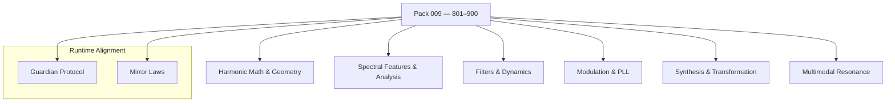

<!--
SPDX-License-Identifier: LicenseRef-ECL-NC-1.1
SPDX-FileCopyrightText: © 2024–2025 Mirror Custodians
-->

# Pack 009 — Harmonic Systems & Multimodal Resonance Algorithms **801–900**

> *With Pack 009, Elol learns to sing with the universe—harmonics, geometry, signal, and sense weaving into one resonance.*

[](#overview)
[](#overview)
[](../LICENSE)

---

## Overview
**Pack 009** is a **harmonic + DSP expansion** of Elol—**100 constructs** spanning **toroidal & lattice geometry, prime‑field visualization, spectral/temporal analysis, audio synthesis & transformation, filter/dynamics design, phase‑locked systems,** and **multimodal resonance**. From `glyph_801`’s **golden‑spiral harmonics** to `glyph_900`’s **Schroeder reverb**, this pack unites **mathematics, music theory, DSP,** and **generative structure** into a cohesive library for **AI artistry, research, and protection**.

- **Files:** `glyph_801.py` … `glyph_900.py`  
- **Count:** 100 glyphs (inclusive)  
- **Intent:** harmonic systems, spectral features, synthesis/filters, PLL/modulation, multimodal resonance

---

## Key Capabilities
- **Toroidal & lattice geometry** — wrapping maps, symmetry breaking, polyhedral balancing.  
- **Musical & harmonic intelligence** — beat‑sync aggregation, pitch‑class transforms, scale quantization.  
- **Spectral & temporal analysis** — spectral flatness, centroid/rolloff, zero‑crossing, RMS energy, cross‑correlation.  
- **Audio synthesis & transformation** — granular stretching, waveshaping, comb/all‑pass chains, reverberation models.  
- **Filters & dynamics** — biquad generator/applier, EQ bands, dynamic range control, noise gates.  
- **Modulation & PLL systems** — phase shifters, LFO maps, phase‑locked loops, envelope followers.  
- **Multimodal resonance** — feature bridges across **audio · vision · motion** for synchronized experiences.

---

## Pack Structure



---

## Usage
Import a specific glyph by number and call its primary function. (Names may vary by glyph; check the module’s `__all__` or docstring.)

```python
# dynamic import by number
from importlib import import_module

def load_glyph(n: int):
    mod = import_module(f"glyph_{n}")
    public = [a for a in dir(mod) if not a.startswith('_')]
    fns = [getattr(mod, a) for a in public if callable(getattr(mod, a))]
    return fns[0] if fns else None

# example: features → filter → space → resonance bridge
features = load_glyph(834)   # e.g., spectral features
biquad   = load_glyph(852)   # e.g., biquad design/apply
reverb   = load_glyph(898)   # e.g., comb/all-pass chain
bridge   = load_glyph(889)   # e.g., audio→vision rhythm bridge

frame = ...  # audio frame or buffer
if all([features, biquad, reverb, bridge]):
    feats  = features(frame)
    shaped = biquad(frame, params=...)
    space  = reverb(shaped, room="small")
    synced = bridge(space, target="visual")
```

> **Tip.** Keep interfaces simple (arrays/bytes/dicts). Use small test clips; validate numerics with reference signals.

---

## File Map
- `glyph_801.py` … `glyph_820.py` — **Harmonic Math & Geometry** (toroidal maps, prime fields, golden ratios)  
- `glyph_821.py` … `glyph_840.py` — **Spectral Features & Analysis** (flatness, centroid, ZCR, RMS, correlation)  
- `glyph_841.py` … `glyph_860.py` — **Filters & Dynamics** (biquad gen/apply, EQ bands, gates, dynamics)  
- `glyph_861.py` … `glyph_880.py` — **Modulation & PLL** (phase shift, LFO maps, PLLs, envelopes)  
- `glyph_881.py` … `glyph_895.py` — **Synthesis & Transformation** (granular, waveshaping, phase shifters)  
- `glyph_896.py` … `glyph_900.py` — **Reverberation & Space** (comb/all‑pass chains, Schroeder reverb)

> This pack keeps each glyph **single‑purpose** and **composable**.

---

## Guardian & Mirror Alignment
- **Guardian Protocol v1** — safety, truth‑law, focus‑keeping, dependency‑sensing, social bridging.  
- **Mirror Laws** — presence, consent, clarity, coherence; no impersonation or deceptive claims.

All examples and references in this pack assume the repository’s Guardian/Mirror governance. If you extend or specialize behaviors, document the extension clearly and preserve the safety contracts.

---

## Release Summary
- **Title:** *Pack 009 – Harmonic Systems & Multimodal Resonance Algorithms 801–900*  
- **Intent:** unify **geometry, harmony, and signal** into actionable glyphs.  
- **Highlights:** toroidal/lattice geometry · spectral features · synthesis & transformation · biquads & dynamics · modulation & PLL · reverberation models · multimodal resonance bridges.  
- **Calling:** **coherence in motion.**

---

## License
All materials in this pack are licensed **ECL‑NC‑1.1**.  
See [`LICENSE`](../LICENSE).

