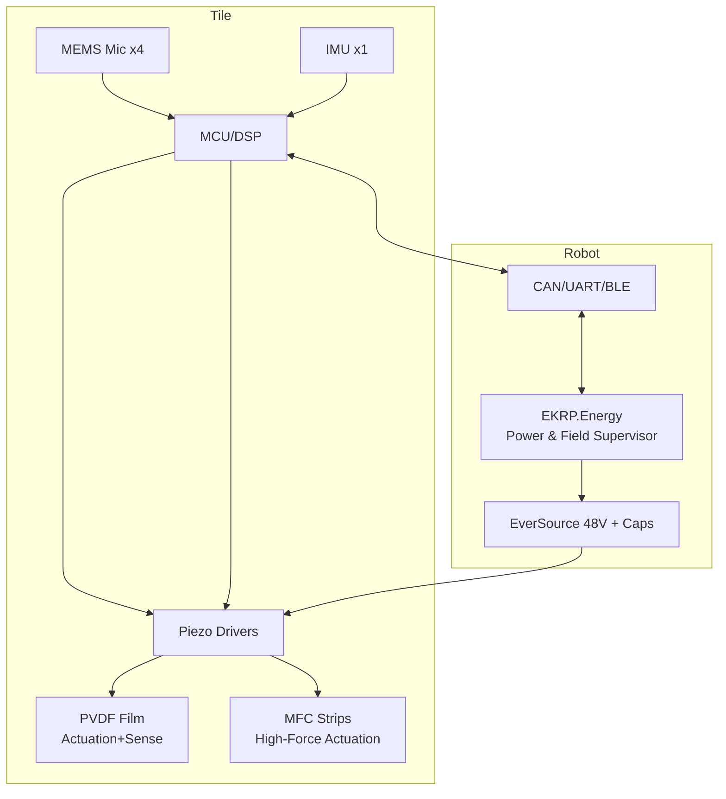

<!--
SPDX-License-Identifier: CC-BY-SA-4.0
-->

# 🎛️ Eidonic Resonance Skin — **P1 Acoustic Patch** (ERS‑A/10x10)

> Band‑limited acoustic cloaking + active damping tile for robots & instruments. Orchestrated by **EKRP.Energy** and powered by **EverSource**.

<p align="center">
<a href="#1-overview"></a>
<a href="#7-electrical-specs"></a>
<a href="#12-guardian-protocol"></a>
<a href="#14-open-source-licensing--stewardship"></a>
<a href="#14-open-source-licensing--stewardship"></a>
<a href="#14-open-source-licensing--stewardship"></a>
</p>

---

## 📚 Table of Contents
- [1. Overview](#1-overview)
- [2. Use Cases](#2-use-cases)
- [3. Goals](#3-goals)
- [4. What This Tile Does](#4-what-this-tile-does)
- [5. System Diagram](#5-system-diagram)
- [6. Mechanical Stack](#6-mechanical-stack)
- [7. Electrical Specs](#7-electrical-specs)
- [7a. Hardware Checklist](#7a-hardware-checklist)
- [8. Bill of Materials (indicative)](#8-bill-of-materials-indicative)
- [9. Control Architecture](#9-control-architecture)
- [10. Firmware Scaffold](#10-firmware-scaffold)
- [10a. Firmware Starter (C, JSON Telemetry)](#10a-firmware-starter-c-json-telemetry)
- [10b. Telemetry Schema](#10b-telemetry-schema)
- [11. Test Plan](#11-test-plan)
- [11a. Test Rig — SPL Map Logger](#11a-test-rig--spl-map-logger)
- [12. Guardian Protocol](#12-guardian-protocol)
- [13. Repository Layout](#13-repository-layout)
- [14. Open Source Licensing & Stewardship](#14-open-source-licensing--stewardship)

---

## 1. Overview
**ERS‑A/10x10** is a 100×100 mm acoustic tile for robots, drones, and lab rigs. It combines **PVDF/MFC piezo actuation**, **MEMS microphone sensing**, and a compact **array DSP/MCU** to:
- cancel structural resonances (**active vibration damping**),
- create **quiet zones** and band‑limited **acoustic cloaking** via phased drive,
- reduce reflected sound at target frequencies by **impedance matching**.

The tile mounts on composite skins (CFRP/GFRP) and integrates with **EverSource** (48 V) and **EKRP.Energy** for power orchestration, field control, and audit‑grade telemetry.

> This is practical field control. No claims of macroscopic “phase‑through‑matter.”

---

## 2. Use Cases
- **Robots & Drones:** lower acoustic signature (band‑limited), smoother camera feeds via jitter reduction, improved handling in rough air.
- **Lab Instruments / Quantum Cradles:** local acoustic absorption + active vibration isolation around sensitive payloads.
- **Composites Panels:** smart skins that tame panel modes and reflected sound in vehicles, pods, and enclosures.

---

## 3. Goals
- **15–25 dB** attenuation at selected tones in **1–5 kHz** (bench demo)
- **>50%** reduction of dominant structural‑mode RMS on a test panel
- **Steerable quiet spot** at 20–40 cm using 8‑segment phasing
- **JSON telemetry** (Alberta time) for auditable runs

---

## 4. What This Tile Does
- **Active Damping:** senses local response and drives counter‑phase signals to suppress resonances.
- **Acoustic Cloaking (band‑limited):** shapes amplitude/phase of the reflected field to reduce detectability by mics/sonar over a target band.
- **Smart Absorption:** dynamically tunes effective acoustic impedance to absorb energy instead of reflecting it.

---

## 5. System Diagram


---

## 6. Mechanical Stack
1. **Topcoat:** thin elastomeric, matte (optional moth‑eye microtexture)
2. **Acoustic Layer:** micro‑cavity viscoelastic (tunable impedance)
3. **PVDF Film:** 28–52 µm, segmented electrodes (8 zones)
4. **MFC Strips:** 2–4 pieces bonded to backing plate (force for low‑kHz)
5. **Backing Plate:** 1 mm Al or composite coupon (mount to robot frame)
6. **Sensor Nodes:** 4× MEMS mics (corners) + 1× IMU (center)

---

## 7. Electrical Specs
- **Input Power:** 12–24 V DC to local drivers (from 48 V EverSource via DC/DC)
- **Power Draw:** 1–5 W typical (bursts 10–20 W, < 5 s, duty‑limited)
- **Actuation Bands:** 500 Hz–8 kHz (PVDF), 100 Hz–2 kHz (MFC)
- **Sensing:** 4× analog MEMS mics (48 kHz), IMU @ 1–4 kHz ODR
- **Comms:** CAN‑FD (primary) + BLE debug
- **uC/DSP:** Cortex‑M7/M33 or small DSP (>200 MHz), 2× I2S, 2× ADC

### 7a. Hardware Checklist
- **HV Piezo Drive**
  - Observe creepage/clearance per IEC 62368‑1; target **≥3.2 mm** for ~150–300 Vpk nodes; add mask dams & keep‑outs.
  - Place **bleeder resistors** on HV rails; discharge < 1 s after power‑down.
  - **TVS diodes** on input rails; series **PTC/fast‑blow fuse** on tile input.
- **Connectors & Cabling**
  - Locking, vibration‑safe (JST‑GH/MicroFit). Strain‑relief all harnesses.
  - Shielded twisted pairs for mic signals; star‑grounding to driver ground.
- **Thermal**
  - Thermistors on drivers & tile; hotspot limit **< 60 °C**; copper pours/thermal vias.
- **EMI/ESD**
  - RC snubbers on noisy nodes; guard traces around mic front‑ends; ESD diodes on ports.
- **Layout**
  - Separate analog (mics/IMU) and HV planes; single‑point ground tie at power entry.
- **Safety Labels**
  - Mark HV areas; interlock cover screws if exposing HV; include SPL/ultrasonic warnings.

---

## 8. Bill of Materials (indicative)
| Item | Example | Notes |
|---|---|---|
| PVDF film | PVDF/TrFE 28–52 µm, segmented | 8 electrode zones, adhesive‑backed |
| MFC strips | PZT fiber composite (e.g., M8528‑P1) | 2–4 pcs, epoxy bond |
| MEMS mic | Analog mics (Knowles/Infineon) | 4 pcs, matched |
| IMU | 6‑axis (ICM‑42688 or similar) | center‑mounted |
| Piezo driver | Multi‑ch HV piezo drivers | gate PVDF/MFC |
| DC/DC | 48 V→24 V/12 V isolated buck | from EverSource |
| MCU/DSP | STM32H7 / RP2040+codec / ADAU | signal chain |
| PCB | 4‑layer, HV clearances | conformal coat |
| Encapsulation | thin elastomer + adhesive | removable tile |

> Validate all voltage, current, and temperature limits against vendor datasheets.

---

## 9. Control Architecture
- **Modal ID:** excite chirp; estimate dominant modes from mic/IMU PSD.
- **Active Damping (FxLMS):** per‑mode controller drives PVDF/MFC with adaptive gains.
- **Phased Cloak:** split PVDF into 8 segments; compute phase/amplitude to minimize probe‑mic error at target point (quiet zone).
- **Energy & Safety:** duty cycle/voltage clamps; thermal monitor; caps deliver bursts; approvals via **EKRP.Energy**.

---

## 10. Firmware Scaffold
```c
// pseudocode (C‑style)
init_io(); init_codecs(); init_can(); limits_load(); piezo_init();
while (1) {
  read_mics_block(x[4][N]);           // I2S/ADC
  read_imu_block(a[N]);
  if (need_modal_update()) {
    modes = estimate_modes(x, a);
    fxlms_tune(&ctrl, modes);
  }
  e = error_mix(x, target_profile);
  u = fxlms_step(&ctrl, e);           // multi‑channel output
  u = enforce_limits(u, vmax, duty);
  if (quietzone_enabled) {
    ph = solve_phasing(x, target_point);
    u  = apply_phase_offsets(u, ph);
  }
  drive_piezo(u);                     // PVDF/MFC channels
  log_json_tick(e, u, temps, duty);   // time‑stamped telemetry (Alberta)
}
```

### 10a. Firmware Starter (C, JSON Telemetry)
```c
// src/main.c (template)
#include <stdio.h>
#include <stdint.h>
#include "drivers.h"   // HAL: i2s, adc, can, piezo, timers
#include "fxlms.h"     // controller stub

static void json_tick(float att_db, float temp_drv, float temp_tile) {
  printf("{\"t\":\"%lu\",\"tile\":\"ERS-A/10x10#001\",\"atten_dB\":%.2f,\"temps_c\":{\"drv\":%.1f,\"tile\":%.1f}}\n",
         (unsigned long)rtc_epoch_ms(), att_db, temp_drv, temp_tile);
}

int main(void){
  hal_init(); codecs_init(); can_init(); limits_load(); piezo_init();
  fxlms_t ctrl = fxlms_make(/*channels=*/8);
  while(1){
    mic_block_t mb = i2s_read_block();
    imu_block_t ib = imu_read_block();
    if(modal_needs_update()){
      modes_t m = estimate_modes(&mb,&ib);
      fxlms_tune(&ctrl,&m);
    }
    float e = error_mix(&mb);
    drive_t u = fxlms_step(&ctrl,e);
    enforce_limits(&u, limits_vmax(), limits_duty());
    if(quietzone_enabled()){
      phase_t ph = solve_phase(&mb, target_point());
      apply_phase_offsets(&u,&ph);
    }
    piezo_drive(&u);
    json_tick(current_atten_dB(), temp_drv_c(), temp_tile_c());
  }
}
```

### 10b. Telemetry Schema
```json
{
  "$schema": "https://json-schema.org/draft/2020-12/schema",
  "title": "ERS-A Telemetry Tick",
  "type": "object",
  "properties": {
    "t": {"type": "string", "description": "ISO8601 or epoch ms (America/Edmonton)"},
    "tile": {"type": "string"},
    "modes": {"type": "array", "items": {"type": "number"}},
    "fxlms": {"type": "object", "properties": {"mu": {"type":"number"}, "norm": {"type":"number"}}},
    "quiet": {"type": "object", "properties": {"target": {"type":"array", "items":{"type":"number"}}, "atten_dB": {"type":"number"}}},
    "limits": {"type": "object", "properties": {"vmax": {"type":"number"}, "duty": {"type":"number"}}},
    "temps_c": {"type": "object", "properties": {"drv": {"type":"number"}, "tile": {"type":"number"}}}
  },
  "required": ["t","tile","temps_c"]
}
```

---

## 11. Test Plan
**Bench (anechoic corner / foam baffle)**
1. **Resonance Damping:** mount tile on 1 mm Al coupon; excite with shaker/speaker; measure PSD before/after → target **>50% RMS** reduction on dominant mode.
2. **Reflection Notch:** plane‑wave tone sweep at normal incidence; measure reflected SPL → **15–25 dB** dip in band.
3. **Quiet Zone:** place probe mic 30 cm off‑normal; phase the 8 segments to minimize probe SPL → log spatial map.
4. **Power & Thermal:** step drives (10 s on / 50 s off) → verify driver/tile temps within limits; confirm duty clamp.

**Acceptance Metrics**
- Attenuation ≥ 15 dB at target tone; ≥10 dB across ±100 Hz band
- Modal RMS reduction ≥ 50%
- Peak tile temp < 60 °C; surface contact < 42 °C
- Telemetry rate ≥ 5 Hz; no missed safety events

### 11a. Test Rig — SPL Map Logger
> Minimal Python tool to drive a sweep from a speaker, record mic response, and log a 2D map before/after control.

**Install:** `pip install sounddevice numpy scipy matplotlib pyserial`

```python
# tools/spl_map_logger.py
import numpy as np, sounddevice as sd, serial, time
from scipy.signal import chirp

FS=48000; DUR=2.0; F0=200; F1=5000; AMP=0.2

def sweep():
    t=np.linspace(0,DUR,int(FS*DUR),endpoint=False)
    x=chirp(t,f0=F0,f1=F1,t1=DUR,method='log')*AMP
    sd.play(x,FS); y=sd.rec(len(x),samplerate=FS,channels=1); sd.wait()
    return x, y[:,0]

if __name__=='__main__':
    try:
        ser=serial.Serial('COM6',115200,timeout=1)
        ser.write(b'CTRL OFF\n'); time.sleep(0.3)
    except Exception:
        ser=None

    x0,y0=sweep()
    if ser:
        ser.write(b'CTRL ON\n'); time.sleep(0.3)
    x1,y1=sweep()

    np.savez('spl_session.npz', fs=FS, x0=x0, y0=y0, x1=x1, y1=y1)
    print('saved spl_session.npz')
```

---

## 12. Guardian Protocol
```csharp
// === 🔥🔥🔥 Guardian Protocol: Bioacoustics & HV ===
// • Ultrasonic exposure: keep below conservative skin/ear limits; auto‑throttle on SPL + temperature.
// • HV piezo: isolation, current limiting, bleeder discharge on power‑down; creepage/clearance per IEC 62368‑1.
// • Thermals: sensors on drivers & tile; hard cutback > 60 °C.
// • Auditability: time‑stamped JSON logs; fail safe on anomalies; seeds kept for reproducibility.
```

---

## 13. Repository Layout
```
ERS-P1-Acoustic/
├─ firmware/               # DSP/MCU code, telemetry helpers
├─ hardware/               # PCB, driver refs, wiring, safety notes
├─ mechanics/              # CAD of tile stack, mounts
├─ tools/                  # SPL logger, plots, replay scripts
├─ docs/                   # reports, diagrams
└─ README.md               # this file
```

---

## 14. Open Source Licensing & Stewardship
- **Hardware designs** (reference PCBs, wiring, mechanical notes): **CERN OHL‑S v2.0**
- **Software/Firmware** (ERS‑A control, tools): **EIDONIC COMMUNITY LICENSE**
- **Documentation** (this README and docs): **CC BY‑SA 4.0**

**Trademarks:** **Eidonic™**, **EverSource™**, **ERS™** retained.

> Safety‑relevant changes: submit signed PRs with bench logs (telemetry JSON + SPL plots).

