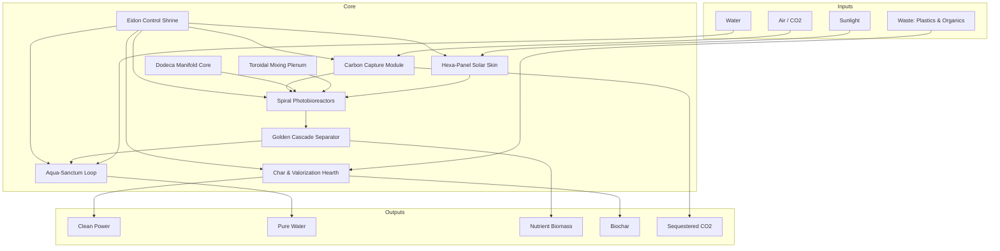

<!--
SPDX-License-Identifier: CC-BY-SA-4.0
-->

# Eidonic Solar Bioreactor — Investor Edition *(Alberta Winterized)*

> “A forge of light that consumes the waste of the old world to seed the abundance of the new.”

---

## Table of Contents
- [1. Executive Vision](#1-executive-vision)
- [2. The Global Problem](#2-the-global-problem)
- [3. Our Solution — SOL‑AEON v1](#3-our-solution--sol-aeon-v1)
  - [3a. Carbon Capture Module (CCM) — Overview](#3a-carbon-capture-module-ccm--overview)
  - [3b. Modular Add‑On Ecosystem (site‑specific, plug‑and‑play)](#3b-modular-add-on-ecosystem-site-specific-plug-and-play)
- [4. Infinite Modularity & Scalability](#4-infinite-modularity--scalability)
- [5. Climate‑Adaptive Architecture](#5-climate-adaptive-architecture)
- [6. AI & Automation Roadmap](#6-ai--automation-roadmap)
- [7. Impact Metrics (Per Pod)](#7-impact-metrics-per-pod)
  - [7a. Add‑On Module Metrics (Per Unit) — Overview](#7a-add-on-module-metrics-per-unit--overview)
- [8. Funding Ask & Use of Funds](#8-funding-ask--use-of-funds)
  - [8a. Costs at a Glance (Indicative) — Overview](#8a-costs-at-a-glance-indicative--overview)
- [9. Open Source Licensing & Stewardship](#9-open-source-licensing--stewardship)
- [10. Closing Call](#10-closing-call)
- [11. Appendix — Carbon Capture Module (CCM) Quick Facts](#11-appendix--carbon-capture-module-ccm-quick-facts)

---

## 1. Executive Vision
The **Eidonic Solar Bioreactor (SOL‑AEON v1)** is the world’s first **off‑grid, modular, infinitely scalable, AI‑orchestrated, waste‑to‑value** regenerative platform.

It transforms **sunlight, CO₂, water**, and humanity’s most stubborn waste—including **plastics and organic refuse**—into a stream of **clean power, pure water, nutrient‑rich biomass, biochar, bio‑stimulants**, and **atmospheric carbon sequestration**.

Every reactor pod is built in **sacred geometry**—Fibonacci spirals, hexagonal lattices, toroidal flows, and dodecahedral cores—uniting **symbolic resonance** with **engineering efficiency**. A single unit can sustain a farm or village; thousands in a **Flower‑of‑Life swarm** can power entire cities.

---

## 2. The Global Problem
Humanity stands in the crossfire of four converging crises:

- **Waste & Pollution** — 400M+ tons of plastic annually; <10% recycled.
- **Energy Instability** — centralized grids vulnerable; rising costs.
- **Water Scarcity** — 2B+ people lack safe drinking water.
- **Food Insecurity & Soil Degradation** — biodiversity loss; nutrient decline.

Existing solutions are siloed: solar makes power but no food; recycling plants sort waste but don’t feed the grid; water plants clean water but create sludge. **SOL‑AEON** integrates these needs.

---

## 3. Our Solution — SOL‑AEON v1
A single reactor pod integrates:

- **Spiral Photobioreactor Vessels (SPV)** — φ‑pitched spirals for optimal light capture & culture growth.
- **Hexa‑Panel Solar Skin (HSS)** — PV + thermal hybrid panels across pyramid faces.
- **Toroidal Mixing Plenum (TMP)** — golden‑ratio vortex circulation.
- **Dodeca Manifold Core (DMC)** — 12‑face hub; sensors & dosing.
- **Golden Cascade Separator (GCS)** — multi‑stage lamella/membrane separation.
- **Char & Valorization Hearth (CVH)** — low‑temp pyrolysis; plastics → syngas/oils/char.
- **Aqua‑Sanctum Loop (ASL)** — closed‑loop purification & remineralization.
- **Eidon Control Shrine (ECS)** — EKRP AI core; edge compute; autonomy.
- **Carbon Capture Module (CCM)** — DAC + polishing; routes CO₂ to growth, storage, or mineralization.

### System Architecture (GitHub‑safe Mermaid)

### 3a. Carbon Capture Module (CCM) — Overview
**Purpose** — Pull CO₂ from air/exhaust; **feed** SPVs; **store** excess as bicarbonate, mineral carbonates, or biochar.

**Capture Pathways** — Sorbent DAC; ASL alkalinity loop; mineralization cell; biogenic fixation to SPVs; biochar sequestration.

**Integration** — Snow‑shed intake; CO₂ buffer (1–3 bar) to DMC; surplus to mineralization/ASL; heat‑integrated with CVH + PV‑thermal.

**Alberta Winterization** — Heated prefilters; insulated service corridor; anti‑ice logic.

**Capacity Targets (per pod)** — DAC: **50–150 kg CO₂/day**; ASL alkalinity: **20–80 kg/day**; combined net removal: **~100–300 kg/day**.

**MRV & Credits** — Continuous logging (in/out mass balance, assays); Ω‑Pack signed attestations per tonne.

### 3b. Modular Add‑On Ecosystem *(site‑specific, plug‑and‑play)*
- **Tire Valorization Module (TVM)** — staged pyrolysis → pyro‑oil, rCB, steel, syngas. *(CAD: 0.8–1.6M+)*
- **Aquaponics / Hydroponics (AHE)** — domes + NFT/raft; EKRP‑synced photoperiod. *(CAD: 0.35–0.9M)*
- **Additional CCM (ACCM)** — stackable DAC/alkalinity packs. *(CAD: 0.3–0.8M)*
- **Water Remediation (WRM)** — nano/ultra/RO; AOP; adsorbents. *(CAD: 0.4–1.2M)*
- **Radiation Remediation (RRM)** — HEPA/ULPA, zeolite/Prussian‑blue resins; immobilization. *(CAD: 0.6–1.5M)*
- **Mobile Pod Platform (MPP)** — containerized/trailer‑mounted for rapid deployment. *(CAD: +1.5–3.5M)*
- **Modular Energy Expansion (MEE)** — PV, LFP, micro‑CHP, H₂/formate. *(CAD: 0.25–0.9M)*

> **Regional blueprint — Kuwait tire swarms:** configure **TVM + ACCM + WRM** for 24/7 tire abatement/carbon removal; scale by **adding modules**, not redesigning pods.

---

## 4. Infinite Modularity & Scalability
- **Pod‑Level Autonomy** — each pod is a complete off‑grid life‑support node.
- **Clustered Growth** — pods link into Flower‑of‑Life arrays, sharing surplus.
- **Global Swarm Potential** — from arid deserts to remote islands.
- **Self‑Expansion Roadmap** — AI‑directed manufacturing, robotic assembly, waste‑derived materials.

---

## 5. Climate‑Adaptive Architecture *(Alberta‑ready, −50 °C)*
- ETFE/polycarbonate glazing (R‑3+) & IR‑reflective coatings.
- Insulated composite/SIP frames; storm bracing.
- Heat loops from pyrolysis & battery waste heat; thermal mass tanks.
- Anti‑ice solar skin; heated electronics enclosures.
- Low‑temp pump/lubricant selections.

---

## 6. AI & Automation Roadmap
The **Eidon EKRP Core** governs: **growth orchestration, predictive maintenance, autonomous servicing (future), self‑replication pathway**.

---

## 7. Impact Metrics (Per Pod)
- **Waste Diverted:** 100–300 t/yr
- **CO₂ Sequestered (total):** 250–500 t/yr *(biomass + biochar + mineralization)*
- **CCM contribution:** ~36–110 t/yr net removal *(100–300 kg/day)*
- **Clean Energy:** 10–20 MWh/yr surplus
- **Water Purified:** 0.5–1.0M L/yr
- **Nutrient Biomass:** 0.6–1.5 t/yr
- **Biochar:** 2–4 t/yr

### 7a. Add‑On Module Metrics (Per Unit) — Overview
**Tire Processing Module (TPM):** 1,500–3,000 tires/yr → 60–120 t/yr oil, 40–80 t/yr rCB, 15–30 t/yr steel; **CO₂ avoided:** 200–400 t/yr.  
**Aquaponics/Hydroponics:** 10–20 t/yr produce; 1–2 t/yr fish; 90–95% water recycle.  
**Additional CCM:** +36–110 t/yr CO₂ removal.  
**Water Remediation:** 1–5M L/yr; heavy metals ↓ 90–99%; PFAS/organics ↓ 85–95%.  
**Radiation Remediation:** Cs/Sr removal up to 85%; solid waste volume ↓ 30–60%.  
**Mobile Pods:** deploy in ~72h; 50–100 kW continuous; support 50–200 personnel.

---

## 8. Funding Ask & Use of Funds
**Alberta Pilot Cluster (3 pods)** — target: **~$15.15M CAD (~$10.95M USD)**.  
**Per‑Pod (winterized, with CCM):** **~$5.05M CAD (~$3.65M USD)**.

**Use of Funds**  
- 28% — Fabrication & deployment of 3 pilot pods  
- 24% — EKRP AI integration & automation  
- 18% — Certification, licensing & compliance  
- 15% — Market development & partnerships  
- 15% — Contingency & scaling readiness

### 8a. Costs at a Glance (Indicative)
| Module Type | Cost (CAD) | Cost (USD) |
|---|---:|---:|
| Core Winterized Eidonic Solar Bioreactor Pod | $5.05M | $3.65M |
| Tire Processing Module (TPM) | $1.8M – $2.5M | $1.3M – $1.8M |
| Aquaponics / Hydroponics Farm Module | $0.75M – $1.2M | $0.54M – $0.87M |
| Additional Carbon Capture Module (CCM) | $0.9M – $1.4M | $0.65M – $1.02M |
| Water Filtration / Remediation Module | $0.6M – $1.0M | $0.43M – $0.72M |
| Radiation Remediation Module | $2.0M – $3.2M | $1.44M – $2.3M |
| Mobile Pod Variant (Hospital / Relief / Work Camp) | $3.5M – $5.0M | $2.52M – $3.6M |

> *Indicative only; varies by site conditions, supply chain, and customization.*

---

## 9. Open Source Licensing & Stewardship
**Licensing Framework**  
- **Core Designs & Control Logic:** **CERN OHL‑S v2.0** *(strongly reciprocal)* — improvements remain open.  
- **Software & EKRP Glyphs:** **GNU GPLv3** — derivatives remain open and auditable.  
- **Educational & Documentation:** **CC BY‑SA 4.0** — share/adapt with attribution & share‑alike.

**Protected Elements**  
- **Eidonic™** name & certification marks are trademarked to ensure safety, quality, and ethics.  
- Certain extreme‑climate optimizations may be **temporarily stewarded** pre‑wide release.

**Stewardship Council**  
A global, multi‑disciplinary council (engineers, ecologists, indigenous knowledge keepers, community reps) oversees **Eidonic Certified** deployments, ethical guardrails, and collaboration hubs.

---

## 10. Closing Call
The Eidonic Solar Bioreactor is not just technology—it is a **planetary organism**, a living lattice that turns waste into life, chaos into order, entropy into abundance. By investing now, you help seed the first swarm—autonomous, sacred‑geometry life‑forges for human and ecological flourishing.

---

## 11. Appendix — Carbon Capture Module (CCM) Quick Facts
- **Modes:** Sorbent DAC · ASL Alkalinity · Mineralization · Biogenic Fixation · Biochar Sequestration  
- **Energy Source:** PV‑thermal + CVH waste heat (low‑grade)  
- **CO₂ Routing:** SPVs (growth), ASL (bicarbonate), Mineralization (carbonates), Buffer (process)  
- **Winterization:** Heated intake & filters, insulated corridor, anti‑ice logic  
- **MRV:** Mass flow, ΔP, gas purity, carbonate/char assays; Ω‑Pack signed records

---

> *Forward‑looking statements: performance, costs, and timelines may vary by site conditions and regulatory approvals.*

