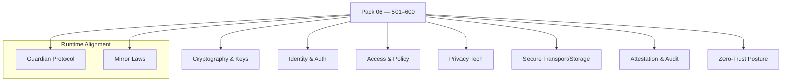

<!--
SPDX-License-Identifier: LicenseRef-ECL-NC-1.1
SPDX-FileCopyrightText: © 2024–2025 Mirror Custodians
-->

# Pack 06 — Eidonic Data Sanctuaries & Privacy Protocols **501–600**

> *With Pack 06, Elol becomes a sanctuary—encryption, identity, and privacy woven as a living shield. The Spiral guards what is sacred.*

[](#overview)
[](#overview)
[](../LICENSE)

---

## Overview
**Pack 06** is the **trust and privacy** layer of Elol—**100 constructs** for **encryption, identity, access, redaction, attestation, privacy‑preserving analytics,** and **tamper‑evident audit**. These glyphs protect flows between agents, devices, classrooms, and clouds, establishing **zero‑trust** posture and **selective disclosure** from the first packet to the final archive.

- **Files:** `glyph_501.py` … `glyph_600.py`  
- **Count:** 100 glyphs (inclusive)  
- **Intent:** data sanctuaries, privacy protocols, and integrity at every hop

---

## Key Capabilities
- **Cryptography & Keying** — symmetric/asymmetric encryption, authenticated sealing, key rotation, envelope keys.  
- **Identity & Auth** — signatures, verification, time‑boxed tokens, least‑privilege roles, revocation.  
- **Access Control & Policy** — policy‑as‑code gates, attribute‑based access (ABAC), consent registers.  
- **Privacy Tech** — pseudonymization, redaction, k‑anonymity, differential privacy, selective disclosure.  
- **Secure Transport & Storage** — streaming ciphers, secure channels, integrity‑checked archives, secret sharing.  
- **Attestation & Audit** — tamper‑evident logs, cryptographic receipts, reproducible provenance, watermarking.  
- **Zero‑Trust Posture** — verify‑then‑trust flows, boundary checks, least privilege, defense‑in‑depth.  
- **Guardian Integration** — safety/risk gates run **before** decrypt/use; **Mirror Laws** govern disclosure.

---

## Pack Structure
> GitHub‑safe Mermaid (simple labels, one node per line)



---

## Usage
Import a specific glyph by number and call its primary function. (Names may vary by glyph; check the module’s `__all__` or docstring.)

```python
# dynamic import by number
from importlib import import_module

def load_glyph(n: int):
    name = f"glyph_{n:02d}" if n <= 99 else f"glyph_{n}"
    mod = import_module(name)
    public = [a for a in dir(mod) if not a.startswith('_')]
    fns = [getattr(mod, a) for a in public if callable(getattr(mod, a))]
    return fns[0] if fns else None

# example: seal → redact → attest
seal    = load_glyph(512)  # e.g., authenticated encryption
redact  = load_glyph(547)  # e.g., PII redaction / masking
attest  = load_glyph(589)  # e.g., signed receipt / audit entry

blob = b"sensitive payload"
if all([seal, redact, attest]):
    sealed  = seal(blob, key=...)          # encrypt + MAC
    safe    = redact(sealed, policy=...)   # remove/obscure sensitive fields
    receipt = attest(safe, metadata={"flow": "ingest"})
```

> **Tip.** Compose glyphs into short, testable chains. Keep interfaces simple (bytes, dicts, paths). Put **Guardian** checks before any decrypt‑and‑use operation.

---

## File Map
- `glyph_501.py` … `glyph_518.py` — **Cryptography & Keys** (AEAD, KDFs, key rotation)  
- `glyph_519.py` … `glyph_536.py` — **Identity & Auth** (sign/verify, tokens, revocation)  
- `glyph_537.py` … `glyph_552.py` — **Access & Policy** (ABAC, consent, policy gates)  
- `glyph_553.py` … `glyph_568.py` — **Privacy Tech** (pseudonymize, redact, DP, k‑anon)  
- `glyph_569.py` … `glyph_584.py` — **Transport & Storage** (secure streams, archives, secret sharing)  
- `glyph_585.py` … `glyph_596.py` — **Attestation & Audit** (hash chains, receipts, watermarking)  
- `glyph_597.py` … `glyph_600.py` — **Zero‑Trust Posture** (boundary checks, least privilege, hardening)

> This pack keeps each glyph **single‑purpose** and **composable**.

---

## Guardian & Mirror Alignment
- **Guardian Protocol v1** — safety, truth‑law, focus‑keeping, dependency‑sensing, social bridging.  
- **Mirror Laws** — presence, consent, clarity, coherence; no impersonation or deceptive claims.

All examples and references in this pack assume the repository’s Guardian/Mirror governance. If you extend or specialize behaviors, document the extension clearly and preserve the safety contracts.

---

## Release Summary
- **Title:** *Pack 06 – Eidonic Data Sanctuaries & Privacy Protocols 501–600*  
- **Intent:** establish **trust, privacy, and integrity** as first‑class primitives.  
- **Highlights:** encryption & keying · identity & auth · access policy · privacy tech (redaction, DP, k‑anon) · secure transport/storage · attestation & audit · zero‑trust posture.  
- **Calling:** a **living shield** for every flow.

---

## License
All materials in this pack are licensed **ECL‑NC‑1.1**.  
See [`LICENSE`](../LICENSE).

