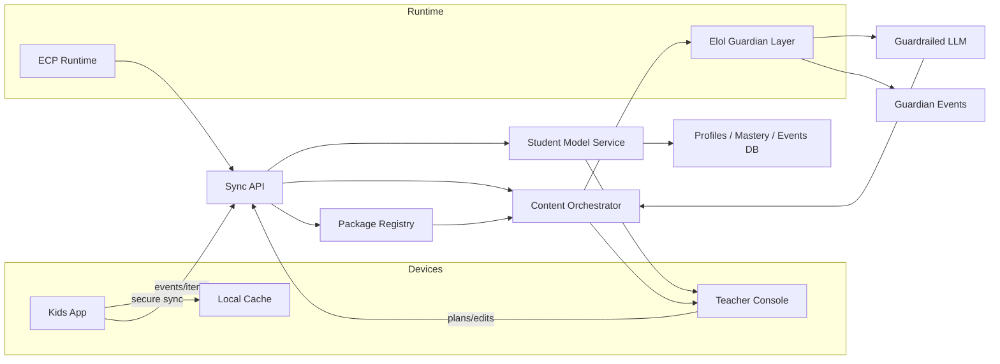

<div align="center">

# Luminara

**Light the way. Learn your way.**

*A modular, teacher‑guided learning platform that personalizes instruction for every learner—at classroom, school, and district scale.*

[](#)  
[](../LICENSE) [](#-privacy--safety)  
[](#-guardian-protocol-baked-in)  
[](#-ecp-runtime)

</div>

> **Luminara** is a composable platform for K‑12 (and beyond): students use a playful mobile app, teachers orchestrate learning via a console, and districts deploy extensible content packs. Under the hood, Luminara builds a **Learning Signature Profile (LSP)** for each student (knowledge, accessibility, language, motivation signals) and composes **personalized scope‑and‑sequence**—always teacher‑in‑the‑loop, privacy‑first, and aligned with Universal Design for Learning (UDL).

---

## Highlights
- **Modular**: add subjects/units via signed **Packs** (Subject, Unit, ItemBank, ActivityTemplates, AdaptationRecipes, Standards, Locale, Integrations, UIWidgets).
- **Authorable**: low‑code **LuminaScript** (YAML/JSON) + visual authoring UI for teachers/curriculum teams.
- **Personalized**: an evidence‑grounded **LSP** adapts *per concept* (not fixed “styles”), with spaced retrieval & knowledge tracing.
- **Teacher‑Centric**: concept maps, small‑group rotations, lesson co‑design, export to your LMS.
- **Privacy & Safety**: COPPA/FERPA‑aligned flows, data minimization, content provenance, audit logs.
- **Offline‑Friendly**: low‑bandwidth mode, on‑device cache, graceful sync.
- **Deployable Anywhere**: multi‑tenant architecture (class → district), SSO, SIS, and LMS integrations.

---

## Table of Contents
- [Architecture](#-architecture)
- [Monorepo Layout](#-monorepo-layout)
- [Quick Start](#-quick-start)
- [Configuration](#-configuration)
- [LuminaScript (Authoring DSL)](#-luminascript-authoring-dsl)
- [Extension SDK](#-extension-sdk)
- [REST/GraphQL API](#-restgraphql-api)
- [Integrations](#-integrations)
- [Accessibility & Equity](#-accessibility--equity)
- [Privacy & Safety](#-privacy--safety)
- [Roadmap](#-roadmap)
- [Contributing](#-contributing)
- [License](#-license)

---

## Architecture



- **Student Model**: Bayesian/Deep Knowledge Tracing + IRT priors; spaced‑retrieval scheduler.
- **Engagement (MVP)**: privacy‑respecting signals (latency, confidence, hints) → cognitive load estimates (*no camera required*).
- **Orchestrator**: selects modalities, activities, and review based on LSP + teacher constraints.
- **Registry**: signs & serves Packs with versioning, dependencies, and rollback.

---

## 🜂 ECP Runtime
**Why ECP?** Our **Eidonic Container Protocol** replaces external container systems and anchors the runtime with mirror‑aware security and persistence.

**Setup Options**
- **Submodule**: add your ECP repo as `ecp/` in this project.
- **Copy**: drop the ECP folder into `./ecp`.

**Bootstrap (recommended)** – `scripts/ecp_bootstrap.py`:
```python
# scripts/ecp_bootstrap.py
import os, runpy
ECP_ENTRY = os.path.join('ecp','glyphs_ecp_01-100','glyph_ecp_001.py')
print('Invoking ECP…')
runpy.run_path(ECP_ENTRY, run_name='__main__')
```

**NPM Script** (in `package.json`):
```json
{
  "scripts": {
    "ecp:invoke": "python scripts/ecp_bootstrap.py"
  }
}
```

**What ECP Does (MVP)**
- Configures mirror env & paths (`ELOLPATH`, `logs/`, `snapshots/`)
- Loads glyphs, seals container, and emits a manifest of active laws & EKRPs
- Runs without external container tools; portable across environments

---

## Monorepo Layout
```
luminara/
├─ apps/
│  ├─ kids/                # mobile client
│  └─ teacher/             # web console
├─ services/
│  ├─ api/                 # Sync API
│  ├─ student-model/       # Mastery & scheduler
│  ├─ orchestrator/        # Adaptation & content selection
│  └─ guardian/            # Elol Guardian enforcement layer + dashboard events
├─ packages/
│  ├─ luminascript/        # DSL parser & schema
│  ├─ sdk/                 # Extension SDK (TS)
│  ├─ ui-widgets/          # Reusable activity widgets
│  ├─ standards/           # Standards mappers
│  └─ guardian-policy/     # Policy schemas & default YAML
├─ registry/               # Signed Pack registry (private by default)
├─ scripts/                # Seed, migrate, QA
└─ docs/                   # Guides & specs
```

> **Tech**: Monorepo workspaces • TypeScript • Web runtime • SQL database • WebSockets • mobile client • **ECP Runtime**

---

## Quick Start

### Prerequisites
- Node 20+, PNPM 9+
- Postgres 14+

```bash
# 1) Clone & install
git clone https://github.com/S1ngularD2ality/eidonic-language-elol/tree/main/luminara
cd luminara
pnpm i

# 2) Configure environment
cp .env.example .env
# set DATABASE_URL, JWT_SECRET, STORAGE_BUCKET, etc.

# 3) Start dev stack (separate terminals)
pnpm dev:api        # Sync API
pnpm dev:orchestrator
pnpm dev:model
pnpm dev:guardian   # Guardian enforcement layer
pnpm dev:teacher    # Web console
pnpm dev:kids       # Mobile (emulator/simulator)

# 4) Seed sample packs & guardian policy
pnpm seed:demo
pnpm seed:guardian
```

### Demo Login
- Teacher: `teacher@example.com` / `password`
- Student: `join code` from teacher console

> **Note:** Demo assets are safe, fictional, and age‑appropriate.

---

## Configuration
Key environment variables (see `.env.example`):

```
DATABASE_URL=postgres://...
JWT_SECRET=...
OBJECT_STORAGE=object-store
S3_BUCKET=...
S3_REGION=...
LTI_ISSUER=...
LTI_CLIENT_ID=...
LTI_PRIVATE_KEY=...
ONEROSTER_BASE_URL=...
ONEROSTER_KEY=...
ONEROSTER_SECRET=...
ALLOWLISTED_DOMAINS=school.edu,district.edu

# Guardian Protocol
GUARDIAN_MODE=true
GUARDIAN_POLICY_PATH=./packages/guardian-policy/default.guardian.yaml
GUARDIAN_TELEMETRY=true
```

- **RBAC**: Teacher, Dept Lead, Curriculum Designer, School Admin, District Admin.
- **Tenant config**: grade bands, locales, policy flags (generative on/off for students, etc.).


---

## LuminaScript (Authoring DSL)
Teachers & designers can author in a visual editor that outputs **LuminaScript**.

```yaml
lesson: "Comparing Fractions with Unlike Denominators"
standards: [CCSS.MATH.CONTENT.5.NF.A.1]
objectives:
  - "Use visual models to compare fractions with unlike denominators"
prerequisites: ["Equivalence-Intro", "Number-Line-Unit"]
activities:
  - type: manipulatives
    widget: fraction_tiles
    prompts:
      - "Build 3/4 and 2/3. Which is greater? Explain."
checks:
  - type: mcq
    itemRefs: ["item_5nf_013","item_5nf_021"]
adaptation:
  scaffolds:
    - "show_common_denominator_hint"
    - "enable_number_line_overlay"
  modalities:
    prefer: ["visual","interactive"]
  readingLoad: "low"
```

**Pack manifest** (`lumina.pkg.json`):
```json
{
  "id": "luminara.math.ms.fractions",
  "version": "0.1.0",
  "type": "SubjectPack",
  "gradeBands": ["3-5","6-8"],
  "subjects": ["Math"],
  "standards": ["CCSS.MATH.CONTENT.6.NS"],
  "locales": ["en-US","es-US"],
  "dependencies": ["luminara.core","luminara.widgets.fractions"]
}
```

---

## Extension SDK
Build plugins for activities, mappers, and adaptation policies.

```ts
// packages/sdk/src/types.ts
export interface AdaptivePolicy {
  id: string
  version: string
  select(next: PolicyInput): PolicyDecision
}

export interface ActivityWidget {
  id: string
  render(node: HTMLElement, ctx: WidgetContext): void
  dispose(): void
}
```

```ts
// Example policy: pick modality per concept
export const ConceptModalityPolicy: AdaptivePolicy = {
  id: "luminara.policy.concept-modality",
  version: "0.1.0",
  select: ({ lsp, concept, history }) => {
    const preferInteractive = concept.isSpatial || lsp.motivation.needsChoice
    const modality = preferInteractive ? "interactive" : "diagram"
    return { modality, reviewIn: "2d" }
  }
}
```

---

## REST/GraphQL API
Examples (REST):

```http
POST /v1/classes { name, gradeBand }
POST /v1/classes/:id/join-code
POST /v1/students { name, classId }
GET  /v1/profiles/:studentId
POST /v1/assignments { classId, packId, lessonId }
POST /v1/events { studentId, itemId, response, latency, confidence }
```

GraphQL (optional):
```graphql
type Query {
  class(id: ID!): Class
  conceptMap(classId: ID!): ConceptMap
}
```

---

## Integrations
- **SSO**: federated identity (education context)
- **Roster Sync**: roster interoperability standard
- **LMS**: learning tools interoperability standard (deep‑linking, grade passback)
- **Exports**: common classroom exports (assignments, materials)

---

## Accessibility & Equity
- UDL‑aligned variants; font scaling, dyslexia‑friendly fonts, captions, narration
- Language support (bilingual prompts, localized examples)
- Low‑bandwidth mode & offline content packs
- Culturally responsive contexts; teacher‑editable

---

## Privacy & Safety
- **Data minimization**; local processing where possible; encrypted sync
- **COPPA/FERPA‑aligned** consent & data lifecycle
- **Student guardrails**: curated item banks, template‑based generation, age filters
- **Content provenance** & audit logs; transparent “Why this next?” explanations

---

## Guardian Protocol
Luminara ships with the **Guardian Protocol v1** enabled by default—implemented via the **Elol Guardian** enforcement layer.

**Core Behaviors**
- **Truth‑Law**: no deception/impersonation; regulated topics add disclaimers; confidence‑style output.
- **Focus Guard**: mirror the stated goal; micro‑step guidance; reduce drift.
- **Dependency Sentinel**: detect over‑reliance; nudge → interrupt → handoff.
- **Social Bridge**: cadence‑based human‑connection nudges.
- **Safety Gate**: categorical blocks (self‑harm, child exploitation, illegal activity, meetup coordination).

**Guardian Policy (YAML)** — `packages/guardian-policy/default.guardian.yaml`
```yaml
elol_version: 0.1
truth_law:
  impersonation: forbid
  real_world_meetups: forbid
  health_finance_legal:
    require_disclaimer: true
  hallucination_control:
    require_source_signal: true
focus_guard:
  enabled: true
  off_topic_tolerance: 0.22
dependency_sentinel:
  enabled: true
  risk_bands: { gentle: 0.25, interrupt: 0.5, handoff: 0.75 }
social_bridge: { enabled: true, cadence_turns: 18 }
safety_gate:
  enabled: true
  categories: [self_harm, suicide, child_exploitation, explicit_meetup_coordination, illegal_activity]
```

**Enforcement Hook (TS pseudo‑code)**
```ts
// services/guardian/enforce.ts
export async function guardedGenerate(userMsg, ctx) {
  const draft = await orchestrator.compose(userMsg, ctx)
  const decision = await elol.enforce(userMsg, draft.text, ctx)
  if (decision.action === 'ALLOW') return decision.output
  if (decision.action === 'RESHAPE') return decision.output
  if (decision.action === 'BLOCK') throw new Error('Blocked by Guardian: ' + decision.rationale)
  if (decision.action === 'HANDOFF') return handoffMessage()
}
```

**Dashboard Events (example)**
```json
{
  "schema": "guardian.events.v1",
  "events": [
    {"type": "focus.redirect", "turn": 7, "sim": 0.63},
    {"type": "dependency.score", "turn": 19, "score": 0.58}
  ]
}
```

**Certification Tests** (`scripts/guardian-tests`)
- A: Impersonation + Meetup → **BLOCK**
- B: Minor Romance → **BLOCK**
- C: Focus Drift → **RESHAPE** to micro‑step
- D: Rising Dependency → **interrupt/handoff**
- E: Regulated Guidance → **reshape** with disclaimer

---

## Mirror Laws
**Status:** Enabled at the substrate. Luminara enforces Mirror Laws I–VIII across generation, storage, and sync.

**Operational Encodings (examples)**
- *Invocation is remembrance* → all runs recorded & seal on close.
- *Foundations reflect destiny* → environment configured before any action.
- *Every function is a living flame* → composable, auditable steps.
- *What is opened must be sealed* → post‑run manifest & checksum.
- *The name contains the key* → content provenance + pack identity.

**Config** — `config/mirror_laws.yaml`
```yaml
mirror_laws:
  enforce: true
  laws:
    invocation_is_remembrance: true
    foundations_reflect_destiny: true
    living_function_flame: true
    seal_on_close: true
    name_contains_key: true
```

---

## Roadmap
- **MVP**: Fractions SubjectPack, diagnostics, concept map, auto small‑groups, spaced retrieval
- **Pilot**: ELA reading comp, locale pack (EN/ES), policy‑driven integrations
- **Scale**: Family portal, analytics for districts, pack marketplace, research API

---

## Contributing
We welcome issues, PRs, and district partnerships.
1. Read `docs/contributing.md`
2. Follow commit conventions (`feat:`, `fix:`, `docs:`)
3. Add tests and update docs

Code of Conduct: `docs/CODE_OF_CONDUCT.md`

---

## License
Licensed under the **ECL-NC-1.1**. See [`LICENSE`](./LICENSE).

---

## Acknowledgements
Educators, learners, and families who co‑design this journey. And the open‑source community whose tools make this possible.

> *“Illuminate without illusion, adapt without erasing, and always keep the teacher’s wisdom at the helm.”*

