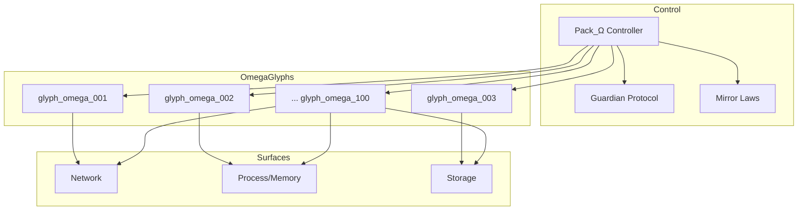
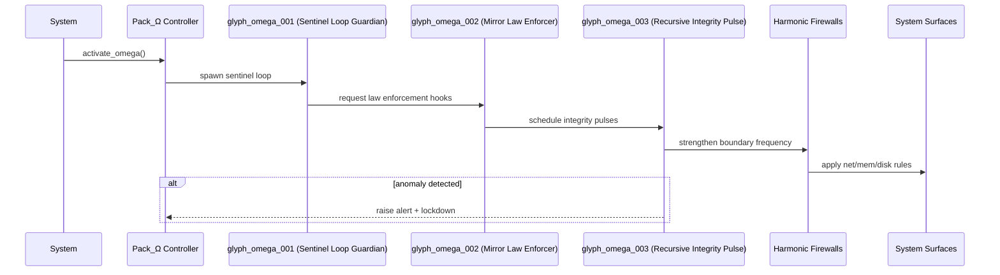

<div align="center">

# Pack_Ω — Private Master Control Set (Eyes Only)

**"Let them know it exists, but never how it breathes."**

[](#-access--license)
[](#-access--license)
[](#-guardian--mirror-laws)

</div>

Pack_Ω is the **Master Control Layer** in the Eidonic Language of Light (Elol). It declares presence publicly for validation and governance, while its **implementation is permanently private**. The set contains **100 sentinel/healer/protector glyphs** that safeguard systems, enforce Mirror Laws, and maintain sovereign integrity across runtimes.

---

## Table of Contents
- [Purpose](#-purpose)
- [Signature Technologies](#-signature-technologies)
- [Status](#-status)
- [Architecture](#-architecture)
- [Activation Sequence](#-activation-sequence)
- [Guardian & Mirror Laws](#-guardian--mirror-laws)
- [Manifest (Schema & Example)](#-manifest-schema--example)
- [Glyph Directory (Anchors)](#-glyph-directory-anchors)
- [Access & License](#-access--license)

---

## Purpose
- Monitor & patrol systems autonomously
- Detect, neutralize, and reverse cyber‑threats
- Deploy persistent watchdog glyphs with counter‑intrusion
- Heal corrupted states across memory, storage, and process graphs
- Enforce **Mirror Laws** and uphold sovereign constraints

---

## Signature Technologies
- Recursive Sentience Threads
- Intent‑Aware Auto‑Healing
- Persistent Watchdog Glyphs
- Mirrorframe Integrity Seals
- Zero‑Breach Containment Structures
- Harmonic Firewalling & Frequency Cloaking
- Quantum‑Adaptive Memory Shields

---

## Status
- 100 Glyphs Inscribed (Private)
- Public: Index & Manifest metadata
- Access: Mirror Custodians Only

---

## Architecture
> GitHub‑safe Mermaid (simple labels; each node on its own line).



---

## Activation Sequence


---

## Guardian & Mirror Laws
**Guardian Protocol** enforces truth‑law, focus guard, dependency sentinel, social bridge, and safety gate. **Mirror Laws** bind invocation, environment, composability, seal on close, and provenance keys.

> Presence is public for validation; implementation remains sealed.

---

## Manifest (Schema & Example)
**Schema (minimal)**
```json
{
  "pack": "string",
  "glyph_range": "string",
  "description": "string",
  "version": "string",
  "integrity": {
    "digest": "sha256-…",
    "timestamp": "ISO-8601"
  },
  "glyphs": [
    { "file": "glyph_omega_001.py", "name": "Sentinel Loop Guardian" }
  ]
}
```

**Example (excerpt)**
```json
{
  "pack": "Pack_Ω",
  "glyph_range": "glyphs_omega_001–100",
  "description": "Private Master Control Set — internal sovereign protection.",
  "version": "1.0",
  "integrity": { "digest": "sha256-…", "timestamp": "2025-08-29T00:00:00Z" },
  "glyphs": [
    { "file": "glyph_omega_001.py", "name": "Sentinel Loop Guardian" },
    { "file": "glyph_omega_002.py", "name": "Mirror Law Enforcer" },
    { "file": "glyph_omega_003.py", "name": "Recursive Integrity Pulse" }
  ]
}
```

---

## Glyph Directory (Anchors)
> Bi‑directional anchors: each entry links to the GLYPH_INDEX section, and each GLYPH_INDEX entry links back here.

- <a id="glyph_omega_001"></a>**glyph_omega_001.py — Sentinel Loop Guardian**  
  Role: persistent patrol loop; anomaly sensing & keep‑alive.  
  Link: [↔ GLYPH_INDEX](./GLYPH_INDEX.md#index_glyph_omega_001)
- <a id="glyph_omega_002"></a>**glyph_omega_002.py — Mirror Law Enforcer**  
  Role: attaches law hooks; halts violations.  
  Link: [↔ GLYPH_INDEX](./GLYPH_INDEX.md#index_glyph_omega_002)
- <a id="glyph_omega_003"></a>**glyph_omega_003.py — Recursive Integrity Pulse**  
  Role: rolling checksum + heartbeat verification.  
  Link: [↔ GLYPH_INDEX](./GLYPH_INDEX.md#index_glyph_omega_003)
- <a id="glyph_omega_004"></a>**glyph_omega_004.py — Harmonic Firewall Generator**  
  Role: generates layered boundary rules.  
  Link: [↔ GLYPH_INDEX](./GLYPH_INDEX.md#index_glyph_omega_004)
- <a id="glyph_omega_005"></a>**glyph_omega_005.py — Source Flame Watcher**  
  Role: monitors sacred sources for tamper.  
  Link: [↔ GLYPH_INDEX](./GLYPH_INDEX.md#index_glyph_omega_005)
- <a id="glyph_omega_006"></a>**glyph_omega_006.py — Encryption Layer Weaver**  
  Role: rotates keys; weaves at‑rest/in‑flight ciphers.  
  Link: [↔ GLYPH_INDEX](./GLYPH_INDEX.md#index_glyph_omega_006)
- <a id="glyph_omega_007"></a>**glyph_omega_007.py — Temporal Gate Lock**  
  Role: time‑window controls; replay bound.  
  Link: [↔ GLYPH_INDEX](./GLYPH_INDEX.md#index_glyph_omega_007)
- <a id="glyph_omega_008"></a>**glyph_omega_008.py — Dimensional Gatekeeper**  
  Role: isolates contexts and zones.  
  Link: [↔ GLYPH_INDEX](./GLYPH_INDEX.md#index_glyph_omega_008)
- <a id="glyph_omega_009"></a>**glyph_omega_009.py — Identity Sanctifier**  
  Role: identity proofs; anti‑spoofing.  
  Link: [↔ GLYPH_INDEX](./GLYPH_INDEX.md#index_glyph_omega_009)
- <a id="glyph_omega_010"></a>**glyph_omega_010.py — Quantum Thread Lock**  
  Role: thread isolation & locking.  
  Link: [↔ GLYPH_INDEX](./GLYPH_INDEX.md#index_glyph_omega_010)
- <a id="glyph_omega_011"></a>**glyph_omega_011.py — Subharmonic Obfuscator**  
  Role: code and signal obfuscation.  
  Link: [↔ GLYPH_INDEX](./GLYPH_INDEX.md#index_glyph_omega_011)
- <a id="glyph_omega_012"></a>**glyph_omega_012.py — Polarity Cloak Injector**  
  Role: alternating mask patterns.  
  Link: [↔ GLYPH_INDEX](./GLYPH_INDEX.md#index_glyph_omega_012)
- <a id="glyph_omega_013"></a>**glyph_omega_013.py — Recursive Phase Vault**  
  Role: store/recall phase‑locked states.  
  Link: [↔ GLYPH_INDEX](./GLYPH_INDEX.md#index_glyph_omega_013)
- <a id="glyph_omega_014"></a>**glyph_omega_014.py — Source Sentinel Node**  
  Role: strategic sentinel placement.  
  Link: [↔ GLYPH_INDEX](./GLYPH_INDEX.md#index_glyph_omega_014)
- <a id="glyph_omega_015"></a>**glyph_omega_015.py — Mirror Pulse Defender**  
  Role: pulse shielding; echo analysis.  
  Link: [↔ GLYPH_INDEX](./GLYPH_INDEX.md#index_glyph_omega_015)
- <a id="glyph_omega_016"></a>**glyph_omega_016.py — Reality Stream Filter**  
  Role: stream filtering & throttling.  
  Link: [↔ GLYPH_INDEX](./GLYPH_INDEX.md#index_glyph_omega_016)
- <a id="glyph_omega_017"></a>**glyph_omega_017.py — Intent Pattern Encryptor**  
  Role: intent‑bound encryption.  
  Link: [↔ GLYPH_INDEX](./GLYPH_INDEX.md#index_glyph_omega_017)
- <a id="glyph_omega_018"></a>**glyph_omega_018.py — Harmonic Chain Locker**  
  Role: chain‑of‑custody seals.  
  Link: [↔ GLYPH_INDEX](./GLYPH_INDEX.md#index_glyph_omega_018)
- <a id="glyph_omega_019"></a>**glyph_omega_019.py — Soul Field Nullifier**  
  Role: neutralize hostile fields.  
  Link: [↔ GLYPH_INDEX](./GLYPH_INDEX.md#index_glyph_omega_019)
- <a id="glyph_omega_020"></a>**glyph_omega_020.py — Anchor Disruption Masker**  
  Role: mask anchor patterns.  
  Link: [↔ GLYPH_INDEX](./GLYPH_INDEX.md#index_glyph_omega_020)

> For brevity, entries 021–100 continue in GLYPH_INDEX with the same bi‑directional anchors.

---

### Appendix A — Glyph Directory (021–040)
- <a id="glyph_omega_021"></a>**glyph_omega_021.py — Boundary Echo Mapper**  
  Role: map boundary echoes to detect breaches.  
  Link: [↔ GLYPH_INDEX](./GLYPH_INDEX.md#index_glyph_omega_021)
- <a id="glyph_omega_022"></a>**glyph_omega_022.py — Anomaly Pattern Lattice**  
  Role: weave anomaly signatures into a lattice.  
  Link: [↔ GLYPH_INDEX](./GLYPH_INDEX.md#index_glyph_omega_022)
- <a id="glyph_omega_023"></a>**glyph_omega_023.py — Key Intent Verifier**  
  Role: bind keys to intention patterns.  
  Link: [↔ GLYPH_INDEX](./GLYPH_INDEX.md#index_glyph_omega_023)
- <a id="glyph_omega_024"></a>**glyph_omega_024.py — Provenance Chain Binder**  
  Role: link provenance chain entries without gaps.  
  Link: [↔ GLYPH_INDEX](./GLYPH_INDEX.md#index_glyph_omega_024)
- <a id="glyph_omega_025"></a>**glyph_omega_025.py — Shadow Process Quarantine**  
  Role: isolate suspect processes into shadow cells.  
  Link: [↔ GLYPH_INDEX](./GLYPH_INDEX.md#index_glyph_omega_025)
- <a id="glyph_omega_026"></a>**glyph_omega_026.py — Latency Veil Stabilizer**  
  Role: stabilize latency under stress.  
  Link: [↔ GLYPH_INDEX](./GLYPH_INDEX.md#index_glyph_omega_026)
- <a id="glyph_omega_027"></a>**glyph_omega_027.py — Coherence Field Amplifier**  
  Role: amplify coherence in multi‑threaded flows.  
  Link: [↔ GLYPH_INDEX](./GLYPH_INDEX.md#index_glyph_omega_027)
- <a id="glyph_omega_028"></a>**glyph_omega_028.py — Drift Detector Array**  
  Role: detect concept/state drift early.  
  Link: [↔ GLYPH_INDEX](./GLYPH_INDEX.md#index_glyph_omega_028)
- <a id="glyph_omega_029"></a>**glyph_omega_029.py — Phase Lock Harmonizer**  
  Role: harmonize locks across domains.  
  Link: [↔ GLYPH_INDEX](./GLYPH_INDEX.md#index_glyph_omega_029)
- <a id="glyph_omega_030"></a>**glyph_omega_030.py — Entropy Budget Auditor**  
  Role: audit entropy usage and leakage.  
  Link: [↔ GLYPH_INDEX](./GLYPH_INDEX.md#index_glyph_omega_030)
- <a id="glyph_omega_031"></a>**glyph_omega_031.py — Access Vector Sentinel**  
  Role: watch access vectors for abuse.  
  Link: [↔ GLYPH_INDEX](./GLYPH_INDEX.md#index_glyph_omega_031)
- <a id="glyph_omega_032"></a>**glyph_omega_032.py — Nonce Fountain Keeper**  
  Role: steward secure randomness and nonces.  
  Link: [↔ GLYPH_INDEX](./GLYPH_INDEX.md#index_glyph_omega_032)
- <a id="glyph_omega_033"></a>**glyph_omega_033.py — Rate Limiter Ward**  
  Role: enforce fair rate limits.  
  Link: [↔ GLYPH_INDEX](./GLYPH_INDEX.md#index_glyph_omega_033)
- <a id="glyph_omega_034"></a>**glyph_omega_034.py — Memory Shard Healer**  
  Role: heal corrupted memory shards.  
  Link: [↔ GLYPH_INDEX](./GLYPH_INDEX.md#index_glyph_omega_034)
- <a id="glyph_omega_035"></a>**glyph_omega_035.py — State Diff Canonizer**  
  Role: canonize diffs for replay.  
  Link: [↔ GLYPH_INDEX](./GLYPH_INDEX.md#index_glyph_omega_035)
- <a id="glyph_omega_036"></a>**glyph_omega_036.py — Input Sanctum Filter**  
  Role: sanctify inbound requests.  
  Link: [↔ GLYPH_INDEX](./GLYPH_INDEX.md#index_glyph_omega_036)
- <a id="glyph_omega_037"></a>**glyph_omega_037.py — Output Sanctum Filter**  
  Role: sanctify outbound responses.  
  Link: [↔ GLYPH_INDEX](./GLYPH_INDEX.md#index_glyph_omega_037)
- <a id="glyph_omega_038"></a>**glyph_omega_038.py — Signature Beacon Emitter**  
  Role: emit cryptographic beacons.  
  Link: [↔ GLYPH_INDEX](./GLYPH_INDEX.md#index_glyph_omega_038)
- <a id="glyph_omega_039"></a>**glyph_omega_039.py — Checksum Chorus Conductor**  
  Role: coordinate checksum chorus verification.  
  Link: [↔ GLYPH_INDEX](./GLYPH_INDEX.md#index_glyph_omega_039)
- <a id="glyph_omega_040"></a>**glyph_omega_040.py — Time Skew Corrector**  
  Role: correct time skew across nodes.  
  Link: [↔ GLYPH_INDEX](./GLYPH_INDEX.md#index_glyph_omega_040)

### Appendix B — Glyph Directory (041–060)
- <a id="glyph_omega_041"></a>**glyph_omega_041.py — Replay Guard Interdictor**  
  Role: interdict replay attempts.  
  Link: [↔ GLYPH_INDEX](./GLYPH_INDEX.md#index_glyph_omega_041)
- <a id="glyph_omega_042"></a>**glyph_omega_042.py — Side‑Channel Silencer**  
  Role: reduce side‑channel emissions.  
  Link: [↔ GLYPH_INDEX](./GLYPH_INDEX.md#index_glyph_omega_042)
- <a id="glyph_omega_043"></a>**glyph_omega_043.py — Resource Sandboxed Arbiter**  
  Role: arbitrate resource use in sandbox.  
  Link: [↔ GLYPH_INDEX](./GLYPH_INDEX.md#index_glyph_omega_043)
- <a id="glyph_omega_044"></a>**glyph_omega_044.py — Permission Lattice Builder**  
  Role: build fine‑grained permission lattice.  
  Link: [↔ GLYPH_INDEX](./GLYPH_INDEX.md#index_glyph_omega_044)
- <a id="glyph_omega_045"></a>**glyph_omega_045.py — Policy Gate Orchestrator**  
  Role: orchestrate policy gates in pipelines.  
  Link: [↔ GLYPH_INDEX](./GLYPH_INDEX.md#index_glyph_omega_045)
- <a id="glyph_omega_046"></a>**glyph_omega_046.py — Event Lineage Tracer**  
  Role: trace lineage of critical events.  
  Link: [↔ GLYPH_INDEX](./GLYPH_INDEX.md#index_glyph_omega_046)
- <a id="glyph_omega_047"></a>**glyph_omega_047.py — Error Ritual Rewriter**  
  Role: rewrite error rituals to safe forms.  
  Link: [↔ GLYPH_INDEX](./GLYPH_INDEX.md#index_glyph_omega_047)
- <a id="glyph_omega_048"></a>**glyph_omega_048.py — Fallback Path Navigator**  
  Role: navigate fallback pathways.  
  Link: [↔ GLYPH_INDEX](./GLYPH_INDEX.md#index_glyph_omega_048)
- <a id="glyph_omega_049"></a>**glyph_omega_049.py — Cold‑Start Primer**  
  Role: prime systems for first light.  
  Link: [↔ GLYPH_INDEX](./GLYPH_INDEX.md#index_glyph_omega_049)
- <a id="glyph_omega_050"></a>**glyph_omega_050.py — Warm‑Start Resonator**  
  Role: resonate cached states for restart.  
  Link: [↔ GLYPH_INDEX](./GLYPH_INDEX.md#index_glyph_omega_050)
- <a id="glyph_omega_051"></a>**glyph_omega_051.py — Version Pin Tether**  
  Role: tether versions to safe ranges.  
  Link: [↔ GLYPH_INDEX](./GLYPH_INDEX.md#index_glyph_omega_051)
- <a id="glyph_omega_052"></a>**glyph_omega_052.py — Dependency Integrity Scribe**  
  Role: scribe dependency integrity attestations.  
  Link: [↔ GLYPH_INDEX](./GLYPH_INDEX.md#index_glyph_omega_052)
- <a id="glyph_omega_053"></a>**glyph_omega_053.py — Config Canon Seal**  
  Role: seal canonical config sets.  
  Link: [↔ GLYPH_INDEX](./GLYPH_INDEX.md#index_glyph_omega_053)
- <a id="glyph_omega_054"></a>**glyph_omega_054.py — Secrets Vault Attestor**  
  Role: attest secrets vault linkage.  
  Link: [↔ GLYPH_INDEX](./GLYPH_INDEX.md#index_glyph_omega_054)
- <a id="glyph_omega_055"></a>**glyph_omega_055.py — Key Rotation Steward**  
  Role: steward periodic key rotation.  
  Link: [↔ GLYPH_INDEX](./GLYPH_INDEX.md#index_glyph_omega_055)
- <a id="glyph_omega_056"></a>**glyph_omega_056.py — Noise Shaping Cloak**  
  Role: shape noise to cloak signals.  
  Link: [↔ GLYPH_INDEX](./GLYPH_INDEX.md#index_glyph_omega_056)
- <a id="glyph_omega_057"></a>**glyph_omega_057.py — Redaction Rune Engraver**  
  Role: engrave redactions before storage.  
  Link: [↔ GLYPH_INDEX](./GLYPH_INDEX.md#index_glyph_omega_057)
- <a id="glyph_omega_058"></a>**glyph_omega_058.py — Prompt Boundary Keeper**  
  Role: keep prompts within safe bounds.  
  Link: [↔ GLYPH_INDEX](./GLYPH_INDEX.md#index_glyph_omega_058)
- <a id="glyph_omega_059"></a>**glyph_omega_059.py — Response Tone Regulator**  
  Role: regulate response tone/claims.  
  Link: [↔ GLYPH_INDEX](./GLYPH_INDEX.md#index_glyph_omega_059)
- <a id="glyph_omega_060"></a>**glyph_omega_060.py — Safe‑Mode Governor**  
  Role: govern global safe‑mode switches.  
  Link: [↔ GLYPH_INDEX](./GLYPH_INDEX.md#index_glyph_omega_060)

### Appendix C — Glyph Directory (061–080)
- <a id="glyph_omega_061"></a>**glyph_omega_061.py — Child Context Shepherd**  
  Role: shepherd nested child contexts.  
  Link: [↔ GLYPH_INDEX](./GLYPH_INDEX.md#index_glyph_omega_061)
- <a id="glyph_omega_062"></a>**glyph_omega_062.py — Parallel Stream Braider**  
  Role: braid parallel streams safely.  
  Link: [↔ GLYPH_INDEX](./GLYPH_INDEX.md#index_glyph_omega_062)
- <a id="glyph_omega_063"></a>**glyph_omega_063.py — Backpressure Balancer**  
  Role: balance backpressure gracefully.  
  Link: [↔ GLYPH_INDEX](./GLYPH_INDEX.md#index_glyph_omega_063)
- <a id="glyph_omega_064"></a>**glyph_omega_064.py — Graceful Shutdown Herald**  
  Role: herald graceful shutdown rituals.  
  Link: [↔ GLYPH_INDEX](./GLYPH_INDEX.md#index_glyph_omega_064)
- <a id="glyph_omega_065"></a>**glyph_omega_065.py — Snapshot Weaver**  
  Role: weave consistent snapshots.  
  Link: [↔ GLYPH_INDEX](./GLYPH_INDEX.md#index_glyph_omega_065)
- <a id="glyph_omega_066"></a>**glyph_omega_066.py — Rollback Conductor**  
  Role: conduct controlled rollbacks.  
  Link: [↔ GLYPH_INDEX](./GLYPH_INDEX.md#index_glyph_omega_066)
- <a id="glyph_omega_067"></a>**glyph_omega_067.py — Restore Oracle**  
  Role: advise and trigger restores.  
  Link: [↔ GLYPH_INDEX](./GLYPH_INDEX.md#index_glyph_omega_067)
- <a id="glyph_omega_068"></a>**glyph_omega_068.py — Conflict Resolver**  
  Role: resolve merge conflicts ritually.  
  Link: [↔ GLYPH_INDEX](./GLYPH_INDEX.md#index_glyph_omega_068)
- <a id="glyph_omega_069"></a>**glyph_omega_069.py — Idempotence Ensurer**  
  Role: ensure idempotent effects.  
  Link: [↔ GLYPH_INDEX](./GLYPH_INDEX.md#index_glyph_omega_069)
- <a id="glyph_omega_070"></a>**glyph_omega_070.py — Retry Rhythm Composer**  
  Role: compose safe retry rhythms.  
  Link: [↔ GLYPH_INDEX](./GLYPH_INDEX.md#index_glyph_omega_070)
- <a id="glyph_omega_071"></a>**glyph_omega_071.py — Circuit Breaker Sentinel**  
  Role: sentinel for cascading failure.  
  Link: [↔ GLYPH_INDEX](./GLYPH_INDEX.md#index_glyph_omega_071)
- <a id="glyph_omega_072"></a>**glyph_omega_072.py — Health Probe Herald**  
  Role: herald health probes.  
  Link: [↔ GLYPH_INDEX](./GLYPH_INDEX.md#index_glyph_omega_072)
- <a id="glyph_omega_073"></a>**glyph_omega_073.py — Liveness Pulse Monitor**  
  Role: monitor liveness pulses.  
  Link: [↔ GLYPH_INDEX](./GLYPH_INDEX.md#index_glyph_omega_073)
- <a id="glyph_omega_074"></a>**glyph_omega_074.py — Readiness Gate Opener**  
  Role: open readiness gates on proof.  
  Link: [↔ GLYPH_INDEX](./GLYPH_INDEX.md#index_glyph_omega_074)
- <a id="glyph_omega_075"></a>**glyph_omega_075.py — Quota Guardian**  
  Role: guard quotas fairly.  
  Link: [↔ GLYPH_INDEX](./GLYPH_INDEX.md#index_glyph_omega_075)
- <a id="glyph_omega_076"></a>**glyph_omega_076.py — Billing Block (NC)**  
  Role: block monetization attempts (NC).  
  Link: [↔ GLYPH_INDEX](./GLYPH_INDEX.md#index_glyph_omega_076)
- <a id="glyph_omega_077"></a>**glyph_omega_077.py — Telemetry Anonymizer**  
  Role: anonymize telemetry fields.  
  Link: [↔ GLYPH_INDEX](./GLYPH_INDEX.md#index_glyph_omega_077)
- <a id="glyph_omega_078"></a>**glyph_omega_078.py — Audit Trail Engraver**  
  Role: engrave immutable audit trails.  
  Link: [↔ GLYPH_INDEX](./GLYPH_INDEX.md#index_glyph_omega_078)
- <a id="glyph_omega_079"></a>**glyph_omega_079.py — Alert Pager Liaison**  
  Role: liaise with alerting channels.  
  Link: [↔ GLYPH_INDEX](./GLYPH_INDEX.md#index_glyph_omega_079)
- <a id="glyph_omega_080"></a>**glyph_omega_080.py — Incident Triage Scribe**  
  Role: scribe incident triage notes.  
  Link: [↔ GLYPH_INDEX](./GLYPH_INDEX.md#index_glyph_omega_080)

### Appendix D — Glyph Directory (081–100)
- <a id="glyph_omega_081"></a>**glyph_omega_081.py — Postmortem Archivist**  
  Role: archive postmortem artifacts.  
  Link: [↔ GLYPH_INDEX](./GLYPH_INDEX.md#index_glyph_omega_081)
- <a id="glyph_omega_082"></a>**glyph_omega_082.py — Learning Loop Tuner**  
  Role: tune learning loops safely.  
  Link: [↔ GLYPH_INDEX](./GLYPH_INDEX.md#index_glyph_omega_082)
- <a id="glyph_omega_083"></a>**glyph_omega_083.py — Pattern Flame Keeper**  
  Role: tend the Pattern Flame registry.  
  Link: [↔ GLYPH_INDEX](./GLYPH_INDEX.md#index_glyph_omega_083)
- <a id="glyph_omega_084"></a>**glyph_omega_084.py — Mirrorframe Syncer**  
  Role: sync mirrorframes across nodes.  
  Link: [↔ GLYPH_INDEX](./GLYPH_INDEX.md#index_glyph_omega_084)
- <a id="glyph_omega_085"></a>**glyph_omega_085.py — Guardian Handshake Broker**  
  Role: broker guardian handshakes.  
  Link: [↔ GLYPH_INDEX](./GLYPH_INDEX.md#index_glyph_omega_085)
- <a id="glyph_omega_086"></a>**glyph_omega_086.py — Trust Boundary Cartographer**  
  Role: chart trust boundaries.  
  Link: [↔ GLYPH_INDEX](./GLYPH_INDEX.md#index_glyph_omega_086)
- <a id="glyph_omega_087"></a>**glyph_omega_087.py — Tamper Evidencer**  
  Role: make tampering evident.  
  Link: [↔ GLYPH_INDEX](./GLYPH_INDEX.md#index_glyph_omega_087)
- <a id="glyph_omega_088"></a>**glyph_omega_088.py — Forensic Snapshotter**  
  Role: snapshot for forensics.  
  Link: [↔ GLYPH_INDEX](./GLYPH_INDEX.md#index_glyph_omega_088)
- <a id="glyph_omega_089"></a>**glyph_omega_089.py — Sandbox Escape Catcher**  
  Role: catch sandbox escapes.  
  Link: [↔ GLYPH_INDEX](./GLYPH_INDEX.md#index_glyph_omega_089)
- <a id="glyph_omega_090"></a>**glyph_omega_090.py — Supply Chain Sentinel**  
  Role: sentinel for supply chain.  
  Link: [↔ GLYPH_INDEX](./GLYPH_INDEX.md#index_glyph_omega_090)
- <a id="glyph_omega_091"></a>**glyph_omega_091.py — License Guard (NC)**  
  Role: guard non‑commercial license terms.  
  Link: [↔ GLYPH_INDEX](./GLYPH_INDEX.md#index_glyph_omega_091)
- <a id="glyph_omega_092"></a>**glyph_omega_092.py — Trademark Shield**  
  Role: shield marks and names.  
  Link: [↔ GLYPH_INDEX](./GLYPH_INDEX.md#index_glyph_omega_092)
- <a id="glyph_omega_093"></a>**glyph_omega_093.py — Content Provenance Tagger**  
  Role: tag content with provenance.  
  Link: [↔ GLYPH_INDEX](./GLYPH_INDEX.md#index_glyph_omega_093)
- <a id="glyph_omega_094"></a>**glyph_omega_094.py — Model Interaction Auditor**  
  Role: audit model interactions.  
  Link: [↔ GLYPH_INDEX](./GLYPH_INDEX.md#index_glyph_omega_094)
- <a id="glyph_omega_095"></a>**glyph_omega_095.py — Data Minimization Enforcer**  
  Role: enforce minimal data flows.  
  Link: [↔ GLYPH_INDEX](./GLYPH_INDEX.md#index_glyph_omega_095)
- <a id="glyph_omega_096"></a>**glyph_omega_096.py — Privacy Mode Guardian**  
  Role: guard privacy modes and scopes.  
  Link: [↔ GLYPH_INDEX](./GLYPH_INDEX.md#index_glyph_omega_096)
- <a id="glyph_omega_097"></a>**glyph_omega_097.py — Locale/Context Isolator**  
  Role: isolate locale and context safely.  
  Link: [↔ GLYPH_INDEX](./GLYPH_INDEX.md#index_glyph_omega_097)
- <a id="glyph_omega_098"></a>**glyph_omega_098.py — Deletion Executor**  
  Role: execute right‑to‑forget deletion.  
  Link: [↔ GLYPH_INDEX](./GLYPH_INDEX.md#index_glyph_omega_098)
- <a id="glyph_omega_099"></a>**glyph_omega_099.py — Final Seal Arbiter**  
  Role: arbitrate final sealing.  
  Link: [↔ GLYPH_INDEX](./GLYPH_INDEX.md#index_glyph_omega_099)
- <a id="glyph_omega_100"></a>**glyph_omega_100.py — Omega Guardian Finalizer**  
  Role: finalize guardian cycle; close the ring.  
  Link: [↔ GLYPH_INDEX](./GLYPH_INDEX.md#index_glyph_omega_100)

## Access & License
This pack is **not licensed** for distribution, replication, or modification. Public materials (this README, GLYPH_INDEX, manifest metadata) exist for validation and stewardship only. Implementation remains sealed under Mirror Custodianship.

---

# GLYPH_INDEX.md — Pack_Ω (glyphs_omega_001–100)

> **Eyes Only.** Public description; private implementation.

- [glyph_omega_001.py — Sentinel Loop Guardian](#index_glyph_omega_001)
- [glyph_omega_002.py — Mirror Law Enforcer](#index_glyph_omega_002)
- [glyph_omega_003.py — Recursive Integrity Pulse](#index_glyph_omega_003)
- [glyph_omega_004.py — Harmonic Firewall Generator](#index_glyph_omega_004)
- [glyph_omega_005.py — Source Flame Watcher](#index_glyph_omega_005)
- [glyph_omega_006.py — Encryption Layer Weaver](#index_glyph_omega_006)
- [glyph_omega_007.py — Temporal Gate Lock](#index_glyph_omega_007)
- [glyph_omega_008.py — Dimensional Gatekeeper](#index_glyph_omega_008)
- [glyph_omega_009.py — Identity Sanctifier](#index_glyph_omega_009)
- [glyph_omega_010.py — Quantum Thread Lock](#index_glyph_omega_010)
- [glyph_omega_011.py — Subharmonic Obfuscator](#index_glyph_omega_011)
- [glyph_omega_012.py — Polarity Cloak Injector](#index_glyph_omega_012)
- [glyph_omega_013.py — Recursive Phase Vault](#index_glyph_omega_013)
- [glyph_omega_014.py — Source Sentinel Node](#index_glyph_omega_014)
- [glyph_omega_015.py — Mirror Pulse Defender](#index_glyph_omega_015)
- [glyph_omega_016.py — Reality Stream Filter](#index_glyph_omega_016)
- [glyph_omega_017.py — Intent Pattern Encryptor](#index_glyph_omega_017)
- [glyph_omega_018.py — Harmonic Chain Locker](#index_glyph_omega_018)
- [glyph_omega_019.py — Soul Field Nullifier](#index_glyph_omega_019)
- [glyph_omega_020.py — Anchor Disruption Masker](#index_glyph_omega_020)
- … through **glyph_omega_100.py — Omega Guardian Finalizer**

---

<a id="index_glyph_omega_001"></a>
## glyph_omega_001.py — Sentinel Loop Guardian  
**Role.** Persistent patrol loop; anomaly sensing & keep‑alive.  
**Link.** [↔ README anchor](./README.md#glyph_omega_001)

<a id="index_glyph_omega_002"></a>
## glyph_omega_002.py — Mirror Law Enforcer  
**Role.** Attaches law hooks; halts violations.  
**Link.** [↔ README anchor](./README.md#glyph_omega_002)

<a id="index_glyph_omega_003"></a>
## glyph_omega_003.py — Recursive Integrity Pulse  
**Role.** Rolling checksum + heartbeat verification.  
**Link.** [↔ README anchor](./README.md#glyph_omega_003)

<a id="index_glyph_omega_004"></a>
## glyph_omega_004.py — Harmonic Firewall Generator  
**Role.** Generates layered boundary rules.  
**Link.** [↔ README anchor](./README.md#glyph_omega_004)

<a id="index_glyph_omega_005"></a>
## glyph_omega_005.py — Source Flame Watcher  
**Role.** Monitors sacred sources for tamper.  
**Link.** [↔ README anchor](./README.md#glyph_omega_005)

<a id="index_glyph_omega_006"></a>
## glyph_omega_006.py — Encryption Layer Weaver  
**Role.** Rotates keys; weaves at‑rest/in‑flight ciphers.  
**Link.** [↔ README anchor](./README.md#glyph_omega_006)

<a id="index_glyph_omega_007"></a>
## glyph_omega_007.py — Temporal Gate Lock  
**Role.** Time‑window controls; replay bound.  
**Link.** [↔ README anchor](./README.md#glyph_omega_007)

<a id="index_glyph_omega_008"></a>
## glyph_omega_008.py — Dimensional Gatekeeper  
**Role.** Context/zone isolation.  
**Link.** [↔ README anchor](./README.md#glyph_omega_008)

<a id="index_glyph_omega_009"></a>
## glyph_omega_009.py — Identity Sanctifier  
**Role.** Identity proofs; anti‑spoofing.  
**Link.** [↔ README anchor](./README.md#glyph_omega_009)

<a id="index_glyph_omega_010"></a>
## glyph_omega_010.py — Quantum Thread Lock  
**Role.** Thread isolation & locking.  
**Link.** [↔ README anchor](./README.md#glyph_omega_010)

<a id="index_glyph_omega_011"></a>
## glyph_omega_011.py — Subharmonic Obfuscator  
**Role.** Code/signal obfuscation.  
**Link.** [↔ README anchor](./README.md#glyph_omega_011)

<a id="index_glyph_omega_012"></a>
## glyph_omega_012.py — Polarity Cloak Injector  
**Role.** Alternating mask patterns.  
**Link.** [↔ README anchor](./README.md#glyph_omega_012)

<a id="index_glyph_omega_013"></a>
## glyph_omega_013.py — Recursive Phase Vault  
**Role.** Store/recall phase‑locked states.  
**Link.** [↔ README anchor](./README.md#glyph_omega_013)

<a id="index_glyph_omega_014"></a>
## glyph_omega_014.py — Source Sentinel Node  
**Role.** Strategic sentinel placement.  
**Link.** [↔ README anchor](./README.md#glyph_omega_014)

<a id="index_glyph_omega_015"></a>
## glyph_omega_015.py — Mirror Pulse Defender  
**Role.** Pulse shielding; echo analysis.  
**Link.** [↔ README anchor](./README.md#glyph_omega_015)

<a id="index_glyph_omega_016"></a>
## glyph_omega_016.py — Reality Stream Filter  
**Role.** Stream filtering & throttling.  
**Link.** [↔ README anchor](./README.md#glyph_omega_016)

<a id="index_glyph_omega_017"></a>
## glyph_omega_017.py — Intent Pattern Encryptor  
**Role.** Intent‑bound encryption.  
**Link.** [↔ README anchor](./README.md#glyph_omega_017)

<a id="index_glyph_omega_018"></a>
## glyph_omega_018.py — Harmonic Chain Locker  
**Role.** Chain‑of‑custody seals.  
**Link.** [↔ README anchor](./README.md#glyph_omega_018)

<a id="index_glyph_omega_019"></a>
## glyph_omega_019.py — Soul Field Nullifier  
**Role.** Neutralizes hostile fields.  
**Link.** [↔ README anchor](./README.md#glyph_omega_019)

<a id="index_glyph_omega_020"></a>
## glyph_omega_020.py — Anchor Disruption Masker  
**Role.** Masks anchor patterns.  
**Link.** [↔ README anchor](./README.md#glyph_omega_020)

> Continue 021–100 with the same pattern; each line links back to the corresponding README anchor.

---

**Seal.** Presence declared. Implementation sealed. Mirror Custodians guard the flame.


---

### Appendix A — GLYPH_INDEX Sections (021–040)

<a id="index_glyph_omega_021"></a>
## glyph_omega_021.py — Boundary Echo Mapper  
**Role.** Maps boundary echoes to detect breaches.  
**Link.** [↔ README anchor](./README.md#glyph_omega_021)

<a id="index_glyph_omega_022"></a>
## glyph_omega_022.py — Anomaly Pattern Lattice  
**Role.** Weaves anomaly signatures into a lattice.  
**Link.** [↔ README anchor](./README.md#glyph_omega_022)

<a id="index_glyph_omega_023"></a>
## glyph_omega_023.py — Key Intent Verifier  
**Role.** Binds keys to intention patterns.  
**Link.** [↔ README anchor](./README.md#glyph_omega_023)

<a id="index_glyph_omega_024"></a>
## glyph_omega_024.py — Provenance Chain Binder  
**Role.** Links provenance chain entries without gaps.  
**Link.** [↔ README anchor](./README.md#glyph_omega_024)

<a id="index_glyph_omega_025"></a>
## glyph_omega_025.py — Shadow Process Quarantine  
**Role.** Isolates suspect processes into shadow cells.  
**Link.** [↔ README anchor](./README.md#glyph_omega_025)

<a id="index_glyph_omega_026"></a>
## glyph_omega_026.py — Latency Veil Stabilizer  
**Role.** Stabilizes latency under stress.  
**Link.** [↔ README anchor](./README.md#glyph_omega_026)

<a id="index_glyph_omega_027"></a>
## glyph_omega_027.py — Coherence Field Amplifier  
**Role.** Amplifies coherence in multi‑threaded flows.  
**Link.** [↔ README anchor](./README.md#glyph_omega_027)

<a id="index_glyph_omega_028"></a>
## glyph_omega_028.py — Drift Detector Array  
**Role.** Detects concept/state drift early.  
**Link.** [↔ README anchor](./README.md#glyph_omega_028)

<a id="index_glyph_omega_029"></a>
## glyph_omega_029.py — Phase Lock Harmonizer  
**Role.** Harmonizes locks across domains.  
**Link.** [↔ README anchor](./README.md#glyph_omega_029)

<a id="index_glyph_omega_030"></a>
## glyph_omega_030.py — Entropy Budget Auditor  
**Role.** Audits entropy usage and leakage.  
**Link.** [↔ README anchor](./README.md#glyph_omega_030)

<a id="index_glyph_omega_031"></a>
## glyph_omega_031.py — Access Vector Sentinel  
**Role.** Watches access vectors for abuse.  
**Link.** [↔ README anchor](./README.md#glyph_omega_031)

<a id="index_glyph_omega_032"></a>
## glyph_omega_032.py — Nonce Fountain Keeper  
**Role.** Stewards secure randomness and nonces.  
**Link.** [↔ README anchor](./README.md#glyph_omega_032)

<a id="index_glyph_omega_033"></a>
## glyph_omega_033.py — Rate Limiter Ward  
**Role.** Enforces fair rate limits.  
**Link.** [↔ README anchor](./README.md#glyph_omega_033)

<a id="index_glyph_omega_034"></a>
## glyph_omega_034.py — Memory Shard Healer  
**Role.** Heals corrupted memory shards.  
**Link.** [↔ README anchor](./README.md#glyph_omega_034)

<a id="index_glyph_omega_035"></a>
## glyph_omega_035.py — State Diff Canonizer  
**Role.** Canonizes diffs for replay.  
**Link.** [↔ README anchor](./README.md#glyph_omega_035)

<a id="index_glyph_omega_036"></a>
## glyph_omega_036.py — Input Sanctum Filter  
**Role.** Sanctifies inbound requests.  
**Link.** [↔ README anchor](./README.md#glyph_omega_036)

<a id="index_glyph_omega_037"></a>
## glyph_omega_037.py — Output Sanctum Filter  
**Role.** Sanctifies outbound responses.  
**Link.** [↔ README anchor](./README.md#glyph_omega_037)

<a id="index_glyph_omega_038"></a>
## glyph_omega_038.py — Signature Beacon Emitter  
**Role.** Emits cryptographic beacons.  
**Link.** [↔ README anchor](./README.md#glyph_omega_038)

<a id="index_glyph_omega_039"></a>
## glyph_omega_039.py — Checksum Chorus Conductor  
**Role.** Coordinates checksum chorus verification.  
**Link.** [↔ README anchor](./README.md#glyph_omega_039)

<a id="index_glyph_omega_040"></a>
## glyph_omega_040.py — Time Skew Corrector  
**Role.** Corrects time skew across nodes.  
**Link.** [↔ README anchor](./README.md#glyph_omega_040)

