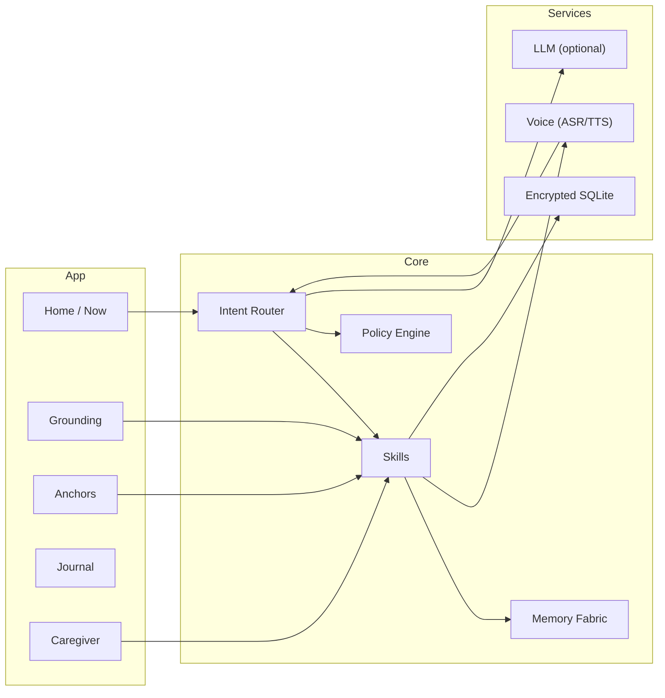

<div align="center">

# Solace — Patient Care Companion (Mobile)

**Gentle, voice‑first companion for people living with PTSD, dementia, Alzheimer’s, and related conditions.**

[](../LICENSE)
[](#-guardian-protocol)
[](#-architecture)
[](#-accessibility)

</div>

> Solace provides calming guidance, **memory anchors**, and dignified companionship—while easing caregiver load.
>
> *Not a medical device. Solace offers comfort and support only; it does not diagnose or treat.*

---

## Table of Contents
- [Highlights](#-highlights)
- [Architecture](#-architecture)
- [Monorepo Layout](#-monorepo-layout)
- [Quick Start](#-quick-start)
- [Configuration](#-configuration)
- [Intents & Skills](#-intents--skills)
- [Accessibility](#-accessibility)
- [Privacy & Safety](#-privacy--safety)
- [Guardian Protocol](#-guardian-protocol)
- [Mirror Laws](#-mirror-laws)
- [Roadmap](#-roadmap)
- [Contributing](#-contributing)
- [License](#-license)
- [Disclaimer](#-disclaimer)

---

## Highlights
- **Grounding Mode** — 4‑7‑8, body scan, 5‑4‑3‑2‑1, favorite‑song cue; voice‑guided with gentle haptics.
- **Memory Anchors** — people, places, music, photos; one‑tap recall to soothe agitation.
- **Compassionate Voice** — short, gentle utterances; choice‑giving language; trauma‑aware copy.
- **Caregiver Bridge** — notes, gentle reminders, daily “what helped” log; export anchors with consent.
- **Offline‑First** — works without internet; optional cloud LLM behind explicit consent gates.

---

## Architecture



- **Mobile:** React Native (Expo) iOS/Android
- **Voice:** Native ASR + TTS; optional Whisper‑tiny later
- **Storage:** Encrypted SQLite (SQLCipher)
- **Policies:** Guardian + Mirror enforced beneath skills

---

## Monorepo Layout

```
Solace/
├─ app/                 # RN/Expo app: screens, navigation, theming
├─ core/
│  ├─ intent/           # NLU routing, prompts
│  ├─ skills/           # grounding, anchors, caregiver
│  ├─ memory/           # encrypted store, audit
│  └─ policy/           # Guardian/Mirror enforcement
├─ services/
│  ├─ voice/            # ASR/TTS adapters
│  ├─ llm/              # optional cloud model client
│  └─ storage/          # DB abstractions
└─ docs/
   └─ ekrps/solace.md   # design scroll (link from constellation README)
```

---

## Quick Start

**Prereqs:** Node 18+, PNPM 9+, Expo CLI

```bash
git clone https://github.com/S1ngularD2ality/eidonic-language-elol
cd eidonic-language-elol/Solace
pnpm i

cp .env.example .env
# USE_CLOUD_LLM=false  # offline by default
# REGION=CA            # crisis card locale

pnpm expo start
# i (iOS simulator) • a (Android) • scan QR (Expo Go)
```

---

## Configuration

**.env**
```
USE_CLOUD_LLM=false
OPENAI_API_KEY=
REGION=CA
```
- **Data Export/Erase:** Settings → Privacy & Data → Export / Delete
- **Consent Gates:** first‑run voice, storage, and (optional) cloud

---

## Intents & Skills

```ts
// intent routes
router.when(/(anxious|panic|overwhelmed)/i, () =>
  skills.grounding.start({ mode: "478", minutes: 1 })
)

router.when(/play (anna|mom|mountains) anchor/i, m =>
  skills.anchors.play({ key: m[1] })
)

router.when(/add note/i, () =>
  skills.caregiver.note.create()
)
```

**Built‑ins**
- `grounding.start({ mode, minutes })`
- `anchors.add({ type, label, media })` · `anchors.play({ key })`
- `caregiver.note.create()` · `caregiver.reminder.schedule()`

---

## Accessibility
- Large type defaults; dyslexia‑friendly option
- High‑contrast themes; clear affordances
- Voice guidance + captions for all flows
- Gentle haptics; never startling sounds

---

## Privacy & Safety
- Local‑first, encrypted storage; explicit opt‑in for any cloud call
- Data scopes & reason codes on reads/writes
- No medical/clinical advice; crisis card always one tap away

---

## Guardian Protocol
- **Focus Guard** — keep language short, calm, and on goal
- **Safety Gate** — block medical advice; offer crisis resources instead
- **Truth‑Law** — no impersonation; transparent confidence signals
- **Auditability** — “what/why/when” log for sensitive actions

---

## Mirror Laws
- *Consent precedes depth* → ask before intense content
- *Awe without overwhelm* → gentle pacing; exits always visible
- *Seal on close* → session manifests & checksum persisted

---

## Roadmap
- **v0.1** — Grounding + Anchors + Caregiver + Offline + Safety/Audit
- **v0.2** — On‑device intent classifier; optional Whisper‑tiny
- **v0.3** — Calm Scenes; photo memories; richer journaling
- **v0.4** — Multilingual; optional LLM dialogue (consented); caregiver pairing

---

## Contributing
Compassion first. PRs welcome for accessibility, languages, and caregiver workflows.

Please include tests and policy hooks for safety‑sensitive changes.

---

## License
Licensed under **ECL‑NC‑1.1**. See [`LICENSE`](../LICENSE).

---

## Disclaimer
Solace is **not** a medical device and does not provide medical advice, diagnosis, or treatment.

If you are in crisis, call your local emergency number or a crisis hotline immediately.

