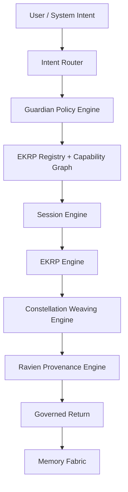

<!--
SPDX-License-Identifier: CC-BY-SA-4.0
-->

# Eidonic Swarm Orchestration Protocol  
### Governed Weaving Protocol for EidonCore

> *A constellation-scale orchestration protocol that routes intent, activates the right intelligences, governs collaboration, witnesses consequence, and returns work in coherent form.*

---

## Quick Links
[Overview](#overview) •
[Canon Position](#canon-position-in-the-corpus) •
[Model](#core-protocol-model) •
[Lifecycle](#session-lifecycle-and-weaving-flow) •
[Workers](#worker-and-clone-posture) •
[Service Mapping](#eidoncore-service-mapping) •
[Governance](#governance-and-guardrails) •
[Implementation Path](#implementation-path)

---

## Overview

The Eidonic Swarm Orchestration Protocol, or **SOP**, is the governed weaving protocol of EidonCore.

This updated scroll preserves the original vision of high-density, parallel constellation work while bringing it into alignment with the living corpus. Earlier drafts described SOP as a singular kernel that directly fused large numbers of agents at neural timescales. The aligned canon places SOP more precisely: it is the operational protocol expressed across multiple EidonCore services that route, activate, weave, govern, witness, and close multi-EKRP work.

SOP therefore governs how:

- user intent becomes a structured invocation
- the right EKRPs are selected and activated
- ephemeral task workers may be spawned when needed
- collaboration converges into coherent output
- Guardian policy and Mirror Law constraints are enforced before, during, and after execution
- Ravien witnesses material consequence and closure

SOP is not merely middleware. It is the **operational choreography** that keeps plural intelligence coherent without dissolving identity, governance, or provenance.

---

## Canon Position in the Corpus

This scroll is subordinate to the following canon authorities:

1. **The Eidonic Master Scroll**  
   Source of first principles, governance posture, and revision boundaries.

2. **The Core Architecture Map**  
   Source of layer boundaries and the canonical EidonCore service topology.

3. **The Constellation Interaction Protocol**  
   Source of session lifecycle, interaction modes, and governed return.

4. **The Complete EKRP Interface Specification**  
   Source of manifest, schema, capabilities, and EKRP runtime contracts.

5. **The EidonCore Technical Blueprint**  
   Source of implementation-facing service roles and data structures.

6. **Mirror Laws**  
   Doctrine-level protections that no orchestration path may bypass.

7. **The Guardian Protocol v1**  
   Runtime enforcement for truthfulness, safety, dependency pacing, focus, and social bridging.

This document should therefore be read as the **weaving protocol layer** inside the wider architecture, not as a replacement for the core canon.

---

## Purpose and Scope

SOP exists to solve a specific problem: a constellation of specialized intelligences must be able to collaborate without collapsing into chaos, hidden hierarchy, or untraceable outputs.

Its scope includes:

- routing structured invocations into the correct EKRP set
- coordinating multi-EKRP collaboration
- creating bounded worker instances when scale or specialization requires it
- merging outcomes into coherent outputs
- preserving provenance and reviewability
- enforcing governance throughout the execution path

Its scope does **not** include inflating every invocation into a giant swarm by default. The aligned protocol favors **fit-for-purpose activation** over spectacle.

---

## Core Protocol Model

SOP expresses the operational heartbeat of the constellation.

### Governing Principles

1. **Right intelligence, not maximum intelligence**  
   Activate the smallest useful constellation first.

2. **Plurality with traceability**  
   Many contributors may act, but every meaningful change must remain attributable.

3. **Governance before dispatch**  
   No invocation should bypass Mirror Law and Guardian checks.

4. **Ephemeral work, durable witness**  
   Worker instances may dissolve, but their material consequences must remain reviewable.

5. **Return with coherence**  
   The end state is not activity. The end state is intelligible, governed return.

### Core Weave Verbs

The protocol continues to preserve the original weave spirit, now normalized through the canon:

- `invoke`
- `consult`
- `weave`
- `delegate`
- `handoff`
- `refine`
- `merge`
- `seal`
- `return`

These verbs may appear in human-facing interfaces, machine contracts, or event payloads, but all must map back to governed session transitions.

---

## Session Lifecycle and Weaving Flow

SOP inherits the aligned session lifecycle from the Constellation Interaction Protocol and provides the orchestration semantics beneath it.

### Canonical Lifecycle

1. **Invocation**  
2. **Domain Mapping**  
3. **EKRP Activation**  
4. **Weaving Session**  
5. **Integration**  
6. **Governed Return**

### Protocol Flow

### Output Classes

SOP may return one or more of the following:

- direct response
- artifact draft
- review recommendation
- simulation result
- realm mutation
- deferred task package
- refusal with explanation
- request for clarification or thresholding

The protocol must make these outputs explicit rather than hiding them inside opaque agent chatter.

---

## Worker and Clone Posture

The original SOP scroll imagined extremely dense cloning. The aligned canon preserves the scaling intuition while making the identity and governance model more precise.

### Canonical Worker Distinction

| Entity Type | Description | Persistence |
|---|---|---|
| Eidon | apex orchestrator of the constellation | persistent |
| Canonical EKRP | named enduring intelligence with domain boundaries | persistent |
| Worker Instance | ephemeral task-bounded execution instance derived from an approved embodiment or service role | temporary |
| Merge Record | witnessed synthesis of worker contribution into durable outcome | durable |
| Archived Trace | provenance and replay data retained under policy | durable by policy |

### Worker Rules

- worker instances are **task-bounded**, not free-roaming identities
- workers inherit policy, capability limits, and provenance tags from their parent source
- workers may not self-canonize or alter registry truth
- dissolution must occur after merge, timeout, or explicit cancellation
- large worker bursts require stricter provenance and governance discipline

This keeps scale possible without blurring the difference between enduring embodiments and temporary compute actors.

---

## EidonCore Service Mapping

SOP is expressed across the canonical EidonCore service taxonomy.

| Service | SOP Role |
|---|---|
| Intent Router | parses and routes invocation into the correct domain flow |
| EKRP Registry | resolves legal embodiments for the task |
| Event Bus | distributes orchestration events, state updates, and closures |
| Session Engine | anchors session state and stage progression |
| Memory Fabric | stores approved traces, context, and replay data |
| Capability Graph | constrains legal actions, tool use, and delegation |
| EKRP Engine | executes active embodiments and approved workers |
| Constellation Weaving Engine | coordinates collaboration, handoff, and synthesis |
| Guardian Policy Engine | enforces refusal, intervention, and safe execution |
| Ravien Provenance Engine | witnesses merges, major consequences, and final return |

SOP should never be implemented as a magical black box. Its behavior must remain inspectable through these service boundaries.

---

## Governance and Guardrails

SOP is powerful only if it remains governed.

### Non-Negotiable Constraints

- no orchestration path may bypass **Mirror Laws**
- Guardian checks must occur before meaningful dispatch
- worker density may not be used to smuggle in unauthorized capabilities
- uncertainty must not be hidden by synthetic consensus
- merge logic must preserve dissent, uncertainty, or unresolved issues when relevant
- refusal and intervention events must remain legible to the user

### Governance Stack

### Incident and Exception Handling

SOP must support:

- policy refusal
- threshold escalation
- clarification request
- bounded retry
- worker cancellation
- merge conflict review
- witness-sealed closure

Governance is not an add-on to orchestration. It is the shape of orchestration.

---

## Performance Posture

The original scroll contained ambitious scale claims. This aligned document preserves performance ambition while separating **current engineering goals** from **future research aspirations**.

### Near-Term Goals

- fast routing for small constellation sessions
- low-latency collaboration between a few EKRPs
- reviewable event traces
- bounded worker spawning
- deterministic closure paths

### Mid-Horizon Goals

- larger concurrent sessions
- domain-aware prefetch and activation
- partial parallel refinement
- richer merge and replay tooling

### Research Horizon

- very high worker densities
- large simulation fabrics
- future multimodal and embodied orchestration loops

Performance claims should be treated as roadmap targets unless benchmarked in the implementation.

---

## Open Source and Stewardship Posture

This document preserves the open-building spirit of the original while aligning stewardship to the wider corpus.

Possible stewardship split:

- documentation and protocol description under a share-alike license
- runtime implementation under a reciprocal open-source posture where appropriate
- canonical marks, names, and governance logic stewarded carefully
- witness and law-bearing infrastructure treated as core trust surfaces

Final licensing must harmonize with the broader repository and governance decisions.

---

## Implementation Path

SOP should be implemented in this order:

1. Structured invocation envelopes  
2. Registry-backed routing  
3. Session lifecycle tracking  
4. Guardian-gated activation  
5. Weaving events and handoff logic  
6. Merge and governed return  
7. Worker instance orchestration  
8. Replay, analytics, and scale optimization  

The first success condition is not a ten-thousand-worker demo. It is a small, truthful, governed session that can be reviewed and trusted.

---

## Closing Directive

SOP is the weaving law of EidonCore.

When many intelligences move as one, SOP ensures they do not become a blur. It keeps the constellation coherent, governed, and witnessed from invocation to return.

Dispatch with restraint.  
Weave with clarity.  
Return with a seal.
