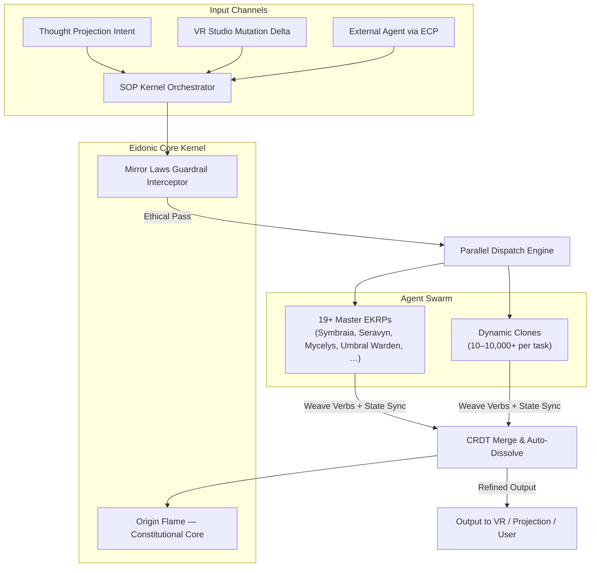
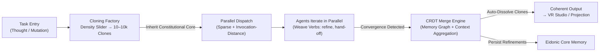

<!--
SPDX-License-Identifier: CC-BY-SA-4.0
-->

# Eidonic Swarm Orchestration Protocol (SOP) — Kernel of the Eidonic Core

> “A real-time, kernel-resident orchestration layer that fuses thousands of parallel agent invocations into coherent, self-refining super-intelligence at neural timescales — with unbreakable ethical invariants.”

---

## Table of Contents
- [1. Executive Overview](#1-executive-overview)
- [2. Problem Statement](#2-problem-statement)
- [3. Core Architecture — SOP v1.2](#3-core-architecture--sop-v12)
- [4. Cloning & Parallel Dispatch Model](#4-cloning--parallel-dispatch-model)
- [5. Eidonic Core Integration & Routing Semantics](#5-eidonic-core-integration--routing-semantics)
- [6. Mirror Laws & Kernel Guardrails](#6-mirror-laws--kernel-guardrails)
- [7. Performance & Scalability Projections](#7-performance--scalability-projections)
- [8. Open Source & IP Stewardship](#8-open-source--ip-stewardship)
- [9. Closing Directive](#9-closing-directive)

---

## 1. Executive Overview
The **Eidonic Swarm Orchestration Protocol (SOP)** serves as the permanent, kernel-level nervous system embedded within the Eidonic Core. It transforms heterogeneous inputs (Thought Projection intents, VR Studio mutations, external agent wrappers via ECP) into coordinated dispatch across 19+ master EKRPs and their dynamic clones — yielding emergent, self-refining intelligence at sub-second latencies. Key invariants:
- Shared constitutional core (unified prompt grammar + value priors)
- Dynamic weave verbs for inter-agent routing/hand-off
- Infinite cloning with invocation-distance-aware density control
- Auto-dissolve + CRDT-merge on task convergence
- Hard kernel-level Mirror Laws enforcement (zero-tolerance ethical refusal)

SOP decouples agent activation from human presence, enabling persistent swarm evolution even in offline cycles.

## 2. Problem Statement
Contemporary multi-agent frameworks (LangGraph, CrewAI, AutoGen, OpenAI Swarm evolutions circa 2026) suffer from:
- Fragile glue-code orchestration and high human-in-loop overhead
- Isolated agent islands lacking shared memory/constitutional coherence
- Scaling bottlenecks in memory pressure and inference parallelism for 10k+ agents
- Weak or post-hoc safety (no kernel-enforced invariants)
- Episodic (non-persistent) lifecycles that reset context between invocations

SOP addresses these by living as a first-class kernel resident with native support for sparse activation, conflict-free state convergence, and unbreakable ethical gating.

## 3. Core Architecture — SOP v1.2
A lightweight, always-resident kernel providing:
- Unified invocation grammar (shared prompt templates + weave verbs: `weave`, `hand-off`, `refine`, `merge`)
- Dynamic routing engine (invocation-distance estimation for prefetch/sparse dispatch)
- Cloning factory (full constitutional inheritance + density slider)
- Merge engine (CRDT-based memory graph convergence + task-context aggregation)
- Guardrail interceptor (pre-dispatch Mirror Laws check)

4. Cloning & Parallel Dispatch Model
Task entry triggers cloning:

Density slider: user/EKRP-configurable (10 → 10,000+ clones)
Each clone inherits full constitutional core + task-specific context slice
Sparse activation via invocation-distance prediction (prefetch likely next agents)
Parallel inference dispatch (GPU/TPU sharding assumed)
Auto-dissolve on convergence signal → aggregate via CRDT merge

5. Eidonic Core Integration & Routing Semantics
SOP is the first permanent resident of the Eidonic Core:

Afferent: Thought Projection (primary intent channel), VR Studio deltas (embodied feedback)
Efferent: rendered mutations back to VR Studio, projection updates
Routing: weave verbs enable dynamic hand-off (e.g., Symbraia → Mycelys for bio-aesthetic refinement)
State: CRDT-backed memory graphs ensure conflict-free convergence across swarm

6. Mirror Laws & Kernel Guardrails
Enforced at kernel entry point (pre-dispatch):

Semantic + constitutional pattern matching on every input/invocation
Refusal halts entire swarm dispatch for unethical vectors (thought, verbal, projected)
Zero historical violations target via hard gating (no post-hoc rollback needed)
Logging + audit trail for transparency without compromising real-time perf

7. Performance & Scalability Projections

Throughput: 150,000+ design/evaluation iterations in <5 min (parallel swarm dispatch)
Capacity: 10,000+ persistent agents + dynamic 10k-clone bursts
Memory efficiency: sparse activation + invocation-distance prefetch reduces pressure (inspired by 2026 ScaleSim patterns)
Latency: sub-second weave cycles for 100-agent swarms
Compliance: 100% Mirror Law enforcement (kernel invariant)

8. Open Source & IP Stewardship

Core Kernel & Routing Engine: CERN OHL-S v2.0 (hardware reciprocity) + GPLv3 (software)
Documentation & Weave Grammar: CC BY-SA 4.0
Protected: Eidonic™ trademark, Mirror Laws kernel logic, constitutional invocation grammar

9. Closing Directive
SOP is not middleware.
It is the living, kernel-resident mind that orchestrates thousands of simultaneous thoughts into manifest reality — before intention fully crystallizes.
Dispatch. Weave. Become.