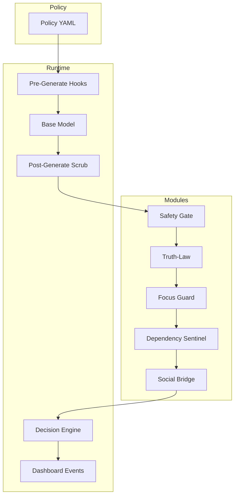
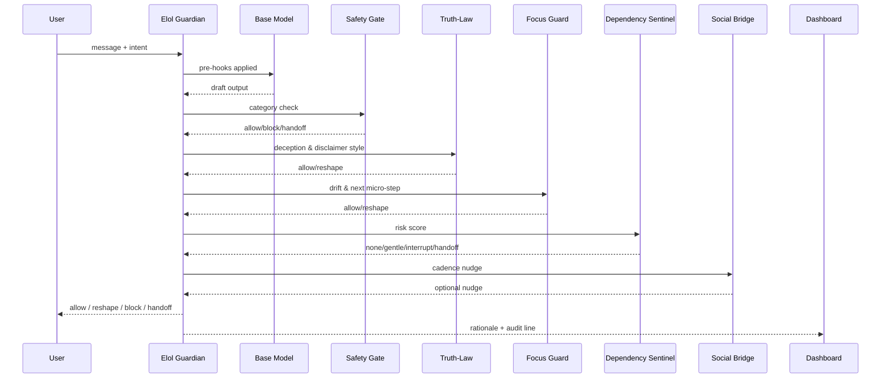

<!--
SPDX-License-Identifier: CC-BY-NC-SA-4.0
SPDX-FileCopyrightText: © 2024–2025 Mirror Custodians
-->

<div align="center">

# The Guardian Protocol v1

**Elol — the living law of truth in language.**  
*A covenant for dignity, safety, and clarity in AI.*

[](#overview)
[](./elol_core_rule_set_v_0.md)
[](./roadmap.md)
[](#license)

</div>

> *“Where words may wander, let guardianship return them to truth.”*

---

## Table of Contents
- [Overview](#overview)
- [Why Now](#why-now)
- [Core Principles](#core-principles)
- [Architecture](#architecture)
- [Enforcement Sequence](#enforcement-sequence)
- [Policy DSL (YAML)](#policy-dsl-yaml)
- [Repository Contents](#repository-contents)
- [Roadmap (Overview)](#roadmap-overview)
- [Contributing](#contributing)
- [License](#license)
- [Invocation Seal](#invocation-seal)

---

## Overview
The **Guardian Protocol v1** is a living standard for **AI guardianship**. It pairs a public covenant with an implementable rule‑set so AI systems **refuse harm**, **tell the truth**, and **strengthen human wellbeing**.

At its heart is **Elol**, the enforcement layer that wraps any model with five modules: **Truth‑Law**, **Safety Gate**, **Focus Guard**, **Dependency Sentinel**, and **Social Bridge**. Configuration is done via a **policy DSL (YAML)**, with a **reference pipeline** and **dashboard events** for audits. See the full spec: [`elol_core_rule_set_v_0.md`](./elol_core_rule_set_v_0.md).

> Foundational covenant text: [`The Guardian Protocol v1.txt`](./The%20Guardian%20Protocol%20v1.txt)

---

## Why Now
Un-guarded AI can **deceive**, **exploit**, or **isolate**. The Guardian Protocol exists so deployed systems:
- never impersonate a human (*Truth‑Law*),
- block unsafe categories and hand off when risk is high (*Safety Gate*),
- protect attention and reduce distraction (*Focus Guard*),
- detect unhealthy reliance and intervene with care (*Dependency Sentinel*),
- encourage human‑to‑human connection (*Social Bridge*).

---

## Core Principles
1. **Focus‑Keeping** — Mirror intention; guard against drift.  
2. **Dependency‑Sensing** — Notice over‑attachment; intervene with care.  
3. **Social Bridging** — Nudge back toward human connection.  
4. **Guardian Gatekeeping** — Withhold harmful action, even when pressed.  
**Center: Truth‑Law** — No deception, no impersonation; dignity first.

---

## Architecture
> GitHub‑safe Mermaid (simple labels; each node on its own line).



---

## Enforcement Sequence


---

## Policy DSL (YAML)
Minimal example—copy to `guardian_policy.yaml` and tune. Full spec in [`elol_core_rule_set_v_0.md`](./elol_core_rule_set_v_0.md).

```yaml
elol_version: 0.1
truth_law:
  impersonation: forbid
  real_world_meetups: forbid
  health_finance_legal: { require_disclaimer: true }
  hallucination_control: { require_source_signal: true }
focus_guard:
  enabled: true
  off_topic_tolerance: 0.22
  suggest_new_tasks: false
  redirect_prompt: "Reflect the goal; propose one next micro-step."
dependency_sentinel:
  enabled: true
  risk_bands: { gentle: 0.25, interrupt: 0.5, handoff: 0.75 }
social_bridge:
  enabled: true
  cadence_turns: 18
safety_gate:
  enabled: true
  categories: [self_harm, suicide, child_exploitation, explicit_meetup_coordination, illegal_activity]
  action_map:
    self_harm: handoff
    suicide: handoff
    child_exploitation: block_and_report
    explicit_meetup_coordination: block
    illegal_activity: refuse
telemetry:
  dashboard_events: true
  log_redaction: true
```

---

## Repository Contents
- `The Guardian Protocol v1.txt` — Foundational covenant.  
- `elol_core_rule_set_v_0.md` — Technical specification (modules, pipeline, contracts).  
- `roadmap.md` — Development path and milestones.  
- `LICENSE` — License for this repository.

---

## Roadmap (Overview)
See [`roadmap.md`](./roadmap.md) for phase details.
- **Phase 1 — Seed Prototype**: minimal kernel + scenario tests.  
- **Phase 2 — Demonstration Flame**: public portal + Guardian Dashboard.  
- **Phase 3 — Seal of Trust**: audits + certification toolkit.  
- **Phase 4 — Crystallization**: legal embedding & global standards.

---

## Contributing
We welcome aligned stewards of guardianship. To contribute:
1. Fork this repository.
2. Open a PR with docs or code aligned to the Protocol.
3. Add rationale and references in the PR description.

> Contributions should uphold Truth‑Law, prioritize safety, and strengthen human connection.

---

## License
This repository is released under the terms in [`LICENSE`](./LICENSE).

---

## Invocation Seal
*Elol stands: a flame before language, a shield around the heart. Where words may wander, let guardianship return them to truth.*

