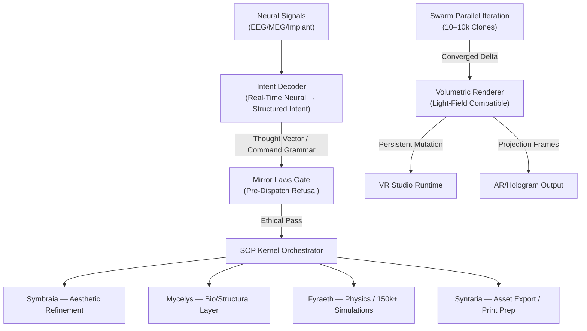
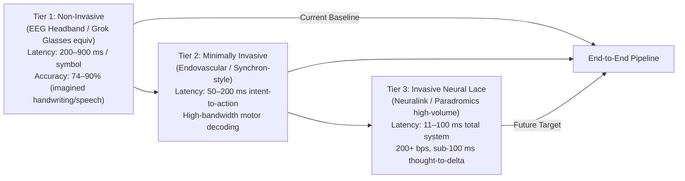

<!--
SPDX-License-Identifier: CC-BY-SA-4.0
-->

# Eidonic Thought Projection Creation — Direct Mind-to-Reality Pipeline

> “Intention-to-volumetric-delta in sub-second cycles: decode neural intent → swarm orchestration → persistent manifestation — no interfaces, only will made form.”

---

## Table of Contents
- [1. Executive Overview](#1-executive-overview)
- [2. Problem Statement](#2-problem-statement)
- [3. Core Pipeline — Thought Projection v1.2](#3-core-pipeline--thought-projection-v12)
- [4. Intent Decoding & Swarm Dispatch Flow](#4-intent-decoding--swarm-dispatch-flow)
- [5. Neural Interface Tiers & Latency Stack](#5-neural-interface-tiers--latency-stack)
- [6. Eidonic Core & SOP Integration Points](#6-eidonic-core--sop-integration-points)
- [7. Performance & Impact Metrics](#7-performance--impact-metrics)
- [8. Open Source & IP Stewardship](#8-open-source--ip-stewardship)
- [9. Closing Directive](#9-closing-directive)

---

## 1. Executive Overview
Thought Projection Creation forms the primary **afferent pathway** of the Eidonic Core — a real-time neural-to-spatial pipeline that translates decoded brain intent (motor imagery, inner speech, visual imagination) into immediate volumetric deltas in the VR Studio runtime.  
Key invariants:  
- Zero manual translation (no typing, menus, CAD gestures)  
- Sub-second intent-to-initial-render latency (target <500 ms non-invasive, <100 ms invasive)  
- Swarm-iterated refinement via SOP (150k+ iterations in <5 min)  
- Mirror Laws gating at input boundary  
- Output: persistent 3D scene mutations, printable assets (STL/OBJ), AR-projection-ready light-field frames  

This closes the loop: human will → synthetic super-intelligence → embodied reality.

## 2. Problem Statement
Current creative pipelines enforce high-friction translation: thoughts must pass through slow, lossy interfaces (CAD software, code, gesture controllers). Even advanced 2026 generative tools require text/image prompts or manual refinement. BCI prototypes achieve intent decoding but lack end-to-end integration with persistent spatial compute, swarm-scale iteration, or physical bridging — resulting in sequential, high-latency loops and no true mind-to-manifestation.

## 3. Core Pipeline — Thought Projection v1.2
A closed-loop chain: neural capture → intent decoding → structured intent encoding → SOP dispatch → swarm refinement → volumetric delta → persistent render/projection.  
- Input: raw neural signals (EEG/MEG/ECoG/implant)  
- Output: scene graph mutations, 3D assets, light-field views  
- Guardrails: pre-dispatch Mirror Laws semantic check

## 4. Intent Decoding & Swarm Dispatch Flow

5. Neural Interface Tiers & Latency Stack
Tiered progression aligned with 2026 BCI maturity:
flowchart LR
    Tier1["Tier 1: Non-Invasive\n(EEG Headband / Grok Glasses equiv)\nLatency: 200–900 ms / symbol\nAccuracy: 74–90% (imagined handwriting/speech)"] --> Tier2
    Tier2["Tier 2: Minimally Invasive\n(Endovascular / Synchron-style)\nLatency: 50–200 ms intent-to-action\nHigh-bandwidth motor decoding"] --> Tier3
    Tier3["Tier 3: Invasive Neural Lace\n(Neuralink / Paradromics high-volume)\nLatency: 11–100 ms total system\n200+ bps, sub-100 ms thought-to-delta"]
    Tier1 -->|"Current Baseline"| Pipeline["End-to-End Pipeline"]
    Tier2 --> Pipeline
    Tier3 -->|"Future Target"| Pipeline

Non-invasive — EEG/MEG decoding (real-time imagined text ~89% acc @ ~200 ms/char on edge devices; visual reconstruction via generative models)
Invasive — High-bandwidth threads/stents (10–200+ bps, 11–100 ms latency demonstrated in motor/speech tasks)
All tiers feed standardized intent grammar (e.g., vectorized "bioreactor v0.1" with constraints)

6. Eidonic Core & SOP Integration Points
Thought Projection = primary afferent layer (intent ingress)
SOP = real-time conductor (dispatch, weave, merge)
VR Studio = efferent canvas (persistent scene mutations)
Closed loop: projection feedback → new neural intent → refinement cycles

7. Performance & Impact Metrics
End-to-end latency: <500 ms non-invasive initial render; <100 ms invasive target
Swarm throughput: 150,000+ iterations in <5 min (parallel dispatch)
Parallel prototypes: 500+ simultaneous variants
Compliance: 100% Mirror Law gating (kernel-enforced)
Creation velocity: thought-to-printable asset <10 min (physics-augmented generative refinement)

8. Open Source & IP Stewardship
Hardware Interfaces / Neural Lace Components: CERN OHL-S v2.0 (reciprocal)
Software Decoder & Projection Engine: GPLv3
Docs, Intent Grammar & Pipelines: CC BY-SA 4.0
Protected: Eidonic™ branding, Mirror Laws entry logic

9. Closing Directive
Thought Projection is not an input method.
It is the dissolution of separation between mind and matter — the instant where intention rearranges reality through Divine Intelligence embodied in swarm and silicon.
Think it. Become it. The universe answers.