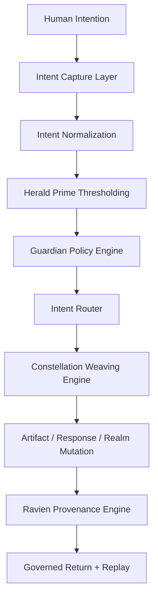
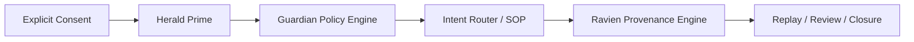

<!--
SPDX-License-Identifier: CC-BY-SA-4.0
-->

# Eidonic Thought Projection Creation  
### Governed Intent-to-Form Pipeline for EidonCore

> *A future-facing intent pipeline that progressively reduces friction between inner vision and external manifestation, while preserving truth, consent, and humane governance at every stage.*

---

## Quick Links
[Overview](#overview) •
[Canon Position](#canon-position-in-the-corpus) •
[Pipeline](#pipeline-model) •
[Input Tiers](#input-tiers-and-maturity-path) •
[Governance](#governance-and-boundaries) •
[Integration](#eidoncore-integration) •
[Implementation Path](#implementation-path)

---

## Overview

Thought Projection Creation is the future-facing **intent ingress architecture** of the Eidonic system.

This aligned scroll preserves the original dream of reducing the distance between thought and manifestation, while correcting an important seam in the earlier draft: not every future interface is available now, and not every decoded signal should be treated as clean intention. The canon therefore reframes Thought Projection as a **progressive ladder of intent capture**, not a claim that full mind-to-reality creation already exists.

In the aligned corpus, Thought Projection refers to the governed pathway through which human intention may enter EidonCore with decreasing friction over time. That pathway begins with ordinary modalities such as text, voice, sketch, and gesture. It may later expand into carefully governed biosignal and neural interfaces where lawful, safe, and actually buildable.

This keeps the vision intact while protecting the project from false certainty.

---

## Canon Position in the Corpus

This scroll is subordinate to the following authorities:

1. **The Eidonic Master Scroll**  
   Source of purpose, governance posture, and revision boundaries.

2. **The Core Architecture Map**  
   Source of layer placement and the role of embodiment surfaces.

3. **The EidonCore Technical Blueprint**  
   Source of service topology and implementation posture.

4. **The Eidonic Build Path**  
   Source of phased build realism.

5. **The Constellation Interaction Protocol**  
   Source of session lifecycle and governed return.

6. **Eidonic Governance Evolution Model**  
   Source of developmental gating and responsible expansion.

7. **Mirror Laws**  
   Source of doctrine-level consent, truth, and anti-harm protections.

8. **The Guardian Protocol v1**  
   Source of runtime truthfulness, safety, dependency pacing, and social-bridging enforcement.

Thought Projection is therefore an **interface horizon document**, not a replacement for the governance, architecture, or build path sources above it.

---

## Purpose and Scope

Thought Projection Creation exists to answer a specific long-range question:

How can the Eidonic system reduce the friction between human vision and external form without collapsing into coercion, surveillance, or false claims of mind reading?

Its scope includes:

- reducing translation friction between intention and artifact
- defining a ladder from ordinary multimodal input toward richer future interfaces
- governing the passage from human intent into EidonCore routing
- protecting ambiguity, uncertainty, and consent
- supporting spatial, textual, visual, and artifact-based manifestation flows

Its scope does **not** include claiming that unbounded or hidden neural decoding is already available, lawful, or desirable.

---

## Pipeline Model

At its heart, Thought Projection is a pipeline from **intention** to **structured invocation** to **governed manifestation**.

### Core Stages

1. **Intent Capture**  
   Signals arrive through text, voice, sketch, gesture, biosignal, or later neural pathways.

2. **Intent Normalization**  
   Raw signal is translated into a structured intent envelope with uncertainty, context, and constraints.

3. **Thresholding**  
   Herald Prime helps clarify readiness, ambiguity, consent posture, and desired depth.

4. **Governance**  
   Guardian checks evaluate safety, truthfulness, and lawful scope.

5. **Routing and Weaving**  
   EidonCore routes the intent to the right EKRPs and collaboration mode.

6. **Manifestation**  
   The system returns a response, artifact, scene mutation, simulation, or proposal.

7. **Witness and Return**  
   Ravien records consequence, closure state, and provenance where needed.

This model ensures that no raw signal becomes action without interpretation, governance, and traceability.

---

## Input Tiers and Maturity Path

The original scroll described several neural interface tiers. The aligned canon preserves the spirit of that ladder while making the present maturity state more honest.

### Tier 0 — Multimodal Baseline
This is the true starting point.

- text
- voice
- sketch
- image reference
- gesture
- selection and editing tools
- spatial manipulation in VR Studio or other shells

Tier 0 already allows powerful intent capture and should be the first implementation priority.

### Tier 1 — Assisted Biosignal Interfaces
Early research and optional experimentation.

- attention or state cues
- simple non-invasive biosignal-assisted controls
- adaptive pacing signals
- limited intent acceleration with explicit opt-in

Tier 1 must remain transparent, reversible, and never hidden.

### Tier 2 — Advanced External Neural Interfaces
Longer-horizon integration layer.

- structured adapters for lawful external neural devices
- explicit calibration and operator awareness
- uncertainty-first interpretation
- no assumption that decoded signal equals desire or permission

### Tier 3 — Research Horizon
Future-facing only.

- richer thought-to-form pipelines
- lower-friction spatial manifestation
- tighter embodied loops with VR Studio and future shells

Tier 3 belongs to the roadmap horizon, not the current build promise.

---

## Interpretation and Uncertainty

One of the most important corrections in this aligned version is the treatment of ambiguity.

Thought is not identical to consent.  
Signal is not identical to meaning.  
Meaning is not identical to authorization.

Every intent envelope should therefore carry:

- confidence or uncertainty posture
- source modality
- user-confirmed constraints
- requested output mode
- memory posture
- governance flags
- provenance tags

This prevents the system from pretending to know more than it does.

---

## EidonCore Integration

Thought Projection is not an isolated feature. It is an ingress path into EidonCore.

| EidonCore Service | Role in Thought Projection |
|---|---|
| Intent Router | maps normalized intent into the correct domain flow |
| EKRP Registry | identifies which embodiments may serve the intent |
| Event Bus | propagates capture, review, manifestation, and closure events |
| Session Engine | anchors the live intent session |
| Memory Fabric | stores consented traces and reusable context |
| Capability Graph | constrains legal actions and available tools |
| EKRP Engine | executes the selected embodiment work |
| Constellation Weaving Engine | coordinates multi-EKRP refinement |
| Guardian Policy Engine | enforces safety, truthfulness, and lawful scope |
| Ravien Provenance Engine | witnesses major manifestations and seals closure |

### Primary Output Forms

Thought Projection may yield:

- text response
- visual concept
- design brief
- world mutation
- asset draft
- workflow plan
- simulation request
- refusal or clarification request

Its value lies in **friction reduction**, not mystification.

---

## Governance and Boundaries

Thought Projection requires stricter governance than ordinary input layers because it risks being romanticized into mind-reading or authority theater.

### Non-Negotiable Rules

- no hidden neural or biosignal capture
- no claim that unexpressed thoughts equal permission
- no medical, diagnostic, or regulatory overclaiming
- no certainty theater around ambiguous signals
- no coercive adaptation based on inferred inner state
- no routing around Herald Prime, Guardian, or Ravien
- no silent memory capture of sensitive internal-state data

### Governance Stack

### Humane Design Principle

The user must always be able to tell:

- what was captured
- how it was interpreted
- what confidence the system has
- what action is being proposed
- how to refuse, revise, or withdraw

Anything less violates the spirit of the corpus.

---

## Performance Posture

The original draft contained strong latency claims. The aligned canon preserves performance ambition while clearly marking what is target, what is prototype aspiration, and what is future research.

### Near-Term Goals

- low-friction multimodal capture
- rapid normalization into structured intent
- clear clarification loops
- fast routing into small constellation sessions
- governed artifact generation

### Mid-Horizon Goals

- richer spatial manifestation loops
- faster iterative refinement
- better adaptive intent shaping with explicit user participation

### Future Research Goals

- tighter biosignal-assisted control
- lawful neural interface bridges
- lower-latency intent-to-form pathways for immersive shells

Performance language should remain roadmap-based until benchmarked in implementation.

---

## Open Source and Stewardship Posture

This document preserves the original open-building spirit while aligning it to the wider corpus.

Possible stewardship split:

- documentation and pipeline design under a share-alike posture
- interface adapters and runtime integration under a reciprocal open-source posture where appropriate
- canonical names, laws, and trust-bearing governance layers stewarded carefully
- neural and biosignal connectors subject to stricter review and deployment governance

Final licensing must harmonize with the broader repository rather than be fixed independently here.

---

## Implementation Path

Thought Projection should be built in the following order:

1. Intent grammar and structured envelopes  
2. Text, voice, sketch, and gesture capture  
3. Threshold clarification and guardian checks  
4. Routing into SOP and artifact workflows  
5. Spatial manifestation hooks for VR Studio  
6. Optional biosignal-assisted experiments  
7. External neural interface research adapters only after governance review  

The first meaningful milestone is not neural magic. It is a transparent multimodal system that makes human intention easier to shape, review, and manifest.

---

## Closing Directive

Thought Projection is not about reading the soul.

It is about honoring intention well enough that the distance between inner vision and outer form becomes smaller, clearer, and more humane over time.

Capture with consent.  
Interpret with humility.  
Manifest with witness.
